# 测度与概率 {#sec-ch1-measure-probability}

概率论的首要任务,是把不确定现象转化为可以推理和计算的数学对象.这个过程可概括为三个层次:首先用样本空间列举可能结果,用事件表达问题;其次用 $\sigma$-代数规定允许讨论的事件;最后用概率测度为事件赋值.古典概型,几何概型和频率解释提供直观入口,测度论公理则保证理论能够处理连续模型与无穷运算.

本章沿着直观模型-集合语言-测度公理-条件化-独立性的路线展开.学习时应不断区分三类问题:模型中的基本结果是什么,所求对象对应哪个事件,以及概率的计算依赖哪些结构假设.尤其要注意,等可能,独立和条件信息都不是自动成立的,它们必须由问题背景给出或经过论证.

## 本章学习目标 {#本章学习目标 .unnumbered}

- 能从随机试验中识别样本空间与事件,并熟练使用事件运算;

- 理解概率测度的公理化定义及其与长度,面积和频率的联系;

- 能选择古典概型,几何概型或一般概率空间建立模型;

- 掌握条件概率,全概率公式和贝叶斯公式的推理结构;

- 理解独立性的层次,并能判断模型中独立假设是否合理.

## 随机现象与概率论 {#sec-ch1-lecture-1}

::: {.callout-note appearance="simple" icon="false"}
## 本节导读

概率论研究的不是毫无规律的偶然,而是大量重复观察中呈现稳定规律的随机现象.本节从课程对象,典型问题和学科发展出发,建立随机试验-样本空间-事件-概率的基本建模视角,并说明概率论与统计学,数据科学之间的联系.
:::

::: {.callout-tip appearance="simple" icon="false"}
## 理论主线

概率论的研究对象不是孤立的偶然结果,而是随机试验在重复观察中表现出的稳定结构.建立模型时,应当依次说明试验条件,可能结果,观察对象和赋予概率的依据.对称性,经验频率与主观信息都可以成为建模依据,但它们对应不同的假设,不能在没有说明的情况下相互替代.

本节保留课程背景,典型问题和学科史材料.阅读这些内容时,应把注意力放在概率论的三条主线上:用集合描述事件,用测度描述不确定性的大小,以及用条件化和独立性描述信息与结构.
:::

### 课程说明

#### 参考书目 {#参考书目 .unnumbered}

- 概率论, 李增沪, 张梅, 何辉, 高等教育出版社

- 概率论, 张颢, 高等教育出版社

- 概率论(第二版), 杨振明, 科学出版社

- 概率论基础, 李贤平, 高等教育出版社

- 概率论导论(翻译版), Joseph K. Blitzstein, Jessica Hwang\
  (张景肖 译), 机械工业出版社

- 概率导论(第二版), Dimitri P. Bertsekas, John N. Tsitsiklis\
  (郑忠国,童行伟译), 人民邮电出版社

- Probability, A. N. Shiryaev, Springer

- 科学发现纵横谈, 王梓坤, 北京师范大学出版社

#### 参考教材封面 {#参考教材封面 .unnumbered}

{fig-align="center" width="3cm"}

{fig-align="center" width="3cm"}

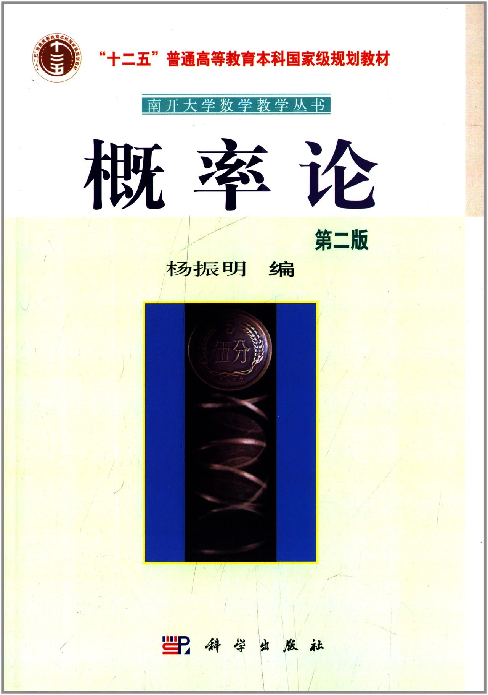{fig-align="center" width="3cm"}

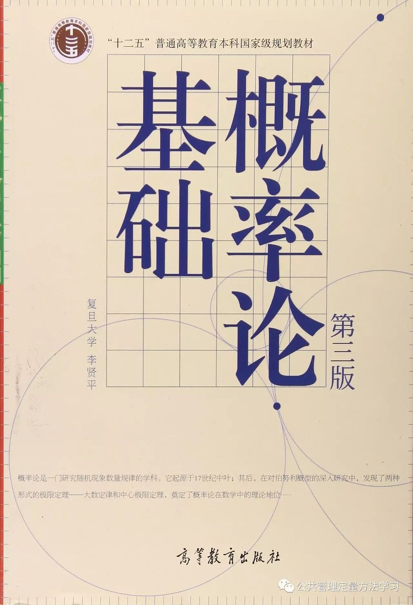{fig-align="center" width="3cm"}

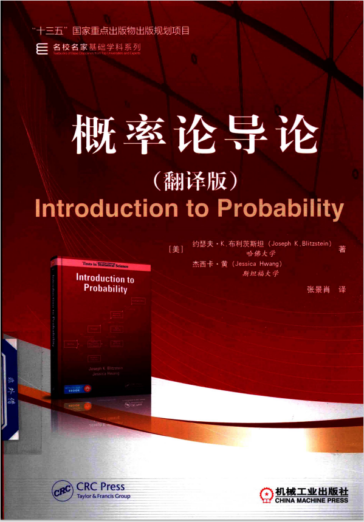{fig-align="center" width="3cm"}

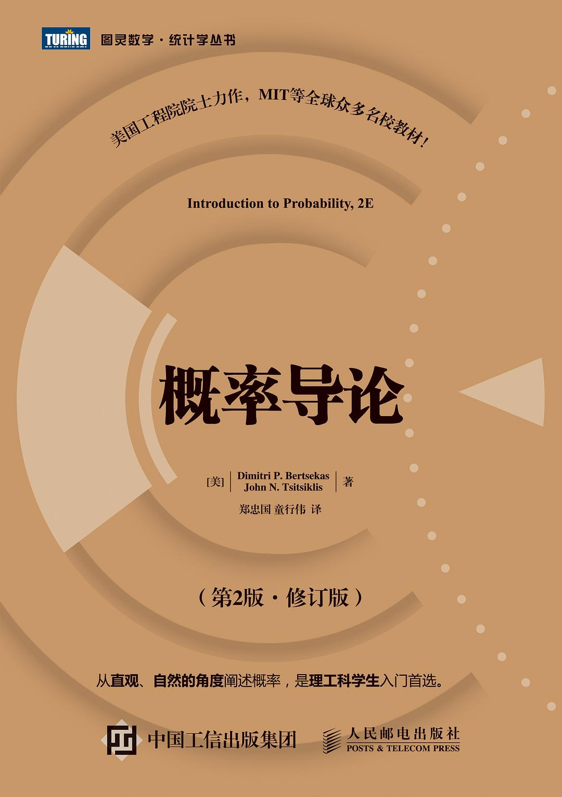{fig-align="center" width="3cm"}

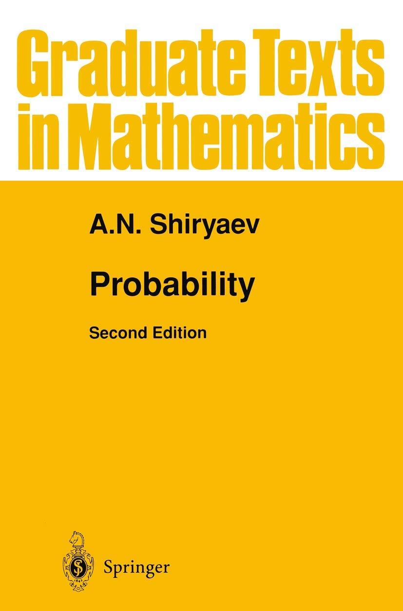{fig-align="center" width="3cm"}

{fig-align="center" width="3cm"}

#### 成绩构成 {#成绩构成 .unnumbered}

: 考勤(不定时随机点名), [**三次缺勤,此部分成绩为零, 但若期末考试成绩高于95分,则考勤成绩可用期末成绩替代.**]{style="color: red"}. 同时,[20%]{style="color: cyan"} :平时成绩,含平时作业,大作业,讨论报告等.

此外,[15%]{style="color: cyan"} : 开卷测验. 相应地,[50%]{style="color: cyan"} : 期末考试. 相应地,[5 分]{style="color: cyan"}: 课堂及平时表现加分项

相应地,期末考试过后, 凡与考试成绩有关的邮件,QQ留言,微信留言均不回复,敬请谅解.

#### 答疑时间与课程QQ群 {#答疑时间与课程qq群 .unnumbered}

答疑 其中,时间:每周二中午 12:00-13:30; 地点:新文科楼 528-4 办公室. 同时,课程QQ群 其中,理科试验班:1012134052; 强基拔尖班:856657190.

#### 作业提交 {#作业提交 .unnumbered}

- 提交时间:每周四上课前

- 作业书写在A4纸上, 首行注明: 第$k$次作业:姓名-学号

- 作业不能仅有公式,没有语言表达

#### 一点期望 {#一点期望 .unnumbered}

守时:作业按规定时间提交. 同时,勇于表现,不做沉默者. 此外,培养批判性思维. 相应地,相互尊重,教学意见及时与老师沟通. 相应地,注重培养书面语言表达能力. 相应地,实事求是,客观的进行教学评价

#### 学习方法 {#学习方法 .unnumbered}

课前预习. 同时,课上学习. 此外,课后复习. 相应地,每2-3周完整复习前2-3周的学习内容

#### 一本书三部电影 {#一本书三部电影 .unnumbered}

{fig-align="center" width="3cm"}

约翰-克利斯朵夫

{fig-align="center" width="3cm"}

肖申克的救赎

{fig-align="center" width="3cm"}

闻香识女人

{fig-align="center" width="3cm"}

心灵捕手

### 为什么要学概率论?

#### 什么是概率 {#什么是概率 .unnumbered}

运气,巧合,随机性,不确定性,风险,时运,机会 - 用法模糊. 同时,概率普遍存在于科学与日常生活中,但可能非常反直觉. 此外,单纯依靠直觉,会出现预测不准确或面临预测过于自信带来严重风险. 相应地,概率论课程旨在搭建一个有原则的量化不确定性和随机性的逻辑框架,通过学习强化自身的直觉.

#### 几个问题 {#几个问题 .unnumbered}

::: {#exr-ch1-001}
假设对于概率论课程成绩有两种不同的方式确定, 你选择哪一种?

课程成绩由提交作业的次数来决定,只要至少提交过 6 次作业就给你 60 分; 同时,课程成绩由某随机试验的结果来决定,但我保证: 你的课程成绩小于 60 分的概率为 0.
:::

#### 几个问题 {#几个问题-1 .unnumbered}

::: {#exr-ch1-002}
某人医院体检报告甲胎蛋白(AFP)值偏高, 医生建议进行肝细胞活检, 当问及原因时,医生说: 我们发现在肝癌患者中, 有 99.9% 的患者其甲胎蛋白数值都偏高. 医生给出活检的理由是否充分?
:::

#### 几个问题 {#几个问题-2 .unnumbered}

::: {#exr-ch1-003}
三门问题: 在某电视节目中,主持人蒙提霍尔会选择一名观众参与一个游戏.

三扇门: 一扇门后是一辆汽车, 另外两扇门后各有一只山羊; 同时,参与者可从三扇门中任选一扇,并可以获得该扇门后的奖品; 此外,在揭晓参与者所选门后的奖品之前, 主持人会打开其中一个未被选中的一扇门,并揭晓门后的奖品是山羊. 相应地,参与者可以坚持原来的选择或换成剩下的那扇门; 相应地,[问题]{style="color: cyan"}: 参与者是否要改变自己的选择? 相应地,如果将上面的问题推广至$n$扇门, 其中$k$扇门后是汽车, 那又做何选择? (此处, $n\geq 3, k\leq n-2$).
:::

::: {#rem-ch1-001}
主持人蒙提霍尔不是在参与者未选择的两扇门中随机选择, 而是总是选取一个后面是羊的门展示.
:::

#### 几个问题 {#几个问题-3 .unnumbered}

::: {#exr-ch1-004}
假设有这样一个赌博游戏: 赌注是 3000 元, 赌博者可以选择掷几个骰子, 只要掷出的骰子有 6 点且没有 1 点,则赌博者即可获得 10000 元.

赌博者应选几个骰子掷胜率更高? 同时,如果换做是你,你是选择玩这个赌博游戏,还是不玩?
:::

#### 几个问题 {#几个问题-4 .unnumbered}

::: {#exr-ch1-005}
假设某合法赌场内有胜率 1/2 与胜率 1/20 的两类赌局. 现迫于需要, 24 小时之内要在此合法赌场将 100 万元变成 200 万元.

一口气将 100 万下注在胜率为 1/2 的赌局上; 同时,将 100 万分成 10 份,每份 10 万下注在胜率为 1/20 的赌局上, 赌 10 次.
:::

::: {#exr-ch1-006}
赌徒破产问题: 假设去某赌徒去某赌场玩轮盘赌游戏, 其获胜的概率是 0.48. 该赌徒现有资产 1000 元, 并决定一直玩下去直到资产翻倍或破产, 试问下面哪一种下注方式对赌徒更为有利

每次下注 1 元; 同时,每次下注 100 元; 此外,每次下注 200 元; 相应地,每次下注 1000 元.
:::

#### 几个问题 {#几个问题-5 .unnumbered}

::: {#exr-ch1-007}
De Mere 分赌注问题

甲乙两人各下赌注$m$元; 同时,先胜三局者取得全部赌金; 此外,甲胜一局而乙胜零局时赌博被迫中止; 相应地,问赌注如何分?
:::

#### 其他问题 {#其他问题 .unnumbered}

买彩票问题; 同时,抽签公平性问题; 此外,生日相同的概率问题; 相应地,小概率事件终将发生; 相应地,一而再再而三,智者千虑,必有一失等谚语的概率理解; 相应地,狼来了故事的概率解释.

#### 概率论的应用领域 {#概率论的应用领域 .unnumbered}

- 统计学:概率论是统计学的基础和语言

- 物理学: 上帝不掷骰子,但量子物理学,统计力学均建立在概率基础之上

- 生物学:遗传学,基因序列,群体的生灭,迁移等随机模型

- 计算机科学:随机算法,算法性能,机器学习,人工智能

- 气象学:天气预报

- 睹博:概率论早期研究旨在解决赌博和机会游戏的问题

- 金融学:概率是计量金融的核心

- 政治科学:预测选举结果,民调等

- 保险精算,风险管理理与控制:保费核定及风险量化等

- 医学:随机临床试验

- 化学化工:化学反应动力学反应的时变率及影响因素问题等

- 天文学:湍流理论及星云密度起伏,辐射传递等

- 运筹与控制,排队论

- 生活:生活是不确定的,在不确定中利用概率做决策.

- $\cdots\cdots$

### 概率论课程简介

#### 概率论课程难不难? {#概率论课程难不难 .unnumbered}

概率论本质是分析类课程,研究内容与数学分析有很好的类比性. 同时,数学分析是确定性分析理论,概率论是随机性分析理论. 此外,难,也不难? 其中,概率论为解决随机问题提供了理论方法,同时也会产生陷阱和悖论; 即使是莱布尼茨和牛顿,也无法避免一些概率论上的基本错误. 相应地,如何避免潜在错误 其中,数值模拟:利用 R 语言运行模拟,看看到底谁是对的; 完整性检查:使用不同的方法来解决同样的问题,或者检查所得到的答案在简单和极端的情况下是否都是合理的.

#### 概率论课程主要内容 {#概率论课程主要内容 .unnumbered}

概率简介 (第1章) 其中,事件及其运算,概率定义及性质; 条件概率,事件独立性; 全概率公式,贝叶斯公式. 同时,随机变量 (第2, 3章) 其中,随机变量定义,性质,结构,研究方法(分布,分布函数),分类; 多维随机变量定义,研究方法(联合分布,联合分布函数),分类; 常见的随机变量具体分布类型:离散型,连续型; 条件分布函数,随机变量的独立性; 分布函数形式下的全概率公式,贝叶斯公式.

#### 概率论课程主要内容 {#概率论课程主要内容-1 .unnumbered}

随机变量的数字特征:期望,方差,协方差 (第4, 5章) 其中,随机变量的积分的定义及性质; 期望的定义以及与随机变量积分之间的关系; 方差,协方差的定义及性质,随机变量的矩,特征函数,矩母函数; 条件数学期望的定义及性质,条件方差. 同时,随机变量序列的极限(第6, 7章) 其中,随机变量序列的几种收敛性及相互关系:几乎必然,依概率,依分布等; 弱大数定律与强大数定律; 中心极限定理.

### 概率论发展简史

#### 概率雏形 {#概率雏形 .unnumbered}

- 1470年, 拉丁文的诗书\<De Vetula\>出版. 上面有首诗记录了3个骰子点数和的排列组合结果.

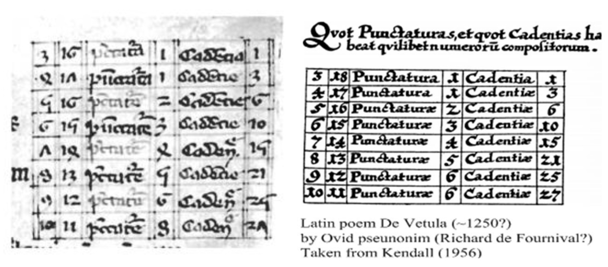{fig-align="center" width="9cm"}

- 左图为原始印刷, 右图为阿拉伯数字版本.可以看出, 三个骰子点数相加等于10或者11, 有6种组合情况, 但是排列情况有27种.

#### 概率雏形 {#概率雏形-1 .unnumbered}

140年后,即1610年左右, 资助Galileo(伽利略)的Tuscany(托斯卡纳)大公请教了Galileo 3个骰子和的问题. 同时,Tuscany大公在赌博时发现三个骰子点数和为10比点数和为9出现的更频繁一些. 他认为有6种方式得到10,分别为 $$(6,3,1),(6,2,2),(5,4,1),(5,3,2),(4,4,2),(4,3,3),$$ 同样有6种方式得到9,分别是 $$(6,2,1),(5,3,1),(5,2,2),(4,4,1),(4,3,2),(3,3,3).$$ 因此,9和10出现的频率不应该有差异. 此外,Galileo指出了大公的错误,三个骰子是不同的,$(6,3,1)$和$(6,1,3)$是不同的两种情况.可惜伽利略那个时候只考虑了频次,还没有形成概率的思想.

#### 概率论思想形成 {#概率论思想形成 .unnumbered}

- 1564年左右, 意大利博学家Cardano(卡尔达诺)写了本书\<Liber de Ludo Aleae (Book on Games of Chance)\>.

- Cardano是第一个系统的推算概率的人, 三个骰子和的问题在\<Liber de Ludo Aleae \>的第13章有提到并且解决.

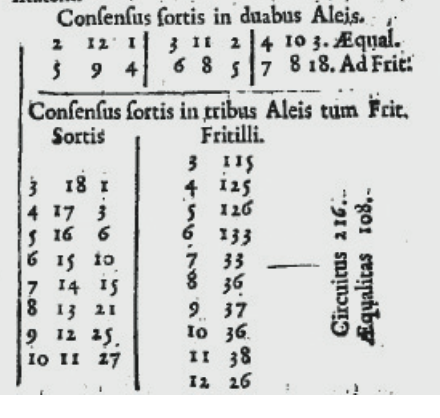{fig-align="center" width="7cm"}

- 直到一个世纪后的1663年才出版, 伽利略1642年去世,所以也没有机会看到.

- Cardano在第14章中明确定义了比例, 若赌局中有利的所有可能的数目为$a$,不利的数目为$b$,则应该根据$a/b$的结果来下注.

#### French Society in the 1650\'s {#french-society-in-the-1650s .unnumbered}

赌博是一种流行时尚. 同时,法律没有禁止. 此外,当游戏越来越复杂, 利益越来越大时, 需要数学方法来计算获胜可能性.

{fig-align="center" width="6cm"}

#### 概率论的诞生 {#概率论的诞生 .unnumbered}

Cardano虽说是概率的创派始祖, 但概率论真正变成一门学科的标志性事件则是1654年Pascal(帕斯卡)和Fermat(费马)关于两个赌博问题的通信. 同时,Pascal(帕斯卡)就是法国物理学家和数学家帕斯卡, 命名压强单位的物理学家Pascal. 此外,Fermat(费马)就是提出费马大定理并且困扰数学家300年之久的费马.

#### 两个赌博问题 {#两个赌博问题 .unnumbered}

::: {#exr-ch1-008}
De Mere(德梅尔):事件可能性大小

一颗骰子投 4 次至少得到一个六点,. 同时,两颗骰子投 24 次至少得到一个双六.
:::

::: {#exr-ch1-009}
De Mere 分赌注问题

甲乙两人各下赌注$m$元; 同时,甲乙两人获胜的概率一样,均为$\frac{1}{2}$; 此外,先胜$t$局者取得全部赌金; 相应地,甲胜$a$局而乙胜$b$局时赌博被迫中止; 相应地,问赌注如何分?
:::

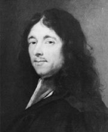{fig-align="center" width="3.5cm"}

Chevalier De Mere

#### 分赌注问题历史 {#分赌注问题历史 .unnumbered}

分赌注问题最早是由意大利数学家Paccioli(帕乔利)在1494年提出, 当时Paccioli给出的答案是按$a:b$进行分配. 同时,50年后, Tartaglia(塔尔塔利亚)提出反对意见:根据这条规则,如果游戏在一轮之后停止,那么其中一名玩家就会得到全部赌注. 此外,Tartaglia试图修改帕乔利的规则, 以便将上述情况考虑进去, 但最后他怀疑这个问题可能根本没有确定的答案. 相应地,1537年, Cardano也曾经思考过这个问题. 其中,Cardano给出了一个公式$f(n)=1+...+n$, 甲还剩$s-a$局就可以获胜,乙还剩$s-b$局可以获胜, 两者的分金比率应该为$f(s-b):f(s-a)=(s-b)(s-b+1):(s-a)(s-a+1)$.

虽然Cardano答案错误, 但Cardano已经开始考虑用未来剩余的赌局来决策,而不是局限于已发生的事件. 相应地,直到1654年, De Mere向Pascal请教, Pascal和Fermat进行书信交流, 并且用不同的解法给出了这个问题的正确答案. 相应地,后来, 荷兰数学家Huygens也参与了Pascal和Fermat的讨论, 并在1657年出版书籍\<De ratiociniis in ludo aleae (On Reasoning in Games of Chance)\>.

#### Blaise Pascal (布莱士-帕斯卡) {#blaise-pascal-布莱士-帕斯卡 .unnumbered}

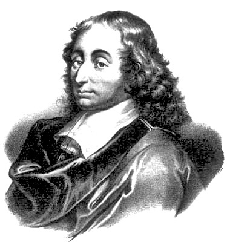{fig-align="center" width="4cm"}

岁时发现著名的帕斯卡六边形定理:内接于一个二次曲线的六边形的三双对边的交点共线; 同时,17 岁时写成\<圆锥曲线论\>,是研究德札尔格射影几何工作心得的论文; 设计并制作了一台能自动进位的加减法计算装置,被称为是世界上第一台数字计算器; 相应地,以积分学的原理解决了摆线问题; 相应地,与费马相互通信探求赌注分配问题,形成概率论中一个重要的基本概念-数学期望.

#### Pierre de Fermat (皮耶-德-费玛) {#pierre-de-fermat-皮耶-德-费玛 .unnumbered}

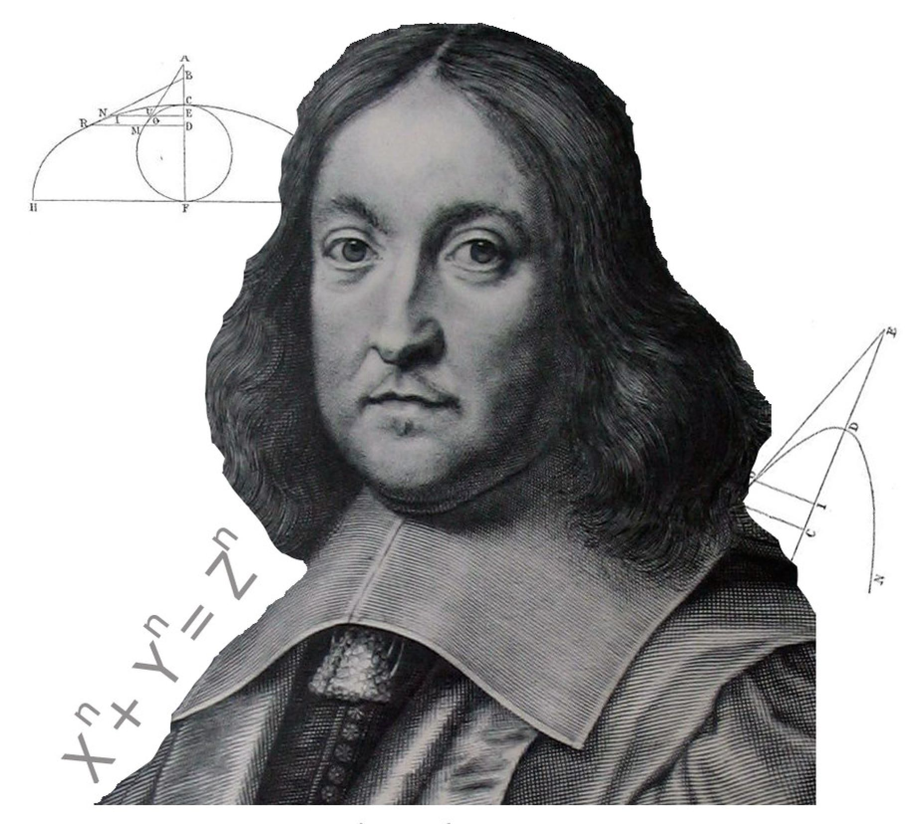{fig-align="center" width="4cm"}

独立于笛卡儿发现了解析几何的基本原理; 同时,求切线,求极大值和极小值以及定积分方法; 此外,费马和帕斯卡在相互通信探求赌注分配问题,形成概率论中一个重要的基本概念-数学期望; 相应地,数论中的费马大小定理; 相应地,光学的最小作用原理.

#### Christiaan Huygens (克里斯蒂安-惠更斯) {#christiaan-huygens-克里斯蒂安-惠更斯 .unnumbered}

在 1657 年写了世界上第一本关于概率论的著作 De ratiociniis in ludo aleae (On Reasoning in Games of Chance), 中文译名论赌博中的计算. 同时,概率论的基本概念,第一次在书中提出期望.

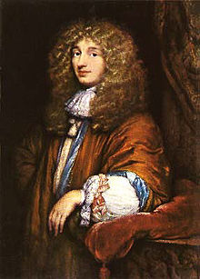{fig-align="center" width="3.5cm"}

#### 分赌注问题:Fermat解法 {#分赌注问题fermat解法 .unnumbered}

显然甲乙距离赢得赌局分别还差$r=t-a$局和$s:=t-b$局. 因此,若赌局不终止,赌局肯定会在接下来的$r+s-1$轮内结束. 同时,考虑所有$r+s-1$场赌局的结果, 计算在所有可能结果中,甲乙最终获胜的概率. 这样一来,整个问题就简化为一个古典概型的概率计算问题. 此外,以上述计算出来的获胜概率作为分配赌注的比例. 若$t=6,a=5,b=3$, 则最多还需要赌$3$场就可以分出胜负. 后续所有可能的结果分别为 $$\{\text{甲甲甲,甲甲乙,甲乙甲,甲乙乙,乙甲甲,乙甲乙, 乙乙甲, 乙乙乙}\}.$$ 相应地,所有的$8$种结果中, 乙只有一个结果获胜, 也就是连胜三局, 故赌注分配比例应为$7:1$.

#### 分赌注问题:Pascal解法 {#分赌注问题pascal解法 .unnumbered}

杨辉三角或Pascal三角法 其中,后续$r+s-1$场赌局的所有可能结果中:

使得甲获胜的结果个数为: $n_{\text{甲}}=\sum_{k=r}^{r+s-1}C_{r+s-1}^k$

使得乙获胜的结果个数为: $n_{\text{乙}}=\sum_{k=s}^{r+s-1}C_{r+s-1}^k$; 若$t=6,a=5,b=3$即$r=1,s=3$, 则 $$n_{\text{甲}}=C_3^1+C_3^2+C_3^3=7, \quad n_{\text{乙}}=C_3^3=1$$

#### 分赌注问题:Pascal解法 {#分赌注问题pascal解法-1 .unnumbered}

递推法 其中,假设甲和乙赌注共$64$个金币, 考虑$t=6,a=5,b=4$的情况:

如果下一局甲胜,则甲得到全部64枚金币

如果下一局甲输,则比分变为$5:5$, 这时候是平局,甲乙平分赌注.; 不管哪种情况, 甲至少会拿$32$个金币,剩余的$32$个金币,可能归甲也可能归乙,平分. 这样甲应该拿$32+(64-32)/2=48$个金币,乙则拿$16$个金币.; 考虑$t=6,a=5,b=3$的情况: 如果下一局甲胜,则拿到所有赌注; 如果甲败,则问题转化为$t=6,a=5,b=4$的情况; 由此可见,甲至少可拿48个硬币,剩余金币平分; 因此,甲最终可拿$48+(64-48)/2=56$个金币, 乙拿8个金币; 和Fermat的$7:1$结果相同.

在递推解法里,Pascal用到了期望的思想,尤其是$48+(64-48)/2$这个式子. 其中,下一局甲胜得到$x=64$个金币,甲输得到$y=48$个金币; 按Pascal的式子, 甲拿到的金币为: $y+(x-y)/2=(x+y)/2=x*0.5+y*0.5$,这其实就是条件期望公式.

#### 分赌注问题:Pascal递推法的一般解法 {#分赌注问题pascal递推法的一般解法 .unnumbered}

赌博中断时,甲乙距离赢得赌局分别还差$r=t-a$局和$s:=t-b$局; 同时,假设中断后赌局继续进行, 甲最终获胜的概率记为$e(r,s)$, 则有边界条件: $$e(0,s)=1,\quad e(r,0)=0,\quad e(r,r)=1/2$$且有如下递推式 $$e(r,s)=[e(r-1,s)+e(r,s-1)]/2.$$ 此外,上式用到了全概率公式,是一个偏差分方程. Pascal借助算术三角阵, 利用数学归纳法得到 $$e(r, s)=\frac{D_{r+s-1, s-1}}{D_{r+s-1}} (r+s=2,3, \cdots)$$ 相应地,这里分子表示算术三角形中第${r+s-1}$行最后${s}$项之和,而分母为第${r+s-1}$行的所有数字之和, 故为${2^{r+s-1}}$.

#### Jacob Bernoulli(雅各布-伯努利) {#jacob-bernoulli雅各布-伯努利 .unnumbered}

概率论与变分法先驱之一; 同时,第一次使用积分一词; 此外,首次给出直角坐标和极坐标下的曲率半径公式; 相应地,1713 年出版 \<Ars Conjectandi\>(可译为\<猜度术\>):提出了概率论中的伯努利大数定律 - 大数定律的最早形式.

{fig-align="center" width="5.5cm"}

#### Abraham de Moivre(亚伯拉罕-棣莫弗) {#abraham-de-moivre亚伯拉罕-棣莫弗 .unnumbered}

棣莫弗公式:$$(\cos x+i\sin x)^n=\cos(nx)+i \sin(nx)$$ 同时,二项分布的正态逼近:棣莫弗-拉普拉斯中心极限定理; 利用概率生成函数计算均匀分布随机变量和的分布; 相应地,寿险保险数学:年金的分析与计算. 相应地,开创了概率论的现代方法:1718 年发表了\<The Doctrine of Chance\>. 在此书中 统计独立性的定义首次出现. 该书在 1738 年与 1756 年出了扩展版,生日问 题出现在 1738 年的版本中,赌徒破产问题出现在 1756 年的版本中.

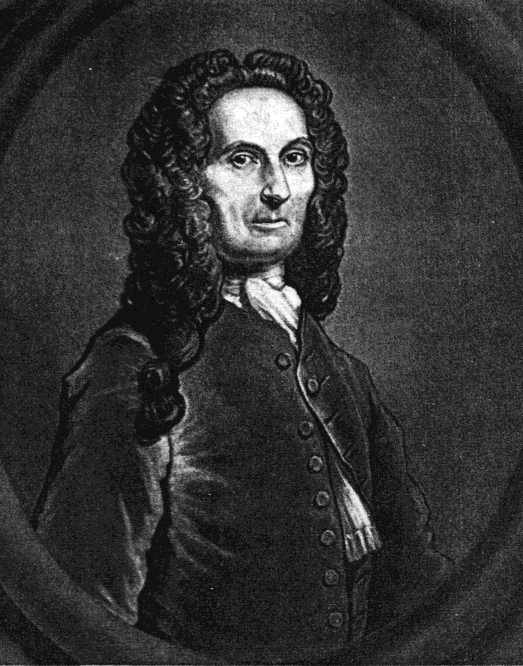{fig-align="center" width="4.5cm"}

#### Pierre-Simon Laplace(皮埃尔-西蒙-拉普拉斯) {#pierre-simon-laplace皮埃尔-西蒙-拉普拉斯 .unnumbered}

在他 1812 年的著作\<Théorie Analytique des Probabilitìés\>(可 译为\<概率论的解析理论\>)中介绍了概率的数学理论及其科学应用; 同时,Laplace只考虑了古典概型, 对一般的概率及其应用没有介绍; 此外,到 1850 年, 许多数学家发现古典概型对一般场合不合理, 开始尝试重新定义概率.

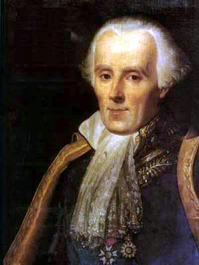{fig-align="center" width="4.5cm"}

#### 概率的公理化体系 {#概率的公理化体系 .unnumbered}

从 17 世纪到 19 世纪长达 300 多年的时间里,以 Laplace(1749 一 1827), De Moivre(1687-1754), J.Bernouil, D.Bernouli(1700-1782). Pascal,Fermat 等为代表的优秀学者从各自不同的角度对概率论的许多方面进行了深入细致的研究,取得了大量成果,可是都无法将概率论纳入到严格的公理化体系中.而概率论作为数学的重要分支,其逻辑的严密性和完整性始终受到质疑. 同时,数学大师 Hilbert(1862-1943)在 1900 年提出的 23 个著名问题中,第 6 个问题是关于物理定律的公理化,其中就涉及概率论的公理化问题. 此外,激发了以 Borel(1871 一 1956)和 Lebesgue(1875-1941)等为代表的一批学者的研究热情.他们在测度理论(Measure Theory)方面得到的成果为后续研究指明了道路.

#### Andrey Kolmogorov(安德列-柯尔莫哥洛夫) {#andrey-kolmogorov安德列-柯尔莫哥洛夫 .unnumbered}

第一个在他 1933 年的著作(\<Foundations of the Theory of Probability\>) 中严格的定义了概率; 同时,类似于Euclid基于公理体系建立几何, 他从基本公理建立了概率理论, 从而使概率论称为一门严谨的数学分支; 此外,概率理论的现代研究和测度论非常紧密的结合在一起.

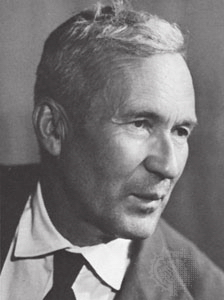{fig-align="center" width="4cm"}

1903.4.25-1987.10.20

#### Kolmogorov 成就 {#kolmogorov-成就 .unnumbered}

世纪最伟大的数学家之一,在概率论,实分析,拓扑学,泛函分析,微分方程,生物数学,等很多领域都有着开创性的贡献. 同时,1933 年,出版\<概率论基础\>,首次将概率论建立在严格的公理基础上,解决了希尔伯特第 6 问题的概率部分. 此外,线性拓扑空间理论的创始人之一, 和美国著名数学家亚历山大(J.W.Alexander)同时独立引入上同调群的概念; 相应地,40 年代, 在遗传学,弹道学,气象学,金属结晶学等有重要贡献; 相应地,50 年代, 经典力学,遍历理论,函数论,信息论,算法理论等. 相应地,柯尔莫哥洛夫的研究几乎遍及数论之外的一切数学领域.1963 年,在第比利斯召开的概率统计会议上,美国统计学家沃尔夫维茨(J.Wolfowitz)说:我来苏联的一个特别的目的是确定柯尔莫哥洛夫到底是一个人呢,还是一个研究机构..

#### Kolmogorov 轶事 {#kolmogorov-轶事 .unnumbered}

历史学要证实自己的观点需要几个甚至几十个正确证明才行,数学只需要一个证明就行, 于是转行数学. 同时,20 年代的莫斯科大学,学生被要求在十四个不同的数学分支参加十四门考试;但考试可用相应领域的独立研究代替. Kolmogorov 从来没有参加考试,他写了十四个不同方向的有新意的文章. 此外,Kolmogorov总是以感激的口气提到斯大林:首先,他在战争年代为每一位院士提供了一床毛毯;第二,原谅了我在科学院的那次打架.一次在选举会上打了Luzin(卢津)一个耳光,他说:(打架)那是我们常用的方式.在实变函数方面有着很重要的贡献,但是以打架而论,远非Kolmogorov的对手.

## 样本空间,事件及其运算 {#sec-ch1-lecture-2}

::: {.callout-note appearance="simple" icon="false"}
## 本节导读

一次随机试验可能产生许多结果,样本空间负责列出所有可能性,事件则表达我们关心的命题.集合运算为事件之间的逻辑关系提供精确语言;事件列的上,下极限进一步刻画最终总发生与无穷多次发生等长期行为.
:::

::: {.callout-tip appearance="simple" icon="false"}
## 理论主线

样本空间与事件是概率模型的逻辑基础.样本空间并非由现实问题唯一决定,而取决于观察尺度和研究目标;同一随机试验可以有不同的样本空间表示.一个表示是否合适,要看它能否无歧义地表达所研究的事件,并能否支持后续概率赋值.

事件运算本质上是逻辑运算:并对应至少一个发生,交对应同时发生,补对应不发生.事件列的上,下极限则把这种语言推广到无穷次试验,用来区分最终总是发生和发生无穷多次.
:::

### 样本空间与随机事件

#### 概率: (随机)事件发生的可能性大小的度量 {#概率-随机事件发生的可能性大小的度量 .unnumbered}

[随机现象:]{style="color: cyan"} 一定条件下,并不总是出现相同结果的现象, 比如抛一枚硬币,掷一颗骰子等; 同时,[随机试验:]{style="color: cyan"} 对随机现象的观测与分析; 常简称[试验]{style="color: cyan"} 其中,随机试验在相同条件下可多次重复; 随机试验的结果至少 2 个且所有可能发生的结果构成的集合是确定不变的; 每次试验或观测得到其中的一个结果,在试验或观测之前不能预知是哪个结果发生.

此外,随机试验举例: 伯努利(Bernoulli)试验: 只有两种可能结果的随机试验, 如抛一枚硬币,掷一颗骰子; 观测把硬币抛 $n$ 次后正面向上的次数; 高尔顿钉板试验.

#### 样本点与样本空间 {#样本点与样本空间 .unnumbered}

[样本空间(Sample Space):]{style="color: cyan"} 随机试验的所有可能结果构成的(非空)集合, 常用[$\Omega$]{style="color: red"}表示. 其中,一个试验的样本空间可能是有限的,可数无限的或不可数的; 当样本空间为有限的时, 我们可以将样本点可视化为圆点,做一次试验就等同于随机选取一个圆点; 如果所有的圆点都是相同的,那么所有的圆点被抽中的可能性就相同,即后面将要介绍的古典概型. 同时,[样本点(Sample Point):]{style="color: cyan"} 样本空间中的元素, 也即随机试验的每个可能结果称为一个样本点,常用[$\omega$]{style="color: red"}表示.

#### 事件 {#事件 .unnumbered}

[随机事件:]{style="color: cyan"} 简称事件 (Event), 由部分样本点组成的试验结果 其中,通常指在随机试验中我们所关心的某一部分可能结果; 如果按照样本点可视化为圆点,则事件就是一些圆点的集合. 同时,[基本事件:]{style="color: cyan"} 仅含有一个样本点的随机事件称为基本事件, 它犹如分子中的原子, 在化学反应中不能再分, 所以有 基本 两字. 此外,[事件发生]{style="color: cyan"} 其中,[事件$A$发生]{style="color: cyan"}:事件$A$包含的样本点在随机试验结果中出现即$\omega\in A$; 通常把事件$A$所包含的样本点构成的集合与事件$A$视为等同,也记为$A$,. 相应地,[两个特殊的事件:]{style="color: cyan"} 其中,[必然事件]{style="color: cyan"}($\Omega$):在随机试验中一定会发生的事件; [不可能事件]{style="color: cyan"}($\emptyset$):在随机试验中不可能发生的事件;

#### 硬币抛 3 次的随机试验 {#硬币抛-3-次的随机试验 .unnumbered}

[样本点:]{style="color: cyan"}正正正,正正反,正反正,反正正,正反反,反正反,反反正,反反反,共 8 种可能结果; 同时,[基本事件:]{style="color: cyan"} {正正正},{正正反},{正反正}, {反正正},{正反反},{反正反},{反反正},{反反反}, 共 8 个基本事件; 此外, $$\Omega:=\{\mbox{正正正,正正反,正反正,反正正,正反反,反正反,反反正,反反反}\}$$ 相应地,[随机事件:]{style="color: cyan"}

$$
\begin{aligned}
A&:=&\{\mbox{至少出现两次正面}\}\\
       &=&\{\mbox{正正正,正正反,正反正,反正正}\} \\
      B&:=&\{\mbox{三次均为正面}\}=\{\mbox{正正正}\}\\
      \cdots
\end{aligned}
$$

#### 样本空间示例 {#样本空间示例 .unnumbered}

掷一枚骰子, 观察出现的点数. 则 $\Omega=\{1, 2, 3, 4, 5, 6\}$. 同时,考察某一地区的年降雨量,则$\Omega=\{x|0\le x<T\}$,这里$T$表示某个常数, 表示降雨量不会超过$T$. 此外,将一枚硬币抛两次,考察正反面出现的情况, 则 $$\Omega=\{\mbox{正正,正反,反正,反反}\}.$$ 相应地,将一枚硬币抛两次,考察正面出现的次数, 则$\Omega=\{0, 1, 2\}$. 相应地,先后掷两次骰子,考察两次骰子的点数, 则 $$\Omega=\{(a_1, a_2), a_i\in \{1,2,\cdots, 6\}, i=1,2\}.$$

#### 样本空间示例 {#样本空间示例-1 .unnumbered}

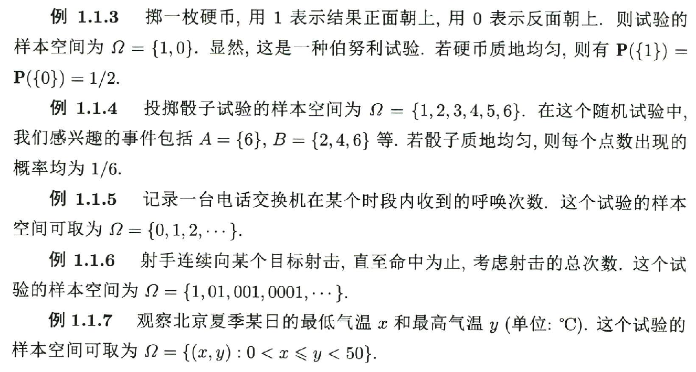{fig-align="center" width="11.5cm"}

### 事件的运算与关系

#### 事件间的并:$A\cup B$ {#事件间的并acup-b .unnumbered}

::: {#def-ch1-001}
() 记为 $A\cup B$, 其含义为:事件$A$和事件$B$至少有一个发生, 即由事件$A$与$B$中所有的样本点组成的新事件. 用数学符号来描述即为:

$$
\begin{aligned}
A\cup B:=\{\omega\in \Omega: \omega\in A, \mbox{ 或 } \omega\in B\}
\end{aligned}
$$

:::

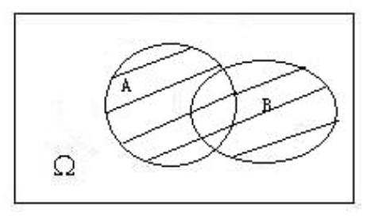{fig-align="center" width="3cm"}

::: {#exm-ch1-001}
考虑掷一枚骰子, 观察出现的点数. 记事件$A$为掷出的点数为奇数, 事件$B$为掷出的点数不超过$3$, 则 $$A=\{1,3,5\},\quad  B=\{1,2,3\},\quad  A\cup B=\{1,2,3,5\}$$
:::

#### 事件间的交:$A\cap B$ {#事件间的交acap-b .unnumbered}

::: {#def-ch1-002}
() 记为 $A\cap B$或 $AB$, 其含义为:事件$A$和事件$B$同时发生, 即由事件$A$与$B$中公共的样本点组成的新事件. 用数学符号来描述即为:

$$
\begin{aligned}
A\cap B:=\{\omega\in \Omega: \omega\in A \mbox{ 且 } \omega\in B\}
\end{aligned}
$$

:::

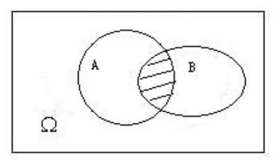{fig-align="center" width="3cm"}

::: {#exm-ch1-002}
考虑掷一枚骰子, 观察出现的点数. 记事件$A$为掷出的点数为奇数, 事件$B$为掷出的点数不超过$3$, 则 $$A=\{1,3,5\},\quad  B=\{1,2,3\},\quad  A\cap B=\{1,3\}$$
:::

#### 事件的差:$A-B$ {#事件的差a-b .unnumbered}

::: {#def-ch1-003}
() 记为$A-B$或$A\backslash B$, 其含义为:事件$A$发生且事件$B$不发生, 即由在$A$中而不在$B$中的样本点组成的新事件. 用数学符号来描述即为:

$$
\begin{aligned}
A-B:=\{\omega\in \Omega: \omega\in  A \mbox{ 且 } \omega\notin B\}
\end{aligned}
$$

:::

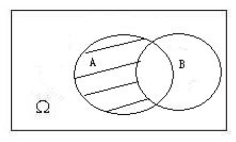{fig-align="center" width="3cm"}

::: {#exm-ch1-003}
考虑掷一枚骰子, 观察出现的点数. 记事件$A$为掷出的点数为奇数, 事件$B$为掷出的点数不超过$3$, 则 $$A=\{1,3,5\},\quad  B=\{1,2,3\},\quad  A-B=\{5\}$$
:::

#### 对立事件:$\overline{A}$ {#对立事件overlinea .unnumbered}

::: {#def-ch1-004}
() 记为$\overline{A}$或$A^c$, 其含义为:事件$A$不发生, 即由在$\Omega$中而不在$A$中的样本点组成的新事件. 用数学符号来描述即为:

$$
\begin{aligned}
\overline{A}:=\{\omega\in \Omega: \omega\notin  A\}\textcolor{red}{=\Omega-A}
\end{aligned}
$$

:::

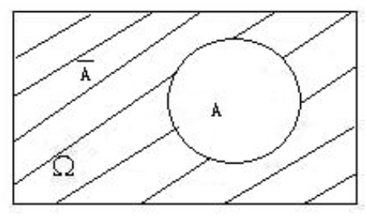{fig-align="center" width="3cm"}

::: {#exm-ch1-004}
考虑掷一枚骰子, 观察出现的点数. 记事件$A$为掷出的点数为奇数, 则 $$A=\{1,3,5\},\quad \overline{A}=\{2,4,6\}$$
:::

#### 对称差事件:$A\Delta B$ {#对称差事件adelta-b .unnumbered}

::: {#def-ch1-005}
() 记为$A\Delta B$, 其含义为:事件$A$与$B$中恰有一个事件发生. 用数学符号来描述即为:

$$
\begin{aligned}
A\Delta B:=\{\omega\in \Omega: \omega\in A\cup B \mbox{ 且 } \omega\notin A\cap B\}\textcolor{red}{=(A-B)\cup (B-A)}
\end{aligned}
$$

:::

#### 包含关系: $A\subset B$ {#包含关系-asubset-b .unnumbered}

::: {#def-ch1-006}
() 称事件$A$包含于事件$B$,或事件$B$包含事件$A$(记为), 如果事件$A$发生必然导致事件$B$发生, 即属于$A$的样本点必然属于$B$.
:::

::: {#exm-ch1-005}
考虑掷一枚骰子, 观察出现的点数. 记事件$A$为掷出的点数为$2$或$4$, 事件$B$为掷出的点数为偶数. 则显然有事件$A$发生必然导致事件$B$发生,同时易知

$$
\begin{aligned}
A=\{2,4\}\subset \{2,4,6\}=B
\end{aligned}
$$

:::

#### 相等关系: $A=B$ {#相等关系-ab .unnumbered}

::: {#def-ch1-007}
() 称事件$A$与事件$B$相等(记为), 如果$A\subset B$且$B\subset A$, 即事情件$A,B$有相同的样本点.
:::

::: {#exm-ch1-006}
考虑掷一枚骰子, 观察出现的点数. 记事件$A$为掷出的点数为$2,4,6$, 事件$B$为掷出的点数为偶数. 则显然有 $$A\subset B, B\subset A,$$ 同时易有

$$
\begin{aligned}
A=\{2,4, 6\}=\{2,4,6\}=B
\end{aligned}
$$

:::

#### 互不相容关系: $A\cap B=\emptyset$ {#互不相容关系-acap-bemptyset .unnumbered}

::: {#def-ch1-008}
() 称事件$A$与事件$B$互不相容, 如果事件$A, B$不能同时发生, 即事情件$A,B$没有相同的样本点.
:::

::: {#exm-ch1-007}
考虑掷一枚骰子, 观察出现的点数. 记事件$A$为掷出的点数为奇数, 事件$B$为掷出的点数为偶数. 则显然有事件$A,B$互不相容, 并且

$$
\begin{aligned}
A\cap B=\{1,3,5\}\cap \{2,4,6\}=\emptyset
\end{aligned}
$$

:::

#### 对立事件与互不相容事件 {#对立事件与互不相容事件 .unnumbered}

$\overline{\overline{A}}=A, A\cap \overline{A}=\emptyset, A\cup \overline{A}=\Omega$; 同时,$A,B$互为对立事件的充要条件为$A\cap B=\emptyset, A\cup B=\Omega$; 此外,对立事件一定是互不相容事件, 但互不相容事件不一定是对立事件; 相应地,$A-B=A\cap \overline{B}=A\overline{B}$.

#### 多个事件的运算 {#多个事件的运算 .unnumbered}

有限并事件:$\bigcup_{k=1}^{n}A_{k}$ 同时,有限交事件:$\bigcap_{k=1}^{n}A_{k}$ 此外,可列并事件:$\bigcup_{k=1}^{\infty}A_{k}$ 相应地,可列交事件:$\bigcap_{k=1}^{\infty}A_{k}$

#### 事件运算的性质 {#事件运算的性质 .unnumbered}

(1) $A\cup B=B\cup A, AB=BA$;

(2) $A\cup (B\cup C)=(A\cup B)\cup C, (AB)C=A(BC)$;

(3) $(A\cup B)\cap C=(A\cap C)\cup (B\cap C)$,\
    $(A\cap B)\cup C=(A\cup C)\cap (B\cup C)$;

(4)

$$
\begin{aligned}
\overline{\bigcup_{i=1}^nA_i}=\bigcap_{i=1}^n \overline{A}_i\\
                \overline{\bigcap_{i=1}^nA_i}=\bigcup_{i=1}^n \overline{A}_i
\end{aligned}
$$

### 事件列的上下极限及其性质

#### 事件列的上下极限 {#事件列的上下极限 .unnumbered}

::: {#def-ch1-009}
令$A_n\subset \Omega, n\geq 1$为一列集合(事件), 记

$$
\begin{aligned}
\inf_{k\geq n} A_k:=\cap_{k=n}^\infty A_k,\quad  \sup_{k\geq n}A_k:=\cup_{k=n}^\infty A_k
\end{aligned}
$$

 则事件列$A_n$的上下极限定义如下:

$$
\begin{aligned}
\liminf_{n\rightarrow\infty}A_n:=\cup_{n=1}^\infty\cap_{k=n}^\infty A_k,\\
            \limsup_{n\rightarrow\infty}A_n:=\cap_{n=1}^\infty\cup_{k=n}^\infty A_k.
\end{aligned}
$$

 若

$$
\begin{aligned}
\liminf_{n\rightarrow\infty}A_n=\limsup_{n\rightarrow\infty}A_n=A
\end{aligned}
$$

 则称$A$为事件列$\{A_n,n\geq 1\}$的极限,并记作$\lim_{n\rightarrow\infty}A_n=A$.
:::

#### 单调事件列的极限 {#单调事件列的极限 .unnumbered}

::: {#def-ch1-010}
事件列$\{A_n\}$称为单调不减的,如果对任意的$n$均有$A_n\subset A_{n+1}$; 事件列$\{A_n\}$称为单调不增的,如果对任意的$n$均有$A_{n+1}\subset A_n$;
:::

::: {#thm-ch1-001}
假设$\{A_n\}$是单调事件列,则

1.  如果$\{A_n\}$是单调不减事件列,则$\lim_{n\rightarrow\infty}A_n=\cup_{n=1}^\infty A_n$

2.  如果$\{A_n\}$是单调不增事件列,则$\lim_{n\rightarrow\infty}A_n=\cap_{n=1}^\infty A_n$
:::

#### 示性函数(indicator function) {#示性函数indicator-function .unnumbered}

::: {#def-ch1-011}
设$A\subset \Omega$, 我们定义事件(集合)$A$的示性函数如下

$$
\begin{aligned}
1_A(\omega)=\left\{
            \begin{array}[l]{ll}
                1, &\mbox{如果}\omega\in A;\\
                0, &\mbox{如果}\omega\notin A.
            \end{array}
            \right.
\end{aligned}
$$

:::

::: {#rem-ch1-002}
$A=\{\omega: 1_A(\omega)=1\}$; 同时,$1_A\leq 1_B\Leftrightarrow A\subset B$; 此外,$1_{A\cap B}=1_A\cdot 1_B$; 相应地,$1_{A\cup B}=1_A+1_B-1_{A\cap B}$;
:::

#### 事件列上下极限的性质 {#事件列上下极限的性质 .unnumbered}

::: {#lem-ch1-001}
令$\{A_n\}$为$\Omega$的任一子集列,则

$$
\begin{aligned}
\limsup_{n\rightarrow\infty}A_n&=&\{\omega:\sum_{n=1}^\infty 1_{A_n}(\omega)=\infty\}\\
            &=&\{\omega: \omega\mbox{属于无穷多个}A_n\}\\
            \liminf_{n\rightarrow\infty}A_n&=&\{\omega:\sum_{n=1}^\infty 1_{\bar{A_n}}(\omega)<\infty\}\\
            &=&\{\omega:\mbox{除去有限多个}A_n\mbox{外},\omega\mbox{属于余下所有的}A_n\}
\end{aligned}
$$

:::

**证明.** 由$\omega\in \limsup_{n\rightarrow\infty}A_n=\cap_{n=1}^\infty \cup_{k=n}^\infty A_k$知,对任意的$n$, 存在 $k_n\geq n$使得$\omega\in A_{k_n}$, 从而$\sum_{n=1}^\infty 1_{A_n}\geq \sum_{n=1}^\infty 1_{A_{k_n}}=\infty$.

反之,若 $\omega\in \{\omega:\sum_{n=1}^\infty 1_{A_n}(\omega)=\infty\}$, 则存在$k_n\rightarrow\infty$使得$\omega\in A_{k_n}$, 从而对任意的$n$, $\omega\in\cup_{k=n}^\infty A_k$, 即 $$\omega\in \cap_{n=1}^\infty \cup_{k=n}^\infty A_k=\limsup_{n\rightarrow\infty} A_n.$$

### 事件运算表及例子

#### 事件运算表 {#事件运算表 .unnumbered}

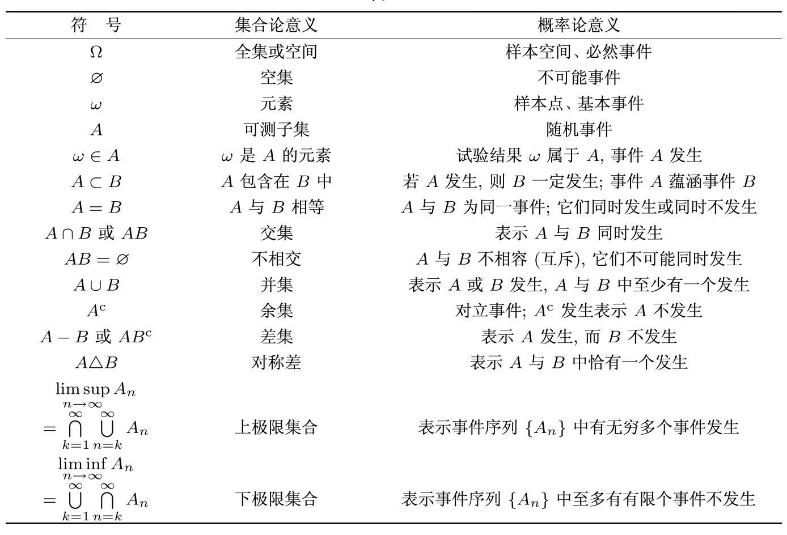{fig-align="center" width="12cm"}

::: {#exm-ch1-008}
设$A,B,C$为某个随机现象的三个事件,试用事件的交,差,并,对立事件表示下列事件

首先,事件$A,B$发生而$C$不发生:[$AB\overline{C}$]{style="color: red"}; 接着,事件$A,B,C$中至少有一个发生: ; 另一方面,事件$A,B,C$中至少有两个发生: ; 最后,事件$A,B, C$中恰好有两个发生: ;

在此基础上,事件$A,B,C$同时发生: ; 接着,事件$A,B,C$都不发生: ; 最后,事件$A,B,C$不全发生: ;
:::

::: {#exm-ch1-009}
(掷硬币) 掷一枚硬币$10$次, 正面用${\mathrm{H}}$表示反面用${\mathrm{T}}$表示.

首先,一个可能的结果为HHHTHHTTHT, 且样本空间就是所有长度为$10$的由${\mathrm{H}}$和${\mathrm{T}}$组成的字符串的集合. 若令${\mathrm{H}}$为$1$,${\mathrm{T}}$为$0$ , 则一个结果可用数列${\left(s_{1}, s_{2}, \cdots, s_{10}\right)}$表示, 其中${s_{j} \in\{0,1\}}$, 样本空间即为这些数列的集合. 最后,下面我们看几个事件: ${A_{i}}$: 第$i$次掷硬币结果为${\mathrm{H}}$,则 $$A_{i}=\left\{\left(s_{1}, \cdots, s_{i-1}, 1, s_{i+1}, \cdots, s_{10}\right): s_{j} \in\{1,0\} \text{ 且 } 1 \leqslant j \leqslant 10, j\neq i\right\}.$$

${B}$: 至少有一次掷硬币结果为${\mathrm{H}}$, 则 $B=\bigcup_{j=1}^{10} A_{j}.$; ${C}$: 所有掷硬币结果都为${\mathrm{H}}$, 则 $C=\bigcap_{j=1}^{10} A_{j}.$; ${D}$: 至少有两个连续的${\mathrm{H}}$, 则 $D=\bigcup_{j=1}^{9}\left(A_{j} \cap A_{j+1}\right).$.
:::

## 古典概型与几何概型 {#sec-ch1-lecture-3}

::: {.callout-note appearance="simple" icon="false"}
## 本节导读

当有限个基本结果等可能时,概率计算可以归结为计数;当随机结果在连续区域中均匀分布时,计数自然过渡为长度,面积或体积之比.本节一方面训练排列组合能力,另一方面揭示等可能性是需要论证的建模假设.
:::

::: {.callout-tip appearance="simple" icon="false"}
## 理论主线

古典概型的核心不只是计数,而是有限个基本结果的等可能性.计算 $P(A)=|A|/|\Omega|$ 之前,必须先确认样本点彼此互斥,穷尽所有可能结果,并且确实等可能.排列组合只是计算集合基数的工具,不能替代对等可能假设的论证.

几何概型把计数测度替换为长度,面积或体积等几何测度.所谓随机取一点或随机取一条弦只有在生成机制和参考测度明确之后才有数学意义;Bertrand 弦问题正说明了忽略这一点会导致模型不唯一.
:::

### 古典概型

#### 古典概型 {#古典概型-1 .unnumbered}

::: {#def-ch1-012}
() 有两个条件,

(1) (有限性) 试验结果只有有限个 (记为 $n$);

(2) (等可能性) 每个基本事件发生的可能性相同.
:::

对于古典概型: $\Omega=\{\omega_1,\cdots,\omega_n\}, \mathcal{F}=\{A:A\subset \Omega\}$, 事件 $A\in\mathcal{F}$ 的概率定义为

$$
\begin{aligned}
P(A)=\dfrac{|A|}{|\Omega|}, \ \forall A\in \mathcal{F}
\end{aligned}
$$

 其中,$|B|$ 表示事件 $B$ 所包含的基本事件的个数.

#### 古典概型的两个重要方面 {#古典概型的两个重要方面 .unnumbered}

确定样本空间与样本点

::: {#exm-ch1-010}
掷两个均匀硬币,出现正,反两面的概率是多少?
:::

其中,数学家d\'Alembert(达朗贝尔)认为掷两个均匀硬币, 出现的结果无外乎正正,反反,正反, 因此概率应是$\dfrac{1}{3}$; 事实上, 该试验样本空间为 $$\Omega=\{(\text{正, 正}),(\text{正, 反}), (\text{反, 正}), (\text{反, 反})\}$$ 若硬币不可区分,则样本空间为 $\Omega=\{\{\text{正,正}\},\{\text{正,反}\}, \{\text{反,反}\}\}$, 但样本空间中的样本点并不是等可能出现, 所以也不能说出现正,反两面的概率是$\frac{1}{3}$.

::: {#exm-ch1-011}
() 掷两个均匀骰子,得到点数和为11与12的概率相同吗?
:::

. 同时,如何计数: 见下面计数原理.

#### 计数原理 {#计数原理 .unnumbered}

考虑试验 $A$ 和 $B$, 若试验 $A$ 有 $a$ 种可能结果,试验 $B$ 有 $b$ 种可能结果,则试验 $A$ 或 $B$ 共有 $a+b$ 种结果\
考虑一个复合试验,它由两个子试验 $A$ 和 $B$ 构成.假设试验 $A$ 有 $a$ 种可能结 果,每一种情况又都对应于试验 $B$ 的 $b$ 种可能结果.那么这个复合试验共有 $ab$ 种可能结果.

#### 冰淇淋甜筒购方案计数 {#冰淇淋甜筒购方案计数 .unnumbered}

::: {#exm-ch1-012}
(冰淇淋甜筒) 假没某人正在购买一支冰淇淋甜筒,甜筒有蛋卷或华夫饼两种选择,冰淇淋有巧克力 (C),草莓 (S) 和香草 (V) 三种口味可选.考虑以下问题:

该随机试验共有 6 种可能购买方案:无论是先决定甜简类型还是冰淇淋口味类型,试验都是总共有 $2\times 3=3\times 2=6$ 种可能. 同时,假设怀特先生某天上下午各买一支冰淇淋甜筒,则该试验共有 $6^2=36$ 种可能结果. 此外,如果只关注这天吃了何种类型的冰淇淋,而不在乎吃冰淇淋的顺序,即 $(cakeC, waffleV)$ 和 $(waffleV, cakeC)$ 之间没有区别, 则共有 $$6*5/2+6=21$$
:::

### 排列组合计数

#### 排列组合 {#排列组合 .unnumbered}

从 $n$ 个不同的元素中,有放回的取出 $r$ 个元素组成的排列种数为 种; 同时,从 $n$ 个不同的元素中,不放回的取出 $r$ 个元素组成的排列种数为 此外,从 $n$ 个不同的元素中,不放回的取出 $r$ 个元素组成的组合,种数为 相应地,从 $n$ 个不同的元素中,有放回的取出 $r$ 个元素组成的组合,种数为 [^1]

#### 生日问题 {#生日问题 .unnumbered}

::: {#exm-ch1-013}
若屋子里有 $k$ 个人,假设每个人的生日都等可能为一年 365 天中的一天 (不考虑 2 月 29 日的情况),而且每个人的生日是相互独立的 (假设这里不存在双胞胎).试问:屋内有两个及以上的人在同一天过生日的概率是多少?
:::

**解.** $k$ 个人中没有人生日相同的概率为 $$P (\mbox{没有人生日相同})=\dfrac{365\cdot364\cdots (365-k+1)}{365^k}$$

故至少有两个人生日相同的概率为 $$P (\mbox{至少有两个人生日相同})=1-\dfrac{365\cdot364\cdots (365-k+1)}{365^k}$$

可以绘制至少两个人生日相同的概率随 $k$ 变化的函数图.概率首次超过 $0.5$ 是在 $k=23$, 当 $k=57$ 时,这个概率超过了 99%.

::: {#exm-ch1-014}
甲乙丙丁四人进行乒乓球双打练习,两人一对地结为对打的双方,有多少种不同的结对方式?
:::

**解.** 简单的组合问题:从四人中选出两人结为一对,剩下的两人结为一对即可.于是可得:\

::: center
有 $C_4^2 = 6$ 种方式. ?
:::

但事实是否如此呢?注意此时并不要求两队之间的顺序,所以

::: center
只有 $3$ 种结对方式: $C_4^2/2 = 3$.
:::

::: {#rem-ch1-003}
在按组合模式分出的 组内, 元素之间是没有 顺序 的; 同时,但是需要指出的是:在 组 之间却存在着 顺序, 或者叫做 编号! 此外,在按 组合 模式计算时,我们计算的是 取出两个人 的所有不同取法数目. 相应地,假如我们把取出的两人算一组,而把留下的两人算另一组,那么由于 取出甲乙,留下丙丁 和 取出丙丁,留下甲乙 是两种不同的取出方式,而在这种计算方法中,被算作两种不同的 分组 方式,从而得到 6 种 分组 方式. 相应地,.
:::

::: {#exm-ch1-015}
欲将 6 个人分为 3 组,每组 2 人,分别从事 3 项不同工作,求分配方式数.
:::

**解.** 先取出两人从事第 1 项工作,有 $C_6^2$ 种方式;再取出两人从事第 2 项工作,有 $C_4^2$ 种方式;剩下的两人从事第 3 项工作.所以一共有:

$$
\begin{aligned}
C_6^2\cdot C_4^2= \dfrac{6!}{4!\cdot 2!}\dfrac{4!}{2!\cdot 2!}  = \dfrac{6!}{2! \cdot  2! \cdot  2!}=90
\end{aligned}
$$

 种分配方式.

::: {#exm-ch1-016}
要把 7 人分为 3 个小组,执行同一种任务,其中一个组 3 人,另两个组各 2 人,求分组方式数.
:::

**解.** 显然这也是一个 无编号分组 问题.但是却与上面的情况有所不同.因为其中有一个 3 人组,无论是否编号,它都与其余两个组有所区别 (编号无非是为了对分出的组加以区分), 所以在按 有编号分组模式 算出分组方式数之后,只应再除以 2! (即除去两个不加区分的组的排列顺序数), 故得:共有

$$
\begin{aligned}
\dfrac{7!}{3!\cdot 2! \cdot 2!}\cdot \dfrac{1}{2!}=\dfrac{7!}{ 3! \cdot (2!)^3}
\end{aligned}
$$

 种分组方式. 为了适应这种分为多个 不同的 组的问题需求,人们总结出如 下的 多组组合模式:

#### 多组组合与排列模式 {#多组组合与排列模式 .unnumbered}

有 $n$ 个不同元素,要把它们分为 $k$ 个不同的组,使得各组依次有 $n_1, n_2,\cdots, n_k$ 个元素,其中 $n_1+n_2+\cdots+n_k = n$, 则一共有

$$
\begin{aligned}
\dfrac{n!}{n_1! \cdot  n_2! \cdot ... \cdot  n_k!}
\end{aligned}
$$

 种不同分法. 同时, 有 $n$ 个元素,属于 $k$ 个不同的类,同类元素之间不可辨认,各类元素分别有 $n_1, n_2, \cdots, n_k$ 个,其中 $n_1 +n_2 +\cdots+n_k = n$, 要把它们排成一列,则一共有

$$
\begin{aligned}
\dfrac{n!}{n_1! \cdot  n_2! \cdot ... \cdot  n_k!}
\end{aligned}
$$

 种不同排法.

::: {#exm-ch1-017}
一批产品有 $N$ 个,其中废品有 $M$ 个.现从中随机取出 $n$ 个,在以下两种情形下,分别求 其中恰好有 $m$ 个废品 这一事件的概率.(1) 有放回地选取;(2) 不放回地选取.
:::

**解.** 记 $A = \{\mbox{其中恰好有} m \mbox{个废品}\}$, 则

有放回情形: $|\Omega| = N^n, |A| = C_n^mM^m (N - M)^{n-m}$, 所以

$$
\begin{aligned}
P(A)=\dfrac{C_n^mM^m(N - M)^{n-m}}{N^n}=C_n^m\big(\dfrac{M}{N}\big)^m\big(\dfrac{N-M}{N}\big)^{n-m}
\end{aligned}
$$

 同时,不放回情形: $|\Omega|=C_N^n, |A|=C_M^mC_{N-M}^{n-m}$ , 所以

$$
\begin{aligned}
P(A)=\dfrac{C_M^mC_{N-M}^{n-m}}{C_N^n}
\end{aligned}
$$

::: {#exm-ch1-exam1-2}
一个笼子里关着 7 只白猫和 3 只黑猫共 10 只猫,把笼门打开每次只允许钻出 1 只猫.若 10 只猫均钻出笼子,并以 $A_k$ 表示事件 第 $k$ 只出笼的猫是黑猫,试求 $P (A_k)$,其中,$k=1,2,...,10$.
:::

[方法一]{style="color: cyan"}:将 10 只猫看成不同的猫

$|\Omega|=10!$. 同时,$\left|A_{k}\right|=C_3^1 \cdot 9!$. 此外,$P\left(A_{k}\right)=\dfrac{\left|A_{k}\right|}{|\Omega|}=\dfrac{3 \cdot 9 !}{10 !}=\dfrac{3}{10}, \quad k=1,2, \cdots, 10 .$.

[方法二]{style="color: cyan"}:仅白猫与黑猫可区别

现在只有两种不同的元素,一种有 7 个 (7 只白猫), 另一种有 3 个 (3 只黑猫), 由不尽相异元素的排列模式知 $$|\Omega|=C_{10}^3=120$$ 同时,$\left|A_{k}\right|=C_9^2=36$. 此外,$P\left(A_{k}\right)=\frac{36}{120}=\frac{3}{10}, \quad k=1,2, \cdots, 10 .$.

[方法三]{style="color: cyan"}:仅考虑前 $k$ 只出笼猫的排列情况

$|\Omega|=C_{10}^k\cdot k!=\dfrac{10!}{(10-k) !}$. 同时,$\left|A_{k}\right|=C_{3}^1\cdot C_{9}^{k-1}\cdot (k-1)!=\dfrac{3 \cdot 9!}{(10-k) !}$. 此外,$P\left(A_{k}\right)=\dfrac{3 \cdot 9 !}{10 !}=\dfrac{3}{10}, \quad k=1,2, \cdots, 10$.

#### 球-盒计数问题 {#球-盒计数问题 .unnumbered}

$S(n,k)$:第二类Stirling数, 表示将$n$个元素的集合分解为$k$个非空子集的分法数目;

同时,不难验证$S(n+1, k)=k S(n, k)+S(n, k-1)$, 并可以证明(枚举空盒的个数,剩下的随便放,盒子是相同的最后要除以$m!$) $$S(n, k)=\frac{1}{k!} \sum_{j=0}^{k}(-1)^{j}C_k^j (k-j)^{n}$$ 此外,${p(n, k)}$: 表示将${n}$分解为${k}$个正整数之和的分法数目. ${(p(n, k)}$的计算相当复杂, 涉及整数以及集合分拆的问题, 有兴趣的可参阅组合计数方面的文献).

+-----+----------------------------+--------------------+
|     |                            |                    |
+:===:+:=:+:======================:+:=:+:==============:+
| 2-5 |   |   ------------         |   |   ------------ |
|     |   |    不允许空盒          |   |    不允许空盒  |
|     |   |      $n>r$             |   |      $n>r$     |
|     |   |   ------------         |   |   ------------ |
+-----+---+------------------------+---+----------------+
|     |   | $r!S(n,r)$             |   | $S(n,r)$       |
+-----+---+------------------------+---+----------------+
|     |   | $C_{(n-r)+r-1}^{n-r}$  |   | $p(n,r)$       |
+-----+---+------------------------+---+----------------+

### 几何概型

#### 几何概型的基本思想 {#几何概型的基本思想 .unnumbered}

1.  可度量性.样本空间 $\Omega$ 充满某个区域,其度量 (长度,面积,体积) 大小可用 $S_{\Omega}$ 表示;

2.  等可能性.任意一点落在度量相等的子区域内是等可能的,即任一子区域 $A$ 的概率,只与子区域的度量 $S_A$ 有关, 而与子区域的位置无关;

3.  若事件 $A$ 为 $\Omega$ 的某个子区域,且其度量大小可用 $S_A$ 表示,则事件 $A$ 的概率为

$$
\begin{aligned}
P(A)=\frac{S_A}{S_{\Omega}}
\end{aligned}
$$

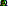{fig-align="center"}

::: {#exm-ch1-019}
: 平面上画有间隔为 $d$ 的等距平行线, 向平面任意投掷一枚长为 $l$ 的针, 求针与平行线相交的概率.
:::

{fig-align="center"}

{fig-align="center"}

**解.** 注意到

$$
\begin{aligned}
\Omega&=&\{(\varphi,x):0\le x\le d/2, 0\le\varphi \le \pi/2\}\\
            A&=&\{\mbox{针与平行线相交}\}\\
            &=&\{(\varphi,x):x\leq \frac{l}{2}\sin\varphi\}
\end{aligned}
$$

 由几何概型知 $$P(A)=\frac{S_A}{S_\Omega}=\frac{\int_0^{\pi/2}\frac{l}{2}\sin\varphi d\varphi}{\frac{d}{2}\cdot \frac{\pi}{2}}=\frac{2l}{d\pi}.$$

#### 随机模拟 {#随机模拟 .unnumbered}

$l,d$ 已知,将 $\pi$ 的值代入即可计算 $P (A)$ 的值; 若我们以频率近似概率 $P (A)$, 即

$$
\begin{aligned}
\frac{n}{N}\approx P(A)=\frac{2l}{d\pi}
\end{aligned}
$$

 则我们可得到 $\pi$ 的近似值

$$
\begin{aligned}
\pi\approx \frac{2lN}{dn}
\end{aligned}
$$

*历史试验数据*

    试验者     年份   $l/d$   投掷次数   数交次数   $\pi$ 的近似值
  ----------- ------ ------- ---------- ---------- ----------------
     Wolf      1850    0.8      5000       2532         3.1596
      Fox      1884   0.75      1030       489          3.1595
   Lazzerini   1901   0.83      3408       1808         3.1415
     Reina     1925   0.54      2520       859          3.1795

#### 会面问题 {#会面问题 .unnumbered}

::: {#exm-ch1-020}
甲乙约定在下午 6 点到 7 点之间在某处会面,并约定先到者等候另一个人 20 分钟,过时即可离去,求两人能会面的概率.
:::

**解.** 以 $x$ 和 $y$ 分别表示甲乙两人到达约地点的时间(以分钟为单位), 则易知:

$$
\begin{aligned}
\Omega&:=&\{(x,y):  0\leq x\leq 60,\quad 0\leq y\leq 60
                \}\\
                A&:=&\{(x,y):|x-y|\leq 20\}
\end{aligned}
$$

 故

$$
\begin{aligned}
P(A)=\frac{S_A}{S_\Omega}=\frac{60^2-40^2}{60^2}=\frac{5}{9}.
\end{aligned}
$$

{fig-align="center"}

#### 贝特朗奇论 {#贝特朗奇论 .unnumbered}

::: {#exm-ch1-021}
在半径为$R$的圆上任作一弦, 求$E=\{\text{弦长大于} \sqrt{3}R\}$的概率.
:::

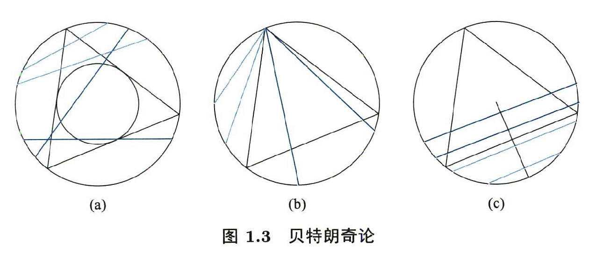{fig-align="center" width="7.5cm"}

**解.** 易知,圆内接正三角形的边长 $\sqrt{3}R$

1.  弦长被其中点位置决定,则当且仅当弦的中点落在半径为 $R/2$ 的小圆内时,弦的长度才会超过 $\sqrt{3} R$, 故所求概率为 $1/4$;

2.  把弦的一端固定,另一端点在圆周上随机移动.若在固定端点作一切线,则与切线交角在 $60^\circ$ 与 $120^\circ$ 之间的弦才能超过 $\sqrt{3} R$. 故所求概率为 $1/3$;

3.  注意到弦的长度与它与圆心的距离有关,而与弦的方向无关.显然,当且仅当弦与圆心的距离小于 $R/2$ 时,弦的长超过 $\sqrt{3} R$, 故概率为 $1/2$.

## 从积分到测度 {#sec-ch1-lecture-4}

::: {.callout-note appearance="simple" icon="false"}
## 本节导读

有限模型不足以容纳连续分布和无穷事件运算.为此需要用测度统一描述长度,面积,体积与概率,并用可测性排除集合论中的病态对象.本节从黎曼积分与 Lebesgue 积分的比较出发,解释现代概率公理化所需的分析基础.
:::

::: {.callout-tip appearance="simple" icon="false"}
## 理论主线

从黎曼积分过渡到 Lebesgue 积分,实质上是从按定义域分割函数图像,转向先测量函数取值层集的大小.概率论需要处理极限,可数并和随机变量的积分,因此以可列运算为核心的测度论语言比有限分割更自然.

测度的构造遵循从简单集合到一般集合的路线:先在区间或矩形上规定长度与体积,再借助外测度和可测性准则扩张定义域.$\sigma$-代数的作用是规定哪些集合能够稳定地参与可数次集合运算,同时保证测度的可列可加性可以成立.
:::

### 黎曼积分

#### 黎曼积分 {#黎曼积分-1 .unnumbered}

函数 $f:[a,b]\mapsto \mathbb{R}$; 同时,分割 $\Delta$: $a=x_0<x_1<\cdots<x_n=b$; 此外,黎曼和: $$I(f,\Delta):=\sum_{i=0}^{n-1}f(\xi_i)(x_{i+1}-x_i), \ \mbox{其中} \xi_i\in[x_i,x_{i+1}];$$ 令$|\Delta|:=\max_{1\leq i\leq n}|x_i-x_{i-1}|$, 则若 $$\lim_{|\Delta|\rightarrow 0}I(f,\Delta)=\lim_{|\Delta|\rightarrow 0}\sum_{i=0}^{n-1}f(\xi_i)(x_{i+1}-x_i)=L:=\int_a^bf(x)dx,$$ 则称 $L$ 为函数 $f$ 在区间 $[a,b]$ 的积分, 并称函数 $f$ 是黎曼可积的.

#### 黎曼积分示意图 {#黎曼积分示意图 .unnumbered}

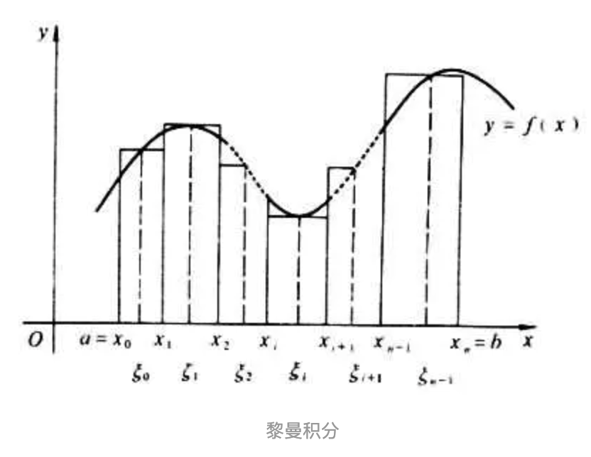{fig-align="center" width="9cm"}

#### 黎曼积分的缺点 {#黎曼积分的缺点 .unnumbered}

一些很简单的函数不是黎曼可积的, 如Dirichlet 函数: $$D(x):=\left\{\begin{array}{ll}
            1, & x \mbox{是有理数},\\
            0, & x \mbox{是无理数}.
        \end{array}\right.$$ 同时,需要一致收敛条件来保证函数积分与极限运算的次序交换, 即若 $f_n(x)$ 一致收敛且黎曼可积, 则 $$\lim_{n\rightarrow\infty}\int_a^bf_n(x)dx=\int_a^b\lim_{n\rightarrow\infty}f_n(x)dx$$ 此外,黎曼可积函数空间不完备, 即存在黎曼可积函数列 $f_n(x)$ 逐点收敛到函数 $f(x)$, 但 $f(x)$ 不是黎曼可积.

#### 黎曼积分的等价定义(I) {#黎曼积分的等价定义i .unnumbered}

考虑函数 $f:[a,b]\mapsto \mathbb{R}$ 及分割 $\Delta$: $a=x_0<x_1<\cdots<x_n=b$, 并令 $|\Delta|:=\max_{1\leq i\leq n}|x_i-x_{i-1}|$ 以及

$$
\begin{aligned}
M_i(\Delta)&:=\sup_{x_{i-1}\leq x\leq x_i}f(x), \  m_i(\Delta):=\inf_{x_{i-1}\leq x\leq x_i}f(x),\\
            M(\Delta)&:=\sum_{i=0}^{n-1}M_i(x_{i+1}-x_i), \ m(\Delta):=\sum_{i=0}^{n-1}m_i(x_{i+1}-x_i).
\end{aligned}
$$

 同时,上下积分:

$$
\begin{aligned}
\overline{\int_a^bf(x)dx}&:=\lim_{|\Delta|\rightarrow 0}M(\Delta)=\inf_{\Delta} M(\Delta), \\
            \underline{\int_a^bf(x)dx}&:=\lim_{|\Delta|\rightarrow 0}m(\Delta)=\sup_{\Delta} m(\Delta)
\end{aligned}
$$

 此外,$f(x)$ 黎曼可积当且仅当上下积分相等, 即 $\overline{\int_a^bf(x)dx}=\underline{\int_a^bf(x)dx}$.

#### 黎曼积分的等价定义(II) {#黎曼积分的等价定义ii .unnumbered}

::: {#def-ch1-013}
(分段常值函数或阶梯函数) 函数 $f:[a,b]\mapsto \mathbb{R}$ 称为分段常值函数或阶梯函数, 如果区间 $[a,b]$ 存在一个有限区间分割 $I_1, I_2,\cdots, I_n$ 使得 $f(x)$ 在每个区间上 $I_i$ 上恒为常数 $c_i$, 即 $$f(x)=\sum_{i=1}^{n}c_i1_{I_i}(x)$$
:::

::: {#rem-ch1-004}
容易验证, $\sum_{i=1}^nc_i|I_i|$ 与分段常值函数或阶梯函数 $f(x)$ 表达形式中所选择的区间分割无关. 我们记 $$p.c.\int_a^bf(x)dx:=\sum_{i=1}^nc_i|I_i|$$ 并将其称为分段常值函数或阶梯函数 $f(x)$ 在 $[a,b]$ 上的积分.
:::

#### 黎曼积分的等价定义(II) {#黎曼积分的等价定义ii-1 .unnumbered}

::: {#def-ch1-014}
(Darboux integral 达布积分) 设函数 $f:[a,b]\mapsto \mathbb{R}$ 为有界函数, 则

称$$\underline{\int_a^b}f(x)dx:=\sup_{g\leq f,\  g\mbox{为阶梯函数}}p.c.\int_a^bg(x)dx$$ 为函数 $f(x)$ 在 $[a,b]$ 上的达布下积分; 称$$\overline{\int_a^b}f(x)dx:=\inf_{h\geq f,\  h\mbox{为阶梯函数}}p.c.\int_a^bh(x)dx$$ 为函数 $f(x)$ 在 $[a,b]$ 上的达布上积分; 显然, $\underline{\int_a^b}f(x)dx\leq \overline{\int_a^b}f(x)dx$. 如果 $$\underline{\int_a^b}f(x)dx=\overline{\int_a^b}f(x)dx,$$ 则称函数 $f(x)$ 在 $[a,b]$ 上达布可积.
:::

#### 黎曼积分的等价定义(II) {#黎曼积分的等价定义ii-2 .unnumbered}

::: {#thm-ch1-002}
设函数 $f:[a,b]\mapsto \mathbb{R}$ 为有界函数, 则函数 $f(x)$ 黎曼可积当且仅当函数 $f(x)$ 达布可积.
:::

#### 黎曼积分的本质 {#黎曼积分的本质 .unnumbered}

黎曼积分思想源于古希腊的穷竭法. 其中,求圆的面积: 通过圆外切正 $n$ 边形和内接正 $n$ 边形, 来得到圆面积的上下界, 然后取极限发现上下界都相等, 从而得到圆的面积.; 求函数 $f(x)$ 围成的面积: 把 $f(x)$ 与坐标轴围成的区域通过对定义域 $[a,b]$ 进行有限分割并利用分割小区间上函数 $f(x)$ 的最大最小值构造函数外接与函数内接长方形, 然后取分割的极限得到函数 $f(x)$ 围成的面积.; 黎曼积分整个过程就是: 有限分割-近似求和-取极限. 同时,对函数[定义域进行有限区间分割]{style="color: cyan"}后近似求和取极限, 适用于连续函数, 即函数在小区间内振荡不明显, 但对然而对于振荡很厉害的函数, 哪怕分割很细, 在很细的区间内振荡依然很厉害(典型的例子是狄利克雷函数).

### Lebesgue 积分

#### Lebesgue 积分基本思想 {#lebesgue-积分基本思想 .unnumbered}

黎曼积分是对函数的定义域 $[a,b]$ 进行分割, 而Lebesgue 积分则是对函数 $f(x)$ 的值域进行分割. 令 $l<L$ 分别为 $f(x)$ 在区间 $[a,b]$ 上的下确界与上确界, 考虑 $[l,L]$ 的分割 $\Delta_y$: $$l=l_0<l_1<l_2<\cdots<l_n=L$$

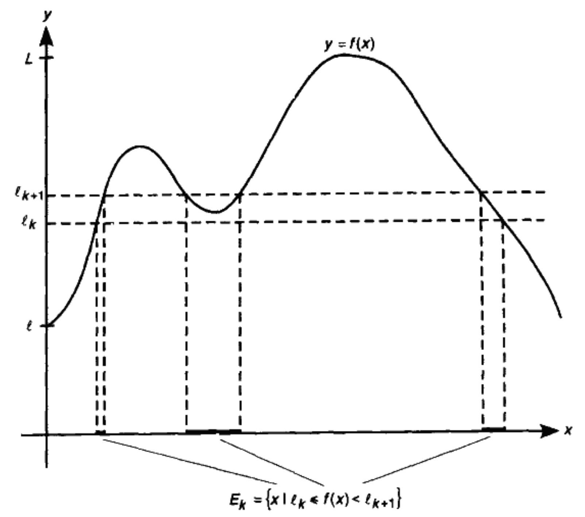{fig-align="center" width="9cm"}

#### Lebesgue 积分基本思想 {#lebesgue-积分基本思想-1 .unnumbered}

令

$$
\begin{aligned}
|\Delta_y|&:=\max_{1\leq k\leq n}|l_k-l_{k-1}|, \\
            E_k&:=\{x:l_k\leq f(x)<l_{k+1}\}, k=0,1,\cdots, n-1,
\end{aligned}
$$

 同时,显然

$$
\begin{aligned}
\sum_{k=0}^{n-1}l_k1_{E_k}(x)\leq f(x)<\sum_{k=0}^{n-1}l_{k+1}1_{E_k}(x), \forall x\in [a,b].
\end{aligned}
$$

 因此, 相应的积分应保持上述不等关系, 即

$$
\begin{aligned}
\sum_{k=0}^{n-1}l_k\int_{a}^{b} 1_{E_k}(x)dx\leq \int_{a}^{b}f(x)dx<\sum_{k=0}^{n-1}l_{k+1}\int_{a}^{b}1_{E_k}(x)dx.
\end{aligned}
$$

 此外,类似于黎曼积分的想法, 我们希望当值域分割$|\Delta_y|\to 0$时, 上述左右两端的极限存在且相等.

#### Lebesgue 积分基本思想 {#lebesgue-积分基本思想-2 .unnumbered}

若对每一个$E_k, k=0, \cdots, n-1$, 示性函数$1_{E_k}(x)$黎曼可积, 且$|\Delta_y|<\epsilon$, 则

$$
\begin{aligned}
\sum_{k=0}^{n-1}(l_{k+1}-l_k)\int_{a}^{b} 1_{E_k}(x)dx\leq \epsilon \sum_{k=0}^{n-1}\int_{a}^{b}1_{E_k}(x)dx=\epsilon (b-a).
\end{aligned}
$$

 若示性函数$1_{E_k}(x)$不是黎曼可积的, 如何定义:

$$
\begin{aligned}
m(E_k):=\int_{a}^{b}1_{E_k}(x)dx,
\end{aligned}
$$

 也即集合$E_k$的测度$m(E_k)$如何定义? 若我们可以定义$m(E_k)$, 则我们可以类似于黎曼和一样, 我们构造勒贝格和, 用面积已知的一些区域逼近曲线下方的区域: $$\int_a^bf(x)dm:=\lim_{|\Delta_y|\rightarrow 0}\Big[\sum_{k=0}^{n-1}l_k\cdot m(E_k)\Big].$$

#### 黎曼积与与Lebesgue 积分的直观解释 {#黎曼积与与lebesgue-积分的直观解释 .unnumbered}

想像一位零售商,在一天结束营业时汇总今天的营业收入. 其中,黎曼积分法: 从钱箱中依次取出现金累加计算获得总的营业收入; Lebesgue 积分法: 先将钱箱中的现金按面值进行分类, 用面值乘以该面值现金的数量并累加求和获得总的营业收入.

### 集合的测度

#### 如何测量集合大小 {#如何测量集合大小 .unnumbered}

基数或势(Cardinality): 集合元素的个数; 同时,称两个集合的基数相等, 如果两个集合之间存在一一映射; 此外,$A=\{2,4,6,\cdots,\}$与$B=\{1,2,3,4,\cdots\}$的基数是相等的; 相应地,基数或势的优缺点: 在有限集上,基数还是很有用处的; 但对于无限集情形,这个度量显得过于粗糙,例如,实数集上任意两个区间的基数都是相同的; 相应地,对于连续的集合,我们又有自然的体积的概念:\
一维空间:长度; 二维空间:面积; 三维空间:传统的体积;

#### 可数集与不可数集 {#可数集与不可数集 .unnumbered}

称集合是可数(countable)的, 如果该集合和自然数集${\mathbf{N}}$的子集之间存在一一映射, 否则称该集合是不可数(uncountable)集. 同时,可数集包括有限可数集和无穷可数集. 此外,有限个可数集的并仍然是可数集,可数个可数集的并仍然是可数集. 相应地,两个可数集的笛卡尔积是可数集. 相应地,实数区间 ${(0,1)}$ 是典型的不可数集.

假设 ${(0,1)}$ 可数, 其元素可以排列为 ${a_{1}, a_{2}, a_{3}, \cdots}$. 注意到 ${(0,1)}$ 中的元素 ${a_{n}}$ 可以表示为 $$a_{n}=0. a_{n}^{(1)} a_{n}^{(2)} a_{n}^{(3)} \cdots=\sum_{k=1}^{\infty} a_{n}^{(k)} 10^{-k}$$

构造 ${x=0.x_{1} x_{2} x_{3} \cdots}$, 其中, 对任意的 ${k}$, 取 ${x_{k} \neq a_{k}^{(k)}}$. 显然, $x \neq a_{k}$, $\forall k \in \mathbf{N}$,矛盾.故 ${(0,1)}$ 是不可数集合. 由于 $$f(x)=-\cot (\pi x):(0,1) \rightarrow(-\infty, \infty)$$

是一一映射, 立刻得到 ${\mathbf{R}}$ 也是不可数集.

#### 集合的测度 {#集合的测度-1 .unnumbered}

对于集合大小, 我们希望定义另外的度量标准:测度. 其中,希望定义一个测度来测量集合的大小,能够处理各种情况,包括有限集,无限集甚至是各种抽象的集合; 希望在某些特定的情况下,和我们熟知的度量相容:比如区间的长度,区域的面积,空间的体积等度量相容; 希望具有常见度量的一些性质:可加性. 同时,如此一来, 设计一个测度就好像变成了制造一把尺子(或者量筒:多维情形). 此外,尺子有其适用范围:用一个普通米尺来测量地球的半径估计会很有困难,或者用它去测量原子的半径也是不可能的. 相应地,测度的适用范围在测度论里同样重要:在定义一个测度的时候,我们需要同时定义哪些集合是可测的(measurable) - 也就是可以用这个测度来衡量.

### 测度的构造

#### 区间,矩形,基本集及其测度 {#区间矩形基本集及其测度 .unnumbered}

区间 $I\subset\mathbb{R}$ : $[a,b],\  [a,b),\  (a,b), \cdots$;

同时,矩形 $B\subset\mathbb{R}^d$: $B:=I_1\times \cdots\times I_d$, 其中$I_i$ 为区间; 此外,矩形的测度: $|B|:=|I_1|\times|I_2|\times\cdots\times|I_d|$. 相应地,基本集 $E\subset\mathbb{R}^d$: 能够表示为有限个矩形的并的集合; 其中,更进一步, 可以证明基本集一定可以表示为有限个不相交矩形的并, 即 $$E=\cup_{i=1}^kB_i, \mbox{其中} B_i, i=1,\cdots, k, \mbox{为矩形且互不相交};$$ 我们将 $m(E):=|B_1|+|B_2|+\cdots+|B_k|$ 称为基本集 $E$ 的基本测度.

#### 约当测度(Jordan Measure) {#约当测度jordan-measure .unnumbered}

::: {#def-ch1-015}
(约当测度) 令 $E$ 为 $\mathbb{R}^d$ 的有界子集.

称 $$m_{*,J}(E):=\sup_{A\subset E, A\mbox{为基本集}}m(A)$$ 为约当内测度; 同时,称 $$m^{*,J}(E):=\inf_{A\supset E, A\mbox{为基本集}}m(A)$$ 为约当外测度; 此外,称 $E$ 为约当可测的, 如果 $$m_{*,J}(E)=m^{*,J}(E).$$此 时称 $m(E):=m_{*,J}(E)=m^{*,J}(E)$ 为集合 $E$ 的约当测度.
:::

#### 如何理解约当可测集的定义:以一维情形为例 {#如何理解约当可测集的定义以一维情形为例 .unnumbered}

假设 $E\subset [a,b]$. 注意到

$$
\begin{aligned}
m_{*,J}(E)&=\sup_{A\subset E, A\mbox{为基本集}}m(A)\\
  &=\sup_{A\subset E, A\mbox{为基本集}}\big((b-a)-m([a,b]-A)\big)\\
            &=\sup_{K\supset [a,b]-E, K\mbox{为基本集}}\big((b-a)-m(K)\big)\\
            &=(b-a)-\inf_{K\supset [a,b]-E, K\mbox{为基本集}}m(K)\\
            &=(b-a)-m^{*,J}([a,b]-E).
\end{aligned}
$$

 因此, $E$ 约当可测的定义$m_{*,J}(E)=m^{*,J}(E)$等价于

$$
\begin{aligned}
m^{*,J}([a,b]-E)&=(b-a)-m^{*,J}(E)=m^{*,J}([a,b])-m^{*,J}(E)\\
    \iff m^{*,J}([a,b])&=m^{*,J}(E)+m^{*,J}([a,b]-E)\\
    &=m^{*,J}([a,b]\cap E)+m^{*,J}([a,b]\cap \bar{E})
\end{aligned}
$$

#### 约当测度的优缺点 {#约当测度的优缺点 .unnumbered}

设 $E,\  F\subset\mathbb{R}^d$ 为约当可测集, 则

$E\cup F,\  E\cap F,\  E\backslash F,\  E\Delta F$ 均为约当可测集; 同时,非负性: $m(E)\geq 0$; 此外,有限可加性: 如果 $E, F$ 不相交, 则 $m(E\cup F)=m(E)+m(F)$; 相应地,平称不变性: $m(x+E)=m(E)$; 相应地,$E_i, i=1,2,\cdots$ 约当可测, 但 $\cup_{i=1}^\infty E_i, \  \cap_{i=1}^\infty E_i$ 不一定约当可测.

#### Riemann 积分与Jordan 测度之间的联系 {#riemann-积分与jordan-测度之间的联系 .unnumbered}

::: {#thm-ch1-003}
(Riemann 积分与Jordan 测度之间的联系)

如果 $E$ 是区间 $[a,b]$ 上的Jordan 可测集, 则示性函数

$$
\begin{aligned}
1_{E}(x):=\left\{\begin{array}{ll}
                1, & x\in E \\ 0, & x\notin E \end{array}\right.
\end{aligned}
$$

 是Riemann 可积的且 $\int_{a}^b{1}_{E}(x) \, dx=m(E)$. 设 $[a,b]$ 为一区间, $f:[a,b]\rightarrow \mathbb{R}$ 为一有界函数, 则 $f$ 是Riemann 可积当且仅当

$$
\begin{aligned}
E_+ &:=\{(x,t):x\in[a,b], 0\leq f(x)\leq t\}\\ E_-&:=\{(x,t):x\in[a,b], f(x)\leq t\leq 0\}
\end{aligned}
$$

 在 $\mathbb{R}^2$ 上是Jordan 可测的, 且有 $$\int_{a}^b f(x)  \, dx=m_{2}(E_{+})-m_{2}(E_{-})$$ 此处的 $m_{2}$ 表示二维Jordan 测度.
:::

#### Lebesgue外测度 {#lebesgue外测度 .unnumbered}

外测度$m^*(E)$: $$m^*(E):=\inf_{\cup_{i=1}^\infty B_i\supset E, B_i, i\geq 1, \mbox{为矩形}}\sum_{i=1}^\infty |B_i|$$ 同时,显然, $m^*(E)\leq m^{*,J}(E)$, 且存在$E\subset\mathbb{R}^d$使得不等号严格成立; 此外,外测度具有次可加性, 即对任意的$E_i, i\geq 1$,均有 $$m^*(\cup_{i=1}^\infty E_i)\leq \sum_{i=1}^\infty m^*(E_i).$$

#### Lebesgue内测度及可测集如何定义 {#lebesgue内测度及可测集如何定义 .unnumbered}

内测度$m_*(E)$如何定义? 其中,如果定义 $$m_*(E):=\sup_{\cup_{i=1}^\infty B_i\subset E, B_i, i\geq 1, \mbox{为矩形}}\sum_{i=1}^\infty |B_i|.$$ 可以证明 $$m_*(E)=m_{*,J}(E).$$ 由于可数矩形并的余集不一定是可数矩形的并, 因此, 若以此处定义的内外测度相等定义Lebesgue可测集, 我们无法像约当可测集那样得到外测度的可加性.; 若$E\subset [a,b]$, 则由外测度的次可加性可知 $$m^*(E)\geq (b-a)-m^*([a,b]-E).$$ 因此, 若定义$m_*(E)=(b-a)-m^*([a,b]-E)$为Lebesgue内测度,并由内外测度相等定义Lebesgue可测集, 则可以得到Lebesgue外测度的可加性, 即 $$m^*([a,b])=m^*(E)+m^*([a,b]-E)=m^*([a,b]\cap E)+m^*([a,b]\cap \bar{E}).$$

#### Lebesgue内外测度的等价定义 {#lebesgue内外测度的等价定义 .unnumbered}

外测度: $$m^*(E):=\inf_{U\supset E, U\mbox{为开集}}m^*(U).$$ 同时,Lebesgue内测度: $$m_*(E):=\sup_{U\subset E, U\mbox{为闭集}}m^*(U).$$ 若 $$m_*(E)=m^*(E),$$ 则称$E$为Lebesgue可测集.

#### Lebesgue可测集的卡拉西奥多里准则 {#lebesgue可测集的卡拉西奥多里准则 .unnumbered}

可测集的卡拉西奥多里(Carathéodory)准则:

称$E\subset\mathbb{R}^d$为Lebesgue可测集, 如果对任意的$S\subset\mathbb{R}^d$均有 $$m^*(S)=m^*(S\cap E)+m^*(S\cap \bar{E}),$$ 并称$m(E):=m^*(E)$为集合$E$的[Lebesgue测度]{style="color: cyan"}.

#### Lebesgue可测集的代数结构 {#lebesgue可测集的代数结构 .unnumbered}

::: {#prp-ch1-001}
在$\mathbb{R}^d$上的Lebesgue可测集具有以下性质:

若$E,\  F\subset\mathbb{R}^d$ Lebesgue可测, 则$\overline{E}:=\mathbb{R}^d-E$ 也Lebesgue可测; 若$E,\  F\subset\mathbb{R}^d$ Lebesgue可测, 则$E\cup F,\  E\cap F,\  E\backslash F,\  E\Delta F$ 均Lebesgue可测; 若$E_i, i\geq 1$,Lebesgue可测, 则$\cup_{i=1}^\infty E_i, \  \cap_{i=1}^\infty E_i$ 也Lebesgue可测.
:::

#### Lebesgue测度的性质 {#lebesgue测度的性质 .unnumbered}

非负性: $m(E)\geq 0$; 同时,所有的区间均Lebesgue可测, 且$$m((a,b))=m([a,b])=m([a,b))=m((a,b])=b-a;$$ 此外,$m(\emptyset)=0$; 相应地,可列可加性: 如果 $E_i, i\geq 1$ 互不相交且Lebesgue可测, 则 $$m(\cup_{i=1}^\infty E_i)=\sum_{i=1}^\infty m(E_i);$$ 相应地,平移不变性: $m(x+E)=m(E)$; 相应地,存在$F\subset\mathbb{R}^d$不Lebesgue可测.

#### 不可测集 {#不可测集 .unnumbered}

[巴拿赫-塔斯基分球悖论(Banach-Tarski Paradox)]{style="color: cyan"}

将一个三维的半径为 $1$ 的实心球用某种巧妙方法分成五等分(五等分的意思是,把其中一份旋转平移后可以和另外一份重合), 然后把这五个分块旋转平移后,可以组合成两个半径为 $1$ 的实心球.

{fig-align="center" width="9cm"}

[选择公理(Axiom of Choice)]{style="color: cyan"}: 任意一组(可能有不可数无限个)非空集合,我们都可以从每个集合挑出一个元素.

#### 巴拿赫-塔斯基分球悖论的启示 {#巴拿赫-塔斯基分球悖论的启示 .unnumbered}

在$\Omega=\mathbb{R}^3$时, 无法构造出一个测度既与常见的体积度量相容且具有平移不变性,又可以度量$\mathbb{R}^3$的任一子集; 同时,类似的, 在$\Omega=\mathbb{R}$ 时,同样无法构造出一个测度既与常见的长度度量相容且具有平移不变性,又可以度量$\mathbb{R}$的任一子集; 因此,对于可测空间$(\Omega,\mathcal{F})$中的$\mathcal{F}$通常为$\Omega$的某些子集构成的$\sigma$代数,而不一定是$\Omega$的所有子集构成的集类.

#### 由Lebesgue测度到一般抽象测度 {#由lebesgue测度到一般抽象测度 .unnumbered}

- 要度量集合元素的全体: $\Omega$

- 测度的适用范围(定义域): $\mathcal{F}:=\{A\subset \Omega:A\mbox{可测}\}$, 通常要求$\mathcal{F}$为$\sigma$-代数

- 通常称$(\Omega, \mathcal{F})$为可测空间

- 测度的定义: 称定义在$\mathcal{F}$的集函数$\mu(\cdot)$为测度, 如果

  (1) $\mu(A)\ge 0, \forall A\in \mathcal{F}$;

  (2) $\mu(\emptyset)=0$;

  (3) $\mu$具有可列可加性: 若$A=\cup_{i=1}^{\infty}A_i$, 其中$A, A_i\in \mathcal{F}$, 且$i\neq j$时, $A_i\cap A_j=\emptyset$, 则

$$
\begin{aligned}
\mu(\cup_{i=1}^{\infty}A_i)=\sum_{i=1}^{\infty}\mu(A_i)
\end{aligned}
$$

- 称$(\Omega,\mathcal{F},\mu)$为测度空间.

### 概率与测度

#### 概率与测度 {#概率与测度-1 .unnumbered}

[$\Omega$:]{style="color: red"} [概率论中的样本空间对应于测度中要度量的集合所包含元素的全体]{style="color: cyan"}. 同时,[$\mathcal{F}$:]{style="color: red"} 事件域, 即某些随机事件组成的集合, 通常要求其为$\sigma$-代数; 其中,注意到随机事件是随机试验中我们所关心的可能出现的结果, 它由一个或若干个基本事件组成, 因此事件是样本空间的子集, 从而事件域为样本空间的某些子集构成的集合; [概率论中的事件域对应于测度中要度量的集合全体即可测集的概念]{style="color: cyan"}. 此外,[$(\Omega,\mathcal{F})$:]{style="color: red"}可测空间.

#### 概率的公理化定义 {#概率的公理化定义 .unnumbered}

::: {#def-ch1-016}
[(概率的公理化定义)]{style="color: cyan"} 设$\Omega$为样本空间, $\mathcal{F}$为$\Omega$的某些子集组成的$\sigma$-代数(事件域), 若定义在$\mathcal{F}$上的集函数$P(\cdot)$满足

(1) 非负性: $P(A)\geq 0$;

(2) 正则性: $P(\Omega)=1\textcolor{red}{\Rightarrow P(\emptyset)=0 (\mbox{结合可列可加性})}$;

(3) 可列可加性: 若$A_i,i=1,2,\cdots$ 互不相交, 则 $$P(\cup_{i=1}^\infty A_i)=\sum_{i=1}^\infty P(A_i).$$

则称$P$为$(\Omega,\mathcal{F})$上的概率测度,简称概率,称$(\Omega,\mathcal{F},P)$为概率空间.
:::

#### 关于概率的几个注记 {#关于概率的几个注记 .unnumbered}

从概率的定义可以看出, 概率是全集度量为 $1$ 的测度; 同时,,只不过概率是用来衡量随机事件发生可能性大小的一种度量, 其在全集上的度量为 $1$; 此外,同一随机试验得到的可测空间$(\Omega,\mathcal{F})$, 可定义不同的概率. 其中,对于抛一枚硬币这一随机试验,

$$
\begin{aligned}
\Omega=\{\mbox{正,反}\}, \mbox{ 选取} \mathcal{F}=\{\emptyset, \{\mbox{正}\}, \{\mbox{反}\}, \Omega\};
\end{aligned}
$$

 我们可以构造概率$P_1(\cdot)$: $$P_1(\emptyset)=0, P_1(\{\mbox{正}\})=1/2,  P_1(\{\mbox{反}\})=1/2,  P_1(\Omega)=1;$$ 也可以构造概率$P_2(\cdot)$: 其中$p+q=1$, $$P_2(\emptyset)=0, P_2(\{\mbox{正}\})=p,  P_2(\{\mbox{反}\})=q,  P_1(\Omega)=1.$$

### 可测空间与测度空间

#### (集)代数(algebra)或域(field) {#集代数algebra或域field .unnumbered}

::: {#def-ch1-017}
[(集代数)]{style="color: cyan"} 设 $\Omega$ 为非空集,$\mathcal{F}$ 为 $\Omega$ 的某些子集构成的集类.称 $\mathcal{F}$ 为 $\Omega$ 上的(集)代数, 如果

(1) $\Omega \in \mathcal{F}$;

(2) 若 $A \in \mathcal{F}$, 则 $\overline{A}\in \mathcal{F}$;

(3) 若 $A, B \in \mathcal{F}$,则 $A \cup B \in \mathcal{F}$.
:::

::: {#rem-ch1-005}
代数是集合的集合,即其本身是集合, 其中的元素仍然是集合. 同时,代数对于集合的求补,有限交和有限并运算封闭. 由于代数仅对集合的有限交并封闭,若样本空间 ${\Omega}$ 是无限集, 将会导致它将无法包含一些重要的集合 (特别是无限集合). 相应地,有必要对代数定义进行延伸, 加强其表达能力.
:::

#### $\sigma$-代数及其性质 {#sigma-代数及其性质 .unnumbered}

::: {#def-ch1-018}
[($\sigma-$代数)]{style="color: cyan"} 设 $\Omega$ 为非空集, $\mathcal{F}$ 为 $\Omega$ 的某些子集构成的集类.称$\mathcal{F}$为 $\Omega$上的$\sigma$-代数, 如果

(1) $\Omega\in \mathcal{F}$;

(2) 若$A\in \mathcal{F}$, 则 $\overline{A}:=\Omega-A\in \mathcal{F}$;

(3) 若$A_i\in \mathcal{F}, i=1, 2,\cdots$, 则$\cup_{i=1}^{\infty}A_i\in \mathcal{F}$.

此时, 我们称$(\Omega, \mathcal{F})$为可测空间, $\mathcal{F}$中的元素为可测集.
:::

::: {#thm-ch1-004}
若 $\mathcal{F}$ 为 $\Omega$ 上的 $\sigma$-代数,则

$\emptyset\in \mathcal{F}$; 若 $E_k\in \mathcal{F}, k=1,2,\cdots,$ 则 $\cap_{k=1}^\infty E_k\in \mathcal{F}$; 若 $E_1,\cdots, E_n\in \mathcal{F}$, 则 $\cap_{k=1}^nE_k\in \mathcal{F}$ 且 $\cup_{k=1}^nE_k\in \mathcal{F}$; 若 $E_1,E_2\in\mathcal{F}$, 则 $E_1-E_2\in \mathcal{F}$.
:::

::: {#thm-ch1-005}
设 $\left\{\mathcal{F}_{\alpha}: \alpha \in I\right\}$ 是 $\Omega$ 上的一族 $\sigma$ 代数,其中 $I$ 为指标集, 则 $\mathcal{F}:= \bigcap_{\alpha \in I} \mathcal{F}_{\alpha}$ 也是 $\Omega$ 上的 $\sigma$ 代数.
:::

#### 几个例子 {#几个例子 .unnumbered}

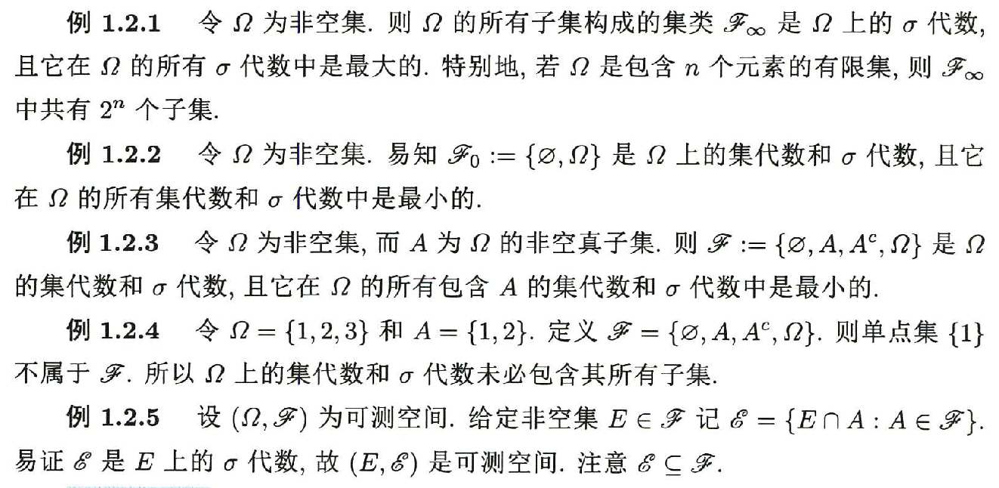{fig-align="center" width="11.5cm"}

#### 几个例子 {#几个例子-1 .unnumbered}

::: {#exm-ch1-022}
[(代数而非 ${\sigma}$-代数)]{style="color: cyan"} 设 ${\Omega}$ 是无限集合, 集族 ${\mathcal{A} \subset 2^{\Omega}}$ ,满足 $$A \in \mathcal{A} \Longleftrightarrow \# A<\infty \text { 或  }  \# \overline{A}<\infty \text {, }$$

即 ${\mathcal{A}}$ 中的集合或者自身是有限集,或者其补集是有限集. 容易验证, ${\mathcal{A}}$ 是代数, 但不是 ${\sigma}$-代数.
:::

::: {#exm-ch1-023}
[(可数集上 ${\sigma}$-代数)]{style="color: cyan"} 设样本空间${\Omega}$为可数集, ${\mathcal{F}}$ 为其上的 ${\sigma}$-代数, 且 ${\forall a \in \Omega}$, 有 ${\{a\} \in \mathcal{F}}$, 则${\forall A \subset \Omega}$, 有${A \in \mathcal{F}}$.
:::

#### 几个例子 {#几个例子-2 .unnumbered}

::: {#exm-ch1-024}
设${\mathcal{F}}$为实数集${\mathbf{R}}$上的${\sigma}$-代数. 若对${\forall x\in\mathbf{R}}$,都有${(-\infty,x]\in\mathcal{F}}$, 则${\mathcal{F}}$包含${\mathbf{R}}$上的任意区间.
:::

::: {.proof}
*Proof.* 仅以${[a,b)}$为例. 注意到:

$$
\begin{aligned}
(-\infty, a)&=\bigcup_{k=1}^{\infty}\left(-\infty, a-\frac{1}{k}\right] \in \mathcal{F},   \quad (x, \infty)=\overline{(-\infty, x]} \in \mathcal{F},  \forall x  \\
        [b, \infty)&=\bigcap_{k=1}^{\infty}\left(b-\frac{1}{k}, \infty\right) \in \mathcal{F}   \quad       [a, b)=\overline{(-\infty, a) \cup [b, \infty)} \in \mathcal{F}
\end{aligned}
$$

 ◻
:::

#### 最小(生成)$\sigma$-代数 {#最小生成sigma-代数 .unnumbered}

::: {#thm-ch1-006}
假设 $\mathcal{C}$ 为 $\Omega$ 的子集组成的非空集类,则存在唯一 $\sigma$-代数 $\mathcal{C}_0$ 使得:

(1) $\mathcal{C}\subset \mathcal{C}_0$;

(2) 若 $\mathcal{G}$ 为任一 $\sigma$-代数,且 $\mathcal{C}\subset \mathcal{G}$, 则 $\mathcal{C}_0\subset \mathcal{G}$.
:::

**证明.** 

若 $\mathcal{F}_t, t\in T$ 为一族 $\sigma$-代数,则 $\cap_{t\in T}\mathcal{F}_t$ 仍为 $\sigma$-代数; 令 $C^{\#}:=\{\mathcal{B}:\mathcal{B}\mbox{为}\sigma-\mbox{代数}, \mathcal{C}\subset \mathcal{B}\}$; 令 $\mathcal{C}_0:=\cap_{\mathcal{B}\in C^{\#}}\mathcal{B}$, 则易证 $\mathcal{C}_0$ 即为定理所求之 $\sigma$-代数.

::: {#rem-ch1-006}
首先,$\mathcal{C}_0:=\cap_{\mathcal{B}\in C^{\#}}\mathcal{B}$ 是包含集类 $\mathcal{C}$ 的最小 $\sigma$-代数; 最后,一般也称 $\mathcal{C}_0$ 为集类 $\mathcal{C}$ 的生成 $\sigma$-代数,后面我们常用 $\sigma (\mathcal{C})$ 表示 $\mathcal{C}_0$.
:::

#### 生成 $\sigma$-代数的性质 {#生成-sigma-代数的性质 .unnumbered}

::: {#prp-ch1-002}
设 $\mathcal{E}$ 和 $\mathcal{G}$ 是 $\Omega$ 上的集类且 $\mathcal{E} \subseteq \mathcal{G}$, 则 $\sigma(\mathcal{E}) \subseteq \sigma(\mathcal{G})$ .
:::

::: {.proof}
*Proof.* 因为 $\mathcal{E} \subseteq \mathcal{G}$, 故有 $$\{\mathcal{F}: \mathcal{F} \text{为} \Omega \text{上的} \sigma \text{代数且 } \mathcal{F} \supseteq \mathcal{E}\} \supseteq\{\mathcal{F}: \mathcal{F}\text{为} \Omega \text{上的} \sigma \text{代数且} \mathcal{F} \supseteq \mathcal{G}\}.$$

从而 $\sigma(\mathcal{E}) \subseteq \sigma(\mathcal{G})$ . ◻
:::

#### 一个例子 {#一个例子 .unnumbered}

::: {#def-ch1-019}
称$\Omega$ 的子集$B_{1}, B_{2}, \cdots$为$\Omega$的一个可数划分, 如果$B_{i}, i\geq 1$ 两两不交且 $\bigcup_{n=1}^{\infty} B_{n}=\Omega$.
:::

::: {#exm-ch1-025}
设 $\mathcal{G}:=\left\{B_{1}, B_{2}, \cdots\right\}$ 是 $\Omega$ 的可数划分, 则 $\sigma(\mathcal{G})$ 是由 $\mathcal{G}$ 中的集合的所有可能的并构成的集类(规定零个集合的并为空集).
:::

#### $\mathbb{R}$上的 $\sigma$-代数 {#mathbbr上的-sigma-代数 .unnumbered}

::: {#exm-ch1-026}
令 $\Omega:=\mathbb{R}$, 考虑 $$\mathcal{A}_1=\{(-\infty, x)|x\in\mathbb{R}\}, \  \mathcal{A}_2=\{(a, b)|-\infty<a<b<\infty\},$$ 则 $\sigma (\mathcal{A}_1)=\sigma (\mathcal{A}_2)$
:::

**解.** 注意到,对任意实数 $x$, 均有 $$(-\infty, x)=\cup_{n=1}^\infty(x-n,x).$$ 因此 $(-\infty, x)\in\sigma (\mathcal{A}_2)$, 从而 $\mathcal{A}_1\subset \sigma (\mathcal{A}_2)$, 进而可得 $\sigma (\mathcal{A}_1)\subset\sigma (\mathcal{A}_2)$.

反之,注意到 $[a,b)=(-\infty, b)-(-\infty,a)\in\sigma (\mathcal{A}_1)$ 以及 $$\{a\}=\cap_{n=1}^\infty[a,a+\dfrac{1}{n})\in\sigma(\mathcal{A}_1),$$ 因此,$(a,b)=[a,b)-\{a\}\in\sigma (\mathcal{A}_1)$, 即 $\mathcal{A}_2\subset\sigma (\mathcal{A}_1)$, 从而 $$\sigma(\mathcal{A}_2)\subset \sigma(\mathcal{A}_1).$$

#### $\mathbb{R}^d$上的Borel集 {#mathbbrd上的borel集 .unnumbered}

::: {#def-ch1-020}
设 $\mathcal{O}^d$ 为 $\mathbb{R}^d$ 上所有开集构成的集类.

称 $\mathcal{B}^d:=\sigma(\mathcal{O}^d)$ 为 $\mathbb{R}^d$ 的 Borel $\sigma$-代数; 同时,称 $\mathcal{B}^d$ 中的集合为 Borel 可测集,简称 Borel 集; 此外,称 $(\mathbb{R}^d, \mathcal{B}^d)$ 为欧氏可测空间或 Borel 可测空间; 相应地,我们也常用 $\mathcal{B}(\mathbb{R}^d)$ 表示 $\mathcal{B}^d$.
:::

#### $\mathbb{R}$上的 Borel 集 {#mathbbr上的-borel-集 .unnumbered}

::: {#exm-ch1-027}
设 $\Omega=\mathbb{R}$, 令

$$
\begin{aligned}
\mathcal{C}_1&=&\{(-\infty,x):-\infty<x<+\infty\}\\
            \mathcal{C}_2&=&\{(a,b]:-\infty\leq a\leq b<+\infty\}\\
            \mathcal{C}_3&=&\{[a,b]:-\infty< a\leq b<+\infty\}\\
            \mathcal{C}_4&=&\{[a,b):-\infty< a\leq b\leq+\infty\}\\
            \mathcal{C}_5&=&\{(a,b):-\infty\leq a\leq b\leq+\infty\}\\
            \mathcal{C}_6&=&\{A\subset\mathbb{R}:A\mbox{为开集}\}\\
            \mathcal{C}_7&=&\{A\subset\mathbb{R}:A\mbox{为闭集}\}
\end{aligned}
$$

 则以上 7 个集类的生成 $\sigma$-代数均相同,即

$$
\begin{aligned}
\sigma(\mathcal{C}_1)=\cdots=\sigma(\mathcal{C}_7):=\mathcal{B}(\mathbb{R}).
\end{aligned}
$$

:::

#### $\mathbb{R}^d$上的Borel集 {#mathbbrd上的borel集-1 .unnumbered}

::: {#prp-ch1-003}
设 $\Omega=\mathbb{R}$, 令

$$
\begin{aligned}
\mathcal{S}_1&=&\{(-\infty,x_1)\times\cdots\times(-\infty,x_d):-\infty<x_i<+\infty, 1\leq i\leq d\}\\
            \mathcal{S}_2&=&\{(a_1,b_1]\times\cdots\times(a_d,b_d]:-\infty\leq a_i\leq b_i<+\infty, 1\leq i\leq d\}\\
            \mathcal{S}_3&=&\{[a_1,b_1]\times\cdots\times[a_d,b_d]:-\infty< a_i\leq b_i<+\infty, 1\leq i\leq d\}\\
            \mathcal{S}_4&=&\{[a_1,b_1)\times\cdots\times [a_d,b_d):-\infty< a_i\leq b_i\leq+\infty, 1\leq i\leq d\}\\
            \mathcal{S}_5&=&\{(a_1,b_1)\times\cdots\times(a_d,b_d):-\infty\leq a_i\leq b_i\leq+\infty, 1\leq i\leq d\}\\
            \mathcal{S}_6&=&\{A\subset\mathbb{R}^d:A\mbox{为开集}\}\\
            \mathcal{S}_7&=&\{A\subset\mathbb{R}^d:A\mbox{为闭集}\}
\end{aligned}
$$

则以上 7 个集类的生成 $\sigma$-代数均相同,即

$$
\begin{aligned}
\sigma(\mathcal{S}_1)=\cdots=\sigma(\mathcal{S}_7):=\mathcal{B}(\mathbb{R}^d).
\end{aligned}
$$

:::

#### 其他集类 {#其他集类 .unnumbered}

::: {#def-ch1-021}
设$\mathcal{C}$为$\Omega$的某些子集构成的非空集类,

称$\mathcal{C}$为$\pi$类, 如果$\mathcal{C}$关于有限交运算封闭, 即

$$
\begin{aligned}
A,B\in \mathcal{C}\Rightarrow A\cap B\in \mathcal{C};
\end{aligned}
$$

 同时,称$\mathcal{C}$为代数, 如果$\mathcal{C}$关于有限交与取余运算封闭, 即

$$
\begin{aligned}
A,B\in \mathcal{C}\Rightarrow A\cap B\in \mathcal{C}, \bar{A}\in \mathcal{C};
\end{aligned}
$$

 此外,称$\mathcal{C}$为单调类, 如果$\mathcal{C}$关于单调极限运算封闭, 即

$$
\begin{aligned}
A_n\in \mathcal{C}, A_n\uparrow A \mbox{ 或 } A_n\downarrow A \Rightarrow A\in \mathcal{C}
\end{aligned}
$$

 相应地,称$\mathcal{C}$为$\lambda$类, 如果$\Omega\in \mathcal{C}$并且$\mathcal{C}$对真差运算及上升极限运算封闭, 即 其中,$\Omega\in \mathcal{C}$; $A, B\in \mathcal{C}, B\subset A\Rightarrow A-B\in \mathcal{C}$; $A_n\in \mathcal{C}, n\geq 1, A_n\uparrow A\Rightarrow A\in \mathcal{C}$.
:::

#### 集类之间的关系 {#集类之间的关系 .unnumbered}

::: {#thm-ch1-007}
设$\mathcal{C}$为$\Omega$的某些子集构成的非空集类,则

1.  若$\mathcal{C}$为$\sigma-$代数,则$\mathcal{C}$一定是:$\pi$类,代数,$\lambda$类,单调类;

2.  若$\mathcal{C}$既是代数又是单调类,则$\mathcal{C}$一定是$\sigma-$代数;

3.  若$\mathcal{C}$既是$\pi$类又是$\lambda$类,则$\mathcal{C}$一定是$\sigma-$代数.
:::

#### 单调类定理 {#单调类定理 .unnumbered}

::: {#def-ch1-022}
与生成$\sigma-$代数类似, 我们可以定义包含集类$\mathcal{C}$的最小单调类$m(\mathcal{C})$及最小$\lambda$类$\lambda(\mathcal{C})$, 分别称为由集类$\mathcal{C}$生成的单调类与$\lambda$类.
:::

::: {#thm-ch1-008}
(单调类定理) 设$\mathcal{C},\mathcal{G}$为$\Omega$中的集类且$\mathcal{C}\subset \mathcal{G}$,则

1.  若$\mathcal{C}$为一代数,则$m(\mathcal{C})=\sigma(\mathcal{C})$;

2.  若$\mathcal{C}$为一$\pi$类,则$\lambda(\mathcal{C})=\sigma(\mathcal{\mathcal{C}})$;

3.  若$\mathcal{C}$为代数而$\mathcal{G}$为单调类, 则$\sigma(\mathcal{C})\subset \mathcal{G}$;

4.  若$\mathcal{C}$为$\pi$类而$\mathcal{G}$为$\lambda$类,则$\sigma(\mathcal{C})\subset \mathcal{G}$.
:::

#### 如何应用单调类定理 {#如何应用单调类定理 .unnumbered}

问题: 如何证明某$\sigma-$代数$\mathcal{F}$中的所有元素都具有某种性质($P$)? 同时,步骤: $\mathcal{G}:=\{A\in \mathcal{F}: A\mbox{具有性质}(P)\}$; 找到某一集类$\mathcal{C}$为代数或$\pi$类且具有以下性质:

$$
\begin{aligned}
\mathcal{C}\subset \mathcal{G}, \quad  \sigma(\mathcal{C})=\mathcal{F};
\end{aligned}
$$

 证明$\mathcal{G}$为单调类或$\lambda$类; 由单调类定理可知:

$$
\begin{aligned}
\mathcal{F}=\sigma(\mathcal{C})\subset \mathcal{G}\subset \mathcal{F}
\end{aligned}
$$

 即

$$
\begin{aligned}
\mathcal{G}=\mathcal{F}
\end{aligned}
$$

 从而$\mathcal{F}$中所有的元素都具有某种性质(P).

#### 单调类定理应用举例 {#单调类定理应用举例 .unnumbered}

::: {#exm-ch1-028}
设$\mathcal{C}$为$\Omega$上的一$\pi$类,$\mu_1$及$\mu_2$为$\sigma(\mathcal{C})$上的两个概率测度. 若$\mu_1$与$\mu_2$限于$\mathcal{C}$一致, 则对任意的$A\in \sigma(\mathcal{C})$均有$\mu_1(A)=\mu_2(A)$.
:::

**证明.** 证明思路如下:

令$\mathcal{G}:=\{A\in \sigma(\mathcal{C}):\mu_1(A)=\mu_2(A)\}$; 注意到$\mathcal{C}$为$\pi$类且$\mathcal{C}\subset \mathcal{G}$,故只需证明$\mathcal{G}$为$\lambda$类即验证即 其中,$\Omega\in \mathcal{G}$; $A, B\in \mathcal{G}, B\subset A\Rightarrow A-B\in \mathcal{G}$; $A_n\in \mathcal{G}, n\geq 1, A_n\uparrow A\Rightarrow A\in \mathcal{G}$. 利用单调类定理可知$\mathcal{G}=\sigma(\mathcal{C})$.

## 概率空间与概率测度 {#sec-ch1-lecture-5}

::: {.callout-note appearance="simple" icon="false"}
## 本节导读

概率空间 $(\Omega,\mathcal F,P)$ 是全书的基本舞台:$\Omega$ 描述可能结果,$\mathcal F$ 规定可讨论的事件,$P$ 为事件赋予满足可列可加性的数值.本节将直观频率提升为公理体系,并由公理推导单调性,连续性和容斥关系.
:::

::: {.callout-tip appearance="simple" icon="false"}
## 理论主线

概率测度是总质量为 $1$ 的有限测度.非负性,规范性和可列可加性是概率论的公理起点;单调性,次可加性,容斥公式以及上,下连续性都应当由这些公理推出,而不是作为彼此独立的经验规则记忆.

概率空间 $(\Omega,\mathcal F,P)$ 的三个组成部分承担不同任务:$\Omega$ 列举可能结果,$\mathcal F$ 指定可讨论的事件,$P$ 为事件赋予概率.改变其中任何一项,都可能得到不同的概率模型.
:::

### 测度与概率的定义及其性质

#### 测度与概率的定义 {#测度与概率的定义 .unnumbered}

::: {#def-ch1-023}
设 $(\Omega, \mathcal{F})$ 是可测空间,$\mu$ 为定义在 $\sigma$-代数 $\mathcal{F}$ 上取值于 $[0, \infty]$ 的(集)函数.

- 称 $\mu$ 为测度,如果

  (1) $\mu(A)\ge 0, \forall A\in \mathcal{F}$;

  (2) $\mu(\emptyset)=0$;

  (3) $\mu$具有可列可加性: 若$A=\cup_{i=1}^{\infty}A_i$, 其中$A, A_i\in \mathcal{F}$, 且$i\neq j$时, $A_i\cap A_j=\emptyset$, 则

$$
\begin{aligned}
\mu(\cup_{i=1}^{\infty}A_i)=\sum_{i=1}^{\infty}\mu(A_i).
\end{aligned}
$$

- 称 $\mu$ 为 $\sigma$ 有限测度, 如果存在两两不交的集合列 $\left\{B_{1}, B_{2}, \cdots\right\} \subseteq \mathcal{F}$ 使得 $\bigcup_{k=1}^{\infty} B_{k}=\Omega$ 且对每个 $k \geqslant 1$有 $\mu\left(B_{k}\right)<\infty$.

- 称 $\mu$ 为有限测度, 如果 $\mu(\Omega)<\infty$.

- 称 $\mu$ 为概率测度或概率, 如果 $\mu(\Omega)=1$.
:::

#### 测度的性质 I {#测度的性质-i .unnumbered}

::: {#thm-ch1-009}
设 $(\Omega,\mathcal{F},\mu)$ 为一测度空间,则其上的测度 $\mu$ 具有如下性 质:

1.  $\mu(\emptyset)=0$;

2.  有限可加性:若 $A_1,\cdots, A_n\in \mathcal{F}$ 且两两互不相交,则

$$
\begin{aligned}
\mu(\cup_{k=1}^n A_k)=\sum_{k=1}^n\mu(A_k)
\end{aligned}
$$

3.  可减性:若 $A, B\in \mathcal{F}$ 且 $A\subset
                          B, \mu(A)<\infty$, 则 $$\mu(B-A)=\mu(B)-\mu(A);$$

4.  单调性:若 $A, B\in \mathcal{F}$ 且 $A\subset B$, 则 $\mu(A)\leq \mu(B)$;

5.  若$\mu$为概率测度, 则$\mu(\bar{A})=1-\mu(A)$;
:::

#### 有限测度的性质 I {#有限测度的性质-i .unnumbered}

1.  次可加性(布尔(Boole)不等式):对任意$A_1, A_2, \cdots\in \mathcal{F}$, 有

$$
\begin{aligned}
\mu(\cup_{n=1}^{\infty}A_n)&\leq \sum_{n=1}^{\infty}\mu(A_n).
\end{aligned}
$$

 特别的, 对任意的$A_1,\cdots, A_n\in\mathcal{F}$, 有

$$
\begin{aligned}
\mu(\cup_{i=1}^{n}A_i)&\leq \sum_{i=1}^{n}\mu(A_i)
\end{aligned}
$$

2.  加法公式(容斥原理):对任意的$A,B\in\mathcal{F}$, 有

$$
\begin{aligned}
\mu(A\cup B)=\mu(A)+\mu(B)-\mu(AB).
\end{aligned}
$$ {#eq-ch1-plusformulatwo}

 一般的,对任意的 $A_1,\cdots,A_n\in \mathcal{F}$, 有

$$
\begin{aligned}
\mu(\cup_{i=1}^nA_i)&=&\sum_{i=1}^n\mu(A_i)-\sum_{1\leq i<j\leq n}\mu(A_iA_j)+\sum_{1\leq i<j<k\leq n}\mu(A_iA_jA_k)\\
                      && +\cdots+(-1)^{n-1}\mu(A_1A_2\cdots A_n).
\end{aligned}
$$ {#eq-ch1-plusformula}

#### 有限测度的性质 II {#有限测度的性质-ii .unnumbered}

1.  邦费罗尼(Bonferroni)不等式:

$$
\begin{aligned}
\mu(\cup_{i=1}^{n} A_{i}) &\geq \sum_{i=1}^{n} \mu(A_{i})-\sum_{1\leq i<j\leq n} \mu(A_{i} \cap A_{j}), \\
                \mu(\cup_{i=1}^nA_i)&\leq \sum_{i=1}^{n} \mu(A_{i})-\sum_{1\leq i<j\leq n} \mu(A_{i} \cap A_{j})+\sum_{1\leq i<j<k\leq n}\mu(A_i\cap A_j\cap A_k), \cdots.
\end{aligned}
$$

2.  下连续性: 若 $A_n\in\mathcal{F}$ 且 $A_n\subset A_{n+1}, n=1,2,\cdots,$ 则

$$
\begin{aligned}
\mu(\cup_{n=1}^\infty A_n)=\mu(\lim_{n\rightarrow\infty}A_n)=\lim_{n\rightarrow\infty}\mu(A_n)
\end{aligned}
$$

3.  上连续性: 若 $A_n\in\mathcal{F}$ 且 $A_n\supset A_{n+1}, n=1,2,\cdots,$ 则

$$
\begin{aligned}
\mu(\cap_{n=1}^\infty A_n)=\mu(\lim_{n\rightarrow\infty}A_n)=\lim_{n\rightarrow\infty}\mu(A_n)
\end{aligned}
$$

4.  有限测度 $\mu$ 的可列可加性等价于 $\mu$ 有限可加且下连续.

#### 布尔不等式的证明 {#布尔不等式的证明 .unnumbered}

首先,定义 $$B_{1}=A_{1}, \quad B_{n}=A_{1}^{c} A_{2}^{c} \cdots A_{n-1}^{c} A_{n}, n \geq 2.$$ 接着,易证 $B_{1}, B_{2}, \cdots \in \mathcal{F}$ 两两不交且 $\bigcup_{n=1}^{\infty} A_{n}=\bigcup_{n=1}^{\infty} B_{n}$ . 由可数可加性得 $$\mu\left(\bigcup_{n=1}^{\infty} A_{n}\right)=\mu\left(\bigcup_{n=1}^{\infty} B_{n}\right)=\sum_{n=1}^{\infty} \mu\left(B_{n}\right)$$ 由单调性知: $\mu\left(B_{n}\right) \leqslant \mu\left(A_{n}\right)$,故

$$
\begin{aligned}
\mu(\cup_{n=1}^{\infty}A_n)&\leq \sum_{n=1}^{\infty}\mu(A_n).
\end{aligned}
$$

#### 加法公式证明 I {#加法公式证明-i .unnumbered}

注意到

$$
\begin{aligned}
A\cup B=A\cup (B-AB).
\end{aligned}
$$

 故由测度的有限可加性及可减性可得:

$$
\begin{aligned}
\mu(A\cup B)=\mu(A)+\mu(B)-\mu(AB).
\end{aligned}
$$

 对于一般情形,可由归纳法证明.当 $n=2$ 时,@eq-ch1-plusformula  式即为 @eq-ch1-plusformulatwo  式.设 @eq-ch1-plusformula  式对 $n-1$ 成立, 则先对 $\cup_{i=1}^{n-1} A_i$ 与 $A_n$ 应用 @eq-ch1-plusformulatwo  得

$$
\begin{aligned}
\mu(\cup_{i=1}^nA_i)&=&\mu(\cup_{i=1}^{n-1}A_i)+\mu(A_n)-\mu((\cup_{i=1}^{n-1}A_i)\cap
        A_n)\\
        &=&\mu(\cup_{i=1}^{n-1}A_i)+\mu(A_n)-\mu((\cup_{i=1}^{n-1}(A_iA_n))
\end{aligned}
$$ {#eq-ch1-proofplusformula}

#### 加法公式证明 II {#加法公式证明-ii .unnumbered}

而

$$
\begin{aligned}
\mu(\cup_{i=1}^{n-1}A_i)&=&\sum_{i=1}^{n-1}\mu(A_i)-\sum_{1\leq i<j\leq n-1}\mu(A_iA_j)+\sum_{1\leq i<j<k\leq n-1}\mu(A_iA_jA_k)\\
        &&
        +\cdots+(-1)^{n-2}\mu(A_1A_2\cdots
        A_{n-1}),
\end{aligned}
$$

$$
\begin{aligned}
\mu(\cup_{i=1}^{n-1}(A_iA_n))&=&\sum_{1\leq i\leq n-1}\mu(A_iA_n)-\sum_{1\leq i<j\leq n-1}\mu(A_iA_jA_n)\\
        && +\cdots+(-1)^{n-2}\mu(A_1A_2\cdots A_n)\\
        &=&\sum_{1\leq i<j=n}\mu(A_iA_n)-\sum_{1\leq i<j<k=n}\mu(A_iA_jA_n)\\
        && +\cdots+(-1)^{n-2}\mu(A_1A_2\cdots A_n)
\end{aligned}
$$

故将上面两式代入 @eq-ch1-proofplusformula  式即得加法公式.

#### 邦费罗尼(Bonferroni)不等式证明:非归纳法 {#邦费罗尼bonferroni不等式证明非归纳法 .unnumbered}

注意到:

$$
\begin{aligned}
\cup_{i=1}^nA_i&=A_1\cup (A_2-A_1)\cup(A_3-(A_1\cup A_2))\cup\cdots\cup(A_n-\cup_{i=1}^{n-1} A_i) \\
           &=A_1\cup (A_2\overline{A}_1)\cup(A_3\overline{A}_2\overline{A}_1))\cup\cdots\cup(A_n\overline{A}_{n-1}\cdots\overline{A}_1)\\
           &=A_1\cup \cup_{i=2}^n (A_i\overline{A}_{i-1}\cdots\overline{A}_1)
\end{aligned}
$$

 从而

$$
\begin{aligned}
\mu(\cup_{i=1}^nA_i) &= \mu(A_1)+\sum_{i=2}^n\mu(A_i\overline{A}_{i-1}\cdots\overline{A}_1) \\
           & = \mu(A_1)+\sum_{i=2}^n\big[\mu(A_i)-\mu(A_i\cap (A_{i-1}\cup \cdots \cup A_1))\big] \\
           &= \sum_{i=1}^n\mu(A_i)-\sum_{i=2}^n\mu(\cup_{j=1}^{i-1}(A_iA_j))
\end{aligned}
$$

#### 邦费罗尼(Bonferroni)不等式证明:非归纳法 {#邦费罗尼bonferroni不等式证明非归纳法-1 .unnumbered}

注意到

$$
\begin{aligned}
\mu(\cup_{j=1}^{i-1}(A_iA_j)) &\leq \sum_{j=1}^{i-1}\mu(A_iA_j)
\end{aligned}
$$

 从而

$$
\begin{aligned}
\mu(\cup_{i=1}^nA_i) &= \sum_{i=1}^n\mu(A_i)-\sum_{i=2}^n\mu(\cup_{j=1}^{i-1}(A_iA_j)) \\
            &\geq \sum_{i=1}^n\mu(A_i)-\sum_{i=2}^n\sum_{j=1}^{i-1}\mu(A_iA_j) \\
            &=\sum_{i=1}^n\mu(A_i)-\sum_{1\leq j<i\leq n}\mu(A_iA_j).
\end{aligned}
$$

 最后,再由$\mu(\cup_{j=1}^{i-1}(A_iA_j)) \geq \sum_{j=1}^{i-1}\mu(A_iA_j)-\sum_{1\leq j<k\leq i-1}\mu(A_iA_j\cap A_iA_k)$可得

$$
\begin{aligned}
\mu(\cup_{i=1}^nA_i)\leq \sum_{i=1}^{n} \mu(A_{i})-\sum_{1\leq i<j\leq n} \mu(A_{i} \cap A_{j})+\sum_{1\leq i<j<k\leq n}\mu(A_i\cap A_j\cap A_k)
\end{aligned}
$$

#### 测度 $\mu$ 的下连续性 {#测度-mu-的下连续性 .unnumbered}

设 $A_n\in\mathcal{F}$ 且 $A_n\subset A_{n+1}, n=1,2,\cdots,$, 则

$$
\begin{aligned}
\lim_{n\rightarrow \infty}A_n=\cup_{i=1}^\infty A_i
\end{aligned}
$$

 若令 $A_0=\emptyset$, 则

$$
\begin{aligned}
\cup_{i=1}^\infty A_i=\cup_{i=1}^\infty (A_i-A_{i-1}).
\end{aligned}
$$

 由于 $A_{i-1}\subset A_i$, 显然诸 $A_i-A_{i-1}$ 互不相容,故由可列可加性得

$$
\begin{aligned}
\mu(\cup_{i=1}^\infty A_i)&=&\mu(\cup_{i=1}^\infty (A_i-A_{i-1})) =\sum_{i=1}^\infty (\mu(A_i)-\mu(A_{i-1}))\\
        &=& \lim_{n\rightarrow \infty}\sum_{i=1}^n(\mu(A_i)-\mu(A_{i-1}))= \lim_{n\rightarrow \infty}\mu(A_n).
\end{aligned}
$$

#### 测度$\mu$的上连续性 {#测度mu的上连续性 .unnumbered}

设 $A_n\in\mathcal{F}$ 且 $A_n\supset A_{n+1}, n=1,2,\cdots$,则 $$\bar{A}_n\in\mathcal{F}, \quad  \bar{A}_n\subset \bar{A}_{n+1}, n=1, 2, \cdots.$$ 由测度的下连续性可得

$$
\begin{aligned}
\mu(\cup_{i=1}^\infty \bar{A}_i)=\lim_{n\rightarrow\infty}\mu(\bar{A}_n)=\mu(\Omega)-\lim_{n\rightarrow\infty}\mu(A_n).
\end{aligned}
$$ {#eq-ch1-downcont}

 另一方面,

$$
\begin{aligned}
\mu(\cup_{i=1}^\infty \bar{A}_i)=\mu(\overline{\cap_{i=1}^\infty A_i})=\mu(\Omega)-\mu(\cap_{i=1}^\infty A_i)=\mu(\Omega)-\mu(\lim_{n\rightarrow\infty}A_n).
\end{aligned}
$$ {#eq-ch1-downcont2}

 最后,综合 @eq-ch1-downcont  式与 @eq-ch1-downcont2  式可得

$$
\begin{aligned}
\lim_{n\rightarrow\infty}\mu(A_n)=\mu(\lim_{n\rightarrow\infty}A_n).
\end{aligned}
$$

#### 可列可加 $\Leftrightarrow$ 有限可加且下连续 {#可列可加-leftrightarrow-有限可加且下连续 .unnumbered}

$\Rightarrow$: 显然,下证 $\Leftarrow$. 设 $A_i\in\mathcal{F},i=1,2,\cdots,$ 是两两互不相交,则由有限可加性知,对任意的 $n$ 均有 $\mu(\cup_{i=1}^nA_i)=\sum_{i=1}^n\mu(A_i)$. 此外,等式两边同时 令 $n\rightarrow\infty$ 可得

$$
\begin{aligned}
\lim_{n\rightarrow\infty} \mu(\cup_{i=1}^nA_i)=\lim_{n\rightarrow\infty}\sum_{i=1}^n\mu(A_i)=\sum_{i=1}^\infty \mu(A_i).
\end{aligned}
$$

 令 $F_n:=\cup_{i=1}^nA_i$, 则 $$F_n\in \mathcal{F},\quad  F_n\subset F_{n+1}.$$ 从而由测度的下连续性可得

$$
\begin{aligned}
\lim_{n\rightarrow\infty} \mu(\cup_{i=1}^nA_i)= \lim_{n\rightarrow\infty} \mu(F_n)=\mu(\cup_{n=1}^\infty F_n)=\mu(\cup_{i=1}^\infty A_i).
\end{aligned}
$$

### 概率空间的概念

#### 概率空间的定义 {#概率空间的定义 .unnumbered}

首先,概率空间是一个三元组 $(\Omega, \mathcal{F}, P)$,其中 其中,$\Omega$ 是样本空间,表示所有可能的结果集合; $\mathcal{F}$ 是 $\Omega$ 的 $\sigma$-代数,表示事件的集合; $P$ 是概率测度,满足 $P: \mathcal{F} \rightarrow [0,1]$,并且 $P(\Omega)=1$.

## 条件概率,全概率公式与贝叶斯公式 {#sec-ch1-lecture-6}

::: {.callout-note appearance="simple" icon="false"}
## 本节导读

获得新信息后,概率空间中的判断需要更新.条件概率描述在事件已知发生时对可能性的重新归一化;全概率公式按照原因分解结果,贝叶斯公式则由结果反推原因.三者构成概率推理中最常用的一组工具.
:::

::: {.callout-tip appearance="simple" icon="false"}
## 理论主线

条件概率是在获得信息后对原概率测度进行重新归一化.全概率公式把目标事件按一组互不相容且穷尽的原因分解,贝叶斯公式则把先验概率与似然结合,得到观察结果出现后的后验概率.三者并非互不相关的公式,而是同一条件化思想的不同方向.

应用这些公式时,最重要的步骤是确定条件事件和完备事件组.尤其要区分 $P(A\mid B)$ 与 $P(B\mid A)$;控方谬误,基础概率忽视和错误诊断推理,往往源于混淆这两个条件概率.
:::

### 条件思考的重要性

#### 条件思考的重要性 {#条件思考的重要性-1 .unnumbered}

条件概率说明了如何以合乎逻辑且相一致的方式将证据纳入人们对世界的理解当中. 同时,添加条件是一种非常有用的解决问题的策略. 此外,条件既可以作为更新判断依据的方法,也是解决问题的策略. 相应地,条件是统计学的灵魂.

### 条件概率的定义和直观解释

#### 条件概率的引入 {#条件概率的引入 .unnumbered}

::: {#exm-ch1-029}
抛掷一枚均匀的骰子一次,已知掷出的点数为奇数,试求点数大于$1$的概率.
:::

$\Omega=\{1,2,\cdots,6\}, A=\{1,3,5\}, B=\{2,3,4,5,6\}$; 令$P(B|A)$表示已知$A$发生的情况下$B$发生的概率; 此外,$A=\{1,3,5\}$, $B$发生就是$AB=\{3,5\}$发生,于是 $$P(B|A)=\frac{|AB|}{|A|}=\frac{2}{3}.$$ 相应地,在原样本空间考虑: $$P(AB)=\frac{|AB|}{|\Omega|}=\frac{2}{6},\quad P(A)=\frac{|A|}{|\Omega|}=\frac{3}{6}.$$ 相应地,易验证:$$P(B|A)=\frac{P(AB)}{P(A)}=\frac{2}{3}.$$

#### 条件概率的引入 {#条件概率的引入-1 .unnumbered}

::: {#exm-ch1-030}
从分别写有号码$1,2,\cdots,10$的$10$张卡片中随机抽取一张,已知抽出的卡片的号码不小于$3$,试求其号码为偶数的概率.
:::

$\Omega=\{1,2,\cdots,10\}, A=\{3,4,\cdots,10\}, B=\{2,4,6,8,10\}$; 同时,类似上一例: $$P(B|A)=\frac{|AB|}{|A|}=\frac{4}{8}=\frac{1}{2}.$$ 此外,在原样本空间考虑: $$P(AB)=\frac{|AB|}{|\Omega|}=\frac{4}{10}=\frac{2}{5},\quad P(A)=\frac{|A|}{|\Omega|}=\frac{8}{10}=\frac{4}{5}.$$ 相应地,易验证:$$P(B|A)=\frac{P(AB)}{P(A)}=\frac{1}{2}.$$

#### 条件概率的引入 {#条件概率的引入-2 .unnumbered}

::: {#exm-ch1-031}
考察有两个小孩的家庭,其样本空间为$\Omega:=\{bb,bg,gb,gg\}$,其中$b, g$分别表男孩与女孩,$bg$表示大的是男孩,小的是女孩,其他样本点类似说明. 在$\Omega$中的四个样本点可能情况下,我们讨论如下事件的概率:

事件$A:=\{\mbox{家中至少有一个女孩}\}$发生的概率为$P(A)=\dfrac{3}{4}$. 若已知$B:=\{\mbox{家中至少有一个男孩}\}$发生,再求$A$发生的概率为

$$
\begin{aligned}
P(A|B)=\frac{2}{3}
\end{aligned}
$$

 若对上述条件概率的分子分母各除以4,则有

$$
\begin{aligned}
P(A|B)=\frac{2/4}{3/4}=\frac{P(AB)}{P(B)}
\end{aligned}
$$

:::

#### 条件概率的定义 {#条件概率的定义 .unnumbered}

::: {#def-ch1-024}
设 $(\Omega,\mathcal{F},P)$ 为概率空间. $A\in\mathcal{F}$, $B\in\mathcal{F}$, 若 $P (B)>0$, 则称 $$P (A|B)=\frac{P (AB)}{P (B)}$$ 为 在已知 $B$ 发生的情况下,$A$ 发生的 [条件概率]{style="color: red"}, 简称条件概率.
:::

::: {#rem-ch1-007}
条件概率的两种计算方法:

原则性方法: $P (A|B)=\dfrac{P (AB)}{P (B)}$. 同时,把 $B$ 作为样本空间看待 (经常显得非常方便): $P (A|B)=\dfrac{|AB|}{|B|}$.
:::

#### 条件概率的例子 {#条件概率的例子 .unnumbered}

::: {#exm-ch1-032}
(两张牌) 洗好一副标准扑克后.从中随机抽取两张牌,无放回地一次抽一张.设 $A$ 事件表示第一张牌为红桃,事件 $B$ 表示第二张牌为红色.求 $P ( A | B )$ 和 $P ( B | A )$.
:::

::: {#sol-ch1-001}
由题意易知

$$
\begin{aligned}
P(A\cap B) &=\frac{13 \cdot 25}{52 \cdot 51}=\frac{25}{204} \\
        P(B)&=\frac{26 \cdot 51}{52 \cdot 51}=\frac{1}{2} \\
        P(A) &=\frac{1}{4}
\end{aligned}
$$

从而,

$$
\begin{aligned}
P(A|B) &=\frac{P(A\cap B)}{P(B)}=\frac{25/204}{1/2}=\frac{25}{102}\\
        P(B|A) &=\frac{P(B \cap A)}{P(B)}=\frac{25/204}{1/4}=\frac{25}{51}
\end{aligned}
$$

:::

#### 条件概率的注 {#条件概率的注 .unnumbered}

条件概率大小与原事件无条件概率并没有明确的大小关系,见教材例6.5. 同时,注意哪些事件放在竖线的哪一边是非常重要的,具体来说就是 $P (A|B)\neq P (B|A)$. 此外,无论 $P (A|B)$ 还是 $P (B|A)$ 都是有意义的 (直观上或数学上): 牌抽取的时间顺序并不能决定出现何种条件概率.; 在计算条件概率时,我们考虑的是一个事件给另一个事件带来的信息,而不是一个事件是否导致了另一个事件. 相应地,此外,也可以通过条件概率的直接解释得出 $P (B|A)=25/51$: 如果第一张抽的牌为红桃,那么剩下的牌就由 25 张红色牌和 26 张黑色牌组成 (所有牌被下一次抽中的可能性是相同的); 所以抽取一张红牌的条件概率是 $25/(25+26)=25/51$.

#### 条件概率的性质 {#条件概率的性质 .unnumbered}

::: {#thm-ch1-010}
条件概率是概率,即若设 $P(B)>0$, 则

非负性: $P (A|B)\geq 0, \forall A\in\mathcal{F}$; 同时,规范性: $P (\Omega|B)=1$; 此外,可列可加性:若 $A_n\in \mathcal{F}, n=1,2,\cdots,$ 互不相容,则

$$
\begin{aligned}
P(\cup_{n=1}^\infty A_n|B)=\sum_{n=1}^\infty P(A_n|B)
\end{aligned}
$$

:::

**证明.** 由条件概率的定义易证非负性与规范性.下面说明可列可加性.假设 $A_n,n=1,\cdots,$ 互不相容,则 $A_nB, n=1,\cdots,$ 也互不相容.从而

$$
\begin{aligned}
P(\cup_{n=1}^\infty A_n|B)&=&\frac{P((\cup_{n=1}^\infty A_n)B)}{P(B)}=\frac{P(\cup_{n=1}^\infty (A_nB))}{P(B)}\\
        &=&\sum_{n=1}^\infty \frac{P(A_nB)}{P(B)}=\sum_{n=1}^\infty P(A_n|B).
\end{aligned}
$$

#### 乘法公式 {#乘法公式 .unnumbered}

::: {#thm-ch1-011}
若 $P (A)>0$, 则

$$
\begin{aligned}
P(AB)=P(A)P(B|A)
\end{aligned}
$$ {#eq-ch1-multiformtwo}

 若 $P (A_1A_2\cdots A_{n-1})>0$, 则

$$
\begin{aligned}
P(A_1A_2\cdots A_n)=P(A_1)P(A_2|A_1)P(A_3|A_1A_2)\cdots P(A_n|A_1A_2\cdots A_{n-1})
\end{aligned}
$$ {#eq-ch1-multiformmul}

:::

**证明.** 由条件概率的定义,移项即得 @eq-ch1-multiformtwo  式,下证 @eq-ch1-multiformmul . 因为

$$
\begin{aligned}
P(A_1)\ge P(A_2)\ge\cdots\ge P(A_1A_2\cdots A_{n-1})>0
\end{aligned}
$$

 故 @eq-ch1-multiformmul  式中条件概率均有意义.从而由两个事件的乘法公式可得

$$
\begin{aligned}
&&P(A_1A_2\cdots A_n)=P(A_1A_2\cdots A_{n-1})P(A_n|A_1A_2\cdots A_{n-1}) \\
        &&=P(A_1\cdots A_{n-2})P(A_{n-1}|A_1\cdots A_{n-2})P(A_n|A_1A_2\cdots A_{n-1}) \\
        &&=\cdots =P(A_1)P(A_2|A_1)P(A_3|A_1A_2)\cdots P(A_n|A_1A_2\cdots A_{n-1})
\end{aligned}
$$

### 全概率公式与贝叶斯公式

#### 全概率公式的引入 {#全概率公式的引入 .unnumbered}

::: {#exm-ch1-033}
有两个罐子

首先,在第一个罐中放有$7$个红球,$2$个白球和$3$个黑球. 接着,在第二个罐中放有$5$个红球,$4$个白球和$3$个黑球. 另一方面,从第一个罐中随机取出$1$个球放入第二个罐中. 于是,再从第二个罐中随机取出$1$个球来. 最后,试求$B$={从第二个罐中随机取出的球为红球}的概率.
:::

[问题简要分析:]{style="color: cyan"}

首先,从第二个罐中随机取出的球这一随机试验结果依赖于第一次从第一个罐中所取球的结果; 因此,无论是计算$|B|$还是直接计算$P(B)$都不很容易. 若已知第一次从第一个罐中所取球的结果后,则从第二个罐中随机取出的球为红球的概率很容易计算.

#### 全概率公式的引入 {#全概率公式的引入-1 .unnumbered}

::: {#sol-ch1-002}
首先,以$A_1,A_2,A_3$分别表示由第一个罐子取出的是红球,白球和黑球; 接着,显然$A_k, k=1,2,3$两两互不相容且$\bigcup_{k=1}^3A_k=\Omega$; 另一方面,$B=\bigcup_{k=1}^{3}A_kB\,$; 于是,$P(B)=\sum_{k=1}^{3} P(A_kB)=\sum_{k=1}^{3} P(A_k) P(B|A_k)$; 其中,$P(A_1)=\dfrac{7}{12},\, P(A_2)=\dfrac{1}{6},\, P(A_3)=\dfrac{1}{4}$; $P(B|A_1)=\dfrac{6}{13},\, P(B|A_2)=\dfrac{5}{13},\, P(B|A_3)=\dfrac{5}{13}$; 故$P(B)=\dfrac{7}{12}\cdot \dfrac{6}{13}+\dfrac{1}{6}\cdot \dfrac{5}{13}+\dfrac{1}{4}\cdot \dfrac{5}{13}=\dfrac{67}{156};$.
:::

#### 全概率公式 {#全概率公式 .unnumbered}

::: {#thm-ch1-012}
设$A_1,A_2,\cdots,A_n$为样本空间$\Omega$的一个分割, 即$A_1,\cdots,A_n$互不相容, 且$\cup_{k=1}^nA_k=\Omega$, 若$P(A_k)>0, k=1,2,\cdots,n$, 则对任一事件$B$有

$$
\begin{aligned}
P(B)=\sum_{k=1}^nP(A_k)P(B|A_k)
\end{aligned}
$$

 **证明.** 因为

$$
\begin{aligned}
B=B\Omega=B(\cup_{k=1}^nA_k)=\cup_{k=1}^n(BA_k)
\end{aligned}
$$

 且$BA_1,BA_2,\cdots,BA_n$互不相容, 所以由有限可加性得

$$
\begin{aligned}
P(B)&=&P(\cup_{k=1}^n(BA_k))=\sum_{k=1}^nP(BA_k)\\
          &=&\sum_{k=1}^nP(A_k)P(B|A_k)
\end{aligned}
$$

:::

#### 全概率公式图示 {#全概率公式图示 .unnumbered}

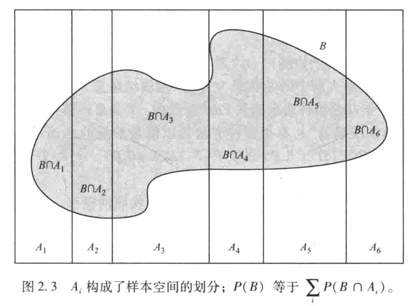{fig-align="center" width="7.5cm"}

#### 全概率公式( 续) {#全概率公式-续 .unnumbered}

对于全概率公式, 我们要注意以下几点

首先,全概率公式的最简单形式: 如果$0<P(A)<1$, 则

$$
\begin{aligned}
P(B)=P(A)P(B|A)+P(\overline{A})P(B|\overline{A})
\end{aligned}
$$

 接着,条件$A_1,A_2,\cdots,A_n$为样本空间$\Omega$的一个分割, 可改为$A_1,A_2,\cdots,A_n$互不相容, 且$B\subset \cup_{k=1}^nA_k$. 最后,在必要时,可把分割的概念推广到可列个事件($n=\infty$)的情形, 相应地有 $$P(B)=\sum_{k=1}^{\infty} P(A_kB)=\sum_{k=1}^{\infty} P(A_k) P(B|A_k).$$

### 贝叶斯公式

#### 贝叶斯公式 {#贝叶斯公式-1 .unnumbered}

::: {#thm-ch1-013}
设$A_1,A_2,\cdots,A_n$为样本空间$\Omega$的一个分割, 即 $A_1,A_2,\cdots,A_n$互不相容, 且$\cup_{k=1}^nA_k=\Omega$, 若 $$P(B)>0, P(A_k)>0, k=1,2,\cdots,n$$ 则

$$
\begin{aligned}
P(A_k|B)=\dfrac{P(A_k)P(B|A_k)}{\sum_{j=1}^nP(A_j)P(B|A_j)}.
\end{aligned}
$$

 特别的, 我们有

$$
\begin{aligned}
P(A|B)=\frac{P(B|A)P(A)}{P(B)}
\end{aligned}
$$

:::

#### 贝叶斯几率 {#贝叶斯几率 .unnumbered}

::: {#def-ch1-025}
() 一个事件的几率(odds)为

$$
\begin{aligned}
\text{odds}(A)=P(A)/P(\overline{A})=\frac{P(A)}{1-P(A)}
\end{aligned}
$$

:::

[概率的几率表示:]{style="color: cyan"} $P(A)=\text{odds}(A)/(1+\text{odds(A)})$

::: {#thm-ch1-014}
()对于任意两个正概率事件$A$和$B$, 给定以$B$为条件的情况下, $A$的几率如下:

$$
\begin{aligned}
\frac{P(A|B)}{P(\overline{A}| B)}=\frac{P(B| A)P(A)}{P(B| \overline{A})P(\overline{A})}
\end{aligned}
$$

:::

后验几率 $\dfrac{P(A|B)}{P(\overline{A}|B)}$ 等于先验几率 $\dfrac{P(A)}{P(\overline{A})}$ 乘以似然比因子 $\dfrac{P(B|A)}{P(B|\overline{A})}$. 同时,有时候用上述形式的贝叶斯准则可以更方便地求出后验几率, 如果需要的话还可以将几率形式转换成概率形式形式.

#### 全概率与贝叶斯内涵:由因到果,由果推因 {#全概率与贝叶斯内涵由因到果由果推因 .unnumbered}

在现实中把事件$B$看作结果, 把事件$A_1,A_2,\cdots, A_n$看作导致结果$B$的各种原因. 同时,全概率公式是由各种原因推理出结果事件发生的概率,是由因到果. 此外,在日常生活中常常是观察到某种现象,反推造成这种现象的各种原因的概率,即由果推因. 相应地,条件概率$P(A_k|B)$, 就是在观察到结果事件$B$已经发生的情况下,推断结果事件$B$是由原因$A_k$造成的概率的大小.

进一步,$P(A_k)$: 先验概率, 在没有别的前提信息情况下的概率值,一般借助经验来估计,或赋予所有原因以相同的先验概率. 同时,$P(A_k|B)$:后验概率, 在获得结果事件$B$发生这个信息之后原因$A_k$出现的概率. 此外,后验概率可看作先验概率在获取了新信息之后的一种修正, 贝叶斯公式恰恰提供了一种计算后验概率的工具

相应地,贝叶斯理论对于人工智能,深度学习等理论具有重要的指导意义, 贝叶斯统计受到了从未有过的青睐, 迎来了前所未有的发展机遇.

#### 条件全概率公式和条件贝叶斯公式 {#条件全概率公式和条件贝叶斯公式 .unnumbered}

::: {#thm-ch1-015}
() 令$A_1,\cdots,A_n$为样本空间$\Omega$的一个划分. 设对于所有的$i$满足$P(A_iE)>0$, 则

$$
\begin{aligned}
P(B| E)=\sum_{i=1}^{n}P(B| A_{i},E)P(A_{i}| E)
\end{aligned}
$$

:::

::: {#thm-ch1-016}
() 设$P(AE)>0$且$P(BE)>0$,则有

$$
\begin{aligned}
P(A| B,E)=\frac{P(B| A,E)P(A| E)}{P(B| E)}
\end{aligned}
$$

:::

### 条件概率,全概率与贝叶斯公式的应用

#### 条件性思维谬误:控方证人的错误 {#条件性思维谬误控方证人的错误 .unnumbered}

::: {#exm-ch1-034}
1988 年,Sally Clark 由于她的两个孩子在出生不久便死亡,因而被指控谋杀幼童.在审讯期间,控方的一个专家证人证实

新生儿因婴儿猝死综合症 (SIDS) 而死亡的概率为 $1/8500$. 同时,所以两个新生儿由于婴儿猝死综合症死亡的概率为 $(1/8500)^2$, 大约为 7300 万分之一. 因此,他认为 Clark 清白的概率仅为 7300 万分之一.
:::

::: {#sol-ch1-003}
这个推理过程至少有两个问题

一个家庭内部成员之间死于 SIDS 是否相互独立? 其中,家庭内部成员之间死于 SIDS 相互独立时,第一个孩子死于 SIDS 且 第二个孩子也死于 SIDS 的概率是相应的两个事件概率相乘; 如果遗传因素或其他家庭特有的风险因素导致某些家庭内的所有新生儿面临 SIDS 的风险增加,这种独立性就不再成立了.
:::

#### 条件性思维谬误:控方证人的错误 {#条件性思维谬误控方证人的错误-1 .unnumbered}

这个所谓的专家将两个不同的条件概率混淆了: $P (\mbox{清白 | 证据})$ 和 $P (\mbox{证据 | 清白})$ 是不一样的. 其中,专家 1 声称:如果在被告人是清白的情况下,两个孩子死亡的概率很低;那就是说 $P (\mbox{证据 | 清白})$ 非常小.; 但人们感兴趣的是,给定现在所有的证据 (孩子均死) 条件下,报告人仍清白的概率,即 $P (\mbox{清白 | 证据})$.; 由贝叶斯准则可知,$$P (\mbox{清白 | 证据})=\frac{P (\mbox{证据 | 清白}) P (\mbox{清白})}{P (\mbox{证据})},$$ 所以为了计算 $P (\mbox{清白 | 证据})$, 这里需要考虑 $P (\mbox{清白})$, 也就是被告清白的先验概率.这个概率是很高的; 虽然 SIDS 造成两个婴儿死亡是很罕见的,但是蓄意杀害两个婴儿的情况也很少见! 基于现有证据的后验概率是对很低的 $P (\mbox{证据 | 清白})$ 和很高的 $P (\mbox{清白})$ 的一个平衡.专家的结果 $(1/8500)^2$ 是有问题的,它只是整个计算式中的一部分.

#### Monty Hall三门问题 {#monty-hall三门问题 .unnumbered}

::: {#exm-ch1-035}
在 Monty Hall 主持的Let\'s Make a Deal节目中, 有三扇门, 其中有两扇门后面是一只山羊, 一扇门后面是一辆车. 选手将获得其所选中的那扇门后面的物品.

一位选手从三扇最近的门中选一扇. 同时,Monty 知道车在哪扇门后面, 并以不暴露车的位置打开剩下两扇门中的一扇, 即他打开的门后面永远是山羊. 若剩下的两扇门后都是山羊的话, Monty 会等可能地随机选一扇门. 相应地,然后 Monty 会让对手选择, 是换另一扇没打开的门还是不换. 相应地,如果对手的目标是得到车, 她应该换吗?
:::

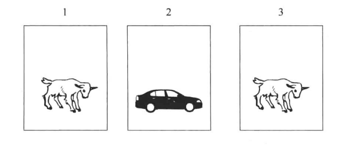{fig-align="center" width="8.5cm"}

#### Monty Hall 问题(续) {#monty-hall-问题续 .unnumbered}

::: {#sol-ch1-004}
先将三扇门从$1$到$3$编号.\
. 同时,不失一般性, 可以假设选手选择的是$1$号门. 令

$$
\begin{aligned}
A&=\{\mbox{换门得到车} \} \\
      B&=\{\mbox{不换门得到车} \}\\
     C_i&:=\{\mbox{车在第}i \mbox{扇门后面} \}, i=1,2,3.
\end{aligned}
$$

 相应地,显然, $P(B)=P( \mbox{不换门得到车} )=1/3$. 相应地,则由全概率公式

$$
\begin{aligned}
P(A)&=P(A|C_1)\cdot\frac{1}{3}+P(A|C_2)\cdot\frac{1}{3}+P(A|C_3)\cdot\frac{1}{3}\\
     & =0\cdot\frac{1}{3}+1\cdot\frac{1}{3}+1\cdot\frac{1}{3}=\frac{2}{3}
\end{aligned}
$$

:::

#### Monty Hall 三门问题图示 {#monty-hall-三门问题图示 .unnumbered}

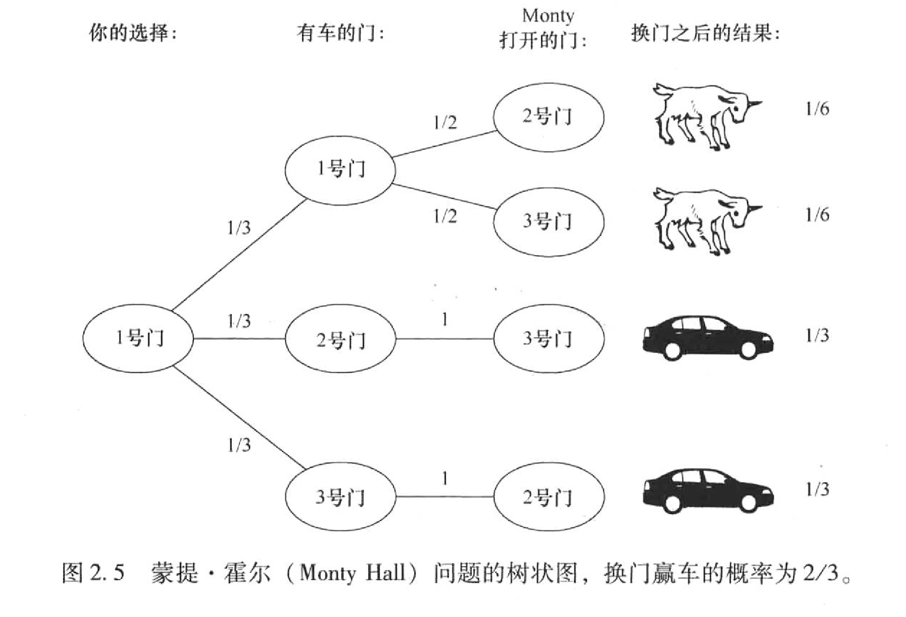{fig-align="center" width="11cm"}

#### 随机徘徊的吸收概率 {#随机徘徊的吸收概率 .unnumbered}

::: {#exm-ch1-036}
质点在数轴上整数点运动, 若质点处在整数点$i$上, 则下一时刻

以概率$p$向右移动到$i+1$. 同时,以概率$q$向左移动到$i-1$, 其中$p,q>0, p+q=1$. 此外,我们把质点的上述运动称之为随机徘徊或随机游动

相应地,考虑数轴上的两个[吸收壁$0$与$a(a>1)$]{style="color: cyan"}:质点运动到$0$或$a$之后就永远不再移动. 相应地,现求自$i(0<i<a)$出发的质点将被$0$或$a$吸收的概率.
:::

**解.** 令 $E_i=\{\mbox{质点自}i\mbox{出发}\}, F=\{\mbox{质点在}0\mbox{被吸收}\}, G=\{\mbox{质点在}a\mbox{被吸收}\}$.

下面对$i=0,1,\cdots,a$ 计算

$$
\begin{aligned}
P_i=P(F|E_i), \quad Q_i=P(G|E_i)
\end{aligned}
$$

 记$B=\{\mbox{质点第一次向左移动 1 单位}\}$并以第 1 次可能的运动情 况为条件进行全概率展开可得

$$
\begin{aligned}
Q_i&=&P(GB|E_i)+P(G\bar{B}|E_i)\\
        &=&P(B|E_i)P(G|BE_i)+P(\bar{B}|E_i)P(G|\bar{B}E_i)\\
        &=&pQ_{i+1}+qQ_{i-1}, \quad i=1,2,\cdots a-1.
\end{aligned}
$$

 将上述递推式重写为

$$
\begin{aligned}
Q_{i+1}-Q_i=\dfrac{q}{p}(Q_i-Q_{i-1}), \quad i=1,\cdots, a-1.
\end{aligned}
$$ {#eq-ch1-ditui1}

1.  当$p=q=1/2$时, 由$Q_0=0$及$Q_a=1$可得

$$
\begin{aligned}
Q_i=\dfrac{i}{a},\quad  i=0,\cdots, a.
\end{aligned}
$$

2.  当$p\neq q$时, 反复利用递推式@eq-ch1-ditui1 并注意到$Q_0=0$可导出

$$
\begin{aligned}
Q_{i+1}-Q_i=\bigg(\dfrac{q}{p}\bigg)^iQ_1, \quad i=1,\cdots, a-1.
\end{aligned}
$$ {#eq-ch1-ditui2}

 上式对$i=1,\cdots, a-1$求和并利用$Q_a=1$可得

$$
\begin{aligned}
Q_1=\bigg[\sum_{i=0}^{a-1}\bigg(\dfrac{q}{p}\bigg)^{i}\bigg]^{-1}=\dfrac{1-q/p}{1-(q/p)^a}
\end{aligned}
$$

 再将([\[eq-ch1-ditui2\]](#eq-ch1-ditui2){reference-type="ref" reference="eq-ch1-ditui2"})式对$i=1,\cdots, i-1$求和并将上述$Q_1$代入可得

$$
\begin{aligned}
Q_i=\dfrac{1-(q/p)^i}{1-(q/p)^a}, \quad i=0,\cdots, a.
\end{aligned}
$$

综上可得

$$
\begin{aligned}
Q_i=\left\{
        \begin{array}{cl}
            \dfrac{i}{a}, &p=q,\\
            \\
            \dfrac{1-(q/p)^i}{1-(q/p)^a}, &p\neq q.
        \end{array}
        \right.
\end{aligned}
$$

 类似可得

$$
\begin{aligned}
P_i=\left\{
        \begin{array}{cl}
            \dfrac{a-i}{a}, &p=q,\\
            \\
            \dfrac{(q/p)^i-(q/p)^a}{1-(q/p)^a}, &p\neq q.
        \end{array}
        \right.
\end{aligned}
$$

#### Simpson 悖论 {#simpson-悖论 .unnumbered}

::: {#exm-ch1-037}
有两种治疗肾结石的方案,其治疗效果如下:

[方案$1$:]{style="color: cyan"} 小结石患者占$25\%$, 大结石患者占$75\%$, 小结石患者的治愈率是$93\%$, 大结石患者的治愈率是$73\%$. 同时,[方案$2$:]{style="color: cyan"} 小结石患者占$77\%$, 大结石患者占$23\%$, 小结石患者的治愈率是$87\%$, 大结石患者的治愈率是$69\%$. 此外,不管是对小结石患者, 还是大结石患者, 方案$1$的治愈率都要高于方案$2$. 相应地,[方案$1$优于方案$2$吗?]{style="color: red"}.
:::

::: {#sol-ch1-005}
计算两种方案的治愈率

记$A$={患者是小结石患者}, $B$={患者被治愈}. 根据全概率公式

$$
\begin{aligned}
&P_1(B)= P_1(A)P_1(B|A)+P_1(\overline{A})P_1(B|\overline{A})= 0.25\cdot 0.93+0.75\cdot 0.73=0.78 \\
                & P_2(B)= P_2(A)P_2(B|A)+P_2(\overline{A})P_2(B|\overline{A})= 0.77\cdot 0.87+0.23\cdot 0.69=0.8286
\end{aligned}
$$

 此外,方案$2$的治愈率高于方案$1$, 可见方案$1$并不优于方案$2$.
:::

#### 敏感性问题调查 {#敏感性问题调查 .unnumbered}

敏感性问题调查方案的关键在于要使被调查者愿意作出真实的回答又能保守个人秘密, 如果调查方案有误, 被调查者就会拒绝配合, 所得调查数据将失去真实性.

**调查方案:** 被调查者只需要加答以下两个问题中的一个问题,且只需要回答是或否.

问题 A: 你的生日是否在 7 月 1 日之前?

问题 B: 所调查的敏感性问题.

**调查方案的操作:**

( 1)被调查者在没有旁人的情况下独自一人在房间内操作回答问题

( 2)被调查者从一个罐子中随机抽一球, 看过颜色后放回, 若抽到白球, 回答问题 A, 抽到红球, 回答问题 B.

( 3)被调查者无论回答问题 A 还是问题 B, 只需在仅有是与否选项的答卷上作答然后将答卷放入密封的投票箱内.

#### 敏感性问题调查 {#敏感性问题调查-1 .unnumbered}

**[问题:]{style="color: red"}** 假若我们有$n$张问卷, 其中$k$张回答是, 我们如何确定选定红球回答问题 B 为是的概率?

**[已知:]{style="color: red"}**

红白球的比例, 即$P(\mbox{红球}):=\pi, P(\mbox{白球})=1-\pi$; 同时,$P(\mbox{是}|\mbox{白球})=0.5$; 此外,$P(\mbox{是})\approx \dfrac{k}{n}$.

**[待求:]{style="color: red"}** $p:=P(\mbox{是}|\mbox{红球})$.

****解.** ** 由全概率公式可得

$$
\begin{aligned}
P(\mbox{是})=P(\mbox{白球})P(\mbox{是}|\mbox{白球})+P(\mbox{红球})P(\mbox{是}|\mbox{红球})
\end{aligned}
$$

 即

$$
\begin{aligned}
\dfrac{k}{n}\approx (1-\pi)\cdot 0.5+\pi\cdot p \Rightarrow p=\dfrac{k/n-0.5(1-\pi)}{\pi}
\end{aligned}
$$

#### Bayesian滤波 {#bayesian滤波 .unnumbered}

- 许多工程科学类问题都可以归结为如下图所示形式

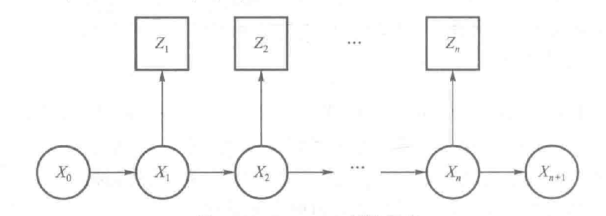{fig-align="center" width="9.19cm"}

- 系统自身的状态 $X$ 是我们关注的随机事件,但是由于技术手段等方面的限制,无法直接对 $X$ 进行观测, 只能获取另一随机事件, 即间接反映系统状态 $X$ 的观测量 $Z$.

- 问题转化为已知观测量 $Z$ 的条件下, 如何对系统状态 $X$ 进行推断.用条件概率的语言讲, 就是计算 $P(X \mid Z)$.

- 通常情况下, $X$ 和 $Z$ 随时间变化,分别记作 $X_{n}$ 和 $Z_{n}$ ,其中 $n$ 表示时间. 那么在实际应用中, 到 $n$ 时刻为止, 我们掌握的实际观测数据为 $\left\{Z_{1}, \cdots, Z_{n}\right\}$,

#### Bayesian滤波 {#bayesian滤波-1 .unnumbered}

如何实现 $P\left(X_{n} | Z_{1}, \cdots, Z_{n}\right) \longrightarrow P\left(X_{n+1} | Z_{1}, \cdots, Z_{n+1}\right)$的递推计算? 注意到, 若已知$X_{n+1}$时,$Z_{n+1}$与$\left\{Z_{1}, \cdots, Z_{n}\right\}$独立, 则

$$
\begin{aligned}
P\left(X_{n+1} | Z_{1}, \cdots, Z_{n+1}\right)&=&  \frac{P\left(X_{n+1}, Z_{1}, \cdots, Z_{n+1}\right)}{P\left(Z_{1}, \cdots, Z_{n+1}\right)}\\
        &=& \frac{P\left(Z_{n+1} | X_{n+1}, Z_{1}, \cdots, Z_{n}\right) P\left(X_{n+1}, Z_{1}, \cdots, Z_{n}\right)}{P\left(Z_{1}, \cdots, Z_{n+1}\right)}\\
        &=& \frac{P\left(Z_{n+1} | X_{n+1}\right) P\left(X_{n+1}, Z_{1}, \cdots, Z_{n}\right)}{P(Z_{n+1}|Z_{1}, \cdots, Z_n)P\left(Z_{1}, \cdots, Z_{n+1}\right)}
\end{aligned}
$$

#### Bayesian滤波 {#bayesian滤波-2 .unnumbered}

再由

$$
\begin{aligned}
&&P\left(X_{n+1}, Z_{1}, \cdots, Z_{n}\right)\\
            &=&\sum_{X_{n}} P\left(X_{n+1}, X_{n}, Z_{1}, \cdots, Z_{n}\right) \\
            &=&\sum_{X_{n}} P\left(X_{n+1} | X_{n}, Z_{1}, \cdots, Z_{n}\right) P\left(X_{n} | Z_{1}, \cdots, Z_{n}\right) P\left(Z_{1}, \cdots, Z_{n}\right) \\
            &=&\sum_{X_{n}} P\left(X_{n+1} | X_{n}\right) P\left(X_{n} | Z_{1}, \cdots, Z_{n}\right) P\left(Z_{1}, \cdots, Z_{n}\right)
\end{aligned}
$$

 同时,将上式代入前面一页表达式中可得 $$P\left(X_{n+1} | Z_{1}, \cdots, Z_{n+1}\right)=\frac{P\left(Z_{n+1} | X_{n+1}\right)}{P\left(Z_{n+1} | Z_{n}, \cdots, Z_{1}\right)} \sum_{X_{n}} P\left(X_{n+1} | X_{n}\right) P\left(X_{n} | Z_{1}, \cdots, Z_{n}\right)$$ 此外,上式便是对系统状态进行递推估计的 Bayesian 滤波公式,在雷达,声呐,通信,导航,机器学习等许多领域有广泛应用.

## 条件化方法及其应用 {#sec-ch1-lecture-7}

::: {.callout-note appearance="simple" icon="false"}
## 本节导读

复杂问题往往可以通过先固定一部分信息,再对所有情形加权来化简.本节在医学诊断,可靠性,递推计算和敏感问题调查等场景中练习条件化方法,重点是识别恰当的完备事件组,而不是机械套用公式.
:::

::: {.callout-tip appearance="simple" icon="false"}
## 理论主线

条件化是一种问题分解方法.面对复杂随机过程,可以先固定第一步结果,隐藏状态或某个分类变量,使剩余问题变得简单,再对条件结果加权.一步分析,递推概率,Pólya 罐模型和秘书问题都体现了这一思路.

建立递推关系时,需要验证状态是否包含决定未来演化所需的全部信息,并写出正确的边界条件.一个形式上成立的递推式,只有在状态定义,条件划分和终止条件均明确时,才构成完整的概率论证明.
:::

### 条件概率的应用

#### 条件概率的例子:男孩女孩概率问题 {#条件概率的例子男孩女孩概率问题 .unnumbered}

::: {#exm-ch1-038}
(年长的是女孩 vs 至少一个女孩) 某家庭有两个孩子,已知至少有一个是女孩.两个孩子都是女孩的概率是多少?如果条件改为年长的孩子是女孩,那么两个都是女孩的概率又是多少?
:::

::: {#sol-ch1-006}
假设每个孩子都是女孩和男孩的可能性相同且不相关,那么

$$
\begin{aligned}
&P (\mbox{都是女孩 | 至少有一个是女孩})
            \\
            &=\frac{P (\mbox{都是女孩,至少有一个是女孩})}{P (\mbox{至少有一个是女孩})}=\frac{1/4}{3/4}=1/3\\
            & P (\mbox{都是女孩 | 年长的是女孩})\\
            &=\frac{P (\mbox{都是女孩,年长的是女孩})}{P (\mbox{年长的是女孩})}=\frac{1/4}{1/2}=1/2
\end{aligned}
$$

:::

#### 男孩女孩概率问题续:随机的一个孩子是女孩 {#男孩女孩概率问题续随机的一个孩子是女孩 .unnumbered}

::: {#exm-ch1-039}
某家庭有两个孩子.随机遇到其中的一个,发现是女孩.给定这个信息后,两个孩子都是女孩的概率是多少?假设随机遇到两个孩子的可能性相同,且与性别无关.
:::

::: {#sol-ch1-007}
直观来看,结果应为 1/2. 令 $G_{1}$, $G_{2}$, $G_{3}$ 分别表示年长, 年幼, 随机的孩子是女孩这三个事件.由对称性可得: $P (G_{1})=P (G_{2})=P (G_{3})=1/2$. 根据朴素概率的定义,或者独立性,可得: $P (G_{1}\cap G_{2})=1/4$. 因此,$P (G_{1}\cap G_{2}|G_{3})=P (G_{1}\cap G_{2}\cap G_{3})/P (G_{3})=1/2$. 相应地,又因为 $G_{1}\cap G_{2}\cap G_{3}=G_{1}\cap G_{2}$, 所以概率为 $1/2$.
:::

::: {#rem-ch1-008}
假设一个强制性法律规定:如果一个男孩有姐妹则禁止他走出家门.那么这时 随机遇到的孩子是女孩 就等价于 至少有一个孩子是女孩
:::

#### 男孩女孩概率问题续:冬天出生的女孩 {#男孩女孩概率问题续冬天出生的女孩 .unnumbered}

::: {#exm-ch1-040}
某家庭有两个孩子,给定条件至少一个是女孩且在冬天出生,求两个孩子都是女孩的概率.假设四个季节出生的可能性相同且性别和季节是相互独立的.
:::

::: {#sol-ch1-008}
由条件概率的定义,可得:

$$
\begin{aligned}
\ P (\mbox{两个都是女孩 | 至少有一个是冬天出生的女孩})\\
            =\frac{P (\mbox{两个都是女孩,至少有一个是冬天出生的女孩})}{P (\mbox{至少有一个是冬天出生的女孩})}
\end{aligned}
$$

 由于指定的孩子是在冬天出生的女孩的概率为 $1/8$, 所以,$$P (\mbox{至少有一个是在冬天出生的女孩}) = 1 - (7/8)^2.$$
:::

#### 男孩女孩概率问题续:冬天出生的女孩 {#男孩女孩概率问题续冬天出生的女孩-1 .unnumbered}

利用性别和季节是相互独立的假设,得到:

$$
\begin{aligned}
&P (\mbox{两个都是女孩,至少有一个是冬天出生的女孩})\\
            &=P (\mbox{两个都是女孩,至少有一个是冬天出生的})\\
            &=(1/4) P (\mbox{至少有一个是冬天出生的女孩})\\
            &=(1/4) (1-P (\mbox{所有孩子都不是在冬天出生的})
\end{aligned}
$$

 合在一起得到,$$P (\mbox{两个都是女孩 | 至少有一个是冬天出生的女孩})=7/15$$

#### 结绳问题 {#结绳问题 .unnumbered}

::: {#exm-ch1-041}
 $n$根绳$2n$个头两两相接, 求$A=\{\mbox{恰好结成} n\mbox{个圈}\}$的概率.
:::

设想 $2n$ 个头排成一行,规定将第 $2k-1$ 个头与第 $2k$ 个端头相接; 令 $B_i$ 表示第 $i$ 根绳的头与尾恰好相接,则 $A=B_1B_2\cdots B_n$; 若以 $n (A)$ 表示事件 $A$ 所包含的样本点个数,则易知

$$
\begin{aligned}
n(\Omega)=(2n)!,  n(B_1)=2n(2n-2)! \Rightarrow P(B_1)=\dfrac{n(B_1)}{n(\Omega)}=\dfrac{1}{2n-1};
\end{aligned}
$$

 相应地,$P (B_2|B_1)$ 可看作 $n-1$ 根绳某根绳头尾相接的概率,类比 $n$ 根绳情形可得 $P (B_2|B_1)=\dfrac{1}{2 (n-1)-1}=\dfrac{1}{2n-3};$. 相应地,同理可得 $P (B_k|B_1B_2\cdots B_{k-1})=\dfrac{1}{2[n-(k-1)]-1}=\dfrac{1}{2n-2k+1}, 3\leq k\leq n;$. 利用乘法公式可得

$$
\begin{aligned}
P(A)&= P(B_1B_2\cdots B_n)= P(B_1)P(B_2|B_1)\cdots P(B_n|B_1\cdots B_{n-1})\\
            &=\dfrac{1}{(2n-1)!}
\end{aligned}
$$

#### 取球问题 {#取球问题 .unnumbered}

::: {#exm-ch1-042}
在计算机中输入程序,让它自动完成如下操作:

在 $1-\dfrac{1}{2^n}$ 时刻,往盒中放入标号 $10 (n-1)+1\sim 10n$ 的 $10$ 个球,同时取出标号为 $10 (n-1)+1$ 的球,$n\geq 1$; 同时,在 $1-\dfrac{1}{2^n}$ 时刻,往盒中放入标号 $10 (n-1)+1\sim 10n$ 的 $10$ 个球,同时取出标号为 $n$ 的球,$n\geq 1$; 此外,在 $1-\dfrac{1}{2^n}$ 时刻,往盒中放入标号 $10 (n-1)+1\sim 10n$ 的 $10$ 个球,同时随机地从盒中取出一个球,$n\geq 1$.

则在时刻 $1$, 盒中的球数结果如下

盒子中有无穷多个球; 同时,盒子变为空的; 此外,盒子变为空的概率等于 $1$?
:::

#### 取球问题 {#取球问题-1 .unnumbered}

**解.**  

记 $E$={在时刻 $1$ 时盒子变空 }; 同时,$\overline{E}$={在时刻 $1$ 时盒中有球未被取出 }; 此外,记 $A_k$={在时刻 $1$ 时 $k$ 号球仍在盒中未被取出 }, 则 $\overline{E}=\bigcup\limits_{k=1}^{\infty} A_k$; 由概率的次可加性知 $$P( \overline{E})= P\big(\bigcup_{k=1}^{\infty}A_k\big)\leq\sum_{k=1}^{\infty} P(A_k);$$ 相应地,为证 $P (\overline{E})=0$,只需证明 $P (A_k)=0,\,k\geq 1$; 由于证法类似,仅以证明 $P (A_1)=0$ 为例;

#### 取球问题 {#取球问题-2 .unnumbered}

记 $B_n$={在 $1-\dfrac{1}{2^n}$ 时刻 $1$ 号球未被取出 }, 易知 $A_1=\bigcap\limits_{n=1}^{\infty} B_n$; 令 $C_m=\bigcap\limits_{n=1}^{m} B_n$, 则有 $$C_m=\bigcap\limits_{n=1}^{m} B_n\supset\bigcap\limits_{n=1}^{m+1} B_n=C_{m+1},\mbox{ 且 } \lim_{m\rightarrow\infty} C_m=A_1;$$ 由概率的上连续性知 $$P (A_1)= P\big (\lim_{m\rightarrow\infty} C_m\big)=\lim_{m\rightarrow\infty} P\big (C_m\big);$$ 相应地,下面求 $P (C_m)$, 即 $P\big (\bigcap_{n=1}^{m} B_n\big)=\prod_{n=1}^{m}\frac{9n}{9n+1}=\prod_{n=1}^{m}\left (1-\frac{1}{9n+1}\right)$; 其中,$B_1$: 在 $1/2$ 时刻,盒中 $10$ 个球,$1$ 号球未被取出,故 $P (B_1)=\frac{9}{10}$; $B_2$: 在 $3/4$ 时刻,盒中 $19$ 个球,$1$ 号球未被取出,故 $P (B_2|B_1)=\frac{18}{19}$; $B_n$: $P(B_n|B_1B_2\cdots B_{n-1})=\frac{9n}{9n+1}.$. 相应地,$P (A_1)=\prod_{n=1}^{\infty}\big (1-\frac{1}{9n+1}\big)=0.$ 同理可证 $P (A_k)=0,\,k=2,3,\cdots$.

#### 罐子模型(波利亚模型) {#罐子模型波利亚模型 .unnumbered}

::: {#exm-ch1-043}
设罐中有 $b$ 个黑球,$r$ 个红球,每次随机的取出一球,取出后将原球放回,还加进 $c$ 个同色球和 $d$ 个异色球.记 $B_i:=\{\mbox{第} i\mbox{次取出的是黑球}\}, R_j:=\{\mbox{第} j\mbox{次取出的是红球}\}$. 若连续从罐子中取出三个球,其中有两个红球,一个黑球,则由乘法公式可得

$$
\begin{aligned}
P(B_1R_2R_3)&=&P(B_1)P(R_2|B_1)P(R_3|B_1R_2)\\
            &=&\frac{b}{b+r}\cdot\frac{r+d}{b+r+c+d}\cdot\frac{r+d+c}{b+r+2c+2d}\\
            P(R_1B_2R_3)&=&P(R_1)P(B_2|R_1)P(R_3|R_1B_2)\\
            &=&\frac{r}{b+r}\cdot\frac{b+d}{b+r+c+d}\cdot\frac{r+d+c}{b+r+2c+2d}\\
            P(R_1R_2B_3)&=&P(R_1)P(R_2|R_1)P(B_3|R_1R_2)\\
            &=&\frac{r}{b+r}\cdot\frac{r+c}{b+r+c+d}\cdot\frac{b+2d}{b+r+2c+2d}
\end{aligned}
$$

 显然以上概率与黑球在第几次抽取有关.
:::

#### 罐子模型(波利亚模型) {#罐子模型波利亚模型-1 .unnumbered}

当 $c=-1, d=0$ 时,即为不返回抽样.此时前次抽取结果会影响后次抽取结果,但只要抽取的黑球与红球个数确定,则概率不依赖其抽出球的次序,都是一样的.

$$
\begin{aligned}
P(B_1R_2R_3)= P(R_1B_2R_3)=P(R_1R_2B_3)=\frac{br(r-1)}{(b+r)(b+r-1)(b+r-2)}.
\end{aligned}
$$

 同时,当 $c=0,d=0$ 时,即为返回抽样.此时前次抽取结果不会影响后次抽取结果,故上述三个概率相等且都等于

$$
\begin{aligned}
P(B_1R_2R_3)= P(R_1B_2R_3)=P(R_1R_2B_3)=\frac{br^2}{(b+r)^3}.
\end{aligned}
$$

 此外,当 $c>0,d=0$ 时,称为传染病模型.此时每次取出球后会增加下一次取出同色球的概率,或换言之,每发现一个传染病患者,以后都会增加再传染的概率.与前两种情况一样,三个概率都等于

$$
\begin{aligned}
P(B_1R_2R_3)= P(R_1B_2R_3)=P(R_1R_2B_3)=\frac{br(r+c)}{(b+r)(b+r+c)(b+r+2c)}.
\end{aligned}
$$

#### 罐子模型(波利亚模型) {#罐子模型波利亚模型-2 .unnumbered}

从上面的结果可以看出,只要 $d=0$,以上三个概率都相等,即只要抽取的黑球与红球的个数确定,则概率不依赖于抽出黑红球的次序. 同时,当 $c=0,d>0$ 时,称为安全模型.此模型可解释为:每当事故发生了 (当红球被取出),安全工作就抓紧一些,下次再发生事故的概率就会减少,而当事故没有发生时 (黑球被取出),安全工作就放松一些,下次再发生事故的概率就会增大,此时,上述三个概率分别为

$$
\begin{aligned}
P(B_1R_2R_3) &=&\frac{b}{b+r}\cdot\frac{r+d}{b+r+d}\cdot\frac{r+d}{b+r+2d}\\
                P(R_1B_2R_3)&=&\frac{r}{b+r}\cdot\frac{b+d}{b+r+d}\cdot\frac{r+d}{b+r+2d}\\
                P(R_1R_2B_3) &=&\frac{r}{b+r}\cdot\frac{r}{b+r+d}\cdot\frac{b+2d}{b+r+2d}
\end{aligned}
$$

#### 罐子模型(波利亚模型) {#罐子模型波利亚模型-3 .unnumbered}

::: {#exm-ch1-044}
设罐中有 $b$ 个黑球,$r$ 个红球,每次随机取出一球后将原球放回并加进 $c$ 个同色球,如此反复进行.试证明:在前 $n=n_1+n_2$ 次取球中,取出了 $n_1$ 个红球和 $n_2$ 个黑球的概率为 $$C_n^{n_1}\frac{a(a+c)(a+2c)\cdots(a+n_1c-c)b(b+c)(b+2c)\cdots(b+n_2c-c)}{(a+b)(a+b+c)(a+b+2c)\cdots(a+b+nc-c)}.$$
:::

### 全概率公式的应用

#### 摸球问题 {#摸球问题 .unnumbered}

::: {#exm-ch1-045}
有三个罐子, 各装有两个球, 分别为两个白球,一白一黑和两个黑球. 任意取出一个罐子, 摸出一球, 发现是白球. (1)求该罐中另一个球也是白球的概率; (2)把摸出的球放回罐中, 再从该罐中随机摸出一球, 求该球也是白球的概率.
:::

::: {#sol-ch1-009}
首先,$A_k, k=1,2$:表示第$k$次取球取出的是白球的事件; 接着,$B_k, k=1,2,3$:表示取出的是装有两白,一白一黑和两黑球的罐子; 另一方面,问题(1)要求的是该白球取自两白的罐子的概率, 即$P(B_1|A_1)$; 由条件概率公式, 得$P(B_1|A_1)=\frac{P(A_1B_1)}{P(A_1)}=\frac{P(B_1)P(A_1|B_1)}{P(A_1)};$ 其中,$P(B_1)=1/3$, $P(A_1|B_1)=1$; $P(A_1)=\sum\limits_{k=1}^{3}P(B_k)P(A_1|B_k)=\dfrac{1}{3}\cdot 1+\dfrac{1}{3}\cdot\dfrac{1}{2}+\dfrac{1}{3}\cdot 0=\dfrac{1}{2}.$. 最后,$P(B_1|A_1)=\dfrac{1/3\cdot 1}{1/2}=2/3$.
:::

#### 摸球问题 {#摸球问题-1 .unnumbered}

首先,问题(2)是在同一个罐子两次有放回的取球, 要求的是在第一次取出白球的条件下, 第二次取出的还是白球的条件概率, 即$P(A_2|A_1)$. 由条件概率的定义, 知 $P(A_2|A_1)=\frac{P(A_1A_2)}{P(A_1)}$; 其中,$P(A_1)=\sum\limits_{k=1}^{3}P(B_k)P(A_1|B_k)=\dfrac{1}{3}\cdot 1+\dfrac{1}{3}\cdot \dfrac{1}{2}+\dfrac{1}{3}\cdot 0=\dfrac{1}{2}.$; $P(A_1A_2)=\sum\limits_{k=1}^{3}P(B_k)P(A_1A_2|B_k)=\dfrac{1}{3}\cdot 1+\dfrac{1}{3}\cdot \dfrac{1}{4}+\dfrac{1}{3}\cdot 0=\dfrac{5}{12}.$. 最后,$P(A_2|A_1)=\frac{P(A_1A_2)}{P(A_1)}=\dfrac{5/12}{1/2}=\dfrac{5}{6}.$.

#### 摸球问题 {#摸球问题-2 .unnumbered}

::: {#exm-ch1-046}
甲盒中有球$5$红$1$黑, 乙盒中有球$5$红$3$黑. 随机取出一个盒子, 从中无放回地相继取出两个球, 试求在第一个球是红球的条件下, 第二个球也是红球的概率.
:::

::: {#sol-ch1-010}
$B:=${第一个球是红球}, $C:=${第二个球是红球}. 同时,$P(C|B)= \dfrac{P(BC)}{P(B)}$ 其中,$A:=${取出的是甲盒}; $P(BC)= P(A)P(BC|A)+P(\overline{A})P(BC|\overline{A})= \dfrac{1}{2}\cdot \dfrac{5}{6}\cdot \dfrac{4}{5}+\dfrac{1}{2}\cdot \dfrac{5}{8}\cdot \dfrac{4}{7}=\dfrac{43}{84}$; $P(B)= P(A)P(B|A)+P(\overline{A})P(B|\overline{A})= \dfrac{1}{2}\cdot \dfrac{5}{6}+\dfrac{1}{2}\cdot \dfrac{5}{8}=\dfrac{35}{48}$

此外,$P(C|B)=\dfrac{43}{84}/\dfrac{35}{48}=\dfrac{172}{245}$.
:::

#### 一般摸球模型 {#一般摸球模型 .unnumbered}

::: {#exm-ch1-047}
袋中有$r$个红球与$b$个黑球. 每次从袋中任摸出 1 球并连同$s$个同色球一起放回. 以$R_n$表示第$n$次摸出红球, 试证$P(R_n)=\dfrac{r}{r+b}$.
:::

**证明.** 利用归纳法来证明:$n=1$时, $P(R_1)=\dfrac{r}{r+b}$显然成立.

假设$n-1$时命题成立. 为求$P(R_n)$, 我们以第 1 次取球的可能结果$R_1$与$\bar{R}_1$作为$\Omega$的分割, 用全概率公式可得:

$$
\begin{aligned}
P(R_n)&= P(R_1)P(R_n|R_1)+P(\bar{R}_1)P(R_n|\bar{R}_1)\\
        &= \dfrac{r}{r+b}\cdot \dfrac{r+s}{r+s+b}+\dfrac{b}{r+b}\cdot \dfrac{r}{r+b+s}\\
        &=\dfrac{r}{r+b}
\end{aligned}
$$

::: {#rem-ch1-009}
当$s=0$时相当于放回摸球, 而$s=-1$相当于不放回摸球.
:::

#### 掷硬币问题 {#掷硬币问题 .unnumbered}

::: {#exm-ch1-048}
甲,乙二人抛掷一枚均匀的硬币, 甲抛了$100$次, 乙抛了$101$次. 求事件$E:=${乙抛出的正面次数比甲多}的概率.
:::

::: {#sol-ch1-011}
首先,如果甲和乙都抛掷这枚均匀的硬币$100$次, 那么当然会有三种不同的可能结果 其中,$A_0$: 甲乙抛出的正面次数一样多; $A_1$: 甲抛出的正面次数比乙多; $A_2$: 乙抛出的正面次数比甲多; $P(A_0)+P(A_1)+P(A_2)=1$ 且 $P(A_1)=P(A_2)$. 接着,以乙第一次抛出的硬币结果对样本空间进行分割: 若$B=${乙第一次时抛出的是正面}发生, 则 乙只要在接下来的$100$次抛掷中, 抛出的正面次数不比甲少即可, 即 $$P(E|B)=P(A_0)+P(A_1)$$ 若$\overline{B}:=${乙第一次时抛出的是反面}发生, 则 乙只要在接下来的$100$次抛掷中, 抛出的正面次数比甲多即可, 即$P(E|\overline{B})=P(A_1)=P(A_2)$. 最后,$P(E)=P(B)P(E|B)+P(\overline{B})P(E|\overline{B})=\frac{1}{2}\left(P(A_0)+P(A_1)+P(A_2)\right)=\frac{1}{2}.$.
:::

#### 对战获胜概率问题 {#对战获胜概率问题 .unnumbered}

::: {#exm-ch1-049}
甲,乙进行某项对战比赛, 每回合胜者得$1$分, 败者不得分. 比赛进行到有 1 人比另外 1 人多$2$分终止, 多$2$分者获胜. 现知每回合甲胜的概率为$p\in (0,1)$. 试求$A:=${甲最终获胜}的概率.
:::

::: {#sol-ch1-012}
[法一(经典解法)]{style="color: red"}

首先,显然甲只能在偶数个回合后获胜. 接着,记$A_{2n}$={甲在$2n$个回合后获胜}, 则$A=\cup_{n=1}^\infty A_{2n}$. 另一方面,$A_{2n}, n\geq 1$两两互不相容且 $P(A_{2n})=(2p(1-p))^{n-1}p^2$. 最后,甲最终获胜的概率

$$
\begin{aligned}
P(A)&=\sum_{n=1}^{\infty}P(A_{2n})=p^2\sum_{n=1}^{\infty}(2p(1-p))^{n-1}\\
                &=p^2\sum_{n=0}^{\infty}(2p(1-p))^{n}=\dfrac{p^2}{1-2p(1-p)}.
\end{aligned}
$$

:::

#### 对战获胜概率问题 {#对战获胜概率问题-1 .unnumbered}

::: {#sol-ch1-013}
[法二(全概率公式)]{style="color: red"}

以前两个回合的战绩对样本空间进行分割. 同时,分别以$B_1,B_2,B_3$表示甲二胜,一胜一败,二败事件. 此外,$P(B_1)=p^2,\,P(B_2)=2p(1-p),\,P(B_3)=(1-p)^2$. 相应地,$P(A|B_1)=1,\,P(A|B_2)=P(A),\,P(A|B_3)=0$. 由全概率公式得$P(A)=\sum\limits_{i=1}^{3}P(B_i)P(A|B_i)=p^2+2p(1-p)P(A)$. 相应地,$P(A)=\dfrac{p^2}{1-2p(1-p)}$.
:::

#### 对战获胜概率问题 {#对战获胜概率问题-2 .unnumbered}

::: {#sol-ch1-014}
[法三(随机游动)]{style="color: red"}

考察质点在数轴整数点上的随机游动:在整数点$x=n$ 其中,以概率$p$向右移动到整数点$x=n+1$,; 以概率$1-p$向左移动到整数点$x=n-1$. 同时,以$p_n$表示质点由$x=n$出发, 未达$-2$前先到达$2$的概率. 此外,显然, $p_{-2}=0,p_2=1$. 相应地,甲获胜的概率即为: $p_0$.

由全概率公式易得

$$
\left\{
                \begin{aligned}
                    &p_0=pp_1+(1-p)p_{-1},  \\ \notag
                    &p_1=pp_2+(1-p)p_0=p+(1-p)p_0,  \\
                    &p_{-1}=pp_0+(1-p)p_{-2}=pp_0.
                \end{aligned}
                \right.
$$

 同时,$p_0=p(p+(1-p)p_0)+(1-p)(pp_0) =p^2+2p(1-p)p_0$. 故 $$p_0=\dfrac{p^2}{1-2p(1-p)}.$$
:::

### Bayes 公式的应用

#### 随机抛硬币问题 {#随机抛硬币问题 .unnumbered}

::: {#exm-ch1-050}
(随机抛硬币) 假设有一枚均匀的硬币和一枚以概率$3/4$正面朝上的不均匀硬币. 随机选取一枚硬币掷$3$次, $3$次都是正面朝上. 试问:

1.  给定上述信息后, 选取的硬币是均匀硬币的概率有多大?

2.  接下去掷第四次时, 仍是正面朝上的概率是多少?
:::

::: {#sol-ch1-015}
令

$$
\begin{aligned}
A &:=\{\mbox{选取的硬币掷 3 次均正面朝上}\}\\
    F & :=\{\mbox{选取的硬币是均匀的}\},\quad
    H :=\{\mbox{第 4 次正面朝上} \}
\end{aligned}
$$

 则

$$
\begin{aligned}
P(F|A)  &=\frac{P(A|F)P(F)}{P(A)} =\frac{P(A|F)P(F)}{P(A|F)P(F)+P(A|F^c)P(F^c)} \\
     &=\frac{(1/2)^3 \cdot 1/2}{(1/2)^3 \cdot 1/2 +(3/4)^3 \cdot  1/2} \approx 0.23\\
    P(H\mid A) & =P(\left.H\mid F,A\right)P(\left.F\mid A\right)+P(\left.H\mid F^{\mathrm{c}},A\right)P(\left.F^{\mathrm{c}}\mid A\right)  \\
     &=\frac{1}{2}\cdot0.23+\frac{3}{4}\cdot(1-0.23)  \approx 0.69.
\end{aligned}
$$

:::

#### 罕见病检测诊断问题 {#罕见病检测诊断问题 .unnumbered}

::: {#exm-ch1-051}
考虑以验血结果诊断某种罕见病的患病概率:

某罕见病的发病率为$1\%$. 同时,通过验血诊断该病的误诊率为$5\%$, 即非患者中有$5\%$的人验血结果为阳性, 患者中有$5\%$的人验血结果为阴性. 此外,现已知某人验血结果为阳性, 试求他患有此病的概率.
:::

::: {#sol-ch1-016}
记$D:=${患有此病}, $T_{1}:=${第一次验血结果为阳性}. 同时,要求的概率是: $P(D|T_{1})=\dfrac{P(DT_{1})}{P(T_{1})}=\dfrac{P(D)P(T_{1}|D)}{P(T_{1})}$. 由题意可知

$$
\begin{aligned}
P(D)&=1\%,\,P(\overline{D})=99\%, \, P(T_{1}|D)=95\%,\,P(T_{1}|\overline{D})=5\% \\
                P(T_{1})&=P(D)P(T_{1}|D)+P(\overline{D})P(T_{1}|\overline{D})=1\%\cdot 95\%+99\%\cdot 5\%  \\
        &=0.0685
\end{aligned}
$$

:::

#### 罕见病检测诊断问题 {#罕见病检测诊断问题-1 .unnumbered}

$P(D|T_{1})=\dfrac{P(D)P(T_{1}|D)}{P(T_{1})}=\dfrac{1\%\cdot 95\%}{0.0685}\approx 0.16.$. 同时,几率方法: $$\frac{P(D|T_1)}{P(D^c|T_1)}=\frac{P(D)}{P(D^c)}\frac{P(T_1|D)}{P(T_1|D^c)}=\frac{1}{99}\cdot\frac{0.95}{0.05}\approx 0.19$$

由几率与概率之间的关系可知 $$P(D|T_1)=0.19/(1+0.19)\approx 0.16,$$ 与上述结果一致. 此外,用几率形式的贝叶斯准则计算更迅速的原因是此时不需要计算普通贝叶斯准则的分母.

#### 罕见病检测诊断问题图示 {#罕见病检测诊断问题图示 .unnumbered}

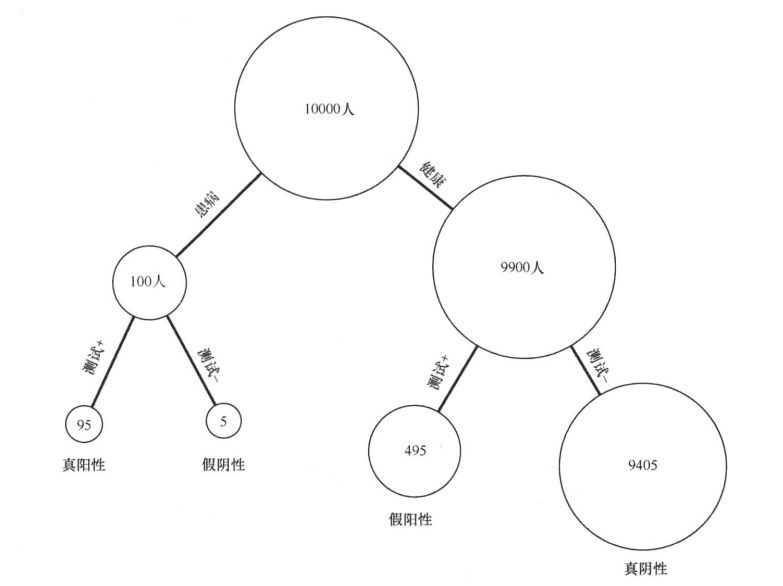{fig-align="center" width="10.5cm"}

#### 罕见病检测诊断问题 {#罕见病检测诊断问题-2 .unnumbered}

::: {#exm-ch1-052}
接上例, 检测结果为阳性的某人, 决定进行第二次检测. 假设新的检测结果与之前的结果相互独立, 且有相同的敏感性和特异性. 若第二次检测结果也为阳性, 试求此人患有此病的概率.
:::

::: {#sol-ch1-017}
记 $T_{2}:=${第二次验血结果为阳性}. 同时,要求的概率是: $P(D|T_{1}T_{2})$ 此外,一步法: 将两个检测结果一次性都考虑在内以进行概率更新, 其中,计算几率 $$\frac{P(D|T_1\cap T_2)}{P(D^c|T_1\cap T_2)}=\frac{P(D)}{P(D^c)}\frac{P(T_1\cap T_2|D)}{P(T_1\cap T_2|D^c)}=\frac{1}{99}\cdot \frac{0.95^2}{0.05^2}=\frac{361}{99}\approx 3.646$$ $P(D|T_{1}T_{2})=\frac{3.646}{1+3.646}\approx 0.78$.
:::

#### 罕见病检测诊断问题 {#罕见病检测诊断问题-3 .unnumbered}

两步法: 在完成第一次检测后, 某人患有此病的后验几率为 $$\frac{P(D|T_1)}{P(D^c|T_1)}=\frac{1}{99}\cdot\frac{0.95}{0.05}\approx 0.19$$ 将后验几率作为新的先验几率, 然后基于第二次检测结果更新后验几率

$$
\begin{aligned}
\frac{P(D|T_1\cap T_2)}{P(D^c|T_1\cap T_2)}
                &=\frac{P(D|T_1)}{P(D^c|T_1)}\frac{P(T_2|D,T_1)}{P(T_2|D^c,T_1)}\\
                &=(\frac{1}{99}\cdot\frac{0.95}{0.05})\frac{0.95}{0.05}\\
                &=\frac{361}{99}\approx 3.646
\end{aligned}
$$

 $P(D|T_{1}T_{2})=\dfrac{3.646}{1+3.646}\approx 0.78$.

#### 电邮问题 {#电邮问题 .unnumbered}

::: {#exm-ch1-053}
甲,乙二人之间经常用 E-mail 相互联系, 他们约定在收到对方信件的当天即给 E-mail 回复. 由于线路问题, 每$n$份 E-mail 中会有$1$份不能在当天送达收件人. 甲在某日发了$1$份 E-mail 给乙, 但未在当天收到乙的回音. 试求乙在当天收到了甲发给他的 E-mail 的概率.
:::

::: {#sol-ch1-018}
在这个问题中, 包含了两个不确定的环节: 甲发给乙的 E-mail 不一定在当天到达乙处; 乙回给甲的 E-mail 不一定在当天到达甲处. 同时,$A$={乙在当天收到甲的 E-mail}, $B$={甲在当天收到乙回的 E-mail}. 此外,$P(A|\overline{B})=\dfrac{P(A)P(\overline{B}|A)}{P(A)P(\overline{B}|A)+P(\overline{A})P(\overline{B}|\overline{A})}$. 相应地, 由题中条件知 $$P(A)=\frac{n-1}{n},\, P(\overline{A})=\frac{1}{n}, \,P(\overline{B}|A)=\frac{1}{n},\,P(\overline{B}|\overline{A})=1.$$ 相应地,$P(A|\overline{B})=\dfrac{\frac{n-1}{n}\cdot \frac{1}{n}}{\frac{n-1}{n}\cdot \frac{1}{n}+\frac{1}{n}\cdot 1}=\dfrac{n-1}{2n-1}<1/2$.
:::

### 条件化及计算概率的递推方法

#### 计算概率的递推方法: 一步分析 {#计算概率的递推方法-一步分析 .unnumbered}

::: {#exm-ch1-054}
(分支过程) 池塘里只有一只变形虫叫作 Bobo.

首先,每过$1$分钟, Bobo 有三种结果: 死去,分裂成两个或保持原状. 接着,三种结果出现的概率相同. 另一方面,此后所有活着的 Bobo 都将继续以这种方式相互独立地进行下去. 最后,那么这个变形虫种族最终灭亡的概率是多少?
:::

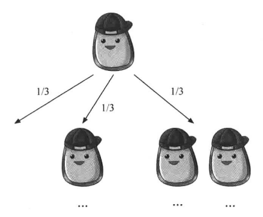{fig-align="center" width="6cm"}

#### 分支过程(续) {#分支过程续 .unnumbered}

::: {#sol-ch1-019}
令$D:=\{\mbox{最终种族灭绝}\}$, 本题希望求出$P(D)$. 接着,我们在第一步结果的基础上即以$1$分钟后的结果进行分析: 令$B_i:=\{1\mbox{分钟后}{\rm Bobo}\mbox{变成的变形虫个数}  \}(i=0,1,2)$; 易知 $P(D|B_0)=1$和$P(D|B_1)=P(D)$, $P(D|B_2)=P(D)^2$. 利用全概率公式有

$$
\begin{aligned}
    P(D)&=P(D|B_0)\cdot\frac{1}{3}+P(D|B_1)\cdot\frac{1}{3}+P(D|B_2)\cdot\frac{1}{3}\\
&=1\cdot\frac{1}{3}+P(D)\cdot\frac{1}{3}+P(D)^2\cdot\frac{1}{3}.
\end{aligned}
$$

 由上式可解得$P(D)=1$, 即变形虫种族最终会以概率$1$灭绝.
:::

#### 对战相遇概率问题 {#对战相遇概率问题 .unnumbered}

::: {#exm-ch1-055}
包括甲,乙二人在内的$2^n$名乒乓球运动员参加一场淘汰赛.

第一轮任意两两配对比赛, 然后$2^{n-1}$名胜者再任意两两配对进行第二轮比赛, 如此下去, 直至第$n$轮决出一名冠军为止. 同时,假定每一名运动员在各轮比赛中胜负都是等可能的. 此外,求$B:=${甲,乙二人在淘汰赛中相遇}的概率.
:::

#### 对战相遇概率问题 {#对战相遇概率问题-1 .unnumbered}

::: {#sol-ch1-020}
记$p_n:=P(B)$, 即甲,乙二人在$2^n$人参赛的比赛中相遇的概率

以甲,乙二人是否在第一轮比赛相遇对样本空间进行分割. 同时,$A:=${甲,乙二人在第一轮比赛中相遇}. 由全概率公式

$$
\begin{aligned}
p_{n+1} &=P(A)P(B|A)+P(\overline{A})P(B|\overline{A})= P(A)+ (1-P(A))\cdot \dfrac{1}{4}p_n
\end{aligned}
$$

 相应地,$P(A)$: 甲,乙二人在第一轮比赛中相遇的概率 其中,采用无编号分组模式考虑; $2^{n+1}$个人两两配对的方式一共有$\dfrac{(2^{n+1})!}{2^{2^n}(2^n)!}$种; 甲,乙二人配为一对的配对方式有$\dfrac{(2^{n+1}-2)!}{2^{2^n-1}(2^n-1)!}$种; 将上述两式相除, 即得$P(A)=\dfrac{1}{2^{n+1}-1}$ 相应地,$p_{n+1}=\frac{1}{2^{n+1}-1}+\frac{1}{4}(1-\frac{1}{2^{n+1}-1})p_n$. 相应地,$p_{n+1}=\frac{1}{2^n}$.
:::

#### 掷骰子问题 {#掷骰子问题 .unnumbered}

::: {#exm-ch1-056}
甲乙轮流掷一均匀骰子. 甲先掷,以后每当某人掷出 1 点后则交给对方掷, 否则此人继续掷. 试求事件$A_n=\{\mbox{第}n\mbox{次由甲掷}\}$的概率.
:::

**解.** 记$p_n=P(A_n)$, 则以$A_{n-}$与$\bar{A}_{n-1}$为分割用全概率公式可得:

$$
\begin{aligned}
p_n=P(A_n)&= P(A_{n-1})P(A_n|A_{n-1})+P(\bar{A}_{n-1})P(A_n|\bar{A}_{n-1})\\
            &= p_{n-1}\dfrac{5}{6}+(1-p_{n-1})\dfrac{1}{6}= \dfrac{2}{3}p_{n-1}+\dfrac{1}{6}
\end{aligned}
$$

 经过整理, 可将上式化为以下递推的形式 $$p_n-\frac{1}{2}=\frac{2}{3}\left(p_{n-1}-\frac{1}{2}\right),\,n=2,3,\cdots.$$ 由$p_1=1$可得$p_n-\frac{1}{2}=\left(\frac{2}{3}\right)^{n-1}\left(p_1-\frac{1}{2}\right)=\frac{1}{2}\left(\frac{2}{3}\right)^{n-1}.$ 因此, 我们有

$$
\begin{aligned}
p_n=P(A_n)=\dfrac{1}{2}\bigg[1+\bigg(\dfrac{2}{3}\bigg)^{n-1}\bigg], n=1,2, \cdots,
\end{aligned}
$$

#### 结绳问题续 {#结绳问题续 .unnumbered}

::: {#exm-ch1-057}
$n$根绳$2n$个头两两相接,求$A_n=\{\mbox{恰好结成}n\mbox{个圈}\}$的概率.
:::

::: {#sol-ch1-021}
此前曾用条件概率解过本题, 现利用全概率公式给出一个解答.

首先,将$n$根短绳作编号并记$p_n=P(A_n)$. 接着,记$B$={$1$号绳连成$1$个圈}并用$B$和$\overline{B}$作为对$\Omega$的分划. 由全概率公式可知 $$p_n=P(A_n)=P(B)P(A_n|B)+P(\overline{B})P(A_n|\overline{B})$$ 于是,$P(B)=\dfrac{1}{2n-1}, P(A_n|\overline{B})=0, P(A_n|B)=P(A_{n-1})=p_{n-1}$. 于是,$p_n=P(A_n)=\frac{1}{2n-1}p_{n-1},\,n=2,3,\cdots.$. 最后,反复利用上式, 并由$p_1=1$可得 $$p_n=\frac{1}{(2n-1)!},\,n=1,2,\cdots.$$
:::

#### 秘书问题 {#秘书问题 .unnumbered}

::: {#exm-ch1-058}
某公司需招收秘书一名, 共有$n$个人报名应聘, 公司面试规则与录取策略如下:

面试规则: 逐个面试, 并在面试当时对应聘者表态是否录用, 一旦对应聘者表态不录用, 不可改变决定. 同时,录用策略: 不录用前$k(1\leq k<n)$个面试者; 自第$k+1$个开始, 只要发现某人比他前面的所有面试者都好, 就录用他, 否则就录用最后一个. 此外,试对该公司的策略作概率分析.
:::

#### 秘书问题 {#秘书问题-1 .unnumbered}

$A:=${最佳人选被录用} 同时,$B_j:=${最佳人选在面试顺序中排在第$j$位}. 此外,全概率公式: $P(A)=\sum\limits_{j=1}^{n}P(A|B_j)P(B_j)$ 其中,$P(B_j)=\frac{(n-1)!}{n!}=\frac{1}{n},\,j=1,\cdots,n$; 当$1\leq j\leq k$时, $P(A|B_j)=0$ (最佳人选位于前$k$个面试者, 不会被录用); 当$k+1\leq j\leq n$时, $P(A|B_j)=\dfrac{k}{j-1}$ (最佳人选被录用当且仅当前$j-1$个面试者中的最佳者在前$k$个人中). 相应地,$P(A)=\dfrac{1}{n}\sum\limits_{j=k+1}^{n}\dfrac{k}{j-1}=\dfrac{k}{n}\sum\limits_{j=k}^{n-1}\dfrac{1}{j}\sim\dfrac{k}{n}\ln\dfrac{n}{k}$.

令$g(x)=\dfrac{x}{n}\ln\dfrac{n}{x},\,x>0$, 则$g'(x)=\dfrac{1}{n}\ln\dfrac{n}{x}-\dfrac{1}{n}=0\Longleftrightarrow x=\dfrac{n}{e}$. 若要$P(A)$达到最大, 只需$k$取最靠近$\frac{n}{e}$的正整数. 此外,最大概率值为$g\left(\frac{n}{e}\right)=\frac{1}{e}\approx 0.36788$与$n$无关

## 独立性与独立试验 {#sec-ch1-lecture-8}

::: {.callout-note appearance="simple" icon="false"}
## 本节导读

独立性表达一个事件是否发生不改变另一个事件的概率,它是概率模型的结构性假设,而不是事件之间互不相容的同义词.本节区分两两独立与相互独立,并把事件独立推广到重复独立试验,为二项分布和极限定理奠定基础.
:::

::: {.callout-tip appearance="simple" icon="false"}
## 理论主线

独立性是概率模型中的乘积结构.两个事件独立意味着联合概率可分解为边缘概率的乘积;当条件概率有定义时,也意味着知道一个事件是否发生不会改变另一个事件的概率.独立性不同于互不相容:两个正概率的互不相容事件一定不独立.

对三个及以上事件,两两独立弱于相互独立.对无限事件族,独立性通过任意有限子族定义.乘积概率空间给出独立重复试验的严格构造,而 Borel-Cantelli 引理则把独立性,概率级数与事件是否无穷多次发生联系起来.
:::

### 事件的独立性

#### 两个事件的独立性 {#两个事件的独立性 .unnumbered}

直观上来说,两个事件的独立性是指:一个事件的发生不影响另一个事件的发生.比如在掷两颗骰子的实验中,第一颗骰子的点数和第二颗骰子的点数是互不影响的. 同时,从概率的角度看,$P (A|B)$ 与 $P (A)$ 的差别在于:事件 $B$ 的发生改变了事件 $A$ 发生的概率,也即事件 $B$ 对事件 $A$ 有某种影响.故如果 $A$ 与 $B$ 的发生是相互不影响的,则有

$$
\begin{aligned}
P(A|B)=P(A),\quad P(B|A)=P(B).
\end{aligned}
$$

 上面两式均等价于

$$
\begin{aligned}
P(AB)=P(A)P(B)
\end{aligned}
$$ {#eq-ch1-inden}

 注意到 @eq-ch1-inden  式对 $P (B)=0$ 或 $P (A)=0$ 仍然成立,为此,我们用 @eq-ch1-inden  作为两个事件相互独立的定义.

#### 两个事件独立性的定义 {#两个事件独立性的定义 .unnumbered}

::: {#def-ch1-026}
如果对事件 $A$ 与 $B$ 有

$$
\begin{aligned}
P(AB)=P(A)P(B)
\end{aligned}
$$

 成立,则称 [事件 $A$ 与 $B$ 相互独立]{style="color: red"}, 简称 [$A$ 与 $B$ 独立]{style="color: red"}. 否则称 $A$ 与 $B$ 不独立或相依.
:::

::: {#rem-ch1-010}
零概率事件 $E$ 与任何事件相互独立,特别的,不可能事件与任何事件相互独立. 若$A, B$互不相容且独立, 则$A, B$至少有一个零概率事件. 此外,非零概率不相容事件,一定不独立; 非零概率独立事件,一定相容. 若事件$A$与其自身相互独立,则$P(A)=0$, 或$P(A)=1$.
:::

[如何确定事件的独立性: ]{style="color: red"}

实际问题中,两个事件的独立大多根据经验及相互有无影响的直观性来判断. 同时,但对于较复杂事件,有无相互影响并不是很直观,则需要验证 @eq-ch1-inden  式是否成立来说明独立性.

#### 对立事件的独立性 {#对立事件的独立性 .unnumbered}

::: {#thm-ch1-017}
若 $A$ 与 $B$ 独立,则 $A$ 与 $\overline{B}$ 独立,$\overline{A}$ 与 $B$ 独立,$\overline{A}$ 与 $\overline{B}$ 独立.
:::

**证明.** 我们仅证 $P (A\overline{B})=P (A) P (\overline{B})$, 其余类似可证.

$$
\begin{aligned}
P(A\overline{B})&=& P(A-B)= P(A)-P(AB) =P(A)-P(A)P(B)\\
        &=& P(A)(1-P(B))= P(A)P(\overline{B})
\end{aligned}
$$

对于上面的定理直观上来理解也是很容易的:因 $A,B$ 独立,故 $A$ 的发生不影响 $B$ 的发生,从而也不会影响 $B$ 的不发生,$\cdots$

#### 概率测度与独立性的关系 {#概率测度与独立性的关系 .unnumbered}

::: {#exm-ch1-059}
考虑掷硬币问题, 记正面向上对应的样本点为 $H$, 反面向上为 $T$, 那么连续掷三次的结果构成样本空间 $$\Omega=\{H H H, H H T, H T H, H T T, T H H, T H T, T T H, T T T\},$$ 令事件$A$为 最后一次是反面, $B$为 三次结果相同, 则有 $$A=\{H H T, H T T, T H T, T T T\},  B=\{H H H, T T T\}$$试讨论 $A, B$的独立性.
:::

**解.** : 设每次抛掷反面向上的概率是$p$, 那么 $$P(A)=p^{3}+2 p^{2}(1-p)+p(1-p)^{2},   P(B)=p^{3}+(1-p)^{3},  P(A B)=p^{3},$$

不难验证, $p=0$,$p=1$和$p=\frac{1}{2}$时,$A$和$B$是独立的, 否则两者不独立.

#### 三个事件的独立性 {#三个事件的独立性 .unnumbered}

::: {#def-ch1-027}
设 $A,B,C$ 三个事件,如果有

$$
\begin{aligned}
\left.\begin{array}{l}
                P(AB)=P(A)P(B)\\
                P(AC)=P(A)P(C) \\
                P(BC)=P(B)P(C)
            \end{array}\right\}\\
            P(ABC)=P(A)P(B)P(C)
\end{aligned}
$$ {#eq-ch1-inden1}

 则称 $A,B,C$ 相互独立.如果仅有 @eq-ch1-inden1  式成立,则称 $A,B,C$ 两两独立.
:::

#### 两两独立与相互独立的关系 {#两两独立与相互独立的关系 .unnumbered}

由定义可知,三个事件相互独立必能推出两两独立. 最后,但两两独立未必能推出相互独立,即 @eq-ch1-inden1  式成立,不一定能推出 @eq-ch1-inden1  成立 其中,考虑独立投掷两枚均匀硬币的随机试验,设事件 $A$ 代表第一枚硬币正面朝上,事件 $B$ 代表第二枚硬币正面朝上,事件 $C$ 表示两枚硬币结果相同.易知: $A$ $B$ 和 $C$ 是两两独立,但

$$
\begin{aligned}
P(A\cap B\cap C)=1/4\neq 1/8=P(A)P(B)P(C).
\end{aligned}
$$

 考虑一个均匀的正四面体,第一二三面分别染上红 / 白 / 黑色,第四面同时染上红白黑色.现在以 $A,B,C$ 分别记投一次四面体出现红,白,黑色朝下的事件.则易有

$$
\begin{aligned}
P(A)=P(B)=P(C)= 1/2\\
                P(AB)=P(BC)=P(AC)= 1/4\\
                P(ABC)= 1/4
\end{aligned}
$$

.

#### 两两独立与相互独立的关系 {#两两独立与相互独立的关系-1 .unnumbered}

首先,反之,如果 @eq-ch1-inden1  成立,是否能推出 @eq-ch1-inden1  成立? 其中,考虑一个均匀的正八面体,第 1, 2, 3, 4 面染上红色,第 1, 2, 3, 5 面染上白色,第 1, 6, 7, 8 面染上黑色.现在以 $A,B,C$ 分别记投一次八面体出现红,白,黑色朝下的事件,则

$$
\begin{aligned}
P(A)=P(B)=P(C)= 4/8=1/2\\
                P(ABC)= 1/8   \\
                P(AB)=3/8 \neq 1/4=P(A)P(B)
\end{aligned}
$$

#### 三个以上事件的独立性 {#三个以上事件的独立性 .unnumbered}

::: {#def-ch1-028}
设 $(\Omega,\mathcal{F}, P)$ 为一概率空间,$A_1,A_2,\cdots,A_n\in\mathcal{F}$, 对任意的 $1\le k\le n$ 及任意的 $1< j_1<j_2<\cdots<j_k\leq n$ 均有:

$$
\begin{aligned}
P(A_{j_1}A_{j_2}\cdots A_{j_k})=P(A_{j_1})P(A_{j_2})\cdots P(A_{j_k})
\end{aligned}
$$ {#eq-ch1-mulinden0}

 成立,则称事件 $A_1,\cdots, A_n$ 相互独立.
:::

@eq-ch1-mulinden0  式共有多少个等式?

$$
\begin{aligned}
\left.\begin{array}{l}
                P(A_{j_1}A_{j_2})=P(A_{j_1})P(A_{j_2})\\
                P(A_{j_1}A_{j_2}A_{j_3})=P(A_{j_1})P(A_{j_2})P(A_{j_3}) \\
                \qquad \vdots\\
                P(A_1A_2\cdots A_n)=P(A_1)P(A_2)\cdots P(A_n)
            \end{array}\right\}  \textcolor{red}{C_n^2+\cdots+C_n^n=2^n-n-1}
\end{aligned}
$$ {#eq-ch1-mulinden}

 同时,从定义可以看出,$n$ 个相互独立事件中的任取 $m$($2\le m\le n$) 个事件仍是相互独立的,而且任意一部分与另一部分也是独立的. 此外,类似于前面的证明,将相互独立事件中的任一部分换为对立事件,所得诸事件仍是相互独立的.

#### 任意多个事件相互独立 {#任意多个事件相互独立 .unnumbered}

::: {#def-ch1-029}
设 $(\Omega,\mathcal{F}, P)$ 为一概率空间,每个 $t\in T$ 有 $A_t\in \mathcal{F}$. 称 $\{A_t, t\in T\}$ 为独立事件族,如果对 $T$ 的任意有限子集 $\{t_1,t_2,\cdots, t_s\}$, 事件 $A_{t_1}, A_{t_2},$ $\cdots, A_{t_s}$ 相互独立.
:::

::: {#exm-ch1-060}
$\mathcal{F}$ 中事件序列 $\{A_n\}$ 为相互独立的充分必要条件是,任意 $n\geq 1$, 事件 $A_1,A_2, \cdots, A_n$ 独立;等价的,任意有限个自然数 $k_1,\cdots, k_s$ 有

$$
\begin{aligned}
P(A_{k_1}A_{k_2}\cdots A_{k_s})=P(A_{k_1})P(A_{k_2})\cdots P(A_{k_s})
\end{aligned}
$$

:::

#### 条件独立 {#条件独立 .unnumbered}

::: {#def-ch1-030}
称事件 $A$ 和 $B$ 是关于 $E$ 条件独立的,如果 $$P (A\cap B|E)=P (A|E) P (B|E)$$
:::

两个事件可以在给定事件 $E$ 的条件下是条件独立的,但它们不是独立的. 同时,两个事件可以是独立但却不是关于 $E$ 条件独立的. 此外,两个事件可以关于 $E$ 条件独立但关于 $\overline{E}$ 不存在条件独立.

#### 条件独立不意味着独立 {#条件独立不意味着独立 .unnumbered}

::: {#exm-ch1-061}
假设有两枚硬币,一枚是均匀的,一枚是不均匀的.从两枚硬币中随机的选一枚硬币并进行抛掷 2 次,若令

$$
\begin{aligned}
F &:=\{\mbox{选取的硬币是均匀的}\}\\
   A_{1}&:= \{\mbox{第一次投掷硬币正面朝上}\}\\
   A_{2}&:= \{\mbox{第二次投掷硬币正面朝上}\}
\end{aligned}
$$

 则给定 $F$ 为条件,$A_1$ 和 $A_2$, 是相互独立的,$A_1$ 和 $A_2$ 并不是无条件独立的,因为 $A_1$ 会提供关于 $A_2$ 的信息.
:::

#### 独立不意味着条件独立 {#独立不意味着条件独立 .unnumbered}

::: {#exm-ch1-062}
假设只有我的朋友 Alice 和 Bob 给我打过电话.每天他俩都会相互独立地决定是否给我打电话.若令

$$
\begin{aligned}
A&:= \{\mbox{Alice 给我打电话}\}\\
     B&:= \{\mbox{Bob 给我打电话}\}\\
     R&:=\{\mbox{听到电话铃响}\}
\end{aligned}
$$

显然,$A$ 和 $B$ 是无条件独立的. 同时,但现在我听到一声电话铃响,那 $A$ 和 $B$ 就不再独立了:如果这个电话不是 Alice 打的,那就肯定是 Bob 打的.从而 $$P(B|R)<1=P(B|\overline{A}R)= \frac{P(B\overline{A}R)}{P(\overline{A}R)}= \frac{P(B\overline{A}|R)}{P(\overline{A}|R)}.$$ 显然: $P (B\overline{A}|R)>P (B|R) P (\overline{A}|R)$. 此外,$B$ 与 $\overline{A}$ 关于 $R$ 不条件独立,$A,B$ 亦是如此.
:::

#### 给定 $E$ 条件独立 $vs$ 给定 $\overline{E}$ 条件独立 {#给定-e-条件独立-vs-给定-overlinee-条件独立 .unnumbered}

::: {#exm-ch1-27}
假设有两种课程:好的课程和坏的课程.在好的课上,如果你努力,就很有可能得到 $A$. 在坏的课上,教授随机分配给学生分数,而不管他们是否努力.若令

$$
\begin{aligned}
G&:= \{\mbox{这个课程是好的}\}\\
    W&:= \{\mbox{你学习努力}\}\\
    A&:=\{\mbox{你的得分为} A\}
\end{aligned}
$$

 这时,给定 $\overline{G}$, $A$ 和 $W$ 是条件独立的,但给定 $G$, $A$ 和 $W$ 却不是独立的!
:::

#### 集类(族)的独立性 {#集类族的独立性 .unnumbered}

::: {#def-ch1-031}
考虑样本空间$\Omega, \mathcal{A}_{k} \subset \Omega$, $k=1,\cdots, n$. 称集类(族)$\left\{\mathcal{A}_{k}\right\}_{k=1}^{n}$是相互独立的, 如果$\left\{\mathcal{A}_{k}\right\}_{k=1}^{n}$满足 $$P\left(\bigcap_{k \in I} A_{k}\right)=\prod_{k \in I} P\left(A_{k}\right),  \forall A_{k} \in \mathcal{A}_{k},  \forall I \subset\{1,2, \cdots, n\}.$$
:::

::: {#thm-ch1-018}
设 $\mathcal{F}_{1}, \cdots, \mathcal{F}_{n}$ 为$\Omega$上的 $\sigma$-代数, 若 $$P\left(A_{1} A_{2} \cdots A_{n}\right)=P\left(A_{1}\right) P\left(A_{2}\right) \cdots P\left(A_{n}\right), \quad \forall A_{k} \in \mathcal{F}_{k}, k=1,2, \cdots, n$$

则 $\mathcal{F}_{1}, \mathcal{F}_{2}, \cdots, \mathcal{F}_{n}$ 是独立的.
:::

::: {#exm-ch1-064}
抛掷不均匀硬币的实验,正面(用 1 表示)向上的概率是 $p$, 反面 (用 0 表示) 向上的概率是 $q$. 假设连抛 $n$ 次, 则样本空间 $\Omega$ 为$\Omega=\left\{a_{1} a_{2} \cdots a_{n}: a_{k}=0,1\right\}$. 考虑事件$A_{k}=\left\{a_{k}=1\right\}$, $k=1,\cdots, n$, 构造 $\sigma$-代数 $\mathcal{F}_{k}$: $\mathcal{F}_{k}=\left\{\Omega, \varnothing, A_{k}, A_{k}^{C}\right\}$. 可以验证, 这些 $\sigma$-代数是独立的.
:::

#### 独立的集类(族)生成的$\sigma$-代数未必独立 {#独立的集类族生成的sigma-代数未必独立 .unnumbered}

考虑$\Omega=\{1,2,3,4\}$, 集类(族)$\mathcal{A}=\{\{1,2\},\{2,3\}\}$,$\mathcal{B}=\{\{2,4\}\}$. 令$P(\{1\})=P(\{2\})=P(\{3\})=P(\{4\})=\dfrac{1}{4}$, 则 $$P(\{1,2\} \cap\{2,4\})=P(\{2\})=\frac{1}{4}=\frac{1}{2} \times \frac{1}{2}=P(\{1,2\}) P(\{2,4\}),$$ $$P(\{2,3\} \cap\{2,4\})=P(\{2\})=\frac{1}{4}=\frac{1}{2} \times \frac{1}{2}=P(\{2,3\}) P(\{2,4\})$$ 此外,集类(族)$\mathcal{A}$和$\mathcal{B}$独立. 相应地,但由于 $$\sigma(\mathcal{A})=2^{\Omega},  \sigma(\mathcal{B})=\{\{2,4\},\{1,3\}, \varnothing, \Omega\}$$ 且明显有 $$P(\{2,4\} \cap\{3\})=0 \neq \frac{1}{8}=\frac{1}{2} \times \frac{1}{4}=P(\{2,4\}) P(\{3\})$$ 故, $\sigma(\mathcal{A})$和$\sigma(\mathcal{B})$不独立.

#### 独立的$\pi$-类(族)生成$\sigma$-代数独立 {#独立的pi-类族生成sigma-代数独立 .unnumbered}

::: {#thm-ch1-019}
如果$\mathcal{A}$和$\mathcal{B}$是独立的集类(族), $\mathcal{B}$是$\pi$-类, 那么$\mathcal{A}$和$\sigma(\mathcal{B})$也独立.
:::

**证明.** 应用单调类定理.

首先,任意固定$A \in \mathcal{A}$, 令 $$\mathscr{A}=\{B \in \sigma(\mathcal{B}): P(A B)=P(A) P(B)\}$$ 则$\mathscr{A}$是$\lambda$-类(系统). 由$\mathcal{B} \subset \mathscr{A}$及单调类定理可得: $\sigma(\mathcal{B}) \subset \mathscr{A}$. 最后,$\mathcal{A}$和$\sigma(\mathcal{B})$独立.

#### Borel-Cantelli引理 {#borel-cantelli引理 .unnumbered}

::: {#thm-ch1-020}
对于事件列$\{A_j\}$,有

首先,如果$\sum_{j=1}^\infty P(A_j)<\infty$,则$P(A_n\ i.o.)=0$. 最后,如果$\{A_j\}$相互独立,$\sum_{j=1}^\infty P(A_j)=\infty$,则$P(A_n\ i.o.)=1$.
:::

**证明.** 注意到

$$
\begin{aligned}
P(A_n\ i.o.)= P(\lim_{n\rightarrow\infty} \cup_{j=n}^\infty A_j)= \lim_{n\rightarrow\infty} P(\cup_{j=n}^\infty A_j)\le  \lim_{n\rightarrow\infty}\sum_{j=n}^\infty P(A_j) =0
\end{aligned}
$$

由于

$$
\begin{aligned}
P(\cup_{j=n}^\infty A_j)&=& \lim_{m\rightarrow\infty}P(\cup_{j=n}^m A_j)= \lim_{m\rightarrow\infty}(1-P(\cap_{j=n}^m\overline{A}_j))\\
    P(\cap_{j=n}^m\overline{A}_j)&=& \Pi_{j=n}^m P(\overline{A}_j)=\Pi_{j=n}^m(1-P(A_j))\\
                            &\le& \Pi_{j=n}^m \exp(-P(A_j))=\exp(-\sum_{j=n}^m P(A_j)) \stackrel{m\rightarrow\infty}{\longrightarrow} 0
\end{aligned}
$$

### 随机试验的独立性

#### 随机试验的独立性 {#随机试验的独立性-1 .unnumbered}

首先,先考虑两个随机试验,假定 $(\Omega_i,\mathcal{F}_i,P_i), i=1,2$ 为第 $i$ 个随机试验对应的概率空间.按照之前独立性的理解,两个试验的独立性应当叙述为: [

$$
\begin{aligned}
&&\mbox{对任何的} A_i\in\mathcal{F}_i, i=1,2, A_1\mbox{与} A_2\mbox{同时}\\
      &&\mbox{发生的概率等于它们各自概率之乘积}
\end{aligned}
$$

]{style="color: red"} 接着,两个不妥: $A_1$ 与 $A_2$ 同时发生 应当是这两个事件的交,但它们分别是两个样本空间 $\Omega_1,\Omega_2$ 的子集,无法进行运算; 两个概率空间有各自的概率 $P_1, P_2$, 但涉及两个度验,命题中 同时发生的概率 既不能用 $P_1$ 也不能用 $P_2$ 来度量. 最后,解决方法:构造可以同时描述两个试验的新概率空间 $(\Omega,\mathcal{F},P)$.

#### 乘积空间的构造 {#乘积空间的构造 .unnumbered}

首先,样本乘积空间: $\Omega:=\Omega_1\times \Omega_2=\{(\omega_1,\omega_2):\omega_1\in\Omega_1\mbox{且}\omega_2\in \Omega_2\}$; 接着,乘积 $\sigma$- 代数 $\mathcal{F}_1\times\mathcal{F}_2$: 可测矩形集类: $\mathcal{G}:=\{A_1\times A_2: A_1\in\mathcal{F}_1, A_2\in \mathcal{F}_2\}$; $\mathcal{F}_1\times \mathcal{F}_2:=\sigma(\mathcal{G})$. 另一方面,乘积概率测度: 对于每个可测矩形 $A_1\times A_2\in \mathcal{G}$ 定义如下集函数:

$$
\begin{aligned}
P(A_1\times A_2)=P_1(A_1)P_2(A_2), \quad A_i\in\mathcal{F}_i, i=1,2.
\end{aligned}
$$ {#eq-ch1-timeprob}

 理论上可以证明如上定义在 $\mathcal{G}$ 上的集函数 $P$ 可唯一地扩张为 $\mathcal{F}_1\times\mathcal{F}_2$ 上的概率测度,称之为 $P_1$ 与 $P_2$ 的乘积 (概率) 测度. 于是,在上述乘积测度下

$$
\begin{aligned}
&&P(A_1\times \Omega_2)=P_1(A_1), \quad P(\Omega_1\times A_2)=P_2(A_2)\\
      && P\big((A_1\times \Omega_2)\cap (\Omega_1\times A_2)\big)= P(A_1\times A_2)\\
      && = P_1(A_1)P_2(A_2)= P(A_1\times\Omega_1)P(\Omega_1\times A_2)
\end{aligned}
$$

 最后,$(\Omega_i,\mathcal{F}_i,P_i)$ 的独立性取决于乘积样本空间 $\Omega_1\times\Omega_2$ 上的概率是否取作由 ([\[eq-ch1-timeprob\]](#eq-ch1-timeprob){reference-type="ref" reference="eq-ch1-timeprob"}) 所确定的乘积测度.

#### $n$ 个试验相互独立的定义 {#n-个试验相互独立的定义 .unnumbered}

::: {#def-ch1-032}
设有 $n$ 个随机试验,第 $i$ 个试验的概率空间为 $(\Omega_i,\mathcal{F}_i,P_i),$ $i=1,\cdots,n$. 代表这 $n$ 个试验的乘积样本空间 $\Omega=\Omega_1\times \cdots \times \Omega_n$, $\mathcal{F}=\mathcal{F}_1\times \cdots\times \mathcal{F}_n=\sigma (\mathcal{G})$, 其中 $\mathcal{G}$ 为形如 $B_1\times\cdots\times B_n (B_i\in\mathcal{F}_i)$ 的可测矩形的全体.如果 $(\Omega,\mathcal{F})$ 上的概率测度 $P$ 是 $P_1,\cdots, P_n$ 的乘积测度,即对任何 $B_1\times\cdots\times B_n\in \mathcal{G}$ 满足

$$
\begin{aligned}
P(B_1\times\cdots\times B_n)=P_1(B_1)\cdots P(B_n),
\end{aligned}
$$

 则称这 $n$ 个度验独立. 如果现设 $$\Omega_i\equiv \Omega_0, \mathcal{F}_i\equiv \mathcal{F}_0, P_i\equiv P_0, i=1,\cdots,n,$$ 即 $n$ 个试验有相同的概率空间,则称它们为 $n$ 个 (重) 独立重复试验. 如果在 $n$ 个独立重复实验中,每次试验的可能结果为两个:$A$ 或 $\overline{A}$, 则称这种试验为 [$n$ 重伯努利试验]{style="color: red"}.
:::

#### 彩票问题 {#彩票问题 .unnumbered}

::: {#exm-ch1-065}
某彩票每周开奖一次,每次提供十万分之一的中奖机会,且各周开奖是独立的.若你每周买一张彩票,坚持十年(每年按 52 周计算),试求未中奖的概率.
:::

**解.** 依假设,每次中奖的概率为 $10^{-5}$, 于是每次不中奖的概率是 $1-10^{-5}$. 另外十年一共购买 520 次彩票,而每次开奖都是独立的,相当于进行了 520 次独立重复试验. 若记 $A_i$ 为 第 $i$ 次开奖不中奖, 则 $A_1,\cdots, A_{520}$ 相互独立,从而

$$
\begin{aligned}
P(A_1A_2\cdots A_{520})=(1-10^{-5})^{520}=0.9948
\end{aligned}
$$

## 本章小结 {#本章小结 .unnumbered}

本章完成了概率模型的基础建构.样本空间 $\Omega$ 提供可能结果,事件域 $\mathcal F$ 保证集合运算封闭,概率测度 $P$ 则通过非负性,规范性与可列可加性刻画不确定性的数量规律.有限等可能模型和几何概型是这一抽象框架的特例,而不是彼此割裂的计算技巧.

条件概率把新增信息纳入模型,全概率公式体现分类讨论后加权,贝叶斯公式完成由结果到原因的反演.独立性则说明联合概率可以分解,是简化高维模型与重复试验的关键.后续各章中的随机变量,数字特征和极限定理,都建立在本章的概率空间之上.

## 本章复习与思考 {#本章复习与思考 .unnumbered}

1.  掷两枚可区分的骰子.分别以有序点对和点数之和作为样本空间,讨论两种表示下事件点数之和为 7的表达,并说明哪一种更适合判断两枚骰子点数是否相等.

2.  证明事件列的 De Morgan 公式,并用示性函数解释 $\limsup A_n$ 与 $\liminf A_n$ 的含义.

3.  从一副标准扑克牌中不放回抽取 5 张.计算恰有两张 A 的概率,并说明等可能假设作用在哪一级基本结果上.

4.  设 $A_1,A_2,\ldots$ 两两互不相容,利用概率测度的可列可加性证明 $P(\bigcup_n A_n)=\sum_nP(A_n)$,再由此推出有限可加性.

5.  某检测方法的灵敏度为 $0.95$,特异度为 $0.98$,人群患病率为 $0.01$.计算检测阳性者实际患病的概率,并解释患病率变化为何会改变该概率.

6.  给出三个事件两两独立但不相互独立的例子,并逐项验证.

7.  比较互不相容与独立.证明两个概率均为正的互不相容事件不可能独立.

8.  选择一个生活中的随机现象,明确写出 $\Omega$,一组有意义的事件以及你所采用的概率假设,并讨论模型的局限性.

[^1]: 又称 Bose-Einstein 值,物理学家玻色和爱因斯坦 1920 年做了不可区分粒子的相关研究,成功预测了玻色 - 爱因斯坦凝聚态陌生物质状态的存在
