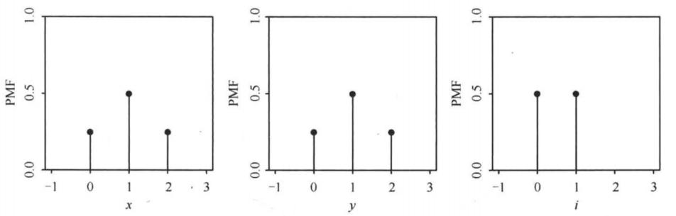
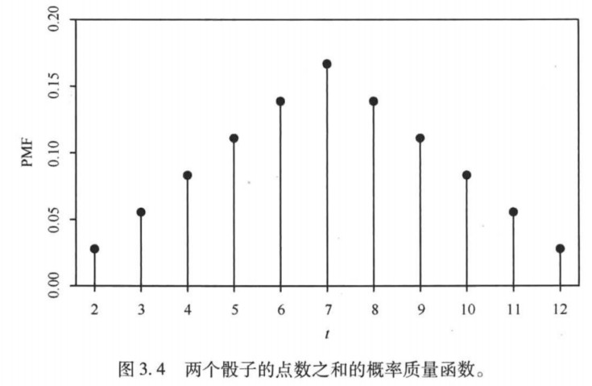
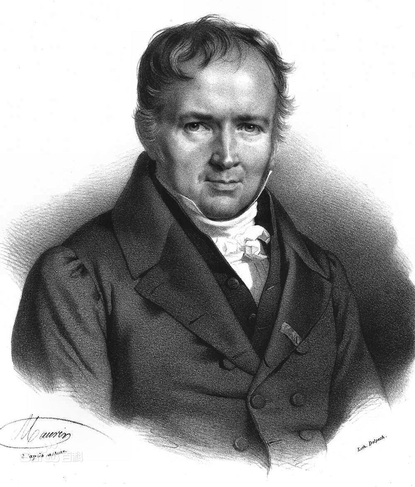
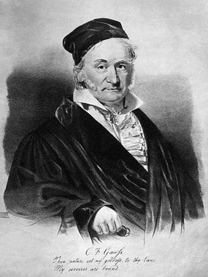
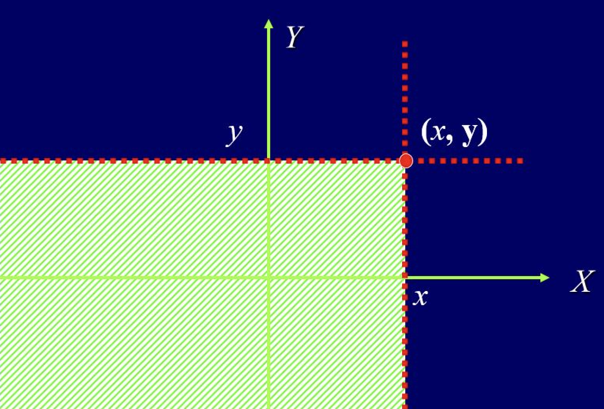
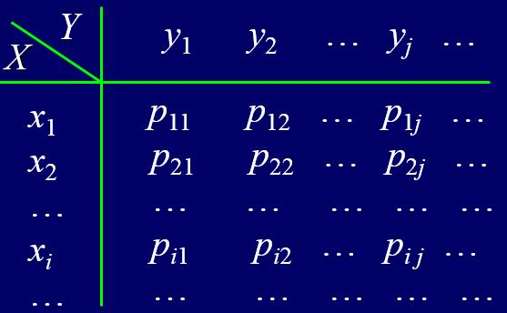
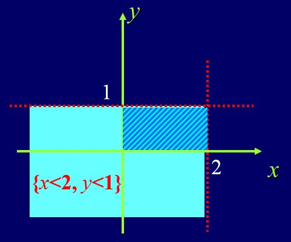
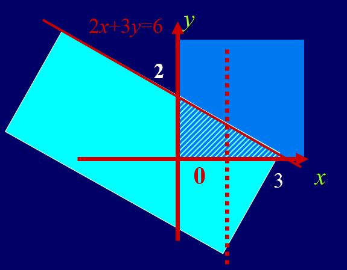
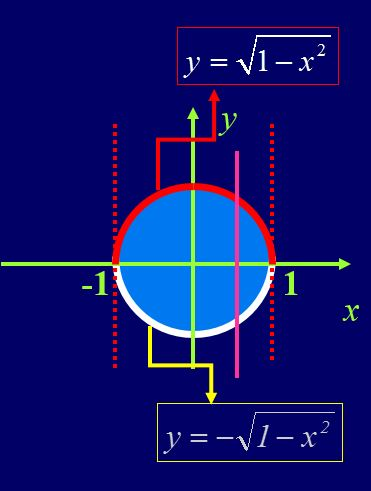
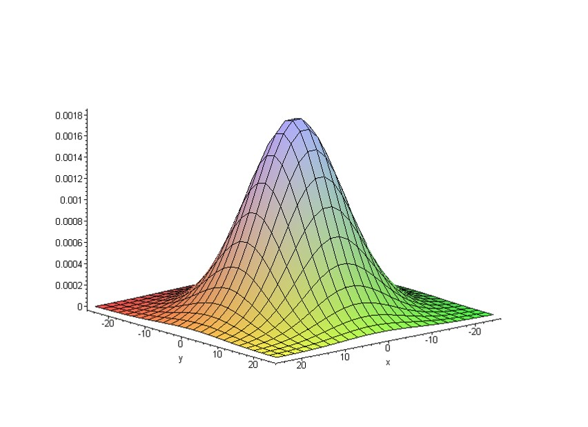

# 随机变量 {#sec-ch2-random-variables}

概率空间描述随机性的来源,随机变量则把这种随机性转化为可观察,可计算的数值.严格地说,随机变量是从样本空间到实数空间的可测映射;它通过原像把实数轴上的区间转化为事件.随机变量的分布是概率测度在该映射下的像测度,因此我们常常可以暂时忘记原样本空间,只研究分布本身.

本章先讨论一维随机变量及其分布函数,再考察常见离散分布和连续分布.随后把理论推广到随机向量,研究联合分布,边缘分布,条件分布与独立性,最后讨论随机变量函数的分布.贯穿本章的主线是:从随机机制识别分布,用分布计算概率,再通过变换产生新的分布.

## 本章学习目标 {#本章学习目标 .unnumbered}

- 理解随机变量的可测性以及分布函数为何能唯一确定分布;

- 能根据试验机制识别并使用常见离散分布和连续分布;

- 掌握联合分布,边缘分布和条件分布之间的关系;

- 能用分布分解判别随机变量的独立性;

- 能使用分布函数法,变量变换法和卷积公式求函数的分布.

## 随机变量与可测映射 {#sec-ch2-lecture-9}

::: {.callout-note appearance="simple" icon="false"}
## 本节导读

随机变量不是会随机变化的未知数,而是把样本点映射为实数的可测函数.借助这一映射,样本空间上的事件可转化为实数轴上的事件,从而能够使用分析工具研究随机现象;随机向量则同时记录多个数量特征.
:::

::: {.callout-tip appearance="simple" icon="false"}
## 理论主线

随机变量的定义包含两个不可分割的部分:它首先是样本空间上的实值函数,其次必须满足可测性.可测性保证对每个实数 $x$,集合 $\{\omega:X(\omega)\leq x\}$ 都属于事件域 $\mathcal F$,因而能够被概率测度 $P$ 赋值.若只说明函数的取值而不验证可测性,就尚未得到严格意义下的随机变量.

从映射观点看,研究 $X$ 的分布就是研究概率测度 $P$ 在 $X$ 下的像测度.随机向量同样是可测映射,只是值域由 $\mathbb R$ 换成 $\mathbb R^n$.这一观点把抽象样本空间与欧氏空间上的分析工具连接起来,也为后续的分布函数,密度和变量变换提供统一基础.
:::

### 随机变量的定义及性质

#### 随机变量的引入 {#随机变量的引入 .unnumbered}

考虑赌徒输光模型.设甲和乙的初始资金分别为 $i, a-i$ 元,每一局甲赢的概率为 $p$ 同时,在这一模型中,需要考察的问题包括:甲最终获胜的概率; 甲乙两人在任意时刻的剩余资产:$k$ 轮赌博后恰好剩下 $j$ 元; $k$ 轮赌博后甲乙两人资产的差额 $Z$; 赌博持续时间 $R$. 此外,为了准确描述这些问题,可以先作如下记号:$E:=${甲最终获胜 }, $Q_i:=P$(E); $A_{jk}:=${甲在 $k$ 轮赌博后恰好剩下 $j$ 元 }; $B_{jk}:=${乙在 $k$ 轮赌博后恰好剩下 $j$ 元 }; $k$ 轮赌博后甲乙两人资产的差额如何表示? 赌博持续时间 $R$ 如何表示? 如果仍然只用事件描述这些数量,记号会变得十分复杂;这正是引入随机变量的直接动机.

#### 随机变量的引入 {#随机变量的引入-1 .unnumbered}

令 $X_k$ 表示甲在 $k$ 轮赌博后的资产 其中,乙在 $k$ 轮赌博后的资产 $Y_k=a-X_k$; 资产差额:$Z=X_k-Y_k=2X_k-a$; 持续时间:$R=\min\{n: X_n=0, \text{或} Y_n=0\}$. 同时,$X_k$ 的取值具有以下特点:依赖于前面 $k$ 次赌博这一 随机试验 的结果; 在 随机试验 完成之前,$X_k$ 取值不确定,因此具有不确定性; $k$ 次赌博 随机试验 一旦完成,$X_k$ 的值必然确定; 记 $k$ 次赌博 随机试验 样本空间为 $\Omega$, 则给定 $\omega\in\Omega$, 则 $X_k$ 值确定. 此外,为说明上述关系,以 $k=2$ 为例考察 $X_2$ 的取值,设 $i\geq 2$ 具体为:$\Omega=\{\omega_1,\omega_2, \omega_3,\omega_4\}$, 其中 $\omega_1=(\text{胜,胜}), \omega_2=(\text{胜,败}), \omega_3=(\text{败,胜}), \omega_4=(\text{败,败})$; $X_2(\omega_1)=i+2,\  X_2(\omega_2)=X_2(\omega_3)=i,\  X_2(\omega_4)=i-2$. 相应地,$X_k$ 可以看作定义在样本空间 $\Omega$ 上的函数,即 $X_k:\Omega\rightarrow \{0, 1,\cdots, a\}$. 由此可见,一般地,随机变量可以看作从样本空间到实数的映射:$X:\Omega\rightarrow R$.

#### 随机变量的直观定义 {#随机变量的直观定义 .unnumbered}

::: {#def-ch2-001}
[(直观定义)]{style="color: cyan"} 称 $X$ 为随机变量,如果 $X$ 是从样本空间 $\Omega$ 到实数的映射,即 $X:\Omega\rightarrow R$.
:::

#### 一个随机变量的例子 {#一个随机变量的例子 .unnumbered}

::: {#exm-ch2-312}
考虑硬币抛掷两次的随机试验,其样本空间为 $$\Omega=\{HH,HT,TH,TT\}.$$

令$X$表示正面朝上的次数,则$X$是一个随机变量,相应的映射如下

$$X(TT)=0, X(HT)=X(TH)=1, X(HH)=2.$$ 令 $Y$ 表示反面朝上的次数,则 $Y=2-X$, 对于任意的 $\omega\in \Omega$, 有 $Y (\omega)=2-X (\omega)$. 设 $I$ 是由第一次掷硬币的结果决定的随机变量:若第一次硬币正面朝上则 $I=1$, 反之 $I=0$, 即

$$
\begin{aligned}
I(HH)=I(HT)=1,\quad I(TH)=I(TT)=0.
\end{aligned}
$$

 若正面记 1, 反面记 0, 此时 $\Omega=\{(1,1),(1,0),(0,1),(0,0)\}$. 上述的 $X,Y$ 和 $I$ 可表示为:$$X (\omega_1,\omega_2)=\omega_1+\omega_2,Y (\omega_1,\omega_2)=2-\omega_1-\omega_2,I (\omega_1,\omega_2)=\omega_1.$$
:::

#### 与函数对比分析 {#与函数对比分析 .unnumbered}

在数学分析中,函数 $f(x)$ 的定义域和值域通常带有距离结构 其中,$f (x):D\rightarrow R$, 其中 $D\subset R$; $R$ 上可定义距离 $d (x,y)=|x-y|$; 可根据距离 $d$ 定义函数的连续性 同时,与此不同,概率论中的随机变量 $X$ 建立在概率空间之上 其中,$X(\omega):\Omega\rightarrow R$; 定义域 $\Omega$ 没有距离的定义, 但有事件域 $\mathcal{F}$ 及定义其上的概率 $P$, 即具有结构 $(\Omega, \mathcal{F}, P)$; 值域 $R$ 有距离, 但因定义域无距离,故无法考虑随机变量的连续性; 值域 $R$ 还有 $\sigma$- 代数 $\mathcal{B}:=\mathcal{B}(R)$, 有可测空间结构 $(R,\mathcal{B})$. 此外,是否需要对 $X (\omega):\Omega\rightarrow R$ 做一些额外的限定,以便更好的研究 $X$? 相应地,从赌徒输光问题可以看出,对随机变量 $X$, 我们会关注 其中,$X (\omega)=x$ 的概率, $X (\omega)\leq x, X (\omega)\in [b,c]$ 的概率; 更一般的,$\forall B\in\mathcal{B}(R), X (\omega)\in B$ 的概率. 相应地,概率的定义域是 $\mathcal{F}$, 要想计算 $X (\omega)\in B$ 的概率,当且仅当 $$\forall B\in\mathcal{B}(R), \ X^{-1}(B):=\{\omega: X(\omega)\in B\}\in\mathcal{F}$$

#### 随机变量的严格数学定义 {#随机变量的严格数学定义 .unnumbered}

::: {#def-ch2-002}
设 $(\Omega,\mathcal{F})$ 和 $(E,\mathcal{E})$ 为两个可测空间并令 $X$ 为从样本空间 $\Omega$ 到 $E$ 的映射,即 $X (\omega):\Omega\rightarrow E$. 若对任意的 $B\in \mathcal{E}$ 均有

$$
\begin{aligned}
X^{-1}(B):=\{\omega: X(\omega)\in B\}\in \mathcal{F}
\end{aligned}
$$

 则称 $X$ 为 $(\Omega,\mathcal{F})$ 到 $(E,\mathcal{E})$ 的可测映射.
:::

若将上述定义中的可测空间 $(E,\mathcal{E})$ 更换为 $(R,\mathcal{B})$,则

::: {#def-ch2-rvdefi1}
设 $(\Omega,\mathcal{F})$ 是可测空间,$X$ 为从样本空间 $\Omega$ 到实数集 $R$ 的映射,即 $X (\omega):\Omega\rightarrow R$. 如果对 $\forall B\in \mathcal{B}$ 均有 $$X^{-1}(B):=\{\omega: X(\omega)\in B\}\in \mathcal{F}.$$ 则称 $X$ 为可测空间 $(\Omega,\mathcal{F})$ 上的可测函数或随机变量.
:::

::: {#def-ch2-rvdefi2}
设 $(\Omega,\mathcal{F})$ 是可测空间,$X$ 为从样本空间 $\Omega$ 到实数集 $R$ 的映射,即 $X (\omega):\Omega\rightarrow R$. 如果对任意的 $x\in R$ 均有

$$
\begin{aligned}
\{\omega: X (\omega)\le x\}\in \mathcal{F} \text{  或  }      \{\omega: X (\omega)< x\}\in \mathcal{F}
\end{aligned}
$$

 则称 $X (\omega)$ 是可测空间 $(\Omega,\mathcal{F})$ 上的随机变量,简称随机变量.
:::

#### 随机变量两种定义的等价性 {#随机变量两种定义的等价性 .unnumbered}

由 @def-ch2-rvdefi2 推出 @def-ch2-rvdefi1：仅需说明若 @def-ch2-rvdefi2 成立,则对任意 $B\in\mathcal{B}$ 均有 $$X^{-1}(B):=\{\omega:X(\omega)\in B\}\in \mathcal{F}.$$ 即只需说明以下集合包含关系成立即可

$$
\begin{aligned}
\mathcal{A}:=\{A:X^{-1}(A)\in \mathcal{F}\}\supset \mathcal{B}
\end{aligned}
$$

欲证上面包含关系成立,我们只需说明以下两点即可:

1.  $\mathcal{A}$ 是 $\sigma$ 代数;

2.  $O_1:=\{(-\infty,x]:x\in R\}\subset \mathcal{A}$.

再由 $\mathcal{B}:=\sigma (O_1)$ 知 $\mathcal{B}\subset \mathcal{A}$.

#### $\mathcal{A}:=\{A:X^{-1}(A)\in \mathcal{F}\}$ 为 $\sigma$ 代数 {#mathcalaax-1ain-mathcalf-为-sigma-代数 .unnumbered}

$X^{-1}(R)=\{\omega:X (\omega)\in R\}=\Omega\in \mathcal{F}$, 故 $R\in\mathcal{A}$; 若 $A\in\mathcal{A}$, 即 $X^{-1}(A)\in \mathcal{F}$, 则

$$
\begin{aligned}
X^{-1}(\overline{A})&=& \{\omega: X(\omega)\in \overline{A}\} =\{\omega:X(\omega)\notin A\}\\
                  &=& \overline{\{\omega:X(\omega)\in A\}}= \overline{X^{-1}(A)}\\  &\in&  \mathcal{F}
\end{aligned}
$$

 此外,对于 $A_j\in \mathcal{A}, j=1,2,\cdots,$ 有 $X^{-1}(A_j)\in \mathcal{F},j=1,2,\cdots.$ 从而

$$
\begin{aligned}
X^{-1}(\cup_{j=1}^\infty A_j)&=& \{\omega:X(\omega)\in\cup_{j=1}^\infty A_j\}
                  = \cup_{j=1}^\infty \{\omega:X(\omega)\in A_j\}\\
                  &=& \cup_{j=1}^\infty X^{-1}(A_j)\\  &\in&\mathcal{F}
\end{aligned}
$$

#### 随机变量的分类以及两个注记 {#随机变量的分类以及两个注记 .unnumbered}

随机变量 $X$ 是从样本空间 $\Omega$ 到实数 $R$ 的映射,故根据其值域集合可粗略的分为两大类 其中,离散型随机变量:其值域集合是有限点集或可数点集即 $$X(\Omega):=\{X(\omega):\omega\in \Omega\}=\{a_n\}_{n\geq 1}$$ 非离散型随机变量:其值域集合不是有限点集或可数点集.

::: {#rem-ch2-001}
随机变量的两点注记:

首先, 随机变量是确定性函数, 自身并没有随机性. 给定样本空间上的样本点, 有唯一确定的实数值与之相对应, 这种对应关系并没有不确定性. 所有的不确定性都体现在样本点是否在试验结果中出现, 和随机变量本身没有关系.随机变量的引入, 更多地是为了数学处理上的方便. 其次, 随机变量并不是概率论中独有的概念. 若将前面可测映射中的$(\Omega, \mathcal{F}), (E, \mathcal{E})$均取为$(R, \mathcal{B}(\mathbb{R}))$, 则可测映射的定义便退化为实分析中的 可测函数. 随机变量是一特殊的可测函数.
:::

#### 示性随机变量 {#示性随机变量 .unnumbered}

::: {#exm-ch2-002}
设 $\Omega$ 是某随机试验的样本空间,$\mathcal{F}$ 为其事件域 ($\sigma$ 代数),则对于任意的 $A\in \mathcal{F}$, 示性函数 $I_A(\omega):=\left\{
            \begin{array}{ll}
                0, & \omega\notin A \\
                1, & \omega\in A
            \end{array}\right.$ 是随机变量.
:::

**解.** 由示性函数的定义知:

$$
\begin{aligned}
\{\omega:I_A(\omega)\le x\}=\left\{
        \begin{array}{ll}
             \emptyset, & x<0,        \\
            \overline{A},     & x\in [0,1), \\
            \Omega,           & x\ge 1.
        \end{array}
        \right.
\end{aligned}
$$

显然,无论 $x$ 取何值,均有 $\{\omega:I_A (\omega)\le x\}\in \mathcal{F}$

#### 随机变量的性质 {#随机变量的性质 .unnumbered}

::: {#thm-ch2-001}
若 $X,Y, \{X_n,n\ge 1\}$ 都为概率空间 $(\Omega,\mathcal{F},P)$ 上的随机变量,则

1.  $|X|$,$aX+bY,(a,b\in R)$ 均为随机变量;

2.  $X^+:=X\vee 0, X^-:=(-X)\vee 0$ 均为随机变量;

3.  $XY$ 为随机变量;

4.  若 $X/Y$ 处处有意义,则 $X/Y$ 为随机变量;

5.  $\inf_{n} X_n,\sup_nX_n, \liminf_{n\rightarrow\infty} X_n, \limsup_{n\rightarrow\infty} X_n$ 均为随机变量.
:::

**证明.** 

1.  首先,$\{\omega:|X|<x\}=\{\omega:-x<X<x\}=\{\omega:X<x\}\cap\overline{\{\omega:X\le -x\}}\in \mathcal{F}$; 接着,$\{\omega:aX<x\}=\{\omega:X<\dfrac{x}{a}\}\in \mathcal{F}$, (当 $a>0$ 时); 设 $Q$ 为有理数集,则

$$
\begin{aligned}
\{\omega:X+Y<x\}&=& \{\omega:X<x-Y\}= \cup_{r\in Q}\{\omega:X<r<x-Y\}\\
                                &=& \cup_{r\in Q}\{\omega:X<r,Y<x-r\}\\
                                &=& \cup_{r\in Q}(\{\omega:X<r\}\cap \{\omega:Y<x-r\})\\
                                &\in& \mathcal{F}
\end{aligned}
$$

 最后,$aX+bY$ 为随机变量显然.

<!-- -->

1.  注意到 $X^+=\dfrac{|X|+X}{2}, X^-=\dfrac{|X|-X}{2}$,易得 $X^+,X^-$ 均为随机变量;

2.  首先假定 $X,Y$ 非负, 则对任意的 $x>0$ 有

$$
\begin{aligned}
\{XY<x\}&=& \{X=0\}\cup \{Y=0\}\cup \left(\cup_{r\in Q_+}\left[\{X<r\}\cap \{Y<\frac{x}{r}\}\right]\right)\\
                      &\in&\mathcal{F}.
\end{aligned}
$$

    对一般的 $X,Y$, 由 $X^+,X^-,Y^+,Y^-$ 为随机变量,可得

$$
\begin{aligned}
XY=(X^+-X^-)(Y^+-Y^-)=(X^+Y^++X^-Y^-)-(X^+Y^-+X^-Y^+)
\end{aligned}
$$

 为随机变量.

3.  设 $|Y|>0$ 处处成立,易证 $\dfrac{1}{Y}$ 是随机变量, 故 $\dfrac{X}{Y}=X\cdot \dfrac{1}{Y}$ 为随机变量.

4.  对任意的 $x\in R$, 我们有

$$
\begin{aligned}
\{\inf_nX_n<x\}=\cup_n\{X_n<x\}, \quad \{\sup_nX_n\le x\}=\cap_n\{X_n\le x\}
\end{aligned}
$$

#### 简单随机变量 {#简单随机变量 .unnumbered}

::: {#exm-ch2-003}
设 $(\Omega,\mathcal{F},P)$ 为一概率空间,$A_i\in\mathcal{F}, i=1,\cdots,n$ 为 $\Omega$ 的一个分割,$a_i,i=1,\cdots, n$ 为 $n$ 个不同的实数,则

$$
\begin{aligned}
X(\omega):=\sum_{i=1}^na_iI_{A_i}(\omega)
\end{aligned}
$$ {#eq-ch2-simplerv}

 作为 $n$ 个示性随机变量的线性组合,仍为随机变量.我们称形如 @eq-ch2-simplerv  的 $X (\omega)$ 为简单随机变量.
:::

#### 随机变量的函数是否仍为随机变量? {#随机变量的函数是否仍为随机变量 .unnumbered}

::: {#thm-ch2-002}
设 $X$ 是可测空间 $(\Omega,\mathcal{F})$ 上的随机变量,$g (x)$ 为 $(R,\mathcal{B})\rightarrow (R,\mathcal{B})$ 上的Borel可测函数,证 $Y:=g (X)$ 为 $(\Omega,\mathcal{F})$ 上的随机变量.
:::

**证明.** 注意到,对任意的 $B\in \mathcal{B}$, $g^{-1}(B)\in \mathcal{B}$, 故

$$
\begin{aligned}
Y^{-1}(B) & = \{\omega:Y(\omega)\in B\}         \\
                  & = \{\omega:g(X(\omega))\in B\}      \\
                  & = \{\omega:X(\omega)\in g^{-1}(B)\} \\
                  & = X^{-1}(g^{-1}(B))                 \\
                  & \in  \mathcal{F}
\end{aligned}
$$

#### 随机变量的结构 {#随机变量的结构 .unnumbered}

对于 $(\Omega,\mathcal{F},P)$ 上的任意非负随机变量 $X$ 及自然数 $n$,我们可将 $\Omega$ 按 $X$ 的取值进行分割.即令

$$
\begin{aligned}
A_k(\omega)&:=& \{\omega:\frac{k}{2^n}\le X(\omega)<\frac{k+1}{2^n}\}, k=0,1,\cdots, n2^n-1\\
        A_{n2^n}(\omega)&:=& \{\omega:X(\omega)\ge n\}
\end{aligned}
$$

 则

$$
\begin{aligned}
X_n(\omega):=\sum_{k=0}^{n2^n}\frac{k}{2^n}I_{A_k}(\omega)
\end{aligned}
$$

 为简单随机变量且随机变量序列 $\{X_n,n\ge 1\}$ 满足

$$
\begin{aligned}
0\le X_1(\omega)\le X_2(\omega)\le \cdots\le X_n(\omega)\rightarrow X(\omega)
\end{aligned}
$$

#### $X_n (\omega)$ 的单调性 {#x_n-omega-的单调性 .unnumbered}

注意到对任意的 $k=0,1,\cdots,n2^n-1$,

$$
\begin{aligned}
A_k(\omega)&=& \{\omega:\frac{k}{2^n}\le X(\omega)<\frac{k+1}{2^n}\}= \{\omega:\frac{2k}{2^{n+1}}\le X(\omega)<\frac{2(k+1)}{2^{n+1}}\}\\
        &=& \{\omega:\frac{2k}{2^{n+1}}\le X(\omega)<\frac{2k+1}{2^{n+1}}\}\cup \{\omega:\frac{2k+1}{2^{n+1}}\le X(\omega)<\frac{2k+2)}{2^{n+1}}\}\\
        &=& A_k^1(\omega)\cup A_k^2(\omega)
\end{aligned}
$$

 故在集合 $A_k (\omega),k=0,1,\cdots,n2^n-1$ 上,

$$
\begin{aligned}
X_{n+1}(\omega)=
        \left\{\begin{array}{ll}
              \frac{2k}{2^{n+1}},   & \omega\in A_k^1(\omega)  \\
                                          &                          \\
              \frac{2k+1}{2^{n+1}}, & \omega\in A_k^2(\omega)
        \end{array}
        \right.  (\textcolor{red}{\ge \frac{k}{2^n}=X_n(\omega)})
\end{aligned}
$$

而在 $A_{n2^n}(\omega):=\{\omega:X (\omega)\ge n\}=\{\omega:X (\omega)\ge \frac{n2^{n+1}}{2^{n+1}}\}$ 上,显然有 $$X_{n+1}(\omega)\ge n=X_n(\omega).$$

#### $X_n (\omega)$ 的收敛性 {#x_n-omega-的收敛性 .unnumbered}

注意到,对任意的 $\omega$, 必定存在 $k$ 使得

$$
\begin{aligned}
\frac{k}{2^n}\le X(\omega)<\frac{k+1}{2^n},
\end{aligned}
$$

 从而

$$
\begin{aligned}
0\le X(\omega)-X_n(\omega)\le \frac{1}{2^n}
\end{aligned}
$$

 显然有

$$
\begin{aligned}
\lim_{n\rightarrow \infty}X_n(\omega)=X(\omega).
\end{aligned}
$$

#### 随机变量的简单随机逼近 {#随机变量的简单随机逼近 .unnumbered}

::: {#thm-ch2-003}
对 $(\Omega,\mathcal{F},P)$ 上的实值变量 $X (\omega)$ 为随机变量的充要条件是:存在简单随机变量序列 $\{X_n (\omega),n\ge 1\}$ 使得

$$
\begin{aligned}
\lim_{n\rightarrow \infty}X_n(\omega)=X(\omega), \quad \forall \omega\in \Omega
\end{aligned}
$$

 而且当 $X$ 非负时,还可选取 $\{X_n (\omega),n\ge 1\}$ 为非负单调不减的简单随机变量序列.
:::

#### 随机变量的生成$\sigma$-代数 {#随机变量的生成sigma-代数 .unnumbered}

::: {#def-ch2-005}
设$X$为定义在$(\Omega,\mathcal{F})$上的随机变量并令 $\mathcal{F}_X:=\{X^{-1}(A):A\in \mathcal{B}(\mathbb{R})\}$. 我们称$\sigma(X):=\sigma\left(\mathcal{F}_{X}\right)$为随机变量$X$的生成$\sigma$-代数.
:::

::: {#def-ch2-006}
设$X_k, k=1,2,\cdots, n$为定义在$(\Omega,\mathcal{F})$上的随机变量并令 $\mathcal{F}_{X_k}:=\{X_k^{-1}(A):A\in \mathcal{B}(\mathbb{R})\}$. 我们称$$\sigma(X_1,X_2,\cdots,X_n):=\sigma\left(\cup_{k=1}^n\mathcal{F}_{X_k}\right)$$为随机变量$X_1,X_2,\cdots,X_n$的生成$\sigma$-代数.
:::

$\mathcal{F}_{X}, \mathcal{F}_{X_k}$均为$\sigma$-代数, 但$\cup_{k=1}^n\mathcal{F}_{X_k}$不一定是$\sigma$-代数, 因此 $$\sigma(X)=\mathcal{F}_X, \quad \text{ 但  } \quad  \sigma(X_1,X_2,\cdots,X_n)\neq \cup_{k=1}^n\mathcal{F}_{X_k}.$$ 若$X$是$(\Omega,\mathcal{F})$上的随机变量,则必有$\sigma(X):=\mathcal{F}_X\subset\mathcal{F}$, 即$\sigma(X)$是$\Omega$上使得$X$成为随变量所需要的最小$\sigma$-代数. 此外,类似的, $\sigma(X_1,X_2,\cdots,X_n)$是$\Omega$上使得$X_1,X_2,\cdots,X_n$为随机变量所需要的最小$\sigma$-代数. 相应地,随机变量$X$生成的$\sigma-$代数$\sigma(X)$集中体现了$X$的取值信息.

#### 两个随机变量之间的关系 {#两个随机变量之间的关系 .unnumbered}

::: {#def-ch2-007}
考虑两个随机变量$X, Y$,如果对任意的$B\in\mathcal{B}(\mathbb{R})$均有 $$Y^{-1}(B) \in \sigma(X),\ \text{等价的}\ \sigma(Y)\subset \sigma(X).$$则称$Y$适应(adaptive to) $X$.
:::

::: {#thm-ch2-004}
考虑可测空间$(\Omega, \mathcal{F})$, $X$和$Y$为定义其上的随机变量. 若$Y$适应$X$, 则存在可测函数$g: \mathbb{R} \rightarrow \mathbb{R}$, 使得 $$Y(\omega)=g(X(\omega)),  \ \forall \omega \in \Omega .$$
:::

::: {#rem-ch2-002}
随机变量的生成$\sigma$-代数研究随机变量间关系起着重要作用. 同时,直观地看,$Y$适应$X$, 意味着$Y$包含的信息被$X$包含的信息所涵盖. 换句话说,$Y$和$X$间存在导出关系.
:::

### 随机向量

#### 随机向量: 如何定义$\mathcal{B}(\mathbb{R}^n)$ {#随机向量-如何定义mathcalbmathbbrn .unnumbered}

直观上来讲, 随机向量就是取值于$\mathbb{R}^n$的随机变量. 如何定义$\mathcal{B}(\mathbb{R}^n)$ 其中,注意到$$\mathbb{R}^n:=\mathbb{R}\times \mathbb{R}\times\cdots\times \mathbb{R}=\Pi_{k=1}^n\mathbb{R}$$ 我们希望 $$\mathcal{B}(\mathbb{R}^n)=\mathcal{B}(\mathbb{R})\times \mathcal{B}(\mathbb{R})\times\cdots\times\mathcal{B}(\mathbb{R})=\Pi_{k=1}^n\mathcal{B}(\mathbb{R})$$ 但$\Pi_{k=1}^n\mathcal{B}(\mathbb{R})$不是$\sigma$-代数.; 因此, 定义 $$\mathcal{B}(\mathbb{R}^n):=\sigma(\mathcal{B}(\mathbb{R})\times \mathcal{B}(\mathbb{R})\times\cdots\times\mathcal{B}(\mathbb{R}))=\sigma(\Pi_{k=1}^n\mathcal{B}(\mathbb{R}))$$ 我们也可以类比$\mathcal{B}(\mathbb{R})$的定义方法, 先定义$\mathbb{R}^n$上的立方体 $$I=I_1\times I_2\times\cdots\times I_n=\Pi_{k=1}^nI_k, \ I_k=(a_k, b_k].$$ 然后定义$\mathcal{B}(\mathbb{R}^n)$为: $$\mathcal{B}(\mathbb{R}^n):=\sigma(\{I:I\text{为}\mathbb{R}^n\text{上的立方体}\}).$$

#### 随机向量 {#随机向量-1 .unnumbered}

::: {#def-ch2-008}
考虑可测空间$(\Omega,\mathcal{F})$, 若映射$X: \Omega \rightarrow \mathbb{R}^{n}$使得对任意的$B \in \mathcal{B}(\mathbb{R}^{n})$均有 $$X^{-1}(B) \in \mathcal{F}$$ 则称$X$为$n$维随机向量.
:::

::: {#rem-ch2-003}
若记$X=(X_1, X_2,\cdots, X_n)$, 则$X$为$n$维随机向量当且仅当$X_k, k=1,\cdots,n$为随机变量.
:::

::: {#def-ch2-009}
考虑可测空间$(\Omega,\mathcal{F})$以及映射$Z$ $$Z(\omega)=X(\omega)+\mathrm{i} Y(\omega) \in \mathbb{C}$$ 其中$\mathrm{i}=\sqrt{-1}$是虚数单位. 如果$(X(\omega), Y(\omega))$构成二维随机向量, 则称$Z$为复随机变量.
:::

## 分布函数与分布类型 {#sec-ch2-lecture-10}

::: {.callout-note appearance="simple" icon="false"}
## 本节导读

分布函数 $F(x)=P(X\le x)$ 完整编码实值随机变量的概率规律,并且不依赖样本空间的具体表示.本节从分布函数的基本性质出发,比较离散型,连续型及一般分布,并讨论给定分布能否构造相应随机变量.
:::

::: {.callout-tip appearance="simple" icon="false"}
## 理论主线

分布函数 $F_X(x)=P(X\leq x)$ 记录半直线 $(-\infty,x]$ 的概率.由于这些半直线生成 $\mathbb R$ 上的 Borel $\sigma$-代数,分布函数能够唯一确定 $X$ 的分布.它必须满足单调不减,右连续以及在正负无穷处分别趋于 $1$ 和 $0$;反之,满足这些条件的函数都对应某个概率分布.

离散型和连续型只是两类重要而非穷尽一切的分布.离散分布由点质量描述,绝对连续分布由密度描述,一般分布还可能同时含有跳跃部分与连续部分.计算时应区分分布函数,概率质量函数和概率密度:密度值本身不是概率,点处的分布函数跳跃量才等于相应点概率.
:::

#### 分布与分布函数 {#分布与分布函数 .unnumbered}

::: {#thm-ch2-005}
设 $X$ 为 $(\Omega,\mathcal{F},P)$ 上的随机变量,对于 Borel 集 $B$, 定义集函数 $\mathbf{F}(B)$ 如下:

$$
\begin{aligned}
\mathbf{F}(B):=P(X^{-1}(B))=P\circ X^{-1}(B)=P(X\in B)
\end{aligned}
$$ {#eq-ch2-rvprob}

 则 $\mathbf{F}(\cdot)$ 为 $(R,\mathcal{B})$ 上的概率,称之为随机变量 $X$ 的诱导概率测度.
:::

::: {#def-ch2-010}
称由 @eq-ch2-rvprob  式定义在 $(R,\mathcal{B})$ 上的概率测度 $\mathbf{F}(\cdot)$ 为随机变量 $X$ 的概率分布,简称分布.
:::

给定概率空间 $(\Omega,\mathcal{F},P)$,任给随机变量均可在 $(R,\mathcal{B})$ 上诱导出一个概率测度.由此可见,在同一个可测空间上可以定义不同的概率测度. 同时,对于任意的 $B\in \mathcal{B}$,随机变量 $X$ 落入 $B$ 中的概率可通过 $B$ 的概率测度 $\mathbf{F}(B)$ 得出.这也就是说,概率分布 $\mathbf{F}(\cdot)$ 完全刻画了随机变量 $X$ 取值的概率规律.

#### 随机变量的分布函数 {#随机变量的分布函数 .unnumbered}

如果我们将 $(R,\mathcal{B})$ 上的测度仅局限于集类 $\mathcal{P}:=\{(-\infty,x],x\in R\}$ 上,由于 $\mathcal{P}$ 中的每条半直线被它的右端点 $x$ 所决定,于是集函数 $F$ 就化为 $R$ 上的点函数.

::: {#def-ch2-011}
对于随机变量 $X$ 而言,称 $x$ 的函数

$$
\begin{aligned}
F(x):=\mathbf{F}((-\infty,x])=P(X\le x)
\end{aligned}
$$

 为 $X$ 的概率分布函数或累积分布函数,简称分布函数并记作 $X\sim F (x)$, 有时也以 $F_X (x)$ 表明是 $X$ 的分布函数.
:::

::: {#rem-ch2-004}
也有一些教材按如下方式定义分布函数:

$$
\begin{aligned}
F(x):=\mathbf{F}((-\infty,x))=P(X<x)
\end{aligned}
$$

:::

#### 分布函数的性质 {#分布函数的性质 .unnumbered}

::: {#thm-ch2-006}
任一分布函数 $F (x)$ 都具有以下三条基本性质

1.  单调性非降性:$F (x)$ 是单调非减函数即对任意的 $x_1<x_2$, 有 $F (x_1)\le F (x_2)$;

2.  右连续性:$F (x)$ 是 $x$ 的右连续函数,即

$$
\begin{aligned}
F(x_0)=F(x_0+):=\lim_{x\rightarrow x_0+}F(x)
\end{aligned}
$$

3.  规范性:对任意的 $x$ 有,$0\le F (x)\le 1$ 且

$$
\begin{aligned}
F(-\infty)=\lim_{x\rightarrow-\infty}F(x)=0\\
                          F(+\infty)=\lim_{x\rightarrow +\infty}F(x)=1
\end{aligned}
$$

:::

::: {#rem-ch2-005}
在函数论中, 我们一般不从随机变量出发来定义分布函数, 而是直接定义满足上面三条性质的函数为分布函数.
:::

#### 分布函数性质的证明 {#分布函数性质的证明 .unnumbered}

1.  对任意的 $x<y$, $F (y)-F (x)=P (x< X\le y)\ge 0$;

2.  因 $F (x)$ 是单调有界非降函数,所以其任一点 $x_0$ 的右极限 $F (x_0+)$ 必存在,为证其连续性,只需证对单调上下降且收敛至 $x_0$ 的数列 $\{x_n\}$ 有 $\lim_{n\rightarrow\infty} F (x_n)=F (x_0)$ 即可.注意到

$$
\begin{aligned}
\lim_{n\rightarrow\infty}F(x_n)&=& \lim_{n\rightarrow\infty}P(X\le x_n)= P(\cap_{n=1}^\infty \{X\le x_n\})= P(X\le x_0)\\
                      &=&F(x_0)
\end{aligned}
$$

3.  由 $F$ 的单调性及概率的连续性可知

$$
\begin{aligned}
F(+\infty)&=& \lim_{n\rightarrow +\infty}F(n)=\lim_{n\rightarrow +\infty}P(X\le n)\\
                      &=& P(\cup_{n=1}^\infty \{X\le n\})=P(X<\infty)=1
\end{aligned}
$$

 同理可证 $F (-\infty)=0$.

#### 事件概率的分布函数表示 {#事件概率的分布函数表示 .unnumbered}

- $P(X> b)=1-F(b)$;

- $P(a< X\le b)=F(b)-F(a)$;

- $P(X<a)=F(a-)$;

- $P(X=a)=F(a)-F(a-)$;

- $P(X\ge b)=1-F(b-)$;

- $P(a\le X<b)=F(b-)-F(a-)$;

- $P(a\le X\le b)=F(b)-F(a-)$;

- $P(a< X<b)=F(b-)-F(a)$;

- 对于不交区间并: $P (X\in \cup_{i=1}^n (a_i,b_i])=\sum_{i=1}^n [F (b_i)-F (a_i)]$;

- 一般的,$P (X\in B)=\int_BdF (x)$.

#### 随机变量与其分布(函数)之间的关系 {#随机变量与其分布函数之间的关系 .unnumbered}

分布函数是随机变量最基本的性质,也是对随机变量概率特性最全面的描述.为清晰起见,通常记随机变量 $X$ 的分布函数为 $F_{X}(x)$. 同时,分布函数和随机变量密不可分. 每个随机变量都有自己的分布函数; 反过来, 每个分布函数都能找到与之相对应的随机变量. 此外,尽管随机变量与其分布函数密切关联,但是两者间并没有一一对应关系.一个随机变量只能有唯一的分布函数, 不同的随机变量却可能具有相同的分布函数.

::: {#exm-ch2-004}
考虑随机变量 $X$, 其分布满足 $$P(X=1)=P(X=-1)=\frac{1}{2}.$$ 设随机变量 $Y=-X$, 那么 $Y$ 的分布为 $$P(Y=1)=P(Y=-1)=\frac{1}{2}$$ 显然, $X$和$Y$的分布函数完全相同, 但明显是两个不同的随机变量.
:::

#### 分布函数表示与Borel域上概率测度之间的关系 {#分布函数表示与borel域上概率测度之间的关系 .unnumbered}

::: {#thm-ch2-007}
任给一个定义在 Borel 域 $\mathcal{B}(\mathbb{R})$ 上的概率 $\bar{P}$, 都存在如下定义的分布函数 $F$ 与之相对应:$F(x)=\bar{P}((-\infty, x])$. 反过来, 任给一个定义于实数轴上的分布函数 $F$, 都存在定义在 Borel 域 $\mathcal{B}(\mathbb{R})$ 上的概率 $\bar{P}$ 与之相对应.
:::

**证明.** 第一个结论可直接验证. 由概率的单调性, 若$x_{1} \leqslant x_{2}$, 则 $$\bar{P}\left(\left(-\infty, x_{1}\right]\right) \leqslant \bar{P}\left(\left(-\infty, x_{2}\right]\right)\Rightarrow F\left(x_{1}\right) \leqslant F\left(x_{2}\right),$$从而得到 $F$ 的单调不减. 再由概率的连续性,

$$
\begin{aligned}
\lim _{x_{n} \downarrow x}\left(-\infty, x_{n}\right]=(-\infty, x]
    &\Rightarrow&  \lim _{x_{n} \downarrow x} \bar{P}\left(\left(-\infty, x_{n}\right]\right)=\bar{P}((-\infty, x]) \\
    &\Rightarrow&  \lim _{x_{n} \downarrow x} F\left(x_{n}\right)=F(x)
\end{aligned}
$$

定理的第二个结论本质上是概率扩张. 根据测度扩张定理,由分布函数所确定的定义在 $\mathcal{P}$ 上的集函数 $\mathbf{F}((-\infty, x]):=F (x)$ 可以唯一的扩张到 $\mathcal{B}:=\sigma (\mathcal{P})$ 上,成为 $\mathcal{B}$ 上的概率测度. 扩张后的概率测度称之为分布函数 $F (x)$ 所引出的勒贝格 - 斯蒂尔吉斯测度.实际上这个 $\mathbf{F}$ 正好是我们前面引进的概率分布.

### 随机变量分布类型

#### 离散型随机变量及分布 {#离散型随机变量及分布 .unnumbered}

::: {#def-ch2-012}
如果随机变量 $X$ 只取有限个值 $x_1,x_2,\cdots, x_n$ 或可列个值 $x_1,x_2,\cdots,$ 就称 $X$ 为离散型随机变量,简称离散随机变量,其分布函数称之为离散型的.
:::

::: {#def-ch2-013}
对于离散型随机变量 $X$, 称 $X$ 取值 $x_k$ 的概率

$$
\begin{aligned}
p_k:=p(x_k)=P(X=x_k), k=1,2,\cdots,
\end{aligned}
$$

 为 $X$ 的概率分布列或简称为分布列,记 $X\sim \{p_k\}$. 分布列也常用下面的矩阵来表示

$$
\begin{aligned}
\left(\begin{array}{ccccc}
                x_1, & x_2, & \cdots, & x_k, & \cdots  \\
                p_1, & p_2, & \cdots, & p_k, & \cdots
            \end{array}\right)
\end{aligned}
$$

:::

容易验证,分布列有以下性质

1.  非负性:$p_k\ge 0, k=1,2,\cdots$;

2.  正则性:$\sum_{k} p_k=1$

#### 离散型随机变量的概率分布及其分布函数 {#离散型随机变量的概率分布及其分布函数 .unnumbered}

由概率分布的定义,对任意的 $B\in \mathcal{B}$,我们有

$$
\begin{aligned}
\mathbf{F}(B)&=&P(X\in B)=P(\cup_{k:x_k\in B}\{X=x_k\})\\
                  &=&\sum_{k:x_k\in B}P(X=x_k)=\sum_{k:x_k\in B}p_k
\end{aligned}
$$

 由分布函数的定义知,

$$
\begin{aligned}
F(x)&=&P(X\le x)=P(\cup_{k:x_k\le x}\{X=x_k\})\\
                  &=&\sum_{k:x_k\le x}P(X=x_k)=\sum_{k:x_k\le x}p_k\\
                  &=&\sum_{k=1}^\infty p_kU(x-x_k)
\end{aligned}
$$

 此处, $U(x)=\left\{\begin{array}{ll}
                1, & x\geq 0,\\
                0, & x<0,
                \end{array}\right.$为阶跃函数. 此外,易见离散型随机变量 $X$ 的分布函数是一个纯跳跃函数:在 $X$ 的每个可能取值 $x_k$ 上有跃度 $p_k$, 在每个不含 $x_k$ 的区间上恒取常值.

#### 退化随机变量 {#退化随机变量 .unnumbered}

::: {#exm-ch2-005}
常数 $c$ 可看作仅取一个值的随机变量 $X$, 即

$$
\begin{aligned}
P(X=c)=1
\end{aligned}
$$

 这个分布常称为 [单点分布]{style="color: red"} 或 [退化分布]{style="color: red"},其分布函数为

$$
\begin{aligned}
F(x)=\left\{
            \begin{array}{ll}
                0, & x<c     \\
                1, & x\ge c
            \end{array}
            \right.
\end{aligned}
$$

:::

::: {#exm-ch2-006}
计算 @exm-ch2-312 中的所有随机变量的分布列或概率质量函数.

$X$ 表示正面朝上的次数,其概率质量函数 $p_X$ 为:

$$
\begin{aligned}
& p_X(0)=P(X=0)=1/4,\quad p_X(1)=P(X=1)=1/2,             \\
                       & p_X(2)=P(X=2)=1/4,\quad p_X(x)=P(X=x)=0, x\neq 0,1,2.
\end{aligned}
$$

同时,$Y=2-X,$ 表示反面朝上的次数.注意到 $$P(Y=y)=P(2-X=y)=P(X=2-y)=p_X(2-y),$$ 因此,随机变量 $Y$ 的概率质量函数为

$$
\begin{aligned}
& p_Y(0)=P(Y=0)=1/4,\quad p_Y(1)=P(Y=1)=1/2,             \\
                       & p_Y(2)=P(Y=2)=1/4,\quad p_Y(y)=P(Y=y)=0, y\neq 0,1,2.
\end{aligned}
$$

此外,$I$ 表示第一次是否正面朝上的示性随机变量.

$$
\begin{aligned}
& p_I(0)=P(I=0)=1/2,\quad p_I(1)=P(I=1)=1/2, \\
                       & p_I(i)=P(I=i)=0, i\neq 0,1.
\end{aligned}
$$

:::

#### $X,Y$ 和 $I$ 的概率质量函数图 {#xy-和-i-的概率质量函数图 .unnumbered}

{fig-align="center" width="12cm"}

::: {#exm-ch2-007}
掷两颗骰子,其样本空间 $\Omega$ 含有 36 个等可能的样本点

$$
\begin{aligned}
\Omega=\{(x,y):x,y=1,2,\cdots,6\}
\end{aligned}
$$

 令 $X$ 和 $Y$ 表示每个骰子分别出现的点数.试求下面随机变量的分布列:

1.  $T_1:=X+Y=\text{骰子点数之和}$;

2.  $T_2:=14-(X+Y)$;

3.  $T_3:=\text{点数为 6 点的骰子的个数}$;

4.  $T_4:=\max\{X, Y\}=\text{骰子的最大点数}$
:::

- $T_1, T_2$ 的概率分布列为

$$
\begin{aligned}
\left(\begin{array}{ccccccccccc}
                        2            & 3            & 4            & 5            & 6            & 7            & 8            & 9            & 10           & 11           & 12           \\
                        \frac{1}{36} & \frac{2}{36} & \frac{3}{36} & \frac{4}{36} & \frac{5}{36} & \frac{6}{36} & \frac{5}{36} & \frac{4}{36} & \frac{3}{36} & \frac{2}{36} & \frac{1}{36}
                    \end{array}\right)
\end{aligned}
$$

{fig-align="center" width="9cm"}

$T_3$ 的概率分布列为

$$
\begin{aligned}
\left(\begin{array}{ccc}
                      0             & 1             & 2            \\
                      \frac{25}{36} & \frac{10}{36} & \frac{1}{36}
                  \end{array}\right)
\end{aligned}
$$

 同时,$T_4$ 的概率分布列为

$$
\begin{aligned}
\left(\begin{array}{cccccc}
                      1            & 2            & 3            & 4            & 5            & 6             \\
                      \frac{1}{36} & \frac{3}{36} & \frac{5}{36} & \frac{7}{36} & \frac{9}{36} & \frac{11}{36}
                  \end{array}\right)
\end{aligned}
$$

#### 连续型随机变量及分布 {#连续型随机变量及分布 .unnumbered}

::: {#def-ch2-014}
设 $X$ 为一随机变量,$F (x)$ 为随机变量 $X$ 的分布函数,如果存在非负可积函数 $p (x)$ 使得

$$
\begin{aligned}
F(x)=\int_{-\infty}^xp(y)dy
\end{aligned}
$$ {#eq-ch2-contrvdist}

 则称 $X$ 为连续型随机变量,其分布函数称之为连续型分布函数,函数 $p (x)$ 称为 $X$ 的概率密度函数,简称密度函数或密度.
:::

::: {#rem-ch2-006}
能够表为 @eq-ch2-contrvdist  式变上限积分的函数 $F (x)$ 在分析中称为绝对连续函数.绝对连续函数必为连续函数. 同时,在若干个点上或零测集上改变密度函数 $p (x)$ 的值并不影响其积分的值,从而不影响分布函数 $F (x)$ 的值,这意味着连续分布的密度函数不唯一.
:::

#### 密度函数的性质 {#密度函数的性质 .unnumbered}

容易验证,随机变量 $X$ 的密度函数有以下性质

1.  非负性:$p (x)\ge 0$;

2.  正则性:$\int_{-\infty}^\infty p (x) dx=1$.

#### 连续型随机变量分布的一些常见性质 {#连续型随机变量分布的一些常见性质 .unnumbered}

$p(x)=F^\prime (x)$; 同时,$P(a< X\le b)=F(b)-F(a)=\int_a^bp(x)dx$; 此外,$0\le P (X=a)\le P (X\in (a-\epsilon,a))=\int_{a-\epsilon}^ap (x) dx\stackrel{\epsilon\rightarrow 0}{\longrightarrow} 0$, 故 $P (X=a)=0$,即连续型随机变量取值单点的概率为 0; 相应地,$P(a<X\le b)=P(a\le X<b)=P(a\le X\le b)=P(a<X<b)$; 相应地,对任意的 Borel 集 $B$,

$$
\begin{aligned}
P(X\in B)=\int_Bp(x)dx
\end{aligned}
$$

 相应地,$P(X\in[x,x+\Delta x])=\int_x^{x+\Delta x}p(y)dy=p(\xi)\Delta x\approx p(x)\Delta x$.

#### 一个连续型随机变量的例子 {#一个连续型随机变量的例子 .unnumbered}

::: {#exm-ch2-008}
考虑概率空间$(\Omega,\mathcal{F}, P)$, 其中$\Omega:=[0,1], \mathcal{F}:=\mathcal{B}([0,1])$, $P(A):=m(A)$即$A$的Lebesgue测度. 定义 $$\theta(\omega)=\omega, \ \forall \omega\in [0,1].$$ 显然, $\theta(\omega)$是随机变量, 且其分布函数为

$$
\begin{aligned}
F(x)=P(\theta(\omega)\leq x)=\left\{
        \begin{array}{ll}
         0, & x<0,\\
         x, & 0\leq x<1\\
         1, & x\geq 1.
        \end{array}
        \right.
\end{aligned}
$$

 其分布密度为 $$p(x)=F'(x)=1, x\in (0,1).$$
:::

::: {#exm-ch2-009}
定义函数 $F (x)$ 如下

$$
\begin{aligned}
F(x)=\left\{
            \begin{array}{ll}
                0,              & x< 0,      \\
                \dfrac{1+x}{2}, & 0\le x< 1, \\
                1,              & x\ge 1.
            \end{array}
            \right.
\end{aligned}
$$

 试说明

1.  $F (x)$ 为分布函数;

2.  $F (x)$ 既非离散型也非连续型分布;

3.  $F (x)$ 可分解为

$$
\begin{aligned}
F(x)=\frac{1}{2}F_1(x)+\frac{1}{2}F_2(x)
\end{aligned}
$$

 其中

$$
\begin{aligned}
F_1(x)=\left\{
                          \begin{array}{ll}
                              0, & x< 0,    \\
                              1, & x\ge 0.
                          \end{array}
                          \right.
                          \quad  F_2(x)=\left\{\begin{array}{ll}
                              0, & x<0,       \\
                              x, & 0\le x< 1, \\
                              1, & x\ge 1.
                          \end{array}
                          \right.
\end{aligned}
$$

:::

#### 勒贝格分解 {#勒贝格分解 .unnumbered}

::: {#thm-ch2-008}
对任一分布函数 $F (x)$ 有如下分解

$$
\begin{aligned}
F(x)=c_1F_1(x)+c_2F_2(x)+c_3F_3(x),
\end{aligned}
$$

 其中常数 $c_1,c_2,c_3\ge 0, c_1+c_2+c_3=1,$ 而 $F_1 (x),F_2 (x),F_3 (x)$ 都是分布函数,$F_1 (x)$ 为纯跳跃离散型函数,$F_2 (x)$ 为连续型分布函数,$F_3 (x)$ 为奇异型分布函数(见教材3.6节奇异连续型分布构造).
:::

上述定理中奇异函数的含义及定理的证明可参见一般的实变函数论教科书,这里我们不再详述,仅指出几种特殊情况: 在分解式中取 $c_1=1,c_2=c_3=0$ 便得到我们所讨论的离散型分布函数; 在分解式中取 $c_2=1,c_1=c_3=0$ 便得到连续型分布函数; 若取 $c_3=0, c_1\neq 0, c_2\neq 0, c_1+c_2=1$ 便得到离散与连续混合分布. 同时,从上面分析可看出,随机变量除了离散型与连续型外还有很多其他类型.

### 随机变量的存在性

#### 分布函数与随机变量 {#分布函数与随机变量 .unnumbered}

$$
\begin{aligned}
&  \left. \begin{array}{c}
         (\Omega, \mathcal{F}, P) \\
          \\
         X(\omega)
            \end{array}\right\}\Rightarrow P(X\leq x)=: F(x)    \Rightarrow  \left\{\begin{array}{l}
           \text{单调非降性} \\
           \text{右连续性}\\
           \text{规范性}
        \end{array}\right. \\
 \\
 \\
 &\left.\begin{array}{r}
     \text{单调非降性} \\
     \text{右连续性}\\
     \text{规范性}
 \end{array}\right\}\text{的} F (x) \text{给定}\Rightarrow \text{存在}  \left\{\begin{array}{l}
         (\Omega, \mathcal{F}, P) \\
         \\
         X(\omega)
     \end{array}\right. \text{使得} F (x)=P (X\leq x) ?
\end{aligned}
$$

#### 随机变量的存在性问题分析 {#随机变量的存在性问题分析 .unnumbered}

::: {#thm-sec-ch2-existofrv}
若 $F (x)$ 是右连续,单调非降函数,且 $F (-\infty)=0, F (+\infty)=1$, 则存在一个概率空间 $(\Omega,\mathcal{F},P)$ 及其上的随机变量 $X (\omega)$, 使 $X (\omega)$ 的分布函数恰好是 $F (x)$.
:::

[分析:]{style="color: cyan"}

对 $[0,1]$ 上的均匀分布随机变量 $\theta (\omega)=\omega$, 其分布函数为

$$
\begin{aligned}
P(\theta(\omega)\le x)=P(\omega\in[0,x])=x, \ \forall x\in[0,1];
\end{aligned}
$$

 同时,$F (x)\in[0.1]$, 若将上式中的 $x$ 替换为 $F (x)$, 则有

$$
\begin{aligned}
P(\theta(\omega)\le F(x))=F(x);
\end{aligned}
$$

 若分布函数 $F (x)$ 可逆,则

$$
\begin{aligned}
P(F^{-1}(\theta(\omega))\le x)=    P(\theta(\omega)\le F(x))= F(x);
\end{aligned}
$$

 相应地,考虑 $X (\omega):=F^{-1}(\theta (\omega))$, 则 $F_X (x)= P (F^{-1}(\theta (\omega))\le x)= F (x)$;

#### 随机变量的存在性问题分析 {#随机变量的存在性问题分析-1 .unnumbered}

$F (x)$[不一定可逆]{style="color: red"}, 能否定义一个函数 $G$ 使得 $$\{\theta(\omega)\le F(x)\}=\{G(\theta(\omega))\le x\}?$$ 同时,上述等式也即寻求如下等价性 $$G(\theta)\leq x \Leftrightarrow F(x)\ge \theta$$ 因此,若函数 $G$ 存在,则对任意给定的 $\theta$ 必须满足 $$G(\theta)\leq x, \quad  \forall x\in \{x: F(x)\ge\theta\}$$ 故所寻找的函数 $G$ 需有以下性质 $$G(\theta)\leq \inf\{x:F(x)\geq \theta\}$$ 相应地,上述不等式右侧的下确界也是 $G$ 的一种选择,可以证明选此下确界作为函数 $G$ 的定义的确具有我们所要求的性质.

#### 单调逆 (一般逆) 的定义 {#单调逆-一般逆-的定义 .unnumbered}

::: {#def-ch2-015}
设 $F (x)$ 是右连续,单调非降函数,且 $F (-\infty)=0, F (+\infty)=1$. 对任意的 $p\in (0,1)$, 我们称

$$
\begin{aligned}
F^{-1}(p):=\inf\{x: F(x)\geq p\},
\end{aligned}
$$

 为函数 $F (x)$ 的单调逆或一般逆.
:::

::: {#rem-ch2-007}
 $F^{-1}(p)$ 在概率论中也称为函数 $F (x)$ 的 $p$ 分位数函数或与其相对应的随机变量 $X$ 的 $p$ 分位数,通常用 $x_p$ 或 $\xi_p$ 来表示.
:::

::: {#thm-ch2-010}
设 $F (x), F^{-1}(p)$ 定义如上,则 $$F^{-1}(p)\leq x \Leftrightarrow F(x)\ge p$$
:::

**证明.** 令 $A:=\{y: F (y)\geq p\}$, 则

首先,$\Leftarrow$: $F (x)\geq p$ 蕴含 $F^{-1}(p):=\inf A\leq x$. 最后,$\Rightarrow$: $F^{-1}(p)\leq x$ 即 $x\geq F^{-1}(p):=\inf A=:x_0$ 其中,若 $x_0\in A$, 则显然 $F (x)\geq F (x_0)\geq p$; 若 $x_0\notin A$, 则存在 $\{x_n\}_{n\geq 1}\subset A$ 使得 $x_n>x_0$ 且 $\lim_{n\rightarrow \infty} x_n=x_0$, 从而 $$F(x)\geq F(x_0)=F(\lim_{n\rightarrow \infty}x_n)= \lim_{n\rightarrow \infty}F(x_n)\geq p;$$

#### 随机变量存在性的证明 {#随机变量存在性的证明 .unnumbered}

首先,取 $\Omega=[0,1]$, $\mathcal{F}$ 为 $[0,1]$ 上的 Borel 集全体,取 $P$ 为直线上的 Lebesgue 测度 (是长度概念的推广,但对一切 Borel 集有定义); 接着,定义: $\theta (\omega)=\omega$, 则 $\theta (\omega)$ 是 $(\Omega,\mathcal{F},P)$ 上的随机变量,并且,对一切的 $0\le x\le 1$,

$$
\begin{aligned}
P(\theta(\omega)\le x)=P(\omega\in[0,x])=x;
\end{aligned}
$$

 最后,考虑 $X (\omega):=F^{-1}(\theta (\omega))$, 则

$$
\begin{aligned}
F_X(x)=P(X\le x)= P(F^{-1}(\theta(\omega))\le x) \xlongequal[p\le F(x)]{F^{-1}(p)\le x} P(\theta(\omega)\le F(x))= F(x)
\end{aligned}
$$

#### 单调逆 (一般逆) 的性质 {#单调逆-一般逆-的性质 .unnumbered}

首先,$F^{-1}(F (x))\leq x, \forall x\in R$ : 设 $x_0\in R$ 任意给定且 $F (x_0)=p_0$, 则

$$
\begin{aligned}
F^{-1}(F(x_0))&= F^{-1}(p_0)= \inf\{x: F(x)\geq p_0\}\\
          &= \inf\{x: F(x)\geq F(x_0)\}\leq  x_0
\end{aligned}
$$

 接着,$F (F^{-1}(p))\geq p, \forall p\in (0,1)$: 设 $p_0\in (0,1)$ 任意给定且

$$
\begin{aligned}
F^{-1}(p_0)=x_0=\inf\{x: F(x)\geq p_0\}=:\inf A,
\end{aligned}
$$

 其中,若 $x_0\in A$, 则显然有 $F (F^{-1}(p_0))=F (x_0)\geq p_0$; 若 $x_0\notin A$, 则 存在 $\{x_n\}_{n\geq 1}\subset A$ 使得 $x_n>x_0$ 且 $\lim_{n\rightarrow \infty} x_n=x_0$, 从而由函数 $F (x)$ 的右连续性可知 $$F(F^{-1}(p_0))=F(x_0)=F(\lim_{n\rightarrow \infty}x_n)= \lim_{n\rightarrow \infty}F(x_n)\geq p_0;$$ 最后,$F^{-1}(p)$ 关于 $p$ 单调非降:集合 $\{x:F (x)\geq p\}$ 关于 $p$ 单调不增,故其下确界也关于 $p$ 单调非降.

#### 单调逆 (一般逆) 的性质 {#单调逆-一般逆-的性质-1 .unnumbered}

下面的几条性质

$F^{-1}(p)$ 关于 $p$ 是左连续的; 同时,$F^{-1}(p):=\inf\{x: F(x)\geq p\}=\sup\{x:F(x)<p\}$. 此外,$x<F^{-1}(p)\Leftrightarrow F(x)<p$

#### 思考 {#思考 .unnumbered}

若 $F (x)$ 是左连续,单调非降函数,且 $F (-\infty)=0, F (+\infty)=1$, 是否存在一个概率空间 $(\Omega,\mathcal{F},P)$ 及其上的随机变量 $X (\omega)$, 使得 $$F(x)=P(X<x).$$

## 常见离散型分布 {#sec-ch2-lecture-11}

::: {.callout-note appearance="simple" icon="false"}
## 本节导读

离散分布通常来自计数问题.伯努利,二项,几何,负二项,泊松和超几何分布分别对应成败试验,等待时间,稀有事件计数以及不放回抽样等机制.掌握这些分布的关键,是先辨认随机试验机制,再写出概率质量函数.
:::

::: {.callout-tip appearance="simple" icon="false"}
## 理论主线

常见离散分布应当从随机机制而不是公式表出发辨认.固定次数的独立伯努利试验产生二项分布;等待首次成功产生几何分布;等待第若干次成功产生负二项分布;不放回抽样产生超几何分布;在稀有,近似独立且发生率稳定的条件下,计数常由泊松分布刻画.

使用这些模型时必须说明参数的含义和取值范围,并核对试验是否满足相应条件.例如,二项分布要求试验次数固定,各次成功概率相同且彼此独立;超几何分布反映不放回抽样造成的依赖;泊松近似则需要同时考察试验次数与单次成功概率的尺度.
:::

### 伯努利试验及其离散型分布

#### 伯努利实验 {#伯努利实验 .unnumbered}

只有两种可能结果的试验称为伯努利试验;例如抽检产品,可能是合格品,也可能是次品;掷两颗骰子,可能得到同点,也可能得到不同点,等等都是伯努利试验. 同时,伯努利试验的样本空间 $\Omega_1$ 并不一定只含有两个样本点,有时只是把我们所关心的一部分样本点归结为一种结果 $A$, 同时把其余的样本点的集合看作另一种结果 $\bar{A}$; 此外,在上述掷骰子的试验中,样本空间 $\Omega_1$ 共含有 36 个样本点,如果我们只关心同点是否发生,就可以把其中的 6 个样本点组成的事件 $A:=\{(i,i):i=1,\cdots, 6\}$ 视为一种结果,而其余的 30 个样本点组成另一结果 $\bar{A}:=\{\text{不同点}\}$; 相应地,此外我们不再关心由 $\Omega_1$ 的其他非空子集组成的事件,于是对于伯努利试验而言,事件 $\sigma$ 代数应取为 $\mathcal{F}_1=\{\emptyset, A, \bar{A}, \Omega_1\}$; 相应地,通常把结果 $A$ 称作 成功, 而把 $\bar{A}$ 称作 失败; 相应地,再取定成功失败的概率 $p=P_1(A), q=P_1(\bar{A})$ ($p>0,q>0$ 且 $p+q=1$), 则建立了一次伯努利试验的概率空间 $(\Omega_1,\mathcal{F}_1,P_1)$.

#### $n$重伯努利试验的概率空间及随机变量 {#n重伯努利试验的概率空间及随机变量 .unnumbered}

令 $\left(\Omega_{1}, \mathscr{F}_{1}, P_{1}\right)$ 为关于成功事件 $A \subseteq \Omega_{1}$ 的伯努利概率空间. 同时,$n$重伯努利试验对应的概率空间: $(\Omega, \mathscr{F}, P):=\left(\Omega_{1}^n, \mathscr{F}_{1}^n, P_{1}^n\right)$, 即$n$维伯努利乘积概率空间. 令 $B_{k}=\Omega_{1}^{k-1} \times A \times \Omega_{1}^{n-k}, 1\leq k\leq n$, 表示第 $k$ 次试验成功. 易知 $B_{1}, B_{2}, \cdots, B_n$ 相互独立. 相应地,记 $\xi_{k}(\omega)=1_{B_{k}}(\omega)=1_{A}\left(\omega_{k}\right),  \omega=\left(\omega_{1}, \omega_{2}, \cdots, \omega_n\right) \in \Omega_{1}^n$, 则 $\xi_{k}$ 是 $(\Omega, \mathscr{F}, P)$ 上的随机变量.

进一步,显然, 若第 $k$ 次试验成功,则 $\xi_{k}=1$, 否则 $\xi_{k}=0$. 从而, $$P\left(\xi_{k}=1\right)=P\left(B_{k}\right)=p, \quad P\left(\xi_{k}=0\right)=P\left(B_{k}^{c}\right)=1-p.$$ 同时,$n$ 次试验中成功的总次数可表示为 $$X:=\xi_{1}+\xi_{2}+\cdots+\xi_{n}.$$ 从而 $X$ 是 $(\Omega, \mathscr{F}, P)$ 上的随机变量.

#### 无穷维伯努利试验的概率空间及随机变量 {#无穷维伯努利试验的概率空间及随机变量 .unnumbered}

令 $\left(\Omega_{1}, \mathscr{F}_{1}, P_{1}\right)$ 为关于成功事件 $A \subseteq \Omega_{1}$ 的伯努利概率空间. 同时,无穷次伯努利试验对应的概率空间: $(\Omega, \mathscr{F}, P):=\left(\Omega_{1}^{\infty}, \mathscr{F}_{1}^{\infty}, P_{1}^{\infty}\right)$, 即无穷维伯努利乘积概率空间. 令 $B_{k}=\Omega_{1}^{k-1} \times A \times \Omega_{1}^{\infty}, k\geq 1$, 表示第 $k$ 次试验成功. 易知 $B_{1}, B_{2}, \cdots$ 相互独立. 相应地,记 $\xi_{k}(\omega)=1_{B_{k}}(\omega)=1_{A}\left(\omega_{k}\right),  \omega=\left(\omega_{1}, \omega_{2}, \cdots\right) \in \Omega_{1}^{\infty}$, 则 $\xi_{k}$ 是 $(\Omega, \mathscr{F}, P)$ 上的随机变量.

进一步,显然, 若第 $k$ 次试验成功,则 $\xi_{k}=1$, 否则 $\xi_{k}=0$. 从而, $$P\left(\xi_{k}=1\right)=P\left(B_{k}\right)=p, \quad P\left(\xi_{k}=0\right)=P\left(B_{k}^{c}\right)=1-p.$$ 同时,前 $n$ 次试验中成功的总次数可表示为 $$X:=\xi_{1}+\xi_{2}+\cdots+\xi_{n}.$$ 从而 $X$ 是 $(\Omega, \mathscr{F}, P)$ 上的随机变量. 相应地,下面讨论伯努利试验中出现的几个离散型随机变量的分布.

#### 二项分布:$n$ 重伯努利试验中成功的次数 $X$ {#二项分布n-重伯努利试验中成功的次数-x .unnumbered}

$X$:$n$ 重伯努利试验中成功 (事件 $A$ 发生) 的次数; 同时,$X$ 的所有可能取值为: $0, 1, \cdots, n$; 此外,下面我们考虑 $X$ 的分布列 其中,$n$ 重伯努利试验的样本空间: $\Omega:=\{\omega=(\omega_1,\cdots,\omega_n):\omega_i\text{或者为} A\text{或者为}\bar{A}\}$; 样本空间样本点的个数为 $2^n$ 个; $\{X=k\}=\{\omega=(\omega_1,\cdots,\omega_n):\omega_1,\cdots,\omega_n\text{中有} k\text{个} A\}$, 共包含 $C_n^k$ 个样本点; 若任给样本点 $\omega=(\omega_1,\cdots,\omega_n)\in \{X=k\}$, 则意味着 $\omega_1,\cdots,\omega_n$ 中有 $k$ 个 $A$, $n-k$ 个 $\bar{A}$, 故由独立性可知

$$
\begin{aligned}
P(\omega)=p^k(1-p)^{n-k}
\end{aligned}
$$

 而事件 $\{X=k\}$ 中共有 $C_n^k$ 个类似的 $\omega$, 故

$$
\begin{aligned}
P(X=k)=C_n^kp^k(1-p)^{n-k}:=b(k;n,p), k=0,1,\cdots, n
\end{aligned}
$$

 这个分布常称为二项分布,记为 $X\sim B (n,p)$.; 容易验证,$\sum_{k=0}^nC_n^kp^k (1-p)^{n-k}=(p+1-p)^n=1$.

#### 两点分布 {#两点分布 .unnumbered}

$n=1$ 时的二项分布 $B (1,p)$ 称为二点分布,或 $0-1$ 分布,或称伯努利分布,其分布列为

$$
\begin{aligned}
P(X=k)=p^k(1-p)^{1-k}, k=0, 1
\end{aligned}
$$

 或记为

$$
\begin{aligned}
\left(\begin{array}{cc}
                      0,   & 1  \\
                      1-p, & p
                  \end{array}\right)
\end{aligned}
$$

 同时,$B (1,p)$ 主要用于描述一次伯努利试验中成功的次数 (0 或 1); 若记 $\xi_i$ 表示第 $i$ 次伯努利试验中成功的次数,则 $\xi_i$ 相互独立且有

$$
\begin{aligned}
X=\xi_1+\xi_2+\cdots \xi_n
\end{aligned}
$$

 即二项分布随机变量可写为 $n$ 个独立同为两点分布随机变量的和.

#### 二项分布的性质 {#二项分布的性质 .unnumbered}

对 $k\ge 1$, 考虑比值

$$
\begin{aligned}
\dfrac{b(k;n,p)}{b(k-1;n,p)}&=& \dfrac{C_n^kp^k(1-p)^{n-k}}{C_n^{k-1}p^{k-1}(1-p)^{n-k+1}}= \dfrac{(n-k+1)p}{k(1-p)}\\
                  &=& \dfrac{k(1-p)+(n+1)p-k}{k(1-p)}= 1+\dfrac{(n+1)p-k}{k(1-p)}
\end{aligned}
$$

 同时,当 $(n+1) p>k$ 时,$b (k;n,p)>b (k-1;n,p)$; 此外,当 $(n+1) p<k$ 时,$b (k;n,p)<b (k-1;n,p)$; 从而,对于固定的 $n,p$,$\{X=k\}$ 的概率 $b (k;n,p)$ 先随 $k$ 增大而增大,再随 $k$ 增大而减小,故必有最大值: 如果 $m:=(n+1) p$ 为整数,则 $b (m;n,p)=b (m-1;n,p)$ 同为 $b (k;n,p)$ 的最大值; 如果 $(n+1) p$ 不为整数,则 $b (k;n,p)$ 在 $m=[(n+1) p]$ 处取到最大值 (此处 $[a]$ 表示不超过 $a$ 的最大整数). 相应地,我们称使得 $b (k;n,p)$ 取得最大值的 $m$ 为二项分布随机变量的最可能值,或称为 $n$ 重伯努利试验中最可能的成功次数.

#### 二项分布的性质 {#二项分布的性质-1 .unnumbered}

::: {#thm-ch2-338}
设 $X\sim B (n,p)$, 且 $q=1-p$(通常用 $q$ 表示伯努利试验失败的概率), 则有 $n-X\sim B (n,q)$.
:::

借用二项分布的直观定义:将 $X$ 为 $n$ 次独立伯努利试验成功的次数,则 $n-X$ 为这些试验中失败的次数. 同时,互相交换成功与失败的角色,可知 $n-X\sim B (n,q)$. 此外,也可从分布列 (概率质量函数) 的角度出发得到 $n-X\sim B(n,q).$. 令 $Y=n-X$, 则 $Y$ 的分布列 (概率质量函数) 为

$$
\begin{aligned}
                      P(Y=k)= & P(n-X=k)=P(X=n-k)                                                           \\
                      =       & \left(\begin{matrix}
                                              n   \\
                                              n-k \\
                                          \end{matrix}\right)p^{n-k}q^{k}=\left(\begin{matrix}
                                                                                    n \\
                                                                                    k \\
                                                                                \end{matrix}\right)q^kp^{n-k},
                  \end{aligned}
$$

#### 二项分布的性质 {#二项分布的性质-2 .unnumbered}

::: {#thm-ch2-012}
设 $X\sim B (n,p)$, 其中 $n$ 为偶数,$p=1/2$, 则 $X$ 的分布关于 $n/2$ 对称,即对任意的非负整数 $j$, 均有 $$P(X=\frac{n}{2}+j)=P(X=\frac{n}{2}-j).$$
:::

::: {#sol-ch2-001}
由 @thm-ch2-338 可知,$n-X$ 同样服从 $B (n,1/2)$. 因此对任意非负整数 $k$ 均有 $$P(X=k)=P(n-X=k)=P(X=n-k).$$

令 $k=n/2+j$, 即可得证.
:::

::: {#exm-ch2-010}
设每台自动机床在运行过程中需要维修的概率均为 $p=0.01$, 并且各机床是否需要维修相互独立.如果:

1.  每名维修工人负责看管 20 台机床;

2.  3 名维修工人负责看管 80 台机床;

求机床不能及维修的概率.
:::

**解.** 1. 这是 $n=20$ 重伯努利试验,参数 $p=0.01$, 故需要维修的机床数 $X$ 服从 $B (20,0.01)$ 分布.故不能及时维修的概率为

$$
\begin{aligned}
P(X>1)&=& 1-P(X\le 1)= 1-P(X=0)-P(X=1)\\
        &=& 1-C_{20}^00.01^0(1-0.01)^{20}-C_{20}^10.01(1-0.01)^{20-1}\approx 0.0169
\end{aligned}
$$

 2. 此时需要维修的机床数 $X$ 服从 $B (80,0.01)$ 分布,类似可得不能及时维修的概率为

$$
\begin{aligned}
P(X>3)=1-\sum_{k=0}^3b(k;80,0.01)\approx 0.0087
\end{aligned}
$$

#### 小概率事件终将发生 {#小概率事件终将发生 .unnumbered}

::: {#exm-ch2-011}
在可列重伯努利试验中,求事件 $E:=\{\text{试验终将成功}\}$ 的概率.
:::

**解.** 考虑所求概率事件的反面即 $\overline{E}:=\{\text{试验永不成功}\}$. 若我们记

$$
\begin{aligned}
F_n:=\{\text{前} n\text{次试验均失败}\},
\end{aligned}
$$

则易知,$\{F_n\}$ 为单调下降事件序列,且

$$
\begin{aligned}
\lim_{n\rightarrow \infty}F_n= \cap_{n=1}^\infty F_n= \overline{E}
\end{aligned}
$$

 从而

$$
\begin{aligned}
P(\overline{E})= P(\lim_{n\rightarrow\infty}F_n)= \lim_{n\rightarrow\infty }P(F_n)= \lim_{n\rightarrow\infty }C_n^0p^0(1-p)^n= 0
\end{aligned}
$$

 故

$$
\begin{aligned}
P(E)=1-P(\overline{E})=1-0=1
\end{aligned}
$$

 无论成功的概率有多小,但是试验最终成功的概率为 1, 也就是说小概率事件终将发生的概率为 1.

#### 几何分布:可列重伯努利试验中首次成功的等待时间 $X$ {#几何分布可列重伯努利试验中首次成功的等待时间-x .unnumbered}

记 $X$ 为可列重伯努利试验中首次成功的等待时间即首次成功所需要试验的次数, 即

$$
\begin{aligned}
X(\omega)=\min\{k:\xi_k(\omega)=1\}.
\end{aligned}
$$

 同时,$\{X=k\}=\left(A^{c}\right)^{k-1} \times A \times \Omega_{1}^{\infty}$, 故根据乘积概率测度的定义知

$$
\begin{aligned}
P(X=k)=(1-p)^{k-1}p:=g(k;p), k=1,\cdots,
\end{aligned}
$$

 这个分布常称为几何分布,记为 $X\sim G (p)$.

#### 几何分布的性质 {#几何分布的性质 .unnumbered}

::: {#thm-ch2-013}
取值自然数的随机变量 $X$ 为几何分布当且仅当 $X$ 有无记忆性:

$$
\begin{aligned}
P (X>m+n|X>m)=P (X>n), \text{对任意的} m,n \ge 1.
\end{aligned}
$$ {#eq-ch2-memory}

:::

**证明.** 若 $X$ 为几何分布,则

$$
\begin{aligned}
P(X>m+n|X>m)= \dfrac{P(X>m+n,X>m)}{P(X>m)}= \dfrac{P(X>m+n)}{P(X>m)}
\end{aligned}
$$

 而

$$
\begin{aligned}
P(X>n)= \sum_{k=n+1}^\infty (1-p)^{k-1}p= \dfrac{(1-p)^{n}p}{1-(1-p)}= (1-p)^n
\end{aligned}
$$

 故

$$
\begin{aligned}
P(X>m+n|X>m)=\dfrac{(1-p)^{m+n}}{(1-p)^m}=(1-p)^n=P(X>n)
\end{aligned}
$$

若 $X$ 具有无记忆性,则由 @eq-ch2-memory  知

$$
\begin{aligned}
Q_n:=P (X>n)>0, \quad \text{对任意的} n\ge 1
\end{aligned}
$$

 并且有

$$
\begin{aligned}
Q_{m+n}=P(X>m+n)= P(X>m)P(X>m+n|X>m)= Q_mQ_n
\end{aligned}
$$

 从而

$$
\begin{aligned}
Q_m=Q_1^m
\end{aligned}
$$

 注意到 $Q_1\in (0,1)$, 事实上,

首先,$Q_1=P (X>1)>0$ 显然; 若 $Q_1=1$, 则对一切的 $m$ 均有 $Q_m=P (X>m)=1$, 这与 $X$ 取自然数矛盾,故 $Q_1\in (0,1)$.

故取 $p=1-Q_1\in (0,1)$, 且对任意的 $k\ge 1$ 有

$$
\begin{aligned}
P(X=k)&=& P(X>k-1)-P(X>k)= Q_{k-1}-Q_k\\
        &=& (1-p)^{k-1}-(1-p)^k= (1-p)^{k-1}p
\end{aligned}
$$

#### 无记忆性 {#无记忆性 .unnumbered}

$$
\begin{aligned}
P(X>m+n|X>m)=P(X>n)
\end{aligned}
$$

首先,上述的无记忆性表明:已知试验了 $m$ 次未获得成功,再加做 $n$ 次试验仍不成功的概率,等于从开始算起做 $n$ 次试验都不成成功的概率. 接着,换句话说,已做过的 $m$ 次失败的试验被忘记了; 最后,产生几何分布的这种无记忆性的根本原因在于,我们进行的是独立重复试验,这是不学习,不总结经验的试验,已经做过的试验当然不会留下记忆.

::: {#exm-ch2-012}
10 把外形相同的钥匙中只有一把能打开门.现一一试开,试对每次试毕放回与不放回两种情形,分别求事件 $E:=\{\text{至多试} 3\text{次能打开门}\}$ 的概率.
:::

**解.** 1. 放回情形是独立重复试验,属伯努利概型.以 $X$ 表示首次打开门的等待时间,则 $X$ 服从几何分布 $G (0.1)$. 故所求概率为

$$
\begin{aligned}
P(E)=P(X\le 3)=\sum_{k=1}^3(1-0.1)^{k-1}0.1=0.271
\end{aligned}
$$

2\. 不放回情形不再是独立重复试验,适用于古典概型.样本点总数 $n (\Omega)=C_{10}^3$, 而 $n (\overline{E})=C_9^3$. 故

$$
\begin{aligned}
P(E)=1-P(\overline{E})=1-\dfrac{C_9^3}{C_{10}^3}=0.3
\end{aligned}
$$

 或令 $A_i:=\{\text{第} i\text{次取到能开门的钥匙}\}$, 则 $A_1,A_2,A_3$ 互不相容,由可加性及抽签的公平性可得

$$
\begin{aligned}
P(E)=P(\cup_{i=1}^3A_i)=\sum_{i=1}^3P(A_i)=0.3
\end{aligned}
$$

#### 帕斯卡 (Pascal) 分布:第 $r$ 次成功的等待时间 {#帕斯卡-pascal-分布第-r-次成功的等待时间 .unnumbered}

记 $X_r$ 为可列重伯努利试验中第 $r$ 次成功的等待时间即第 $r$ 次成功所需要试验的次数; 同时,易见 $X_r$ 的所有可能取值为 $k=r, r+1,\cdots,$ 并且有

$$
\begin{aligned}
\{X_r=k\}&=&\{\text{前} k-1\text{次试验恰有} r-1\text{次成功且第} k\text{次成功}\}\\
                  P (X_r=k)&=& P (\text{前} k-1\text{次试验恰有} r-1\text{次成功}) P (\text{第} k\text{次成功})\\
                  &=& C_{k-1}^{r-1}p^{r-1}(1-p)^{k-1-(r-1)}p\\
                  &=& C_{k-1}^{r-1}p^r(1-p)^{k-r}:=f(k;r,p), \quad k=r, r+1,\cdots
\end{aligned}
$$

 这个分布常称为帕斯卡 (Pascal) 分布. 此外,$f (k;r,p), k=r,r+1,\cdots,$ 可以成为离散型分布的密度,事实上: $f (k;r,p)>0$ 显然,其和

$$
\begin{aligned}
\sum_{k=r}^\infty f(k;r,p)&=&  \sum_{k=r}^\infty C_{k-1}^{r-1}p^r(1-p)^{k-r}\xlongequal[q=1-p]{k-r=i} \sum_{i=0}^\infty C_{r+i-1}^{r-1}p^rq^{r+i-r}\\
                  &=& \sum_{i=0}^\infty C_{r+i-1}^ip^rq^i= \sum_{i=0}^\infty C_{-r}^ip^r(-q)^i= p^r(1-q)^{-r}=1
\end{aligned}
$$

 .

#### 负二项分布 {#负二项分布 .unnumbered}

在可数重伯努利试验中, 令 $\zeta_{r}=X_{r}-r$ 为第 $r$ 次成功前的失败次数. 同时,不难看出,对 $k=0,1,2, \cdots$ 有

$$
\begin{aligned}
P\left(\zeta_{r}=k\right)  &=C_{k+r-1}^{r-1} p^{r}(1-p)^{k}=C_{k+r-1}^{k} p^{r}(1-p)^{k} \\
&=\frac{(k+r-1) \cdots(r+1) r}{k!} p^{r}(1-p)^{k} \\
&=\frac{(-r)(-r-1) \cdots(-r-k+1)}{k!} p^{r}(p-1)^{k}
\end{aligned}
$$

 此外,对组合记号作简单推广后,可将上式表示为 $$P\left(\zeta_{r}=k\right)=C_{-r}^{k} p^{r}(p-1)^{k},  k=0,1,2, \cdots$$ 相应地,上式右端给出的离散型概率分布称为以 $(r, p)$ 为参数的负二项分布,记作 $NB(r, p)$.

#### 帕斯卡分布的性质 {#帕斯卡分布的性质 .unnumbered}

若帕斯卡分布中的 $r=1$, 则此时的帕斯卡分布即为几何分布; 同时,如果记 $$\tau_1=X_1, \quad \tau_n=X_n-X_{n-1}, \quad n>1,$$ 则随机变量 $\tau_n$ 是第 $n-1$ 次成功到第 $n$ 次成功的间隔时间.显然有

$$
\begin{aligned}
X_r=\tau_1+\tau_2+\cdots+\tau_r
\end{aligned}
$$

 此外,以后我们会看到: $\tau_1,\cdots, \tau_r$ 是 $r$ 个相互独立的随机变量且每个 $\tau_k$ 均服从几何分布.

::: {#exm-ch2-013}
某人口袋中有两盒火柴,开始时每盒各装 $n$ 根.每次他从口袋中任取一盒使用其中的一根火柴.求此人掏出一盒发现已空,而另一盒尚余 $r$ 根的概率.
:::

**解.** 记

$$
\begin{aligned}
E=\{\text{掏出甲盒已空而乙盒尚余} r\text{根}\}
\end{aligned}
$$

 则由对称性可知所求概率为 $2P (E)$. 若我们以取出甲盒为 成功, 这便是一个成功率 $p=1/2$ 的独立重复伯努利试验. 而

$$
\begin{aligned}
E=\{\text{第} n+1\text{次成功发生在第} 2n-r+1\text{次试验}\}
\end{aligned}
$$

 故所求概率为

$$
\begin{aligned}
2P(E)&=& 2f(2n-r+1;n+1,1/2)= 2C_{2n-r}^n(\dfrac{1}{2})^{n+1}(\dfrac{1}{2})^{2n-r-n}\\
        &=& C_{2n-r}^n2^{r-2n}
\end{aligned}
$$

#### 分赌注问题 {#分赌注问题 .unnumbered}

::: {#exm-ch2-014}
1654 年,当时的职业赌徙 DeMere 爵士向法国的大数学家 Pascal 提出如下问题:甲乙两人各下赌注 $m$ 元,商定先胜三局者取得全部赌金.假定在每一局中二人获胜的机会相等,且各局胜负相互独立.如果当甲胜一局而乙胜零局时赌博被迫中止,问赌注如何分?
:::

为解决这个问题,Pascal 与当时声望很高的数学家 Fermat 建立了通信联系.他们进行了卓有成效的讨论,不仅完满的回答了分赌注问题,而且为解决其他概率问题建立起了框架,极大的促进了概率论的建立与发展; 同时,Pascal 令人信服的指出,赌金的分法应当取决于若赌博能继续进行下去甲乙各自获胜的概率,这个概率即为在 $p=0.5$ 的可列重伯努利试验中 2 次成功发生在 3 次失败之前的概率; 此外,更一般的,下面我们求一下 $n$ 次成功发生在 $m$ 次失败之前的概率.

::: {#exm-ch2-015}
在可列重伯努利试验中,求下面事件的概率: $$E=\{n\text{次成功发生在} m\text{次失败之前}\}$$
:::

**解.** 记 $F_k=\{\text{第} n\text{次成功发生在第} k\text{次试验}\}$, 则

$$
\begin{aligned}
E=\cup_{k=n}^{n+m-1}F_k
\end{aligned}
$$

 从而由 $F_k$ 的互不相容性可得

$$
\begin{aligned}
P(E)=\sum_{k=n}^{n+m-1}P(F_k)=\sum_{k=n}^{n+m-1}C_{k-1}^{n-1}p^n(1-p)^{k-n}
\end{aligned}
$$

 利用上面的公式可计算 $n=2,m=3, p=1/2$ 时,其相应的概率为

$$
\begin{aligned}
P (\text{甲胜})=P (E)\xlongequal{n=2,m=3,p=1/2}\dfrac{11}{16}
\end{aligned}
$$

 故赌注应以 $11:5$ 的比例分配给甲乙两人.

### 泊松分布

{fig-align="center" width="4cm"}

*泊松*

西莫恩-德尼-泊松:法国数学家,几何学家和物理学家;

同时,泊松的科学生涯开始于研究微分方程及其在摆的运动和声学理论中的应用; 此外,对积分理论,行星运动理论,热物理,电磁理论,位势理论和概率论都有重要贡献; 相应地,19 世纪概率统计领域里的卓越人物,改进了概率论的运用方法,特别是用于统计方面的方法,建立了描述随机现象的一种概率分布-泊松分布; 相应地,推广了 大数定律,并导出了在概率论与数理方程中有重要应用的泊松积分.

#### 泊松 (Poisson) 分布 {#泊松-poisson-分布 .unnumbered}

Poisson 分布是概率论中一种重要的离散型分布,它在理论与实践中都有广泛的应用,常与单位时间 (面积) 内上的计数过程相联系; 其中,一天内到达某商场的顾客数; 单位时间内,电路受外界电磁波的冲击次数; 一定时期内,某放射性物质放射出来的粒子数等. 同时,在二项分布中,当参数 $n$ 较大时,计算二项概率 $b (k;n,p)$ 会非常麻烦.

::: {#thm-ch2-014}
设有一列二项分布 $\{b (k;n,p_n)\}$, 若其参数列 $p_n$ 满足

$$
\begin{aligned}
\lim_{n\rightarrow \infty}np_n=\lambda>0,
\end{aligned}
$$

 则对任何非负整数 $k$ 有

$$
\begin{aligned}
\lim_{n\rightarrow \infty}b(k;n,p_n)=\dfrac{\lambda^k}{k!}e^{-\lambda}.
\end{aligned}
$$

:::

**证明.** 记 $\lambda_n:=np_n$, 则

$$
\begin{aligned}
b(k;n,p_n)&=& C_n^kp_n^k(1-p_n)^{n-k}= \dfrac{n!}{k!(n-k)!}(\dfrac{\lambda_n}{n})^k(1-\dfrac{\lambda_n}{n})^{n-k}\\
        &=& \dfrac{\lambda_n^k}{k!}(1-\dfrac{1}{n})(1-\dfrac{2}{n})\cdots(1-\dfrac{k-1}{n})(1-\dfrac{\lambda_n}{n})^{n-k}
\end{aligned}
$$

 注意到

$$
\begin{aligned}
&& \lim_{n\rightarrow\infty}\lambda_n^k=\lambda^k, \\
        && \lim_{n\rightarrow\infty}(1-\dfrac{1}{n})(1-\dfrac{2}{n})\cdots(1-\dfrac{k-1}{n})=1\\
        && \lim_{n\rightarrow\infty}(1-\dfrac{\lambda_n}{n})^{n-k}= \lim_{n\rightarrow\infty}e^{(n-k)\ln(1-\dfrac{\lambda_n}{n})}\\
        &&= e^{\lim_{n\rightarrow\infty}(n-k)\ln(1-\frac{\lambda_n}{n})}= e^{\lim_{n\rightarrow\infty}(n-k)(-\frac{\lambda_n}{n}+o(\frac{1}{n}))}\\
        &&= e^{\lim_{n\rightarrow\infty}(-\lambda_n+\frac{k\lambda_n}{n}+(n-k)o(\frac{1}{n}))}= e^{-\lambda}
\end{aligned}
$$

 从而

$$
\begin{aligned}
\lim_{n\rightarrow\infty}b(k;n,p_n)=\dfrac{\lambda^k}{k!}e^{-\lambda}, k=0, 1, 2,\cdots
\end{aligned}
$$

有了上述定理,当 $n$ 很大而 $p$ 很小时,可以用近似公式计算二项概率

$$
\begin{aligned}
b(k;n,p)\approx \dfrac{(np)^k}{k!}e^{-np}
\end{aligned}
$$

 这里我们要求 $p$ 很小,为保证 $n$ 很大时,乘积 $np$ 有适度的大小.

::: {#def-ch2-016}
对参数 $\lambda>0$, 记

$$
\begin{aligned}
p(k;\lambda)=\dfrac{\lambda^k}{k!}e^{-\lambda}, \quad k=0, 1,\cdots.
\end{aligned}
$$

 易见 $p (k;\lambda)>0$ 且

$$
\begin{aligned}
\sum_{k=0}^\infty p(k;\lambda)=\sum_{k=0}^\infty \dfrac{\lambda^k}{k!}e^{-\lambda}= e^\lambda e^{-\lambda}=1
\end{aligned}
$$

 即 $\{p (k;\lambda)\}$ 可以看成离散型分布的密度,我们就把它称为以 $\lambda$ 为参数的泊松分布,记作 $P (\lambda)$.
:::

#### 泊松分布的性质 {#泊松分布的性质 .unnumbered}

首先,泊松分布列 $p (k;\lambda)$ 随 $k$ 变化情况与二项分布相似,事实上,考虑比值

$$
\begin{aligned}
\dfrac{p(k;\lambda)}{p(k-1;\lambda)}=\dfrac{\lambda^k(k-1)!e^{-\lambda}}{\lambda^{k-1}k!e^{-\lambda}}=\dfrac{\lambda}{k}, k\ge 1
\end{aligned}
$$

 其中,当 $k<\lambda$ 时有,$p (k;\lambda)>p (k-1;\lambda)$; 当 $k>\lambda$ 时有,$p (k;\lambda)<p (k-1;\lambda)$; 因此 $p (k;\lambda)$ 随 $k$ 先升后降,在 $m=[\lambda]$ 处达到最大值,而 $\lambda$ 为整数时,$p (k;\lambda)$ 在 $m=\lambda,\lambda-1$ 处同时取到最大值. 最后,泊松分布在随机选择下的不变性:假设某块放射性物质在单位时间内发射出的粒子数 $X$ 服从 $P (\lambda)$ 分布.而每个粒子被记录下来的概率为 $p$ 即粒子有 $1-p$ 的概率被计数器遗漏,如果各粒子是否被记录相互独立,试求记录下的粒子数 $Y$ 的分布.

$$
\begin{aligned}
P(Y=k)&=& \sum_{n=0}^\infty P(X=n, Y=k)= \sum_{n=0}^\infty P(X=n) P(Y=k|X=n)\\
        &=& \sum_{n=k}^\infty P(X=n) P(Y=k|X=n)= \sum_{n=k}^\infty p(n;\lambda)B(k;n,p) \\
        &=& \sum_{n=k}^\infty \dfrac{\lambda^n}{n!}e^{-\lambda}C_n^kp^k(1-p)^{n-k}= \sum_{n=k}^\infty\dfrac{[\lambda(1-p)]^{n-k}}{(n-k)!}\dfrac{1}{k!}e^{-\lambda}(\lambda p)^k\\
        &=& \dfrac{1}{k!}e^{-\lambda p}(\lambda p)^k\\
\end{aligned}
$$

### 超几何分布

#### 超几何分布 {#超几何分布-1 .unnumbered}

假设某个罐子中有 $w$ 个白球和 $b$ 个黑球,考虑如下两种取球方式

有放回的抓取 $n$ 个球 其中,$X:=n$ 个球中白球的数量; ; $X\sim B(n, \dfrac{w}{w+b})$. 同时,不放回的抓取 $n$ 个球 其中,$X:=n$ 个球中白球的数量; $X$ 服从超几何分布,记为 $X\sim H (w,b,n)$; 易知 $$P(X=k)=\frac{C_w^kC_b^{n-k}}{C_{w+b}^n}:=h(k,w,b,n), k=0,1,\cdots,r,$$ 其中 $r:=\min\{w,n\}$.; 若要验证以上给出的确实为一个概率分布列,只需注意到下面的组合等式成立

$$
\begin{aligned}
\sum_{k=0}^rC_w^kC_{b}^{n-k}=C_{w+b}^n
\end{aligned}
$$

#### 超几何分布:两个例子 {#超几何分布两个例子 .unnumbered}

不合格品抽检问题 包括:设有 $N$ 件产品,其中有 $M$ 件不合格品,从中不放回的抽取 $n$ 件; 令 $X:=n$ 件抽取的产品中不合格品的件数; $X\sim H(M,N-M,n)$. 同时,麋鹿的捕获 - 再捕获问题 包括:森林中共有 $N$ 头麋鹿.某天,捕获了 $M$ 头麋鹿,标记后将这 $M$ 头麋鹿再放回野外.; 几天后,又重新随机地捕获 $n$ 头麋鹿.假设重新捕获的麋鹿也同样可能是之前捕获的麋鹿.; 令 $X:=$ 再次被捕获的麋鹿的数量; $X\sim H(M,N-M,n)$; 第一次捕获的 $M$ 头麋鹿相当于前面例子中白球的总数,第一次未捕获的 $N-M$ 头麋鹿相当于前面例子中黑球的总数,再次被捕获的 $n$ 头麋鹿相当于前面例子中抽样的数量.

#### 超几何分布的适用基础 {#超几何分布的适用基础 .unnumbered}

除上面例子外,超几何分布还可出现在许多情况下; 同时,超几何分布的适用基础是总体根据两套标签进行分类: 在罐子的示例中,每个球不是白色就是黑色 (第一套标签); 每个球要么是样本要么不是样本 (第二套标签); 此外,两套标签中至少有一个是被完全随机分配的 (在罐子的例子中,球是随机抽样的); 相应地,$X$ 代表被两套标签都标记的数量:在罐子的例子中,关注的是既被抽样又是白色的球. 相应地,$X$ 服从超几何分布.

#### 超几何分布之间的对称性 {#超几何分布之间的对称性 .unnumbered}

::: {#thm-ch2-015}
$X\sim H (w,b,n), Y\sim H (n,w+b-n,w)$, 则 $X$ 和 $Y$ 是同分布的.
:::

**证明.** 

首先,考虑一个由 $w$ 个白球和 $b$ 个黑球充满的罐子,现在随机不放回地从罐子里抓取 $n$ 个球; 接着,白球或者黑球看作第一套标签,有没有被抽取看作第二套标签; 另一方面,$X$ 表示抽取的样本球中白球的数量 $\sim H (w,b,n)$; 若将是否被抽取看作第一套标签,白球或者黑球看作第二套标签;

在此基础上,$Y$ 表示所有白球中被抽中的数量 $\sim H (n,w+b-n,w)$; 接着,显然 $X$ 和 $Y$ 都是表示被抽取的白球数量,所以它们有相同的分布; 最后,也可以用代数的方法来检查 $X$ 和 $Y$ 是否具有相同的概率质量函数,即验证 $P (X=k)=P (Y=k)$.

#### 二项分布与超几何分布 {#二项分布与超几何分布 .unnumbered}

::: {#thm-ch2-016}
如果 $X \sim B (n,p), Y \sim B (m,p)$, 且 $X$ 和 $Y$ 相互独立,则当给定条件 $X+Y=r$ 时,$X$ 的条件分布为超几何分布 $H (n,m,r)$.
:::

::: {#thm-ch2-017}
如果 $X \sim H (M,b,n)$, 且当 $N=M+b \rightarrow \infty$ 时 $p=\dfrac{M}{N}$ 保持不变,则 $X$ 的分布列 (概率质量函数) 收敛到 $B (n,p)$ 的分布列.
:::

#### 超几何分布的二项近似 {#超几何分布的二项近似 .unnumbered}

注意到

$$
\begin{aligned}
& h(k;M,b,n)= \dfrac{C_M^kC_b^{n-k}}{C_{M+b}^n}= \dfrac{C_M^kC_{N-M}^{n-k}}{C_{N}^n}                                                                                                                                                                                \\
         & =\dfrac{\dfrac{M!}{k!(M-k)!}\dfrac{(N-M)!}{(n-k)!(N-M-(n-k))!}}{\dfrac{N!}{n!(N-n)!}}                                                                                                                                                                                         \\
         & = \dfrac{n!}{k!(n-k)!}\dfrac{M!}{(M-k)!}\dfrac{(N-M)!}{(N-M-(n-k))!}\dfrac{(N-n)!}{N!}                                                                                                                                                                                  \\
         & = \dfrac{n!}{k!(n-k)!}\dfrac{M(M-1)\cdots (M-(k-1))}{N(N-1)\cdots (N-(k-1))} \dfrac{(N-M)\cdots (N-M-(n-k)+1)}{(N-k)\cdots (N-n+1)}                                                                                                                                     \\
         & = \dfrac{n!}{k!(n-k)!}\dfrac{\dfrac{M}{N}(\dfrac{M}{N}-\dfrac{1}{N})\cdots (\dfrac{M}{N}-\dfrac{(k-1)}{N})}{1(1-\dfrac{1}{N})\cdots (1-\dfrac{(k-1)}{N})} \dfrac{(1-\dfrac{M}{N})\cdots (1-\dfrac{M}{N}-\dfrac{(n-k)-1}{N})}{(1-\dfrac{k}{N})\cdots (1-\dfrac{n-1}{N})} \\
         & \rightarrow  C_n^k\bigg(\dfrac{M}{N}\bigg)^k\bigg(1-\dfrac{M}{N}\bigg)^{n-k}=b(k;n,p)
\end{aligned}
$$

## 常见连续型分布 {#sec-ch2-lecture-12}

::: {.callout-note appearance="simple" icon="false"}
## 本节导读

连续型随机变量以密度描述概率,单点概率通常为零,但区间仍可具有正概率.均匀,指数,正态等分布分别体现无偏位置,无记忆等待时间和大量微小扰动叠加等结构,是后续建模与近似计算的基础.
:::

::: {.callout-tip appearance="simple" icon="false"}
## 理论主线

连续型随机变量的概率由密度在集合上的积分给出.密度只需几乎处处非负且积分为 $1$,在有限个点上改变密度并不会改变分布.因而连续型随机变量在任意单点取值的概率为零,但这并不意味着该取值不可能,而只说明单点是零测集.

均匀分布强调给定区间上的平移对称性,指数分布刻画无记忆等待时间,正态分布则与线性变换,误差叠加和极限定理紧密相关.建模时应先说明变量的取值范围与生成机制,再选择分布;参数化公式只有与具体机制相联系,才具有可解释性.
:::

#### 均匀分布 {#均匀分布 .unnumbered}

::: {#def-ch2-017}
任给参数 $a<b$, 函数

$$
\begin{aligned}
p(x)=\dfrac{1}{b-a}, \quad a<x<b
\end{aligned}
$$

 满足密度函数的两个性质即:$p (x)\ge 0$ 且 $\int_{-\infty}^\infty p (x) dx=1$. 我们称以上式中的 $p (x)$ 为密度的连续型分布为区间 $(a,b)$ 上的均匀分布,记作 $U (a,b)$.
:::

易见,均匀分布的分布函数为

$$
\begin{aligned}
F(x)=\left\{
                  \begin{array}{ll}
                      0,                & x<a       \\
                      \dfrac{x-a}{b-a}, & a\leq x<b \\
                      1.                & x\ge b
                  \end{array}
                  \right.
\end{aligned}
$$

 同时,如果 $X$ 服从 $U (a,b)$ 分布,则对任何 $a\le x<y\le b$ 有

$$
\begin{aligned}
P(x<X\le y)= \int_x^y\dfrac{1}{b-a}dt= \dfrac{y-x}{b-a}
\end{aligned}
$$

{fig-align="center" width="8.5cm"}

{fig-align="center" width="5cm"}

*高斯*

卡尔.弗里德里希.高斯 1777 年出生于布伦瑞克; 同时,11 岁时就发现了二项式定理; 此外,19 岁发现正十七边形的尺规作图法,解决了困扰数学家们两千多年的难题; 相应地,1809 年提出 最小二乘法 并在此基础上建立的正态分布方程,是概率统计中一个非常重要的工具,广泛应用于数学,物理学等领域; 相应地,一生发表了 155 篇论文,对数论,代数学,非欧几何,复变函数和微分几何等领域都做出了开创性的贡献,被誉为数学王子.

#### 正态分布 (高斯分布) {#正态分布-高斯分布 .unnumbered}

考虑下述函数

$$
\begin{aligned}
p_{\mu,\sigma}(x):=\dfrac{1}{\sqrt{2\pi}\sigma}e^{-\dfrac{(x-\mu)^2}{2\sigma^2}}
\end{aligned}
$$

 下面我们验证 $p_{\mu,\sigma}(x)$ 满足密度函数的两个性质即非负性与正则性:非负性显然;正则性则需要计算积分 $I:=\int_{-\infty}^\infty p_{\mu,\sigma}(x) dx$.

由于 $p_{\mu,\sigma}(x)$ 的原函数不是初等函数,我们无法通过微积分基本公式计算 $I$. 我们考虑计算 $I^2$:

$$
\begin{aligned}
I^2&=& \int_{-\infty}^\infty \dfrac{1}{\sqrt{2\pi}\sigma}e^{-\dfrac{(x-\mu)^2}{2\sigma^2}}dx\int_{-\infty}^\infty \dfrac{1}{\sqrt{2\pi}\sigma}e^{-\dfrac{(x-\mu)^2}{2\sigma^2}}dx\\
        &=& \int_{-\infty}^\infty \dfrac{1}{\sqrt{2\pi}\sigma}e^{-\dfrac{(x-\mu)^2}{2\sigma^2}}dx\int_{-\infty}^\infty \dfrac{1}{\sqrt{2\pi}\sigma}e^{-\dfrac{(y-\mu)^2}{2\sigma^2}}dy\\
        &=& \int_{-\infty}^\infty\dfrac{1}{\sqrt{2\pi}}e^{-\dfrac{x^2}{2}}dx\int_{-\infty}^\infty\dfrac{1}{\sqrt{2\pi}}e^{-\dfrac{y^2}{2}}dy\\
        &=& \dfrac{1}{2\pi}\int_{-\infty}^\infty\int_{-\infty}^\infty e^{-\dfrac{x^2+y^2}{2}}dxdy\\
        &=& \dfrac{1}{2\pi}\int_0^{2\pi}\int_0^\infty e^{-\dfrac{r^2}{2}}rdrd\theta\\
        &=& 1
\end{aligned}
$$

#### 正态分布的定义 {#正态分布的定义 .unnumbered}

::: {#def-ch2-018}
若随机变量 $X$ 的密度函数为

$$
\begin{aligned}
p_{\mu,\sigma}(x):=\dfrac{1}{\sqrt{2\pi}\sigma}e^{-\dfrac{(x-\mu)^2}{2\sigma^2}}
\end{aligned}
$$

 则称 $X$ 服从参数为 $(\mu,\sigma^2)$ 的正态分布,记作 $X\sim N (\mu,\sigma^2)$. 特别的称 $N (0,1)$ 分布为标准正态分布,并简写 $p_{0,1}(x)$ 为 $\varphi (x)$. 正态分布又称高斯分布.
:::

#### 正态分布的性质 {#正态分布的性质 .unnumbered}

分布密度关于参数 $\mu$ 对称,即有

$$
\begin{aligned}
p_{\mu,\sigma}(\mu-x)=p_{\mu,\sigma}(\mu+x),  \quad \forall x \in R
\end{aligned}
$$

 特别的,$N (0,1)$ 分布的密度函数为偶函数. 同时,$p_{\mu,\sigma}(x)$ 在 $x=\mu$ 处取得最大值 $\dfrac{1}{\sqrt{2\pi}\sigma}$. 注意到密度曲线下的面积应保持等于 1, 并且密度函数在 $x$ 处的值反映了此分布取值 $x$ 附近的概率大小.故 $\sigma^2$ 越小,密度的曲线越尖陡,分布取值越集中;$\sigma^2$ 越大,密度曲线越平缓,分布取值越分散. 此外,正态分布的分布函数为

$$
\begin{aligned}
\Phi_{\mu,\sigma}(x)=\int_{-\infty}^x\dfrac{1}{\sqrt{2\pi}\sigma}e^{-\dfrac{(t-\mu)^2}{2\sigma^2}}dt
\end{aligned}
$$

 特别的记标准正态分布函数为 $\Phi (x)$. 其与 $\Phi_{\mu,\sigma}(x)$ 有以下关系:

$$
\begin{aligned}
\Phi_{\mu,\sigma}(x)=\Phi(\dfrac{x-\mu}{\sigma})
\end{aligned}
$$

::: {#exm-ch2-016}
设随机变量 $X$ 服从 $N (\mu,\sigma^2)$ 分布,求 $P (|X-\mu|<3\sigma)$.
:::

**解.** 注意到

$$
\begin{aligned}
P(|X-\mu|<3\sigma)&=& P(\mu-3\sigma<X<\mu+3\sigma)\\
        &=& \Phi_{\mu,\sigma}(\mu+3\sigma)-\Phi_{\mu,\sigma}(\mu-3\sigma)\\
        &=& \Phi(3)-\Phi(-3)= \Phi(3)-(1-\Phi(3))\\
        &=& 2\Phi(3)-1= 0.9973
\end{aligned}
$$

 这表明,尽管正态分布的取值范围是 $(-\infty,+\infty)$, 但是其取值落在区间 $(\mu-3\sigma,\mu+3\sigma)$ 的概率高达 $99.73\%$

#### 标准正态分布与一般正态分布之间的关系 {#标准正态分布与一般正态分布之间的关系 .unnumbered}

::: {#exm-ch2-017}
若 $X\sim N (\mu,\sigma^2)$, 则 $Y:=\dfrac{X-\mu}{\sigma}\sim N (0,1)$; 反之,若 $X\sim N (0,1)$, 则 $Y:=\sigma X+\mu\sim N (\mu,\sigma^2)$.
:::

**解.** 我们仅给出第一种情况的证明.事实上,我们只需要说明 $Y$ 的分布密度为

$$
\begin{aligned}
\varphi(x)=\dfrac{1}{\sqrt{2\pi}}e^{-\dfrac{x^2}{2}}
\end{aligned}
$$

 即可. 事实上,考虑 $Y$ 的分布函数

$$
\begin{aligned}
F_Y(x)&=& P(Y\le x)= P(\dfrac{X-\mu}{\sigma}\le x)= P(X\le \sigma x+\mu)\\
        &=& \int_{-\infty}^{\sigma x+\mu}\dfrac{1}{\sqrt{2\pi}\sigma}e^{-\dfrac{(t-\mu)^2}{2\sigma^2}}dt= \int_{-\infty}^x\dfrac{1}{\sqrt{2\pi}}e^{-\dfrac{y^2}{2}}dy
\end{aligned}
$$

 从而 $Y$ 的分布密度为

$$
\begin{aligned}
p_Y(x)=F_Y'(x)=\dfrac{1}{\sqrt{2\pi}}e^{-\dfrac{x^2}{2}}=\varphi(x)
\end{aligned}
$$

#### 正态分布函数的简单性质 {#正态分布函数的简单性质 .unnumbered}

记 $\Phi (x)$ 为标准正态分布的分布函数,$U\sim N (0,1)$, $\Phi_{\mu,\sigma}(x)$ 为 $N (\mu,\sigma^2)$ 分布的分布函数,$X\sim N (\mu,\sigma^2)$, 则

$\Phi(0)=\dfrac{1}{2}$; 同时,$\Phi_{\mu,\sigma}(\mu)=\dfrac{1}{2}$; 此外,$\Phi(-x)=1-\Phi(x)$; 相应地,$P(|U|<x)=P(-x<U<x)= P(U<x)-P(U\le -x)$ $= \Phi(x)-(1-\Phi(x))= 2\Phi(x)-1$; 相应地,$\Phi_{\mu,\sigma}(x)= P(X\le x)= P(\dfrac{X-\mu}{\sigma}\le \dfrac{x-\mu}{\sigma})= \Phi(\dfrac{x-\mu}{\sigma})$. 相应地,$P(a<X\le b)=\Phi(\dfrac{b-\mu}{\sigma})-\Phi(\dfrac{a-\mu}{\sigma})$.

#### 伽玛函数 (Gamma 函数) {#伽玛函数-gamma-函数 .unnumbered}

::: {#def-ch2-019}
称以下函数

$$
\begin{aligned}
\Gamma(\alpha):=\int_0^\infty x^{\alpha-1}e^{-x}dx, \quad \alpha>0,
\end{aligned}
$$

 为 Gamma 函数.
:::

Gamma 函数有以下性质:

$\Gamma(1)= \int_0^\infty x^{1-1}e^{-x}dx= 1$; 同时,$\Gamma(\dfrac{1}{2})= \int_0^\infty x^{\frac{1}{2}-1}e^{-x}dx= 2\sqrt{\pi}\int_0^\infty \frac{1}{\sqrt{2\pi}}e^{-x}d\sqrt{2}x^{\frac{1}{2}}$ $=2\sqrt{\pi}\int_0^\infty \frac{1}{\sqrt{2\pi}}e^{-\frac{t^2}{2}}dt= \sqrt{\pi}$; 此外,$\Gamma (\alpha+1)=\alpha\Gamma (\alpha)$, 故 $\Gamma (n+1)=n\Gamma (n)=\cdots =n!$; 事实上,

$$
\begin{aligned}
\Gamma(\alpha+1)&=& \int_0^\infty x^\alpha e^{-x}dx= \int_0^\infty -x^\alpha de^{-x}\\
                  &=& -x^\alpha e^{-x}|_0^\infty+\int_0^\infty \alpha x^{\alpha-1} e^{-x}dx= \alpha\Gamma(\alpha)
\end{aligned}
$$

#### 伽玛分布 {#伽玛分布 .unnumbered}

::: {#def-ch2-020}
若随机变量 $X$ 的密度函数为

$$
\begin{aligned}
p(x)=\left\{
            \begin{array}{ll}
                \dfrac{\lambda^\alpha}{\Gamma(\alpha)}x^{\alpha-1}e^{-\lambda x}, & x\ge 0 \\
                0,                                                                & x<0
            \end{array}
            \right.
\end{aligned}
$$

 则称 $X$ 服从参数为 $(\alpha,\lambda)$ 的 Gamma 分布,记作 $X\sim \Gamma (\alpha,\lambda)$.
:::

#### 指数分布与 $\chi^2$(卡方) 分布 {#指数分布与-chi2卡方-分布 .unnumbered}

::: {#def-ch2-021}
称 $\Gamma (1,\lambda)$ 分布为指数分布,其密度函数与分布函数分别为

$$
\begin{aligned}
p(x)=\left\{
            \begin{array}{ll}
                \lambda e^{-\lambda x}, & x\ge 0, \\
                0,                      & x<0.
            \end{array}
            \right.\quad
            F(x)=\left\{
            \begin{array}{ll}
                1- e^{-\lambda x}, & x\ge 0, \\
                0,                 & x<0.
            \end{array}
            \right.
\end{aligned}
$$

:::

::: {#def-ch2-022}
称 $\Gamma (\frac{n}{2},\frac{1}{2})$ 分布为 $\chi^2$ 分布,记作 $\chi^2 (n)$, 其密度函数为

$$
\begin{aligned}
p(x)=\left\{
            \begin{array}{ll}
                \dfrac{1}{2^{\frac{n}{2}}\Gamma(\frac{n}{2})}x^{\frac{n}{2}-1}e^{-\frac{x}{2}}, & x\ge 0, \\
                0,                                                                              & x<0.
            \end{array}
            \right.
\end{aligned}
$$

:::

#### 泊松分布与伽玛分布 {#泊松分布与伽玛分布 .unnumbered}

::: {#exm-ch2-018}
假定有一个于随机时刻陆续到来的质点流,我们若以 $N (t)$ 表示在 $[0,t]$ 时间内到来的质点的个数,并假设其服从参数为 $\lambda t$ 的泊松分布.试证明第 $n$ 个质点到达的时间 $S_n$ 服从 $\Gamma (n,\lambda)$ 分布.
:::

**证明.** 首先我们考虑一下 $S_n$ 的分布函数

$$
\begin{aligned}
P(S_n\le t)&=& P(N(t)\ge n)= \sum_{k=n}^\infty P(N(t)=k)\\
        &=&\sum_{k=n}^\infty \dfrac{(\lambda t)^k}{k!}e^{-\lambda t}
\end{aligned}
$$

 故其密度 $p (t)$ 为

$$
\begin{aligned}
p(t)=F'(t)&=& \sum_{k=n}^\infty\left[ \dfrac{\lambda(\lambda t)^{k-1}}{(k-1)!}e^{-\lambda t} - \dfrac{\lambda(\lambda t)^k}{k!}e^{-\lambda t}\right]\\
        &=&  \dfrac{\lambda(\lambda t)^{n-1}}{(n-1)!}e^{-\lambda t}= \dfrac{\lambda^n}{\Gamma(n)}t^{n-1}e^{-\lambda t}
\end{aligned}
$$

#### 随机变量$X$的分布与分布函数的总结 {#随机变量x的分布与分布函数的总结 .unnumbered}

首先,随机变量 $X$ 的分布 $\mu$ 定义为 $\mu(B):=P(X\in B), \forall B\in \mathcal{B}(\mathbb{R})$; 接着,随机变量 $X$ 的分布函数 $F(x):=P(X\leq x), \forall x\in \mathbb{R}$; 另一方面,离散型分布: $\displaystyle \mu(B)=\sum_{i:x_i\in B}P(X=x_i), \forall B\in \mathcal{B}(\mathbb{R});$; $\displaystyle F(x)=\sum_{i:x_i\leq x}P(X=x_i),\forall x\in \mathbb{R}$. 最后,连续型分布: $\displaystyle \mu(B)=\int_{B}p_X(x)dx, \forall B\in \mathcal{B}(\mathbb{R});$; $\displaystyle F(x)=\int_{-\infty}^x p_X(t)dt,\forall x\in \mathbb{R}$.

## 多维随机变量与联合分布 {#sec-ch2-lecture-13}

::: {.callout-note appearance="simple" icon="false"}
## 本节导读

现实问题往往同时观察多个量.联合分布描述分量的整体规律,边缘分布只保留其中一个分量的信息;从联合分布可以得到边缘分布,反向却通常不唯一.本节建立联合分布函数,联合密度和联合质量函数的统一框架.
:::

::: {.callout-tip appearance="simple" icon="false"}
## 理论主线

联合分布刻画随机向量各分量的整体行为.二维分布函数 $F_{X,Y}(x,y)=P(X\leq x,Y\leq y)$ 不仅要分别单调,还必须满足矩形增量非负;该矩形增量正是随机向量落在相应半开矩形中的概率.这一条件是多维分布函数区别于两个一维分布函数简单并列之处.

边缘分布可由联合分布对其余变量求和或积分得到,但边缘分布通常不能恢复联合分布,因为依赖结构已经被消去.处理多维问题时,应明确当前使用的是联合,边缘还是条件信息,并注意联合密度的支撑区域往往不是直角矩形,积分限必须由几何区域决定.
:::

### 随机向量与联合分布

#### $n$ 维随机向量的定义 {#n-维随机向量的定义 .unnumbered}

::: {#def-ch2-023}
如果 $X_1,\cdots, X_n$ 是定义在同一个概率空间 $(\Omega,\mathcal{F},P)$ 上的 $n$ 个随机变量,即

$$
\begin{aligned}
\{\omega:X_i (\omega)\in B_i\}\in \mathcal{F}, \quad \text{任意的} B_i\in \mathcal{B},
\end{aligned}
$$

 则称 $X (\omega):=(X_1 (\omega),\cdots,X_n (\omega))$ 为概率空间 $(\Omega,\mathcal{F},P)$ 上的 $n$ 维随机向量或 $n$ 维随机变量.
:::

::: {#rem-ch2-008}
如果 $\left (X_1,\cdots ,X_n \right)$ 是一个 $n$ 维随机向量,则对任何不超过 $n$ 的正整数 $k$ 和 $1\leqslant j_1<\cdots <j_k\leqslant n$, $\left ( X_{j_1},\cdots ,X_{j_k} \right)$ 都是一个 $k$ 维随机向量; 同时,特别地,当 $k=1$ 时就是随机变量.
:::

#### $n$ 维随机向量的定义 {#n-维随机向量的定义-1 .unnumbered}

::: {#thm-ch2-018}
$X (\omega)=(X_1 (\omega),\cdots,X_n (\omega))$ 是定义在某个概率空间 $(\Omega,\mathcal{F},P)$ 上的 $n$ 维随机向量当且仅当对任意的 $(x_1,\cdots, x_n)\in \mathbb{R}^ n$ 均有 $$\{\omega: X_1(\omega)\leq x_1,\cdots, X_n(\omega)\leq x_n\}=\{X_1\leq x_1,\cdots, X_n\leq x_n\}\in\mathcal{F},$$ 或等价的有对任意的 $B\in\mathcal{B}(\mathbb{R}^ n)$ $$\{\omega: X(\omega)\in B\}=\{\omega: (X_1(\omega),\cdots,X_n(\omega))\in B\}\in\mathcal{F}.$$
:::

#### 博雷尔函数与随机向量的复合 {#博雷尔函数与随机向量的复合 .unnumbered}

::: {#thm-ch2-019}
设 $X=\left(X_{1}, X_{2}, \cdots, X_{d}\right)$ 为 $\Omega$ 上的 $n$ 维向量值函数, $f$ 为 $\mathbb{R}^{n}$ 上的博雷尔可测函数, 则 $Y:=f(X)$ 关于 $\Omega$ 上的 $\sigma$ 代数 $\sigma\left(X_{1}, X_{2}, \cdots, X_{n}\right)$ 可测. 特别地,若 $X$ 为 $(\Omega, \mathcal{F}, P)$ 上的 $n$ 维随机向量,则 $Y$ 为 $(\Omega, \mathcal{F}, P)$ 上的随机变量.
:::

### 联合分布函数及其性质

#### 多维分布及联合分布函数 {#多维分布及联合分布函数 .unnumbered}

::: {#def-ch2-024}
设 $X=\left (X_1,\cdots ,X_n \right)$ 是定义在某个概率空间 $\left ( \varOmega ,\mathcal{F},P   \right)$ 上的 $n$ 维随机向量,则对任意的 $B\in\mathcal{B}(\mathbb{R}^n)$, 称 $$\mu(B):=P(X\in B)=P((X_1,\cdots, X_n)\in B)$$ 为 $n$ 维随机向量 $X=\left (X_1,\cdots ,X_n \right)$ 的分布.
:::

::: {#def-ch2-025}
设 $X=\left (X_1,\cdots ,X_n \right)$ 是定义在某个概率空间 $\left ( \varOmega ,\mathcal{F},P \right)$ 上的 $n$ 维随机向量,称 $$F\left( x_1,\cdots ,x_n \right) =P\left( X_1\leqslant x_1,\cdots ,X_n\leqslant x_n \right) ,\quad \forall \left( x_1,\cdots ,x_n \right) \in \mathbb{R}^n$$ 为随机向量 $X$ 的分布函数,也称为随机变量 $X_1,\cdots,X_n$ 的联合分布函数.
:::

::: {#rem-ch2-009}
$n$ 维随机向量的分布函数 $F (x_1,\cdots,x_n)$ 是定义在 $\mathbb{R}^n$ 上的 $n$ 元函数; 同时,称一个 $n$ 元函数 $F (x_1,\cdots,x_n)$ 为 $n$ 维分布函数,如果存在某个随机向量以它作为分布函数.
:::

#### 差分算子 {#差分算子 .unnumbered}

对于 $\mathbb{R}^{n}$ 上的函数 $F(x_1,\cdots,x_n)$, 定义如下差分算子 $\Delta_{\alpha_{i}, b_{i}}$:

$$
\begin{aligned}
&\Delta_{a_{i}, b_{i}}F(x_{1}, \cdots, x_{n})\\
   &=F\left(x_{1}, \cdots, x_{i-1}, b_{i}, x_{i+1}, \cdots, x_{n}\right)-F\left(x_{1}, \cdots, x_{i-1}, a_{i}, x_{i+1}, \cdots, x_{n}\right),
\end{aligned}
$$

 同时,$\Delta_{a_{i}, b_{i}}$ 差分算子可以通过复合来形成更加丰富的差分操作: $$\Delta_{\left(a_{1}, \cdots, a_{n}\right)}^{\left(b_{1}, \cdots, b_{n}\right)}F\left(x_{1}, \cdots, x_{n}\right) :=\Delta_{a_{1}, b_{1}} \Delta_{a_{2}, b_{2}} \cdots \Delta_{a_{n}, b_{n}} F\left(x_{1}, \cdots, x_{n}\right).$$ 此外,以二元及三元情况为例,

$$
\begin{aligned}
\Delta_{\left(a_{1}, a_{2}\right)}^{\left(b_{1}, b_{2}\right)} F&= \Delta_{a_{1}, b_{1}} \Delta_{a_{2}, b_{2}} F(x,y)=\Delta_{a_{1}, b_{1}} (F(x, b_2)-F(x,a_2)) \\
    &=F\left(b_{1}, b_{2}\right)-F\left(a_{1}, b_{2}\right)-F\left(b_{1}, a_{2}\right)+F\left(a_{1}, a_{2}\right)  \\
    \Delta_{\left(a_{1}, a_{2}, a_{3}\right)}^{\left(b_{1}, b_{2}, b_{3}\right)} F&= F\left(b_{1}, b_{2}, b_{3}\right)-F\left(a_{1}, b_{2}, b_{3}\right)-F\left(b_{1}, a_{2}, b_{3}\right)\\
    &\quad -F\left(b_{1}, b_{2}, a_{3}\right) +F\left(a_{1}, a_{2}, b_{3}\right)+F\left(a_{1}, b_{2}, a_{3}\right)\\
    &\quad +F\left(b_{1}, a_{2}, a_{3}\right)-F\left(a_{1}, a_{2}, a_{3}\right)
\end{aligned}
$$

#### 复合差分算子的表达式 {#复合差分算子的表达式 .unnumbered}

::: {#thm-ch2-020}
对于复合差分算子 $\Delta_{\left(a_{1}, \cdots, a_{n}\right)}^{\left(b_{1}, \cdots, b_{n}\right)}$,有如下表达式: $$\Delta_{\left(a_{1}, \cdots, a_{n}\right)}^{\left(b_{1}, \cdots, b_{n}\right)} F(x_1,\cdots,x_n)=\sum_{\boldsymbol{x}=(x_1,\cdots, x_n)\in\mathcal{O}} \operatorname{sgn}(\boldsymbol{x}) F(\boldsymbol{x}),$$ 其中

$$
\begin{aligned}
\mathcal{O}&:=\{(x_1,\cdots,x_n): x_j=a_j\text{或} b_j, 1\leq j\leq n\},\\
                \operatorname{sgn}(\boldsymbol{x})&=\left\{
                \begin{array}{ll}
                    1,& |\{j:x_j=a_j\}|\text{为偶数},\\
                    -1, &|\{j:x_j=a_j\}|\text{为奇数}.
                    \end{array}\right.
\end{aligned}
$$

:::

为后面叙述方便, 我们引入以下记号:

$$
\begin{aligned}
I(x_1,\cdots,x_n)&:= (-\infty, x_1]\times\cdots\times (-\infty, x_n]\\
\end{aligned}
$$

#### 复合差分算子与随机变量取值概率之间的联系 {#复合差分算子与随机变量取值概率之间的联系 .unnumbered}

::: {#thm-ch2-021}
令 $F(x_1,\cdots,x_n)$ 是随机向量 $X:=\left (X_1,\cdots ,X_n \right)$ 的分布函数, 即 $$F\left( x_1,\cdots ,x_n \right) =P\big( X\in I(x_1,\cdots,x_n) \big),$$ 则我们有:

$$
\begin{aligned}
\Delta_{\left(a_{1}, \cdots, a_{n}\right)}^{\left(b_{1}, \cdots, b_{n}\right)} F(x_1,\cdots,x_n) &:=\Delta_{a_{1}, b_{1}} \Delta_{a_{2}, b_{2}} \cdots \Delta_{a_{n}, b_{n}} F\left(x_{1}, \cdots, x_{n}\right) \\
  &=P\big( X\in (a_1,b_1]\times\cdots\times (a_n,b_n]\big)\\
  & \geq 0.
\end{aligned}
$$

:::

#### 复合差分算子与随机变量取值概率之间的联系 {#复合差分算子与随机变量取值概率之间的联系-1 .unnumbered}

**证明.** 注意到

$$
\begin{aligned}
&I(x_1,\cdots,x_{n-1})\times (a_n,b_n] = I(x_1,\cdots,x_{n-1}, b_n) - I(x_1,\cdots,x_{n-1}, a_n)
\end{aligned}
$$

 因此,

$$
\begin{aligned}
&P(X\in I(x_1,\cdots,x_{n-1})\times (a_n,b_n]) \\
  =&P\big( X\in I(x_1,\cdots,x_{n-1}, b_n)\big) - P\big(X\in I(x_1,\cdots,x_{n-1}, a_n)\big)\\
  =& F(x_1,\cdots,x_{n-1}, b_n) - F(x_1,\cdots,x_{n-1}, a_n)=\Delta_{a_{n},b_n} F(x_1,\cdots,x_n)
\end{aligned}
$$

 类似的, 由于

$$
\begin{aligned}
&I(x_1,\cdots,x_{n-2})\times (a_{n-1}, b_{n-1}]\times (a_n,b_n] \\
  =& I(x_1,\cdots,x_{n-2}, b_{n-1})\times (a_n, b_n] - I(x_1,\cdots,x_{n-2}, a_{n-1})\times (a_n, b_n]
\end{aligned}
$$

#### 复合差分算子与随机变量取值概率之间的联系 {#复合差分算子与随机变量取值概率之间的联系-2 .unnumbered}

故

$$
\begin{aligned}
&P(X\in I(x_1,\cdots, x_{n-2})\times (a_{n-1}, b_{n-1}]\times (a_n,b_n])\\
  =&P(X\in I(x_1,\cdots,x_{n-2},b_{n-1})\times (a_n,b_n])\\
  &-P(X\in I(x_1,\cdots,x_{n-2},a_{n-1})\times (a_n,b_n])\\
  =&\Delta_{a_n,b_n}F(x_1,\cdots,x_{n-2},b_{n-1}, x_n)-\Delta_{a_n,b_n}F(x_1,\cdots,x_{n-2},a_{n-1}, x_n)\\
  =&\Delta_{a_{n-1},b_{n-1}}\Delta_{a_n,b_n}F(x_1,\cdots,x_n)
\end{aligned}
$$

依此类推, 可得

$$
\begin{aligned}
\Delta_{\left(a_{1}, \cdots, a_{n}\right)}^{\left(b_{1}, \cdots, b_{n}\right)} F(x_1,\cdots,x_n) &=\Delta_{a_{1}, b_{1}} \Delta_{a_{2}, b_{2}} \cdots \Delta_{a_{n}, b_{n}} F\left(x_{1}, \cdots, x_{n}\right) \\
  &=P\big( X\in (a_1,b_1]\times\cdots\times (a_n,b_n]\big)\\
  &\geq 0.
\end{aligned}
$$

#### 联合分布(函数)与边缘分布(函数) {#联合分布函数与边缘分布函数 .unnumbered}

首先,随机向量 $X$ 的 第 $k$ ($1\leq k\leq n$) 个分量 $X_k$ 的分布称之为边缘分布: $$\mu_{k}(B):=P\left(X_{k} \in B\right)=\mu(\mathbb{R} \times \cdots \times \mathbb{R} \times B \times \mathbb{R} \times \cdots \times \mathbb{R}), \quad  B \in \mathcal{B}(\mathbb{R})$$ 接着,随机向量 $X$ 的 第 $k$ ($1\leq k\leq n$) 个分量 $X_k$ 的分布函数称之为边缘分布函数: $$F_{k}(x):=P\left(X_{k} \leqslant x\right)=F(\infty, \cdots, \infty, x, \infty, \cdots, \infty), \quad x \in \mathbb{R}.$$ 最后,显然联合分布函数可以确定边缘分布函数,反之是否成立? 即是否存在边缘分布函数相同但联合分布函数不同的情况?

#### $n$ 维随机向量分布函数的性质 {#n-维随机向量分布函数的性质 .unnumbered}

::: {#thm-ch2-022}
$n$ 维随机向量 $X=\left (X_1,\cdots ,X_n \right)$ 的分布函数 $F\left ( x_1,\cdots ,x_n \right)$ 具有下述性质:

1.  $F\left (x_1,\cdots ,x_n \right)$ 对每个变元非降;

2.  $F\left (x_1,\cdots ,x_n \right)$ 对每个变元右连续;

3.  对任意的 $1\leq j\leq n$, $$\begin{aligned}
                    &\lim_{x_j\rightarrow -\infty} F\left( x_1,\cdots, x_j,\cdots,x_n \right) =0,\\
                    &\lim_{x_1\rightarrow \infty ,\cdots ,x_n\rightarrow \infty} F\left( x_1,\cdots ,x_n \right) =1\\
                \end{aligned}$$

4.  $F\left (x_1,\cdots ,x_n\right)$ 具有增量非负性:对任意的 $1\leq j\leq n$ 及 $a_j\leqslant b_j$ 均有 $$\Delta_{\left(a_{1}, \cdots, a_{n}\right)}^{\left(b_{1}, \cdots, b_{n}\right)} F(x_1,\cdots,x_n)\geq 0.$$
:::

#### 二维 (联合) 分布函数 {#二维-联合-分布函数 .unnumbered}

::: {#def-ch2-026}
设 $(X,Y)$ 为 $(\Omega,\mathcal{F},P)$ 上的随机向量,称

$$
\begin{aligned}
F(x,y):=P(X\le x, Y\le y)
\end{aligned}
$$

 为 $(X,Y)$ 的二维 (联合) 分布函数.
:::

{fig-align="center" width="7cm"}

#### 二维 (联合) 分布函数的性质 {#二维-联合-分布函数的性质 .unnumbered}

::: {#thm-ch2-023}
$F (x,y)$ 具有性质

1.  $F (x,y)$ 对每个自变量是单调不减的;

2.  $F (x,y)$ 对每个自变量都是右连续的;

3.  $\lim_{x\rightarrow -\infty}F(x,y)=\lim_{y\rightarrow -\infty}F(x,y)=1-\lim_{x\rightarrow +\infty, y\rightarrow +\infty }F(x,y)=0$;

4.  $F (x,y)$ 在任一矩形 $(a_1,b_1]\times (a_2,b_2]$ 上具有非负增量,即有

$$
\begin{aligned}
\Delta F=F(b_1,b_2)-F(a_1,b_2)-F(b_1,a_2)+F(a_1,a_2)\ge 0.
\end{aligned}
$$

:::

#### 二维离散型分布 {#二维离散型分布 .unnumbered}

::: {#def-ch2-027}
若随机向量 $(X,Y)$ 有至多可列对可能值 $(x_i,y_i), i,j=1,2,\cdots,$, 则称随机向量及其联合分布是离散型的,而

$$
\begin{aligned}
p_{ij}:=p(x_i,y_j)=P(X=x_i,Y=y_j), \quad i, j=1,2,\cdots,
\end{aligned}
$$

 称为 $(X,Y)$ 的联合分布列 (律). 我们常用下表来表示 $(X,Y)$ 的分布列
:::

{fig-align="center" width="6cm"}

### 二维离散及连续型分布

#### 二维离散型分布列的基本性质 {#二维离散型分布列的基本性质 .unnumbered}

非负性: $p_{ij}\ge 0, i,j=1,2,\cdots$; 同时,正则性: $\sum_i\sum_jp_{ij}=1$; 此外,与一维情形类似,对任意的 $B\in \mathcal{B}^2$,

$$
\begin{aligned}
P((X,Y)\in B)=\sum_{i, j: (x_i,y_j)\in B}p_{ij}.
\end{aligned}
$$

 相应地,特别的, $$F(x, y)=P(X\leqslant x, Y \leqslant y)=\sum_{x_{i} \leqslant x} \sum_{y_{j} \leqslant y} p\left(x_{i}, y_{j}\right)=\sum_{x_{i} \leqslant x} \sum_{y_{j} \leqslant y} p_{ij}, (x, y) \in \mathbb{R}^{2}.$$

#### 计算联合分布列的方法 {#计算联合分布列的方法 .unnumbered}

确定随机变量 $(X, Y)$ 的所有取值数对; 同时,计算取每个数值对的概率; 此外,列出表格.

::: {#exm-ch2-019}
从 $1,2,3,4$ 中任取一数记为 $X$, 再从 $1,\cdots,X$ 中任取一数记作 $Y$, 求 $(X,Y)$ 的联合分布列及 $P (X=Y)$.
:::

#### 二维连续型分布 {#二维连续型分布 .unnumbered}

::: {#def-ch2-028}
若存在二元非负可积函数 $p (x,y)$ 使得 $(X,Y)$ 的二维 (联合) 分布函数

$$
\begin{aligned}
F(x,y)=\int_{-\infty}^x\int_{-\infty}^yp(u,v)dudv, \forall (x,y)\in\mathbb{R}^2
\end{aligned}
$$

 则称 $(X,Y)$ 及其概率分布为连续型的,称 $p (x,y)$ 为其联合分布密度.
:::

易知,联合分布密度具有以下两个基本性质:

1.  非负性: $p (x,y)\ge 0$;

2.  正则性: $\int_{-\infty}^\infty\int_{-\infty}^\infty p (x,y) dxdy=1$.

#### 联合分布密度与概率分布之间的关系 {#联合分布密度与概率分布之间的关系 .unnumbered}

$p(x,y)=\dfrac{\partial^2F(x,y)}{\partial x\partial y}$. 同时,对于连续型随机变量,对任意的 $B\in \mathcal{B}^2$ 有

$$
\begin{aligned}
P((X,Y)\in B)=\iint_Bp(x,y)dxdy
\end{aligned}
$$

 此外,如何证明上述等式?

::: {#exm-ch2-020}
设 $(X,Y)$ 的联合密度函数为

$$
\begin{aligned}
p(x,y)=\left\{
      \begin{array}{ll}
        Ae^{-2x-3y},& x>0,y>0\\
        0,&\text{其他}
      \end{array}\right.
\end{aligned}
$$

 试确定常数 $A$, 并求概率 $P (X<2,Y<1)$ 及 $P (2X+3Y<6)$.
:::

**解.** 

由 $\iint p (x,y) dxdy=1$ 可得 $A=6$; 同时,$P(X<2,Y<1)= \int_{-\infty}^2\int_{-\infty}^1p(x,y)dxdy= \int_0^2\int_0^1p(x,y)dxdy= (1-e^{-4})(1-e^{-3})$;

{fig-align="center" width="4.8cm"}

注意到如果我们令 $D:=\{(x,y):2x+3y< 6\}$, 则

$$
\begin{aligned}
P(2X+3Y<6)&=&P((X,Y)\in D)=\iint_D p(x,y)dxdy\\
              &=&\int_0^3\int_0^{\frac{1}{3}(6-2x)}6e^{-(2x+3y)}dxdy\\
              &=&6\int_0^3e^{-2x}(-\frac{1}{3}e^{-3y})|_0^{\frac{1}{3}(6-2x)}dx=1-7e^{-6}
\end{aligned}
$$

{fig-align="center" width="5cm"}

### 边缘分布

#### 边缘分布:随机向量的分量各自的概率分布 {#边缘分布随机向量的分量各自的概率分布 .unnumbered}

::: {#def-ch2-029}
在 $(X,Y)$ 的联合分布函数中,令 $y\uparrow +\infty$ 可得

$$
\begin{aligned}
\lim_{y\rightarrow+\infty}F(x,y)&=& \lim_{y\rightarrow+\infty}P(X\le x, Y\le y)\\ &=&  P(X\le x,Y\le +\infty)=F(x,+\infty)
      \\
      &=& P(X\le x):=F_1(x).
\end{aligned}
$$

 称 $F_1 (x)$ 为 $X$ 的边缘分布. 类似的,$Y$ 的边缘分布为

$$
\begin{aligned}
F_2(y)=P(Y\le y)=\lim_{x\rightarrow+\infty}F(x,y)=F(+\infty,y)
\end{aligned}
$$

:::

从边缘分布的定义可知,若 $(X,Y)$ 的联合分布为 $F (x,y)$, 则

$$
\begin{aligned}
X\sim F_1(x)=F(x,+\infty)\\
Y\sim F_2(y)=F(+\infty, y)
\end{aligned}
$$

#### 边缘分布的离散情形 {#边缘分布的离散情形 .unnumbered}

边缘一词源于离散型情形.在二维离散型概率分布 $\{p_{ij}\}$ 的列表中,将各行求和写在表的最右一列,再将各列求和写在表的最下一行. 若 $(X,Y)$ 的联合分布列为 $\{p_{ij}\}$, 则

$$
\begin{aligned}
&&X\text{的分布列为:} P (X=x_i)= \sum_{j} P (X=x_i,Y=y_j)= \sum_{j} p_{ij}= p_{i\cdot};\\
            &&  Y\text{的分布列为:} P (Y=y_j)=\sum_{i} P (X=x_i,Y=y_j)=\sum_{i} p_{ij}= p_{\cdot j}
\end{aligned}
$$

       $i,j$             1               2         $\cdots$        $j$        $\cdots$   $p_{i\cdot}$
  --------------- --------------- --------------- ---------- --------------- ---------- --------------
         1           $p_{11}$        $p_{12}$      $\cdots$     $p_{1j}$      $\cdots$   $p_{1\cdot}$
         2           $p_{21}$        $p_{22}$      $\cdots$     $p_{2j}$      $\cdots$   $p_{2\cdot}$
     $\vdots$        $\vdots$        $\vdots$      $\vdots$     $\vdots$      $\vdots$
        $i$          $p_{i1}$        $p_{i2}$      $\cdots$     $p_{ij}$      $\cdots$   $p_{i\cdot}$
     $\vdots$        $\vdots$        $\vdots$      $\vdots$     $\vdots$      $\vdots$
   $p_{\cdot j}$   $p_{\cdot 1}$   $p_{\cdot 2}$   $\cdots$   $p_{\cdot j}$   $\cdots$

#### 边缘分布的连续情形 {#边缘分布的连续情形 .unnumbered}

注意到

$$
\begin{aligned}
F_1(x)&=&P(X\le x)= F(x,+\infty)= \int_{-\infty}^x\int_{-\infty}^{+\infty}p(u,v)dudv\\
            &=& \int_{-\infty}^x\underbrace{\left[\int_{-\infty}^{+\infty}p(u,v)dv\right]}_{p_1(u)}du= \int_{-\infty}^xp_1(u)du
\end{aligned}
$$

 类似的有,

$$
\begin{aligned}
F_2(y)&=&P(Y\le y)= F(+\infty,y)= \int_{-\infty}^y\int_{-\infty}^{+\infty}p(u,v)dudv\\
            &=& \int_{-\infty}^x\underbrace{\left[\int_{-\infty}^{+\infty}p(u,v)du\right]}_{p_2(v)}dv= \int_{-\infty}^yp_2(v)dv
\end{aligned}
$$

 同时,对于连续型随机向量,其分量仍为连续型,相应的边缘密度分别为 $$p_1 (x)=\int_{-\infty}^{+\infty} p (x,y) dy,\quad  p_2 (y)=\int_{-\infty}^{+\infty} p (x,y) dx$$

#### 二维连续与分量连续之间的关系 {#二维连续与分量连续之间的关系 .unnumbered}

若 $(X, Y)$ 为二维连续型分布, 则分量 $X$ 与 $Y$ 也均为连续型分布. 若 $X$ 与 $Y$ 均为连续型分布, $(X,Y)$ 是否为二维连续型分布? 其中,设 $X$ 服从均匀分布 $U(0,1)$, 并令 $Y=\sqrt{X}$; $Y$ 也服从绝对连续型分布且有分布密度 $p_{Y}(y)=2 y, 0<y<1$; 记 $E=\{(x, \sqrt{x}): 0<x<1\}$, 则显然有 $P\{(X, Y) \in E\}=1$; 由于集合 $E$ 的二维勒贝格测度为零,随机向量 $(X, Y)$ 不是绝对连续型的.; 可见,随机向量的边缘分布是绝对连续型的并不能保证其联合分布是绝对连续型的.

### 常见的多维分布

#### 常见的多维离散型分布:多项分布 {#常见的多维离散型分布多项分布 .unnumbered}

多项分布:进行 $n$ 次独立重复试验,每次试验有 $r$ 个互不相容的结果:$A_1,\cdots, A_r$ 之一发生; 同时,每次试验中 $A_i$ 发生的概率为 $p_i=P (A_i), i=1,\cdots,  r$ 且 $p_1+\cdots +p_r=1$; 此外,记 $X_i$ 为 $n$ 次独立试验中 $A_i$ 出现的次数,则 $(X_1,X_2,\cdots,X_r)$ 取值 $(n_1,n_2,\cdots,n_r)$ 的概率,即 $A_i,i=1,\cdots, r$ 出现 $n_i$ 次的概率为

$$
\begin{aligned}
P(X_1=n_1,\cdots, X_r=n_r)=\dfrac{n!}{n_1!n_2!\cdots n_r!}p_1^{n_1}p_2^{n_2}\cdots p_r^{n_r}
\end{aligned}
$$

 其中 $n=n_1+\cdots+n_r$; 相应地,这个联合分布列称为 $r$ 项分布,又称多项分布,记作 $M (n,p_1,\cdots,p_r)$. 相应地,上述概率是多项式 $(p_1+p_2+\cdots+p_r)^n$ 的一项,故其和为 1. 相应地,$r=2$ 时即为二项分布.

#### 常见的多维离散型分布:多维超几何分布 {#常见的多维离散型分布多维超几何分布 .unnumbered}

多维超几何分布:袋中有 $N$ 个球,其中有 $N_i$ 个 $i$ 号球,$i=1,2,\cdots, r$, 且 $N_1+N_2+\cdots +N_r=N$; 同时,从中任取 $n$ 个球,若记 $X_i$ 为取出的 $n$ 个球中 $i$ 号球的个数,$i=1,2,\cdots, r$, 则

$$
\begin{aligned}
P(X_1=n_1,X_2=n_2,\cdots, X_r=n_r)=\dfrac{C_{N_1}^{n_1}C_{N_2}^{n_2}\cdots C_{N_r}^{n_r}}{C_{N}^n}
\end{aligned}
$$

 其中 $n_1+n_2+\cdots+n_r=n$; 此外,$r=2$ 时即为超几何分布.

#### 多维均匀分布 {#多维均匀分布 .unnumbered}

::: {#def-ch2-030}
设 $D$ 为 $\mathbb{R}^ n$ 中的一个有界区域,其度量为 $S_D$, 如果多维随机变量 $(X_1,\cdots, X_n)$ 的联合密度函数为

$$
\begin{aligned}
p(x_1,\cdots,x_n)=\left\{
            \begin{array}{ll}
                \dfrac{1}{S_D}, &(x_1,x_2,\cdots,x_n)\in D\\
                0,&\text{其他}
            \end{array}\right.
\end{aligned}
$$

 则称 $(X_1,\cdots,X_n)$ 服从 $D$ 上的多维均匀分布,记作 $(X_1,\cdots, X_n)\sim U (D)$.
:::

二维均匀分布所描述的随机现象就是向平面区域 $D$ 中随机投点,如果该点的坐标 $(X,Y)$ 落在 $D$ 的子区域 $G$ 中的概率只与 $G$ 的面积有关,而与 $G$ 的位置无关, 则

$$
\begin{aligned}
P((X,Y)\in G)=\iint_{G}p(x,y)dxdy=\iint_{G}\dfrac{1}{S_D}dxdy=\dfrac{S_G}{S_D}
\end{aligned}
$$

::: {#exm-ch2-021}
设 $(X,Y)$ 服从单位圆 $D=\{(x,y):x^2+y^2<1\}$ 上的均匀分布,试求其边缘密度函数 ([非均匀分布]{style="color: red"}).
:::

{fig-align="center" width="4cm"}

$(X,Y)$ 的联合密度为

$$
\begin{aligned}
p(x,y)=\left\{
            \begin{array}{ll}
                \dfrac{1}{\pi}, & x^2+y^2<1\\
                0, & \text{其他}
            \end{array}\right.
\end{aligned}
$$

 故当 $|x|\ge 1$, $p (x,y)=0$, 从而 $p_1 (x)=0$; 当 $|x|<1$ 时,

$$
\begin{aligned}
p_1(x)&=& \int_{-\infty}^{+\infty}p(x,y)dy= \int_{-\sqrt{1-x^2}}^{\sqrt{1-x^2}}\dfrac{1}{\pi}dy
            \\
            &=& \dfrac{2}{\pi}\sqrt{1-x^2}
\end{aligned}
$$

 类似可得 $Y$ 的密度为 $p_2 (y)=\dfrac{2}{\pi}\sqrt{1-y^2}$

#### 二维正态分布 {#二维正态分布 .unnumbered}

::: {#def-ch2-031}
设参数 $\mu_1,\mu_2,\sigma_1,\sigma_2, \rho$ 满足 $\sigma_1>0,\sigma_2>0$ 及 $-1<\rho<1$, 称以

$$
\begin{aligned}
p(x,y)&=&\dfrac{1}{2\pi \sigma_1\sigma_2\sqrt{1-\rho^2}}\times\\
            &&\exp\bigg\{-\dfrac{1}{2(1-\rho^2)}\bigg[\dfrac{(x-\mu_1)^2}{\sigma_1^2}-\dfrac{2\rho(x-\mu_1)(y-\mu_2)}{\sigma_1\sigma_2}+\dfrac{(y-\mu_2)^2}{\sigma_2^2}\bigg]\bigg\}
\end{aligned}
$$

 为密度函数的连续型分布为二维正态分布,记作 $$(X,Y)\sim N (\mu_1,\mu_2,\sigma_1^2,\sigma_2^2,\rho).$$
:::

后面我们会给出

$$
\begin{aligned}
\int_{-\infty}^{+\infty}  \int_{-\infty}^{+\infty}p(x,y)dxdy=1
\end{aligned}
$$

 的证明.

#### 二维正态分布密度图像 {#二维正态分布密度图像 .unnumbered}

{fig-align="center" width="11cm"}

#### 二维正态分布的边缘分布 {#二维正态分布的边缘分布 .unnumbered}

::: {#thm-ch2-024}
若 $(X,Y)$ 为二维正态分布 $N (\mu_1,\mu_2,\sigma_1^2,\sigma_2^2,\rho)$, 则 $$X\sim N (\mu_1,\sigma_1^2), \quad Y\sim N (\mu_2,\sigma_2^2)$$
:::

**证明.** $X$ 的边缘分布密度为

$$
\begin{aligned}
p_1(x)&=& \int_{-\infty}^{+\infty}\dfrac{1}{2\pi \sigma_1\sigma_2\sqrt{1-\rho^2}}\\
            &&\cdot \exp\bigg\{-\dfrac{1}{2(1-\rho^2)}\bigg[\dfrac{(x-\mu_1)^2}{\sigma_1^2}-\dfrac{2\rho(x-\mu_1)(y-\mu_2)}{\sigma_1\sigma_2}+\dfrac{(y-\mu_2)^2}{\sigma_2^2}\bigg]\bigg\}dy\\
            &=& \int_{-\infty}^{+\infty}\dfrac{1}{2\pi \sigma_1\sqrt{1-\rho^2}}\exp\left\{-\dfrac{u^2-2\rho uv+v^2}{2(1-\rho^2)}\right\}dv\\
            &=& \int_{-\infty}^{+\infty}\dfrac{1}{2\pi \sigma_1\sqrt{1-\rho^2}}\exp\left\{-\dfrac{1}{2}\left[\left(\dfrac{v-\rho u}{\sqrt{1-\rho^2}}\right)^2+u^2\right]\right\}dv\\
            &=& \dfrac{1}{\sqrt{2\pi}\sigma_1}e^{-\dfrac{(x-\mu_1)^2}{2\sigma_1^2}}\int_{-\infty}^{+\infty}\dfrac{1}{\sqrt{2\pi}} e^{-\dfrac{t^2}{2}}dt= \dfrac{1}{\sqrt{2\pi}\sigma_1}e^{-\dfrac{(x-\mu_1)^2}{2\sigma_1^2}}
\end{aligned}
$$

 类似的可得 $Y\sim N (\mu_2,\sigma_2^2)$.

## 条件分布与随机变量的独立性 {#sec-ch2-lecture-14}

::: {.callout-note appearance="simple" icon="false"}
## 本节导读

条件分布研究在一个分量取值已知时另一个分量的概率规律,是条件概率在随机变量层面的延伸.若联合分布能够分解为边缘分布之积,则分量独立;这一判据需要分别在离散型,连续型和一般情形下理解.
:::

::: {.callout-tip appearance="simple" icon="false"}
## 理论主线

条件分布是已知一个分量的信息后,对另一分量分布的更新.离散情形可直接由条件概率定义;连续情形中的给定 $Y=y$通常是零概率条件,条件密度公式应理解为联合密度与边缘密度之比,并只在分母为正的取值上讨论.

独立性是联合分布等于边缘分布乘积的性质.对离散型变量,它表现为联合质量函数的乘积分解;对连续型变量,它表现为联合密度在几乎处处意义下可分解;在一般情形下则应回到分布函数或生成 $\sigma$-代数的定义.不能仅由协方差为零或若干点上的等式判定独立.
:::

### 条件分布

#### 条件分布 {#条件分布-1 .unnumbered}

首先,$(\Omega,\mathcal{F},P)$ 为一概率空间,任意固定 $B\in\mathcal{F}$ 且 $P (B)>0$, $P (\cdot|B)$ 仍为 $(\Omega,\mathcal{F})$ 上的概率; 接着,对于 $(\Omega,\mathcal{F})$ 上的随机变量 $X$, 考虑其关于条件概率 $P (\cdot|B)$ 的分布即在概率空间 $(\Omega,\mathcal{F},P (\cdot|B))$ 上考虑 $X$ 的分布:

$$
\begin{aligned}
F(x|B):=P(X\le x|B)=\dfrac{P(X\le x, B)}{P(B)}, x\in R
\end{aligned}
$$

 最后,现假定有另一随机变量 $Y$, 则当 $P (Y=y)>0$ 时,$F (x|Y=y)$ 则为已知 $Y=y$ 时 $X$ 的条件分布函数.

#### 离散型条件分布 {#离散型条件分布 .unnumbered}

::: {#def-ch2-032}
若离散型随机向量 $(X,Y)$ 的联合分布为 $\{p_{ij}\}$, 则当 $$P (Y=y_j)=p_{\cdot j}>0$$ 时,称

$$
\begin{aligned}
p_{i|j}:=P(X=x_i|Y=y_j)=\dfrac{p_{ij}}{p_{\cdot j}}, i=1,2,\cdots,
\end{aligned}
$$

 为已知 $Y=y_j$ 时 $X$ 的条件分布. 类似的,当 $P (X=x_i)=p_{i\cdot}>0$ 时,称

$$
\begin{aligned}
p_{j|i}:=P(Y=y_j|X=x_i)=\dfrac{p_{ij}}{p_{i\cdot}}
\end{aligned}
$$

 为已知 $X=x_i$ 时 $Y$ 的条件分布.
:::

#### 离散型条件分布函数 {#离散型条件分布函数 .unnumbered}

根据上面的定义,给定 $Y=y_j$ 条件下 $X$ 的条件分布函数为

$$
\begin{aligned}
F(x|y_j)=\sum_{i:x_i\le x}P(X=x_i|Y=y_j)=\sum_{i:x_i\le x}p_{i|j}
\end{aligned}
$$

 类似的给定 $X=x_i$ 条件下 $Y$ 的条件分布函数为

$$
\begin{aligned}
F(y|x_i)=\sum_{j:y_j\le y}P(Y=y_j|X=x_i)=\sum_{j:y_j\le y}p_{j|i}
\end{aligned}
$$

#### 连续型条件分布 {#连续型条件分布 .unnumbered}

设二维连续型随机变量 $(X,Y)$ 的联合密度函数为 $p (x,y)$, 边际密度函数分别为 $p_X (x), p_Y (y)$; 同时,条件分布函数 $P (X\le x|Y=y)$: 因为 $P (Y=y)=0$, 故无法通过条件概率直接计算; 此外,$P(X\le x|Y=y):=\lim_{h\rightarrow 0}P(X\le x|Y\in[y,y+h])$; 根据如上定义:

$$
\begin{aligned}
F(x|y)&:=&P(X\le x|Y=y)= \lim_{h\rightarrow 0}\dfrac{P(X\le x, Y\in[y,y+h])}{P(Y\in[y,y+h])}\\
                &=& \lim_{h\rightarrow 0}\dfrac{\int_{-\infty}^x\int_y^{y+h}p(u,v)dvdu}{\int_y^{y+h}p_Y(v)dv}
                = \lim_{h\rightarrow 0}\dfrac{\int_{-\infty}^x\big\{\dfrac{1}{h}\int_y^{y+h}p(u,v)dv\big\}du}{\dfrac{1}{h}\int_y^{y+h}p_Y(v)dv}\\
                && \xlongequal[\text{积分中值定理}]{p (x,y),p_Y (y)\text{在} y\text{连续}} \int_{-\infty}^x\dfrac{p (u,y)}{p_Y (y)} du
\end{aligned}
$$

 相应地,这表明给定 $Y=y$ 时 $X$ 的条件分布仍为连续型,其密度函数为 $$p (x|y)=p (x,y)/p_Y (y).$$

#### 连续随机变量的条件分布函数及条件密度函数 {#连续随机变量的条件分布函数及条件密度函数 .unnumbered}

::: {#def-ch2-033}
对一切使 $p_Y (y)>0$ 的 $y$, 给定 $Y=y$ 条件下 $X$ 的条件分布函数和条件密度函数分别为

$$
\begin{aligned}
F(x|y)&=&\int_{-\infty}^x\dfrac{p(u,y)}{p_Y(y)}du,\\
            p(x|y)&=&\dfrac{p(x,y)}{p_Y(y)}.
\end{aligned}
$$

 同理,对一切使 $p_X (x)>0$ 的 $x$, 给定 $X=x$ 条件下 $X$ 的条件分布函数和条件密度函数分别为

$$
\begin{aligned}
F(y|x)&=&\int_{-\infty}^y\dfrac{p(x,v)}{p_X(x)}dv,\\
            p(y|x)&=&\dfrac{p(x,y)}{p_X(x)}.
\end{aligned}
$$

:::

#### 连续场合的全概率公式和贝叶斯公式 {#连续场合的全概率公式和贝叶斯公式 .unnumbered}

由条件密度函数的定义可得

$$
\begin{aligned}
p(x,y)=p_X(x)p(y|x), \quad p(x,y)=p_Y(y)p(x|y)
\end{aligned}
$$

 同时,对 $p (x,y)$ 求边际密度函数可得

$$
\begin{aligned}
p_X(x)&=& \int_{-\infty}^{+\infty}p_Y(y)p(x|y)dy \\
             P(X\le x)&=& \int_{-\infty}^x\bigg[\int_{-\infty}^{+\infty}p_Y(y)p(u|y)dy\bigg]du\\
            &=& \int_{-\infty}^{+\infty}\bigg[\int_{-\infty}^xp(u|y)du\bigg]p_Y(y)dy\\
            &=& \int_{-\infty}^{+\infty}P(X\le x|Y=y)dP(Y\le y)
\end{aligned}
$$

#### 连续场合的全概率公式和贝叶斯公式 {#连续场合的全概率公式和贝叶斯公式-1 .unnumbered}

类似推导可得

$$
\begin{aligned}
p_Y(y)&=& \int_{-\infty}^{+\infty}p_X(x)p(y|x)dx \\
             P(Y\le y)&=&  \int_{-\infty}^{+\infty}P(Y\le y|X=x)dP(X\le x)
\end{aligned}
$$

 同时,贝叶斯公式的密度函数形式:

$$
\begin{aligned}
p(x|y)=\dfrac{p(x,y)}{p_Y(y)}=\dfrac{p_X(x)p(y|x)}{\int_{-\infty}^{+\infty}p_X(x)p(y|x)dx}\\
            p(y|x)=\dfrac{p(x,y)}{p_X(x)}=\dfrac{p_Y(y)p(x|y)}{\int_{-\infty}^{+\infty}p_Y(y)p(x|y)dy}
\end{aligned}
$$

::: {#exm-ch2-022}
若 $(X,Y)$ 为二维正态分布 $N (\mu_1,\mu_2,\sigma_1^2,\sigma_2^2,\rho)$, 试求给定 $Y=y$ 时 $X$ 的条件分布密度.\
:::

**解.** $X$ 的条件分布密度为

$$
\begin{aligned}
&&p(x|y)= \dfrac{p(x,y)}{p_Y(y)}\\
        &=&  \dfrac{\frac{1}{2\pi \sigma_1\sigma_2\sqrt{1-\rho^2}}\exp\big\{-\frac{1}{2(1-\rho^2)}\big[\frac{(x-\mu_1)^2}{\sigma_1^2}-\frac{2\rho(x-\mu_1)(y-\mu_2)}{\sigma_1\sigma_2}+\frac{(y-\mu_2)^2}{\sigma_2^2}\big]\big\}}{\frac{1}{\sqrt{2\pi}\sigma_2}\exp\big\{-\frac{(y-\mu_2)^2}{2\sigma_2^2}\big\}}\\
        &=& \frac{\exp\big\{\frac{-1}{2\sigma_1^2(1-\rho^2)}\big[(x-\mu_1)^2-2\rho\frac{\sigma_1}{\sigma_2}(x-\mu_1)(y-\mu_2)+\rho^2\frac{\sigma_1^2}{\sigma_2^2}(y-\mu_2)^2\big]\big\}}{\sqrt{2\pi} \sigma_1\sqrt{1-\rho^2}}\\
        &=& \frac{1}{\sqrt{2\pi} \sigma_1\sqrt{1-\rho^2}}\exp\big\{-\frac{1}{2\sigma_1^2(1-\rho^2)}\big[x-(\mu_1+\rho\frac{\sigma_1}{\sigma_2}(y-\mu_2)\big]^2\big\}\\
        &\sim&  N(\mu_1+\rho\frac{\sigma_1}{\sigma_2}(y-\mu_2),\sigma_1^2(1-\rho^2)) \xlongequal{\rho=0} N(\mu_1,\sigma_1^2)
\end{aligned}
$$

 类似可求得 $Y$ 关于 $X=x$ 的条件分布密度.

::: {#exm-ch2-023}
设 $(X,Y)$ 服从单位圆 $D=\{(x,y):x^2+y^2<1\}$ 上的均匀分布,试求条件分布密度函数 $p (y|x)$.
:::

**解.** $(X,Y)$ 的联合密度及 $X$ 的边缘密度分别为

$$
\begin{aligned}
p(x,y)=\left\{
        \begin{array}{ll}
            \dfrac{1}{\pi}, & x^2+y^2<1,\\
            0, & \text{其他}
        \end{array}\right. ,\quad
        p_X(x)=\left\{\begin{array}{ll}
            \dfrac{2}{\pi}\sqrt{1-x^2}, & |x|<1,\\
            0, & \text{其他}.
        \end{array}\right.
\end{aligned}
$$

 故

$$
\begin{aligned}
p(y|x)=\dfrac{p(x,y)}{p_X(x)}=\left\{
        \begin{array}{ll}
            \dfrac{1}{2\sqrt{1-x^2}}, & |y|\le \sqrt{1-x^2}\\
            0, &\text{其他}
        \end{array}
        \right.
\end{aligned}
$$

### 随机变量的独立性

#### 随机变量的独立性 {#随机变量的独立性-1 .unnumbered}

首先我们回顾一下事件的独立性: $$P (AB)=P (A) P (B)\Leftrightarrow P (A|B)=P (A), \text{当} P (B)>0;$$ 同时,二维离散型随机变量

$$
\begin{aligned}
p_{i|j}:=\textcolor{red}{\dfrac{p_{ij}}{p_{\cdot j}}}=P (X=x_i|Y=y_j)\xlongequal[\text{不影响概率}]{\text{若条件事件}} P (X=x_i)\textcolor{red}{=p_{i\cdot}};
\end{aligned}
$$

 故如果对任意的事件 $\{X=x_i\}, \{Y=y_j\}, i,j=1,2,\cdots,$ 均独立,我们则可称随机变量 $X,Y$ 独立,即 $X,Y$ 独立等价于

$$
\begin{aligned}
p_{ij}=p_{i\cdot}p_{\cdot j}, \quad i,j=1,2,\cdots,
\end{aligned}
$$

 相应地,此时的联合分布函数 $F (x,y)$ 为

$$
\begin{aligned}
\textcolor{red}{F(x,y)}&=& P(X\le x,Y\le y)= \sum_{x_i\le x}\sum_{y_j\le y}p_{ij}= \sum_{x_i\le x}p_{i\cdot}\sum_{y_j\le y}p_{\cdot j}\\
            &=& \sum_{x_i\le x}P(X=x_i)\sum_{y_j\le y}P(Y=y_j)= \textcolor{red}{F_X(x)F_Y(y)}
\end{aligned}
$$

#### 随机变量的独立性 {#随机变量的独立性-2 .unnumbered}

二维连续型随机变量

$$
\begin{aligned}
F (x|y)&=&\int_{-\infty}^x\dfrac{p (u,y)}{p_Y (y)} du=P (X\le x|Y=y)\xlongequal[\text{不影响概率}]{\text{若条件事件}} P (X\le x)\\
            &=&\int_{-\infty}^xp_X(u)du\\
            &\Rightarrow& p(x,y)=p_X(x)p_Y(y)
\end{aligned}
$$

 同时,此时,其分布函数

$$
\begin{aligned}
\textcolor{red}{F(x,y)}&=&P(X\le x, Y\le y)=\int_{-\infty}^x\int_{-\infty}^yp(u,v)dudv\\
            &=&\int_{-\infty}^xp_X(u)du\int_{-\infty}^yp_Y(v)dv=\textcolor{red}{F_X(x)F_Y(y)}
\end{aligned}
$$

#### 随机变量独立性的定义 {#随机变量独立性的定义 .unnumbered}

::: {#def-ch2-034}
设 $n$ 维随机变量 $(X_1,X_2,\cdots,X_n)$ 的联合分布函数为 $F (x_1,
        \cdots,x_n)$, $F_i (x_i)$ 为 $X_i$ 的边缘分布函数.如果对任意的 $n$ 个实数 $x_1,x_2,\cdots, x_n$, 有

$$
\begin{aligned}
F(x_1,x_2,\cdots, x_n)=F_1(x_1)F_2(x_2)\cdots F_n(x_n)
\end{aligned}
$$

 则称 $X_1,X_2,\cdots, X_n$ 相互独立.特别的,
:::

1.  在离散随机变量场合,如果对任意 $n$ 个取值 $x_1,x_2,\cdots, x_n$, 有

$$
\begin{aligned}
P(X_1=x_1,X_2=x_2,\cdots,X_n=x_n)=P(X_1=x_1)P(X_2=x_2)\cdots P(X_n=x_n),
\end{aligned}
$$

 则称 $X_1,X_2,\cdots, X_n$ 相互独立.

2.  在连续随机变量场合,如果对任意的 $n$ 个取值 $x_1,x_2,\cdots, x_n$, 有

$$
\begin{aligned}
p(x_1,x_2,\cdots, x_n)=p_1(x_1)p_2(x_2)\cdots p_n(x_n)
\end{aligned}
$$

 则称 $X_1,X_2,\cdots, X_n$ 相互独立.

#### 两个随机变量独立性的另一定义 {#两个随机变量独立性的另一定义 .unnumbered}

事件独立性的定义: $P(AB)=P(A)P(B)$; 事件族 $\mathcal{A}$ 和 $\mathcal{B}$ 的独立性: 若对任意的 $A\in \mathcal{A}$ 和 $B\in \mathcal{B}$ 都有 $$P(AB)=P(A)P(B);$$ 随机变量 $X$ 和 $Y$ 的独立性: 与随机变量 $X$, $Y$ 相关的事件族为: $$\sigma(X)=X^{-1}(\mathcal{B}), \quad \sigma(Y)=Y^{-1}(\mathcal{B}), \quad \mathcal{B}:=\mathcal{B}(\mathbb{R});$$ 称 $X$ 和 $Y$ 独立,若它们生成的 $\sigma$代数 $\sigma(X)$ 和 $\sigma(Y)$ 独立,

::: {#def-ch2-035}
称概率空间 $(\Omega, \mathcal{F}, P)$ 上的随机变量 $X$ 和 $Y$ 独立, 如果它们生成的 $\sigma$代数 $\sigma(X)=X^{-1}(\mathcal{B})$ 和 $\sigma(Y)=Y^{-1}(\mathcal{B})$ 独立,即对任意的 $A, B \in \mathcal{B}$ 都有 $$P(X \in A, Y \in B)=P(X \in A) P(Y \in B)$$
:::

#### 随机变量独立性的一些重要性质 {#随机变量独立性的一些重要性质 .unnumbered}

::: {#thm-ch2-025}
设随机变量 $X, Y$ 相互独立, 并令 $F_{X}$ 和 $F_{Y}$ 为随机向量 $(X, Y)$ 的边缘分布函数, 则对 $A, B \in \mathcal{B}$, 只要 $P(X \in A)>0, P(Y \in B)>0$ 就有 $$F_{Y}(y | X \in A)=F_{Y}(y), \quad F_{X}(x | Y \in B)=F_{X}(x), \quad x, y\in \mathbb{R}.$$
:::

::: {#thm-ch2-026}
设随机向量 $(X, Y)$ 有联合分布函数 $F$ 和边缘分布函数 $F_{X}, F_{Y}$ .则随机变量 $X, Y$ 相互独立当且仅当 $$F(x, y)=F_{X}(x) F_{Y}(y), \quad  x, y \in \mathbb{R}.$$
:::

 

#### 随机变量独立性的一些重要性质 {#随机变量独立性的一些重要性质-1 .unnumbered}

::: {#thm-ch2-027}
设随机变量 $X$ 和 $Y$ 独立, 则对任何博雷尔可测函数 $f$ 和 $g$, 随机变量 $f(X)$ 和 $g(Y)$ 也相互独立.
:::

**证明.** 

首先,因为 $f, g$ 是博雷尔可测函数,故 $f(X), g(Y)$ 都是随机变量. 接着,对任意的 $A, B \in \mathcal{B}$ 有 $f^{-1}(A), g^{-1}(B) \in \mathcal{B}$. 故由 $X$ 和 $Y$ 的独立性知, $$\begin{aligned}
P\{f(X) \in A, g(Y) \in B\}  &=P\left\{X \in f^{-1}(A), Y \in g^{-1}(B)\right\} \\
& =P\left\{X \in f^{-1}(A)\right\} P\left(Y \in g^{-1}(B)\right\}  \\
&=P\{f(X) \in A\} P\{g(Y) \in B\}
\end{aligned}$$ 最后,$f(X)$ 和 $g(Y)$ 相互独立.

#### 随机变量独立性的一些重要性质 {#随机变量独立性的一些重要性质-2 .unnumbered}

::: {#thm-ch2-028}
设 $X_{1}$ 和 $Y_{2}$ 分别是概率空间 $\left(\Omega_{1}, \mathcal{F}_{1}, P_{1}\right)$ 和 $\left(\Omega_{2}, \mathcal{F}_{2}, P_{2}\right)$ 上的随机变量. 令 $(\Omega, \mathcal{F}, P)=\left(\Omega_{1} \times \Omega_{2}, \mathcal{F}_{1} \times \mathcal{F}_{2}, P_{\mathbf{1}} \times P_{2}\right)$, 并定义 $$X(\omega)=X_{1}\left(\omega_{1}\right), \quad Y(\omega)=Y_{2}\left(\omega_{2}\right),  \omega=\left(\omega_{1}, \omega_{2}\right) \in \Omega .$$ 则如下性质成立:

1.  $X, Y$ 是概率空间 $(\Omega, \mathcal{F}, P)$ 上的随机变量且相互独立;

2.  $X$ 与 $X_{1}$ 有相同分布,而 $Y$ 与 $Y_{2}$ 有相同分布.
:::

#### 多个随机变量独立性的定义及性质 {#多个随机变量独立性的定义及性质 .unnumbered}

::: {#def-ch2-036}
称概率空间 $(\Omega, \mathcal{F}, P)$ 上的 $n$ 个随机变量 $X_{1}, X_{2}, \cdots, X_{n}$ 独立,如果它们生成的 $\sigma$ 代数 $\sigma\left(X_{1}\right), \sigma\left(X_{2}\right), \cdots, \sigma\left(X_{n}\right)$ 独立,即对于任意的 $B_{1} \in \mathcal{B}, \cdots, B_{n} \in \mathcal{B}$ 都有 $$P\left(X_{1} \in B_{1}, \cdots, X_{n} \in B_{n}\right)=P\left(X_{1} \in B_{1}\right)  \cdots P\left(X_{n} \in B_{n}\right).$$
:::

::: {#def-ch2-037}
称概率空间 $(\Omega, \mathcal{F}, P)$ 上的一族随机变量 $X_{i}, i \in I$ 独立,是指它们生成的 $\sigma$ 代数 $\sigma\left(X_{i}\right), i \in I$ 独立.
:::

::: {#thm-ch2-029}
随机变量 $X_{1}, X_{2}, \cdots, X_{n}$ 相互独立当且仅当随机向量 $\left(X_{1}, X_{2}, \cdots, X_{n}\right)$的联合分布函数等于其边缘分布函数的乘积,即 $$F\left(x_{1}, x_{2}, \cdots, x_{n}\right)=F_{1}\left(x_{1}\right) F_{2}\left(x_{2}\right) \cdots F_{n}\left(x_{n}\right),  x_{1}, x_{2}, \cdots, x_{n} \in \mathbb{R} .$$
:::

## 随机变量函数的分布 {#sec-ch2-lecture-15}

::: {.callout-note appearance="simple" icon="false"}
## 本节导读

许多目标量并非原始观测,而是 $Y=g(X)$ 或 $Z=g(X,Y)$.求函数分布的核心是把目标事件拉回原随机变量的取值区域;分布函数法最具普适性,变量变换与卷积公式则为单调变换和独立和提供高效计算.
:::

::: {.callout-tip appearance="simple" icon="false"}
## 理论主线

求随机变量函数的分布,本质上是计算原像概率:对于 $Y=g(X)$,先把事件 $\{Y\leq y\}$ 写成 $\{X\in g^{-1}((-\infty,y])\}$.分布函数法不要求 $g$ 单调,也不要求原分布有密度,因此是最稳妥的基本方法;导数公式和 Jacobi 变换则是在光滑,可逆等条件下的计算简化.

对非一一变换,目标点可能有多个原像,密度必须汇总所有分支的贡献;对二维及更高维变换,还要核对支撑区域,逆变换和 Jacobi 行列式.独立随机变量之和的卷积公式来源于联合密度的乘积分解与区域积分,若不独立则必须使用实际的联合分布.
:::

#### 一维离散型随机变量函数的分布 {#一维离散型随机变量函数的分布 .unnumbered}

::: {#thm-ch2-030}
设 $X\sim \{p_k\}$ 为一维离散型随机变量,若 $Z=f (X)$, 则对随机变量 $Z$ 的所有可能值 $z_k$ 有

$$
\begin{aligned}
P(Z=z_k)=\sum_{i:f(x_i)=z_k}p_i
\end{aligned}
$$

:::

**证明.** 注意到

$$
\begin{aligned}
\{Z=z_k\}=\{f(X)=z_k\}=\cup_{i:f(x_i)=z_k}\{X=x_i\}
\end{aligned}
$$

 故 $P (Z=z_k)=\sum_{i:f (x_i)=z_k} P (X=x_i)=\sum_{i:f (x_i)=z_k} p_i$.

::: {#exm-ch2-024}
若 $P (X=1)=P (X=-1)=0.25, P (X=0)=0.5$, 求 $Z=X^2$ 的分布.
:::

**解.** $P(Z=1)=\sum_{i:x_i^2=1}p_i=P(X=1)+P(X=-1)=0.5$\
$$P(Z=0)=P(X=0)=0.5$$

#### $Y=f (X): f (x)$ 严格单调且 $X$ 为连续型随机变量 {#yf-x-f-x-严格单调且-x-为连续型随机变量 .unnumbered}

::: {#thm-ch2-031}
设 $X$ 是连续随机变量,其密度函数为 $p_X (x)$. $Y=f (X)$ 是另一个随机变量.若 $y=f (x)$ 严格单调,其反函数 $h (y)$ 有连续导数,则 $Y=f (X)$ 的密度函数为

$$
\begin{aligned}
p_Y(y)=\left\{
            \begin{array}{ll}
                p_X(h(y))|h'(y)|,& a\leq y\leq b\\
                0,&\text{其他}
            \end{array}
            \right.
\end{aligned}
$$

 其中 $a=\min\{f (-\infty), f (+\infty)\}, b=\max\{f (-\infty), f (+\infty)\}$.
:::

**证明.** 由 $f (x)$ 为严格单调函数可知:

$$
\begin{aligned}
F_Y(y)&=& P(Y\le y)=P(f(X)\le y)\\
        &=& \left\{
        \begin{array}{ll}
             0, & y<a\\
             1, & y>b\\
             P (X\le h (y))= \int_{-\infty}^{h (y)} p_X (x) dx, & a\leq y \leq b \text{且} f (x)\text{严格递增}\\
             P (X\ge h (y))= \int_{h (y)}^{+\infty} p_X (x) dx, &a\leq y \leq b\text{且} f (x)\text{严格递减}
        \end{array}
        \right.
\end{aligned}
$$

#### 几个常见的函数形式 $f$ {#几个常见的函数形式-f .unnumbered}

首先,$f (x)=ax+b$ : 当 $X$ 为均匀分布,正态分布,伽玛分布时,求 $Y=f (X)$ 的分布密度; 接着,当 $X\sim N (\mu,\sigma^2)$ 时,可以验证 $aX+b\sim N (a\mu+b, a^2\sigma^2)$; 另一方面,$f (x)=e^x$ : 当 $X$ 为均匀分布,正态分布,伽玛分布时,\
求 $Y=f (X)$ 的分布密度; 于是,对无单调性的函数 $f (x)$, 我们一般根据 $X$ 的分布密度想法求出 $Y$ 的分布函数 $F_Y (y)$,

$$
\begin{aligned}
F_Y(y)&=&P(Y\le y)=P(f(X)\le y)=P(X\in f^{-1}((-\infty, y]))\\
            &=&\int_{f^{-1}((-\infty, y])}p_X(x)dx
\end{aligned}
$$

 最后,然后对 $F_Y (y)$ 关于 $y$ 求导即可得到其分布密度 $p_Y (y)$.

#### 标准正态分布随机变量函数的分布 {#标准正态分布随机变量函数的分布 .unnumbered}

::: {#exm-ch2-025}
设 $X$ 服从正态分布 $N(0,1)$, 求 $Y=X^{2}$ 的分布.
:::

**解.** 

首先,显然,可以认为 $Y=X^{2}$ 以概率 1 取值于开区间( $0, \infty$ ); 接着,对 $y>0$ 有

$$
\begin{aligned}
F(y)&=P(X^2\leq y)=P(|X| \leqslant \sqrt{y})\\
   &=\int_{-\sqrt{y}}^{\sqrt{y}} \frac{1}{\sqrt{2 \pi}} \mathrm{e}^{-\frac{x^{2}}{2}} \mathrm{d} x=\sqrt{2} \int_{0}^{\sqrt{y}} \frac{1}{\sqrt{\pi}} \mathrm{e}^{-\frac{x^{2}}{2}} \mathrm{d} x
\end{aligned}
$$

 故 $Y$ 的密度函数为 $$p(y)=\frac{1}{\sqrt{2 \pi y}} \mathrm{e}^{-\frac{y}{2}},  y>0$$ 最后,显然, $Y\sim \chi^2(1)$.

#### 多维随机变量函数的分布:离散情形 {#多维随机变量函数的分布离散情形 .unnumbered}

::: {#thm-ch2-032}
设 $X$ 与 $Y$ 为相互独立的非负整值随机变量,各有分布 $\{a_k\}$ 与 $\{b_k\}$. 则其和有分布

$$
\begin{aligned}
P(X+Y=n)=\sum_{k=0}^na_kb_{n-k}, n=0,1,2,\cdots.
\end{aligned}
$$

:::

**证明.** 注意到 $X$ 与 $Y$ 相互独立,故对任何的 $n=0,1,2,\cdots,$ 有

$$
\begin{aligned}
&&P(X+Y=n)= \sum_{k=0}^\infty P(X+Y=n,X=k)= \sum_{k=0}^n P(X+Y=n,X=k)\\
        &=& \sum_{k=0}^n P(X=k)P(X+Y=n|X=k)= \sum_{k=0}^n P(X=k)P(Y=n-k|X=k)\\
        &=& \sum_{k=0}^n P(X=k)P(Y=n-k)=\sum_{k=0}^n a_kb_{n-k}
\end{aligned}
$$

#### 泊松分布的可加性 {#泊松分布的可加性 .unnumbered}

::: {#exm-ch2-026}
设随机变量 $X\sim P (\lambda_1), Y\sim P (\lambda_2)$, 且 $X,Y$ 相互独立,则 $Z=X+Y\sim P (\lambda_1+\lambda_2)$
:::

**解.** 由题意知

$$
\begin{aligned}
P(Z=k)&=& P(X+Y=k)= \sum_{i=0}^\infty P(X=i, X+Y=k)\\
        &=& \sum_{i=0}^\infty P(X=i, Y=k-i)=\sum_{i=0}^kP(X=i,Y=k-i)\\
        &=& \sum_{i=0}^kP(X=i)P(Y=k-i)=\sum_{i=0}^n\bigg(\dfrac{\lambda_1^i}{i!}e^{-\lambda_1}\bigg)\bigg(\dfrac{\lambda_2^{k-i}}{(k-i)!}e^{-\lambda_2}\bigg)\\
        &=& \dfrac{e^{-(\lambda_1+\lambda_2)}}{\textcolor{red}{k!}}\sum_{i=0}^k\dfrac{\textcolor{red}{k!}}{i!(k-i)!}\lambda_1^i\lambda_2^{k-i}=\dfrac{(\lambda_1+\lambda_2)^k}{k!}e^{-(\lambda_1+\lambda_2)}\\
        && k=0,1,\cdots,
\end{aligned}
$$

#### 泊松分布的可加性 {#泊松分布的可加性-1 .unnumbered}

首先,泊松分布的上述性质可以叙述为:泊松分布的卷积仍是泊松分布,并记为

$$
\begin{aligned}
P(\lambda_1)*P(\lambda_2)=P(\lambda_1+\lambda_2);
\end{aligned}
$$

 接着,这里的卷积是指 寻求两具独立随机变量和的分布运算; 另一方面,上述泊松的性质可推广至有限个独立泊松随机变量之和的分布上去,即:

$$
\begin{aligned}
P(\lambda_1)*P(\lambda_2)*\cdots *P(\lambda_n)=P(\lambda_1+\lambda_2+\cdots+\lambda_n);
\end{aligned}
$$

 最后,特别的,当 $\lambda_1=\lambda_2=\cdots=\lambda_n$ 时有

$$
\begin{aligned}
P(\lambda)*P(\lambda)*\cdots *P(\lambda)=P(n\lambda);
\end{aligned}
$$

#### 二项分布的可加性 {#二项分布的可加性 .unnumbered}

::: {#exm-ch2-027}
设随机变量 $X\sim B (n,p), Y\sim B (m,p)$, 且 $X,Y$ 独立,则 $X+Y\sim B (n+m,p)$. 特别的,若 $$X_i\sim B (1,p), i=1,2,\cdots, n, \text{则} X_1+X_2+\cdots+X_n\sim B (n,p).$$
:::

#### 多维随机变量函数的分布:连续情形的一般方法 {#多维随机变量函数的分布连续情形的一般方法 .unnumbered}

若 $Z=f (X_1,X_2,\cdots,X_n)$, $(X_1,X_2,\cdots,X_n)$ 的密度函数为 $p (x_1,x_2,\cdots,x_n)$, 则 $Y$ 的分布函数为

$$
\begin{aligned}
G(z)=P(Z\le z)=\int\cdots\int_{f(x_1,x_2,\cdots,x_n)\le z}p(x_1,x_2,\cdots,x_n)dx_1dx_2\cdots dx_n
\end{aligned}
$$

#### 二维随机变量和的分布 (卷积公式): $Z=X+Y$ {#二维随机变量和的分布-卷积公式-zxy .unnumbered}

::: {#thm-ch2-033}
若 $Z=X+Y$, 而 $(X,Y)$ 的联合密度函数为 $p (x,y)$, 则

$$
\begin{aligned}
F(z)&=&P(Z\le z)= \iint_{x+y\le z}p(x,y)dxdy\\
            &=& \int_{-\infty}^{+\infty}\int_{-\infty}^{z-x}p(x,y)dydx
\end{aligned}
$$

 特别的,若 $X,Y$ 相互独立时有 $p (x,y)=p_1 (x) p_2 (y)$, 将其代入上式得

$$
\begin{aligned}
F(z)&=& \int_{-\infty}^{+\infty}dx\int_{-\infty}^{z-x}p_1(x)p_2(y)dy\\
            &=&   \int_{-\infty}^{+\infty}dx\int_{-\infty}^zp_1(x)p_2(u-x)du\\
            &=&   \int_{-\infty}^{z}\bigg[\int_{-\infty}^{+\infty}p_1(x)p_2(u-x)dx\bigg]du\\
\end{aligned}
$$

 故其密度函数为 $p (z)=\int_{-\infty}^{+\infty} p_1 (x) p_2 (z-x) dx=\int_{-\infty}^{+\infty} p_1 (z-y) p_2 (y) dy$
:::

#### 正态分布的可加性 {#正态分布的可加性 .unnumbered}

::: {#exm-ch2-028}
设随机变量 $X\sim N (\mu_1,\sigma_1^2), Y\sim N (\mu_2,\sigma_2^2)$, 且 $X,Y$ 独立,则 $X+Y\sim N (\mu_1+\mu_2,\sigma_1^2+\sigma_2^2)$.
:::

**证明.** 显然 $Z=X+Y$ 仍在 $(-\infty,+\infty)$ 上取值.据卷积公式可得

$$
\begin{aligned}
&&   p_z(z)=\int_{-\infty}^{+\infty}p_1(z-y)p_2(y)dy\\
            &=&\dfrac{1}{2\pi\sigma_1\sigma_2}\int_{-\infty}^{+\infty}\exp\left\{-\dfrac{1}{2}\bigg[\dfrac{(z-y-\mu_1)^2}{\sigma_1^2}+\dfrac{(y-\mu_2)^2}{\sigma_2^2}\bigg]\right\}dy\\
            &\xlongequal[B=\frac{(z-\mu_1)}{\sigma_1^2}+\frac{\mu_2}{\sigma_2^2}]{A=\frac{1}{\sigma_1^2}+\frac{1}{\sigma_2^2}}&\dfrac{1}{2\pi\sigma_1\sigma_2}\int_{-\infty}^{+\infty}\exp\left\{-\dfrac{1}{2}\bigg[A(y-\dfrac{B}{A})^2+\dfrac{(z-\mu_1-\mu_2)^2}{\sigma_1^2+\sigma_2^2}\bigg]\right\}dy\\
            &=&\dfrac{\sqrt{2\pi}\sqrt{1/A}}{2\pi\sigma_1\sigma_2}e^{-\frac{(z-\mu_1-\mu_2)^2}{2(\sigma_1^2+\sigma_2^2}}\textcolor{red}{\int_{-\infty}^{+\infty}\frac{1}{\sqrt{2\pi}\sqrt{1/A}}\exp\big\{-\dfrac{(y-\dfrac{B}{A})^2}{2(\sqrt{1/A})^2}\big\}dy}\\
            &=&\dfrac{1}{\sqrt{2\pi}\sigma_1\sigma_2\sqrt{A}}e^{-\frac{(z-\mu_1-\mu_2)^2}{2(\sigma_1^2+\sigma_2^2)}}=\dfrac{1}{\sqrt{2\pi}\sqrt{\sigma_1^2+\sigma_2^2}}e^{-\dfrac{(z-\mu_1-\mu_2)^2}{2(\sigma_1^2+\sigma_2^2)}}
\end{aligned}
$$

#### 正态分布的可加性 {#正态分布的可加性-1 .unnumbered}

若 $X\sim N (\mu,\sigma^2)$, 则对任意非零常数 $a$ 有,$aX\sim N (a\mu,a^2\sigma^2)$; 若 $X_i\sim N (\mu_i,\sigma_i^2), i=1,2,\cdots, n$ 为 $n$ 个独立的正态随机变量,则其线性组合仍服从正态分布,即

$$
\begin{aligned}
a_1X_1+a_2X_2+\cdots+a_nX_n\sim N(\mu_0,\sigma_0^2)
\end{aligned}
$$

 其中 $\mu_0=\sum_{i=1}^na_i\mu_i, \sigma_0^2=\sum_{i=1}^na_i^2\sigma_i^2$.

#### Gamma 分布的可加性 {#gamma-分布的可加性 .unnumbered}

::: {#exm-ch2-029}
若 $X\sim \Gamma (\alpha_1,\lambda), Y\sim \Gamma (\alpha_2,\lambda)$, 且 $X,Y$ 独立,则 $$Z=X+Y\sim \Gamma (\alpha_1+\alpha_2,\lambda).$$
:::

::: {#exm-ch2-030}
若 $X_i\sim \exp (\lambda)=\Gamma (1,\lambda), i=1,2,\cdots,n$, 且相互独立独立,则

$$
\begin{aligned}
X_1+X_2+\cdots+X_n\sim \Gamma(n,\lambda).
\end{aligned}
$$

:::

::: {#exm-ch2-031}
若 $X_i\sim \chi^2 (n_i)=\Gamma (\dfrac{n_i}{2},\dfrac{1}{2}), i=1,2,\cdots,m$, 且相互独立独立,则

$$
\begin{aligned}
X_1+X_2+\cdots+X_m&\sim& \Gamma(\dfrac{n_1+n_2+\cdots+n_m}{2},\dfrac{1}{2})\\
            &=& \chi^2(n_1+n_2+\cdots+n_m)
\end{aligned}
$$

:::

::: {#exm-ch2-032}
若 $X_i\sim N(0,1), \  i=1,2,\cdots,m$, 且相互独立独立,则

$$
\begin{aligned}
X_1^2+X_2^2+\cdots+X_m^2 \sim \chi^2(m)
\end{aligned}
$$

:::

#### 二维随机变量商的分布: $Z=X/Y$ {#二维随机变量商的分布-zxy .unnumbered}

::: {#thm-ch2-034}
如果随机变量 $(X,Y)$ 的联合密度函数为 $p (x,y)$, 则它们的商 $Z:=X/Y$ 仍为连续型,且其密度为

$$
\begin{aligned}
p(z)=\int_{-\infty}^{+\infty} |y|p(zy,y)dy.
\end{aligned}
$$

:::

**证明.** 商的分布函数为

$$
\begin{aligned}
F(z)&=& P(X/Y\le z)= \iint_{x/y\le z}p(x,y)dxdy\\
        &=& \iint_{x/y\le z, y>0}p(x,y)dxdy+\iint_{x/y\le z,y<0}p(x,y)dxdy\\
        &=& \int_0^{+\infty} dy\int_{-\infty}^{yz}p(x,y)dx+\int_{-\infty}^0dy\int_{yz}^{+\infty}p(x,y)dx\\
        &=& \int_0^{+\infty} dy\int_{-\infty}^{z}yp(yu,y)du+\int_{-\infty}^0dy\int_{z}^{-\infty}yp(yu,y)du\\
        &=& \int_{-\infty}^{z}\bigg[\int_{-\infty}^{+\infty}|y|p(yu,y)dy\bigg]du
\end{aligned}
$$

#### 多维独立随机变量的最大 (小) 值分布 {#多维独立随机变量的最大-小-值分布 .unnumbered}

::: {#thm-ch2-035}
若 $X_1,X_2,\cdots,X_n$ 是相互独立的随机变量,其各自的分布为 $F_k (x), k=1,2,
        \cdots, n$, 若记

$$
\begin{aligned}
\overline{X}:=\max_{k=1}^nX_k, \quad \underline{X}=\min_{k=1}^nX_k
\end{aligned}
$$

 则

$$
\begin{aligned}
P(\overline{X}\le x)=\Pi_{k=1}^nF_k(x),\quad  P(\underline{X}\le x)=1-\Pi_{k=1}^n(1-F_k(x))
\end{aligned}
$$

:::

**证明.** $\overline{X},\underline{X}$ 的分布函数为

$$
\begin{aligned}
F_{\overline{X}}(x)&=&P(\overline{X}\le x)= P(X_1\le x,X_2\le x,\cdots, X_n\le x)\\
        &=&  \Pi_{k=1}^nP(X_k\le x)=\Pi_{k=1}^nF_k(x)\\
        F_{\underline{X}}(x)&=&  1-P(\underline{X}>x)=1-P(X_1>x,\cdots, X_n>x)\\
        &=& 1-\Pi_{k=1}^nP(X_k>x)=1-\Pi_{k=1}^n(1-F_k(x))
\end{aligned}
$$

#### 独立同分布情形下的最大最小值分布 {#独立同分布情形下的最大最小值分布 .unnumbered}

::: {#cor-ch2-001}
若上述定理中的 $F_k$ 均相同为 $F (x)$, 并且假设 $F (x)$ 具有分布密度 $p (x)$, 则 $\overline{X},\underline{X}$ 分布密度分别为

$$
\begin{aligned}
p_{\overline{X}}(x)&=&n[F(x)]^{n-1}p(x),\\
            p_{\underline{X}}(x)&=&n[1-F(x)]^{n-1}p(x)
\end{aligned}
$$

:::

[思考]{style="color: red"}: 计算 $(\overline{X},\underline{X})$ 的联合分布函数.

#### 多维独立随机变量的最大最小值的联合分布 {#多维独立随机变量的最大最小值的联合分布 .unnumbered}

::: {#thm-ch2-036}
若 $X_1,X_2,\cdots,X_n$ 是相互独立的随机变量,其各自的分布为 $F_k (x), k=1,2,
        \cdots, n$, 若记 $\overline{X}:=\max_{k=1}^nX_k, \underline{X}=\min_{k=1}^nX_k$, 则其联合分布函数为

$$
\begin{aligned}
P(\overline{X}\le x, \underline{X}\le y)=\left\{\begin{array}{ll}
              \Pi_{k=1}^nF_k(x),& x\leq y\\
              \Pi_{k=1}^nF_k(x)-\Pi_{k=1}^n(F_k(x)-F_k(y)),& x>y
            \end{array}\right.
\end{aligned}
$$

:::

**证明.** $(\overline{X},\underline{X})$ 的联合分布函数为:

首先,当 $x\leq y$时,

$$
\begin{aligned}
F_{\overline{X}, \underline{X}}(x,y)&=&P(\overline{X}\le x, \underline{X}\le y)= P(X_1\le x,X_2\le x,\cdots, X_n\le x)\\
        &=&  \Pi_{k=1}^nP(X_k\le x)=\Pi_{k=1}^nF_k(x)
\end{aligned}
$$

 最后,当 $x>y$时,

$$
\begin{aligned}
F_{\overline{X}, \underline{X}}(x,y)&=&P(\overline{X}\le x, \underline{X}\le y)= P(\overline{X}\le x)-P(\overline{X}\le x, \underline{X}>y)\\
        &=& P(X_1\le x,\cdots, X_n\le x)-P(y<X_1\le x,\cdots, y<X_n\le x)\\
        &=&\Pi_{k=1}^nF_k(x)-\Pi_{k=1}^n(F_k(x)-F_k(y))
\end{aligned}
$$

#### 最大最小值分布的应用 {#最大最小值分布的应用 .unnumbered}

::: {#exm-ch2-033}
向区间 $(0,1)$ 中独立地随机投掷 $n$ 个点.求这些个点全分布在长为 $1 / 2$的子区间内的概率.
:::

首先,以 $\xi_{i}$ 表示第 $i$ 个点的坐标,$i=1,\cdots, n$, 则 $\xi_i\sim U(0,1)$且独立. 令 $\eta=\xi_{1} \wedge \xi_{2} \wedge \cdots \wedge \xi_{n}$ 和 $\zeta=\xi_{1} \vee \xi_{2} \vee \cdots \vee \xi_{n}$. 由最大最小值的分布公式可知,$\eta$ 和 $\zeta$ 的联合密度为 $$p_{\eta, \zeta}(x, y)=\left\{\begin{array}{lc} n(n-1)(y-x)^{n-2}, & 0<x<y<1 \\ 0, & \text { 其他 } \end{array}\right.$$ 最后,题目要求的概率即为 $\mathbf{P}(\zeta-\eta<1 / 2)$, 由联合密度可得

$$
\begin{aligned}
&P(\zeta-\eta<1 / 2) =\iint_{\{y-x<1 / 2,0<x<y<1\}} n(n-1)(y-x)^{n-2} \mathrm{d} x \mathrm{d} y \\
   &=\int_{0}^{1 / 2} \mathrm{d} x \int_{x}^{x+1 / 2} n(n-1)(y-x)^{n-2} \mathrm{d} y+ \int_{1 / 2}^{1} \mathrm{d} x \int_{x}^{1} n(n-1)(y-x)^{n-2} \mathrm{d} y \\
   &=  \int_{0}^{1 / 2} \frac{n}{2^{n-1}} \mathrm{d} x+\int_{1 / 2}^{1} n(1-x)^{n-1} \mathrm{d} x=\frac{n+1}{2^{n}}.
\end{aligned}
$$

#### 随机向量函数的联合分布:一般情形 {#随机向量函数的联合分布一般情形 .unnumbered}

求连续型随机向量的函数的分布最一般的提法是:

设已知 $(X_1,X_2,\cdots,X_n)$ 的联合密度函数 $p (x_1,x_2,\cdots, x_n)$, 而

$$
\begin{aligned}
\left\{
        \begin{array}{l}
            Y_1=f_1(X_1,X_2,\cdots,X_n)\\
            Y_2=f_2(X_1,X_2,\cdots,X_n)\\
            \cdots\\
            Y_m=f_m(X_1,X_2,\cdots,X_n)
        \end{array}
        \right.
\end{aligned}
$$ {#eq-ch2-yfx}

 求随机变量 $(Y_1,Y_2,\cdots,Y_m)$ 的分布.

保证 $(Y_1,Y_2,\cdots, Y_n)$ 是随机向量:只需 $f_i, i=1,2,\cdots, m$ 是 Borel 函数即可; 同时,我们需要利用 $(X_1,\cdots, X_n)$ 的分布密度计算 $(Y_1,\cdots,Y_n)$, 故我们需要从 @eq-ch2-yfx  中反解出 $(X_1,\cdots,X_n)$ 即要求方程组 @eq-ch2-yfx  有解: 若 $m>n$, 既使对线性函数 $f_i$ 也不能保证方程组有解; 若 $m<n$, 我们可以增补 $Y_j=X_j, j=m+1,\cdots, n$ 化为 $m=n$ 的情形; 故我们只考虑 $m=n$ 的情形.

#### 随机向量函数的联合分布:一般情形 {#随机向量函数的联合分布一般情形-1 .unnumbered}

::: {#thm-ch2-037}
设随机向量 $(X_1,X_2,\cdots,X_n)$ 的联合密度函数 $p (x_1,x_2,\cdots, x_n)$, 而 $Y_k=f_k (X_1,\cdots,X_n), k=1,2,\cdots,n$.

若假设每个 $f_k$ 均为 $n$ 维 Borel 函数,并且对 $(Y_1,\cdots, Y_n)$ 的每一组可能值 $(y_1,\cdots,y_n)$, 方程组

$$
\begin{aligned}
\left\{
            \begin{array}{l}
                y_1=f_1(x_1,\cdots,x_n)\\
                \cdots\\
                y_n=f_n(x_1,\cdots,x_n)
            \end{array}
            \right.
\end{aligned}
$$ {#eq-ch2-yxf2}

 有唯一解

$$
\begin{aligned}
\left\{\begin{array}{l}
                x_1=h_1(y_1,\cdots,y_n)\\
                \cdots\\
                x_n=h_n(y_1,\cdots,y_n)
            \end{array}
            \right.
\end{aligned}
$$ {#eq-ch2-yxf3}

 并且每个 $h_k (y_1,\cdots,y_n)$ 有连续的一阶偏导数.那么 $(Y_1,\cdots, Y_n)$ 是连续型随机向量,并且有联合密度函数

$$
\begin{aligned}
q(y_1,\cdots,y_n)=\left\{
            \begin{array}{l}
                p\big(h_1(y_1,\cdots,y_n),\cdots, h_n(y_1,\cdots,y_n)\big)|J|\\
                0,  \text{若}(y_1,\cdots,y_n)\text{使}@eq-ch2-yxf2 \text{无解}
            \end{array}
            \right.
\end{aligned}
$$

 其中 $J$ 为变换 @eq-ch2-yxf3  的 Jacobi 行列式.
:::

#### 随机向量函数的联合分布:一般情形 {#随机向量函数的联合分布一般情形-2 .unnumbered}

**证明.** $(Y_1,\cdots,Y_n)$ 的联合分布函数为

$$
\begin{aligned}
&& F(u_1,\cdots,u_n)= P(Y_1\le u_1,\cdots,Y_n\le u_n)\\
        &=& \int_{f_1(x_1,\cdots,x_n)\le u_1}\cdots\int_{f_n(x_1,\cdots,x_n)\le u_n}p(x_1,\cdots,x_n)dx_1\cdots dx_n\\
        &=& \int_{-\infty}^{u_1}\cdots\int_{-\infty}^{u_n}p\big(h_1(y_1,\cdots,y_n),\cdots, h_n(y_1,\cdots,y_n)\big)|J|dy_1\cdots dy_n\\
\end{aligned}
$$

 故 $(Y_1,\cdots, Y_n)$ 是连续型随机向量,并且有联合密度函数

$$
\begin{aligned}
q(y_1,\cdots,y_n)=\left\{
        \begin{array}{l}
            p\big(h_1(y_1,\cdots,y_n),\cdots, h_n(y_1,\cdots,y_n)\big)|J|\\
            \\
            0,  \text{若}(y_1,\cdots,y_n)\text{使}@eq-ch2-yxf2 \text{无解}
        \end{array}
        \right.
\end{aligned}
$$

[注:]{style="color: red"} 若 Jacobi 行列式 $J$ 不易计算时,可计算 $J^{-1}$ 即变换 @eq-ch2-yxf2  的 Jacobi 行列式.

#### 随机变量积的分布 {#随机变量积的分布 .unnumbered}

::: {#exm-ch2-034}
设随机向量 $(X,Y)$ 的联合密度函数为 $p (x,y)$. 则 $U=XY$ 的密度函数为

$$
\begin{aligned}
p_U(u)=\int_{-\infty}^{+\infty}p(\frac{u}{v},v)\dfrac{1}{|v|}dv
\end{aligned}
$$

:::

**证明.** 增补变量 $V=Y$, 则 $\left\{
    \begin{array}{l}
        u=xy,\\
        v=y,
    \end{array}
    \right.$ 的反函数为 $\left\{
    \begin{array}{l}
        x=\dfrac{u}{v},\\
        y=v,
    \end{array}
    \right.$. 其 Jacobi 行列式为

$$
\begin{aligned}
J=\left|
        \begin{array}{cc}
            \dfrac{1}{v} & -\dfrac{u}{v^2}\\
            & \\
            0      & 1
        \end{array}
        \right|=\dfrac{1}{v},
\end{aligned}
$$

 故 $(U,V)$ 的联合密度函数为 $q (u,v)=p (\dfrac{u}{v},v)\dfrac{1}{|v|}$. 对 $q (u,v)$ 关于 $v$ 积分便可得 $U=XY$ 的密度函数. ([随机变量商的密度也可类似求出]{style="color: red"})

## 本章小结 {#本章小结 .unnumbered}

随机变量把抽象样本点变成数值,其分布则保存与该数值有关的全部概率信息.分布函数适用于任意实值随机变量;概率质量函数与概率密度分别是离散型和绝对连续型分布的具体表达.常见分布并非需要孤立记忆的公式集合,每一种分布都对应特定的随机机制和参数含义.

对随机向量而言,联合分布包含分量之间的依赖结构,边缘分布一般不足以恢复联合分布.条件分布用于描述信息更新,独立性表现为联合规律的乘积分解.研究随机变量函数时,应优先从事件 $\{g(X)\le y\}$ 或其多维原像出发,再根据单调性,光滑性和独立性选择变量变换或卷积等简化工具.

## 本章复习与思考 {#本章复习与思考 .unnumbered}

1.  证明任意分布函数都右连续,并说明左极限 $F(x-)$ 与点概率 $P(X=x)$ 的关系.

2.  设 $X\sim\operatorname{Bin}(n,p)$.从独立伯努利试验的角度推导其概率质量函数,并解释参数 $n,p$ 的含义.

3.  说明几何分布与指数分布的无记忆性,并比较离散时间与连续时间表述.

4.  设 $X\sim N(\mu,\sigma^2)$,求 $aX+b$ 的分布;再解释标准化变量 $(X-\mu)/\sigma$ 的作用.

5.  构造两个具有相同边缘分布但联合分布不同的二维离散随机向量,说明边缘分布为何不能决定依赖关系.

6.  设 $(X,Y)$ 有联合密度 $f(x,y)=2$,定义域为 $0<y<x<1$,其余处为零.求边缘密度与条件密度,并判断 $X,Y$ 是否独立.

7.  设 $X,Y$ 独立且均服从参数为 $\lambda$ 的指数分布.用卷积求 $X+Y$ 的密度.

8.  若 $X$ 的分布函数连续且严格递增,证明 $F_X(X)$ 服从 $(0,1)$ 上的均匀分布,并说明这一结论与随机数生成的关系.
