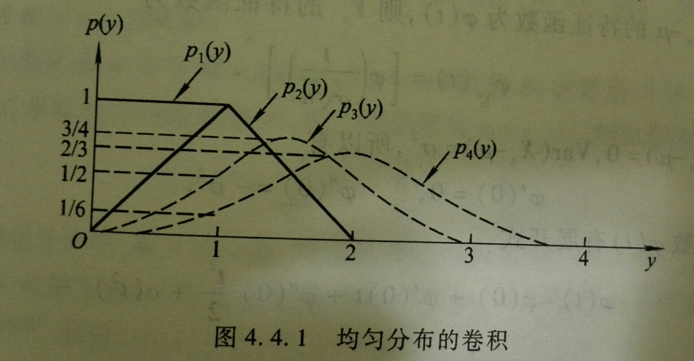

# 随机变量的收敛性 {#sec-ch4-convergence}

概率论中的极限定理研究大量随机因素共同作用时出现的稳定规律.由于随机变量既是样本点的函数又具有分布,序列趋近可以在不同层面定义:逐样本点比较产生几乎处处收敛,比较偏离概率产生依概率收敛,比较矩产生 $L^p$ 收敛,而只比较分布则产生依分布收敛.不同收敛方式对应不同强度的信息.

在收敛概念的基础上,大数定律说明样本平均趋近总体均值,中心极限定理描述中心化,标准化后的误差趋近正态分布.前者给出一致性,后者给出波动尺度与近似分布.本章既重视定理条件,也强调如何把抽象极限结论转化为概率近似和统计解释.

## 本章学习目标 {#本章学习目标 .unnumbered}

- 准确表述几乎处处,依概率,$L^p$ 与依分布收敛;

- 掌握常用收敛方式之间的蕴含关系与反例;

- 理解弱大数定律和强大数定律的条件,结论及统计意义;

- 掌握独立同分布中心极限定理及其标准化步骤;

- 能判断一个实际问题应使用大数定律还是中心极限定理.

## 随机变量的收敛方式 {#sec-ch4-lecture-21}

::: {.callout-note appearance="simple" icon="false"}
## 本节导读

随机变量序列的趋近可以从样本点,平均误差,偏差概率或分布函数等不同角度定义.几乎处处收敛,$L^p$ 收敛,依概率收敛和依分布收敛强弱不同;辨清它们的含义与关系,是理解概率极限定理的前提.
:::

::: {.callout-tip appearance="simple" icon="false"}
## 理论主线

各种收敛方式比较的是不同对象.几乎处处收敛要求除一个零概率集合外逐点收敛;依概率收敛只要求显著偏差的概率趋于零;$L^p$ 收敛控制平均 $p$ 次误差;依分布收敛则只比较分布函数在极限分布连续点处的行为.量词顺序和例外集合是否依赖于误差阈值,是理解这些定义的关键.

一般而言,$L^p$ 收敛和几乎处处收敛都蕴含依概率收敛,依概率收敛蕴含依分布收敛;反向通常不成立.依概率收敛可以抽取几乎处处收敛子列,而当极限为常数时,依分布收敛与依概率收敛等价.讨论任何蕴含关系时,都应同时说明条件并准备反例.
:::

#### 随机变量的几种收敛性 {#随机变量的几种收敛性 .unnumbered}

[几乎必然收敛:]{style="color: red"} 如果

$$
\begin{aligned}
P(\{\omega:\lim_{n\rightarrow\infty}X_n(\omega)=X(\omega)\})=1,
\end{aligned}
$$

 则称随机变量列 $\{X_n\}$ 几乎必然收敛到 $X$, 记作 $X_n\stackrel{a.e.}{\rightarrow} X$, 或 $X_n\rightarrow X, a.s.$ [依概率收敛:]{style="color: red"} 如果对任意的 $\epsilon>0$ 有

$$
\begin{aligned}
\lim_{n\rightarrow\infty}P(|X_n(\omega)-X(\omega)|>\epsilon)=0,
\end{aligned}
$$

 则称 $X_n$ 依概率收敛到 $X$, 记作 $X_n\stackrel{P}{\rightarrow} X$. [$r$ 阶平均收敛:]{style="color: red"} 设 $r>0$ 为常数,如果随机变量 $X$ 与 $X_n (n\geq 1)$ 的 $r$ 阶矩皆有限,并且有

$$
\begin{aligned}
\lim_{n\rightarrow\infty}E|X_n-X|^r=0,
\end{aligned}
$$

 则称 $\{X_n\}$ 为 $r$ 阶平均收敛到 $X$, 简称 $r$ 阶收敛,记作 $X_n\stackrel{L^r}{\rightarrow} X$.

#### 几乎必然收敛的刻划与性质 {#几乎必然收敛的刻划与性质 .unnumbered}

若记 $E:=\{\omega: \lim_{n\rightarrow\infty} X_n (\omega)=X (\omega)\}$, 则

$$
\begin{aligned}
E=\cap_{m=1}^\infty\cup_{k=1}^\infty\cap_{n=k}^\infty\{\omega:|X_n(\omega)-X(\omega)|<\dfrac{1}{m}\}\in \mathcal{F};
\end{aligned}
$$

 同时,$X_n\stackrel{a.s.}{\rightarrow} X$ 等价于 $P (E)=1$ 或 $P (\bar{E})=0$; 此外,$X_n\stackrel{a.s.}{\rightarrow} X$ 的充分必要条件是对任意的 $\epsilon>0$ 有

$$
\begin{aligned}
\lim_{k\rightarrow\infty}P(\cup_{n=k}^\infty|X_n-X|\geq \epsilon)=0
\end{aligned}
$$

 若 $X_n\stackrel{a.s.}{\rightarrow} X$, 则 $X_n\stackrel{P}{\rightarrow} X$.

#### 依概率收敛不能推出几乎必然收敛 {#依概率收敛不能推出几乎必然收敛 .unnumbered}

::: {#exm-ch4-001}
取 $\Omega=[0,1), \mathcal{F}$ 为区间 $[0,1)$ 上的Borel 集类,$P$ 为Lebesgue 测度.令

$$
\begin{aligned}
X_{11}(\omega)=1; \quad
            X_{21}(\omega)=\left\{
            \begin{array}{ll}
                1, &\omega\in [0,\frac{1}{2}),\\
                0, &\omega\in [\frac{1}{2},1);
            \end{array}
            \right.\quad
            X_{22}(\omega)=\left\{
            \begin{array}{ll}
                1, &\omega\in [\frac{1}{2},1),\\
                0, &\omega\in [0,\frac{1}{2});
            \end{array}
            \right.
\end{aligned}
$$

 一般地,对每个自然数 $k$, 将 $[0,1)$ 等分为 $k$ 个区间,并取

$$
\begin{aligned}
X_{ki}(\omega)=\left\{
            \begin{array}{ll}
                1, &\omega\in [\frac{i-1}{k},\frac{i}{k}),\\
                0, &\text{其他},
            \end{array}
            \right. i=1,\cdots, k
\end{aligned}
$$

 定义

$$
\begin{aligned}
Y_1=X_{11}, Y_2=X_{21}, Y_2=X_{22}, Y_3=X_{31}, \cdots
\end{aligned}
$$

 对于随机变量序列 $Y_n$, 对任意的 $\epsilon>0$ 有

$$
\begin{aligned}
P(|X_{ki}(\omega)|\geq \epsilon)\leq \dfrac{1}{k}\rightarrow 0,
\end{aligned}
$$

 但是收敛的点集 $E=\emptyset$, 即 $Y_n$ 不几乎必然收敛.
:::

#### $r$ 阶收敛与依概率收敛 {#r-阶收敛与依概率收敛 .unnumbered}

::: {#lem-ch4-001}
(Markov 不等式) 设随机变量 $X$ 的 $r$ 阶矩有限,则对任意 $\epsilon>0$ 有

$$
\begin{aligned}
P(|X|\geq  \epsilon)\leq \dfrac{1}{\epsilon^r}E|X|^r
\end{aligned}
$$

:::

::: {#thm-ch4-001}
若 $X_n\stackrel{L^r}{\rightarrow} X$, 则 $X_n\stackrel{P}{\rightarrow} X$. 反之不真.
:::

::: {#exm-ch4-002}
仍取区间 $(0,1)$ 上的几何概率空间 $(\Omega,\mathcal{F}, P)$. 固定 $r>0$, 令

$$
\begin{aligned}
X_n(\omega)=\left\{
            \begin{array}{ll}
                n^{1/r},&\omega\in (0, 1/n),\\
                0, &\omega\in [1/n,1),
            \end{array}
            \right. \quad X(\omega)=0.
\end{aligned}
$$

 易知 $X_n\stackrel{a.s.}{\rightarrow} X$, 从而 $X_n\stackrel{P}{\rightarrow} X$, 但 $X_n\stackrel{L^r}{\nrightarrow} X$.
:::

#### 依分布收敛 (弱收敛) {#依分布收敛-弱收敛 .unnumbered}

::: {#def-ch4-001}
设随机变量 $X,X_1, X_2,\cdots,$ 的分布函数分别为 $F (x), F_1 (x),F_2 (x),\cdots,$, 如果对 $F (x)$ 的任一连续点 $x$ 均有

$$
\begin{aligned}
\lim_{n\rightarrow}F_n(x)=F(x),
\end{aligned}
$$ {#eq-ch4-weakdefn}

 则称 $\{F_n (x)\}$ 弱收敛于 $F (x)$, 记作 $F_n (x)\stackrel{W}{\rightarrow} F (x)$. 此时也称 $\{X_n\}$ 按分布收敛于 $X$, 记作 $X_n\stackrel{W}{\rightarrow} X$.
:::

::: {#rem-ch4-001}
后面我们用$C_F$表示函数$F(x)$的连续点集, 即 $$C_F:=\{x: x\text{为}F(x)\text{的连续点}  \}$$
:::

#### 为何要求分布函数在连续点收敛,而不是每一点收敛 {#为何要求分布函数在连续点收敛而不是每一点收敛 .unnumbered}

::: {#exm-ch4-003}
考虑随机变量序列 $\{X_n\}$ 服从如下退化分布

$$
\begin{aligned}
P(X_n=\frac{1}{n})=1, n=1,2,\cdots,
\end{aligned}
$$

 它们的分布函数分别为 $F_n (x)=\left\{
        \begin{array}{ll}
            0, & x<\frac{1}{n}\\
            1, &x\ge \frac{1}{n}
        \end{array}
        \right.$

则在点点收敛要求下,$\{F_n (x)\}$ 的极限函数为

$$
\begin{aligned}
g(x)=\left\{
                \begin{array}{ll}
                    0, & x\le 0\\
                    1, &x>0
                \end{array}
                \right.
\end{aligned}
$$

 显然上述极限不满足右连续性,即 $g (x)$ 不是一个分布函数. 同时,因为 $F_n (x)$ 在 $x=1/n$ 处有跳跃,故当 $n\rightarrow\infty$ 时,跳跃点的位置趋于 0, 很自然的认为 $\{F_n (x)\}$ 应该收敛于点 $x=0$ 的退化分布,即 $F (x)=\left\{
            \begin{array}{ll}
                0, & x<0\\
                1, &x\ge 0
            \end{array}
            \right.$. 但是对任意的 $n$, 有 $F_n (0)=0$, 而 $F (0)=1$, 所以 $\lim_{n\rightarrow\infty} F_n (0)=0\neq 1=F (0)$, 而这个不收敛的点恰为 $F (x)$ 的不连续点.
:::

#### 依概率收敛与依分布收敛的关系 {#依概率收敛与依分布收敛的关系 .unnumbered}

::: {#thm-ch4-002}
若 $X_n\stackrel{P}{\rightarrow} X$, 则 $X_n\stackrel{W}{\rightarrow} X$.
:::

**证明.** 设随机变量 $X,X_1, X_2,\cdots,$ 的分布函数分别为 $F (x), F_1 (x),F_2 (x),\cdots,$ 只需证在 $F (x)$ 的连续点上均有 $F_n (x)\rightarrow F (x)$ 即可. 而要证明这一点我们只需要说明,对任意的 $x$ 均有

$$
\begin{aligned}
F(x-0)\le \liminf_{n\rightarrow\infty} F_n(x)\le \limsup_{n\rightarrow\infty} F_n(x)\le F(x+0)
\end{aligned}
$$

 注意到,对任意的 $x'<x$,

$$
\begin{aligned}
\{X\le x'\}&=&\{X_n\le x, X\le x'\}\cup\{X_n>x,X\le x'\}\\
         &\subset&\{X_n\le x\}\cup\{|X_n-X|\ge x-x'\}
\end{aligned}
$$

 从而有 $F (x')\le F_n (x)+P (|X_n-X|\ge x-x')$. 再由 $X_n\stackrel{P}{\rightarrow} X$ 知

$$
\begin{aligned}
F(x')\le \liminf_{n\rightarrow\infty}F_n(x)  \Rightarrow F(x-0)\le \liminf_{n\rightarrow\infty}F_n(x)
\end{aligned}
$$

 类似可证,当 $x''>x$ 时,$\limsup_{n\rightarrow\infty} F_n (x)\le F (x+0)$.

#### 依分布收敛无法推出依概率收敛 {#依分布收敛无法推出依概率收敛 .unnumbered}

::: {#exm-ch4-004}
设随机变量 $X$ 的分布列为

$$
\begin{aligned}
P(X=-1)=P(X=1)=1/2
\end{aligned}
$$

 令 $X_n=-X$, 则 $X_n$ 与 $X$ 同分布,即 $X_n$ 与 $X$ 有相同的分布,故 $X_n\stackrel{W}{\rightarrow} X$, 但对任意的 $\epsilon\in (0,2)$,

$$
\begin{aligned}
P(|X_n-X|\ge \epsilon)= P(2|X|\ge \epsilon)=1\nrightarrow 0
\end{aligned}
$$

:::

#### 若 $X_n$ 依分布收敛至常数 $c$, 则 $X_n$ 概率收敛至常数 $c$ {#若-x_n-依分布收敛至常数-c-则-x_n-概率收敛至常数-c .unnumbered}

::: {#thm-ch4-003}
若 $c$ 为常数,则 $X_n\stackrel{P}{\rightarrow} c\Leftrightarrow X_n\stackrel{W}{\rightarrow} c$
:::

只需证明充分性即可.记 $X_n$ 的分布函数为 $F_n (x), n=1,2,\cdots,$ 常数 $c$ 的分布函数为 $F (x)=\left\{
    \begin{array}{ll}
        0, &x<c,\\
        1, &x\ge c.
    \end{array}\right.$ 故对任意的 $\epsilon>0$,

$$
\begin{aligned}
P(|X_n-c|\ge \epsilon)&=& P(X_n\ge c+\epsilon)+P(X_n\le c-\epsilon)\\
        &\le&  P(X_n> c+\epsilon/2)+P(X_n\le c-\epsilon)\\
        &=& 1-F_n(c+\epsilon/2)+F_n(c-\epsilon)\\
        &\rightarrow&  1-F(c+\epsilon/2)+F(c-\epsilon)=0
\end{aligned}
$$

 从而 $X_n\stackrel{P}{\rightarrow} c$.

#### 弱收敛的充分条件 {#弱收敛的充分条件 .unnumbered}

::: {#thm-ch4-004}
设 $F (x), F_n (x)(n\geq 1)$ 均为分布函数,如果对于 $F(x)$的连续点集$C_F$ 的某个稠密子集 $D$ 上的一切 $x$ 均有

$$
\begin{aligned}
\lim_{n\rightarrow\infty}F_n(x)=F(x), \forall x\in D
\end{aligned}
$$ {#eq-ch4-wchou}

 则 $F_n\stackrel{W}\rightarrow F$.
:::

**证明.** 由 $D \subset C_{F}$ 立得必要性.下设@eq-ch4-wchou 式成立. 对任何 $x \in C_{F}$,取 $$y<x<z \text{且} y, z \in D,$$ 则有

$$
\begin{aligned}
F_{n}(y) \leq F_{n}(x) \leq F_{n}(z).
\end{aligned}
$$

 上式令 $n \rightarrow \infty$并利用@eq-ch4-wchou 式可得 $$F(y)=\lim _{n} F_{n}(y) \leq \varliminf_{n} F_{n}(x) \leq \varlimsup_{n} F_{n}(x) \leq \lim _{n} F_{n}(z)=F(z) .$$

再令 $y \uparrow x$ 及 $z \downarrow x$ 便得证@eq-ch4-weakdefn 式. 即 $F_{n} \xrightarrow{W} F$ .证毕.

#### Helly 第一定理 {#helly-第一定理 .unnumbered}

::: {#thm-ch4-005}
(Helly 第一定理)任意分布函数列 $F_n(x)$ 均存在子列$F_{n(k)}(x)$以及一个有界,非降,右连续的函数$F(x)$使得对任意的$x\in C_F$, 均有 $$\lim _{k \rightarrow \infty} F_{n(k)}(x)=F(x).$$
:::

::: {#rem-ch4-002}
极限函数 $F(x)$ 不一定为分布函数. 比如, 若$a+b+c=1$, $G(x)$为分布函数, 令$F_{n}(x)=a 1_{(x \geq n)}+b 1_{(x \geq-n)}+c G(x)$, 则易知 $$F_{n}(x) \rightarrow F(x)=b+c G(x),$$ 但 $$\lim _{x \downarrow-\infty} F(x)=b\neq 0, \quad  \lim _{x \uparrow \infty} F(x)=b+c=1-a\neq 1$$
:::

#### Helly 第一定理证明 {#helly-第一定理证明 .unnumbered}

令 $q_{1}, q_{2}, \ldots$ 为有理数排列, $m_{0}(j) \equiv j$. 由于对每个$k$, $$F_{m}\left(q_{k}\right) \in[0,1], \quad \forall m\geq 1.$$ 因此, 存在$m_{k-1}(j)$的子列$m_{k}(j)$使得 $$\lim_{j \rightarrow \infty}F_{m_{k}(j)}(q_{k}) = G(q_{k}).$$ 令 $F_{n(k)}(x):=F_{m_k(k)}(x)$, 则 $$\lim_{k \rightarrow \infty}F_{n(k)}(q) = G(q),\quad  \forall q \in \mathbb{Q}.$$ 令$F(x)=\inf \{G(q): q \in \mathbb{Q}, q>x\}$, 则易知$F(x)$右连续. 事实上, $$\begin{aligned}
    \lim _{x_{n} \downarrow x} F\left(x_{n}\right) & = \inf \left\{G(q): q \in \mathbb{Q}, q>x_{n} \text { 对某个 } n\right\} \\
    & = \inf \{G(q): q \in \mathbb{Q}, q>x\}= F(x)
    \end{aligned}$$

#### Helly 第一定理证明II {#helly-第一定理证明ii .unnumbered}

首先,右连续性证明方法2:对任何 $\varepsilon>0$, 总存在 $q_{k}>x$ 使 $G\left(q_{k}\right)<F(x)+\varepsilon$, 且对于一切 $y \in\left(x, q_{k}\right)$ 有 $$F(x)\leq F(y)\leq G\left(q_{k}\right)<F(x)+\varepsilon .$$ 先令 $y \downarrow x$ ,再令 $\varepsilon \downarrow 0$ 得 $F(x)\leq F(x+0) \leq F(x)$. 右连续得证. 令$x\in C_F$并取$r_1,r_2,r_3\in\mathbb{Q}$使得$r_{1}<r_{2}<x<r_3$, 则 $$F(x)-\epsilon<F\left(r_{1}\right) \leq F\left(r_{2}\right) \leq F(x) \leq F(r_3)<F(x)+\epsilon$$ 由于 $$F_{n(k)}\left(r_{2}\right) \rightarrow G\left(r_{2}\right) \geq F\left(r_{1}\right), \quad  F_{n(k)}(r_3) \rightarrow G(r_3) \leq F(r_3),$$ 因此, 当$k$充分大时, $$F(x)-\epsilon<F_{n(k)}\left(r_{2}\right) \leq F_{n(k)}(x) \leq F_{n(k)}(r_3)<F(x)+\epsilon$$ 综上可知 $$\lim_{k \rightarrow \infty}F_{n(k)}(x) = F(x), \quad x\in C_F.$$

#### 胎紧(tight) {#胎紧tight .unnumbered}

::: {#def-ch4-002}
设随机变量$X_n$的分布函数为$F_n(x)$, 我们称分布函数列$\{F_n(x)\}_{n\geq 1}$为胎紧的(tight), 如果对任意的$\epsilon>0$, 存$M_{\epsilon}$使得 $$\sup_{n\geq 1}P(|X_n|>M_{\epsilon})\leq\epsilon.$$
:::

::: {#thm-ch4-006}
分布函数列$\{F_n(x)\}_{n\geq 1}$是胎紧的(tight)的当且仅当对任意的$\epsilon>0$, 存$M_{\epsilon}$使得$\sup_{n\geq 1} \big(1-F_{n}\left(M_{\epsilon}\right)+F_{n}\left(-M_{\epsilon}\right) \big)\leq \epsilon$.
:::

**证明.** 充分性, 若$\sup_{n\geq 1} \big(1-F_{n}\left(M_{\epsilon}\right)+F_{n}\left(-M_{\epsilon}\right) \big)\leq \epsilon$, 则由

$$
\begin{aligned}
\sup_{n\geq 1}P(|X_n|>M_{\epsilon})&=\sup_{n\geq 1}\big(1-F_n(M_{\epsilon})+P(X_n<M_{\epsilon})\big)\\
        &\leq \sup_{n\geq 1}\big(1-F_{n}\left(M_{\epsilon}\right)+F_{n}\left(-M_{\epsilon}\right)\big)\leq \epsilon
\end{aligned}
$$

 知分布函数列$\{F_n(x)\}_{n\geq 1}$是胎紧的. 反之, 取$K_\epsilon=M_\epsilon+\delta, \delta>0$, 则

$$
\begin{aligned}
\sup_{n\geq 1}\big(1-F_{n}\left(K_{\epsilon}\right)+F_{n}\left(-K_{\epsilon}\right)\big)&\leq \sup_{n\geq 1}\big(1-F_{n}\left(M_{\epsilon}\right)+P(X_n<-M_\epsilon)\big)\\
        &=\sup_{n\geq 1}P(|X_n|>M_{\epsilon})\leq  \epsilon
\end{aligned}
$$

#### 胎紧与分布函数列收敛 {#胎紧与分布函数列收敛 .unnumbered}

::: {#thm-ch4-007}
分布函数列$\{F_n(x)\}_{n\geq 1}$的子序列收敛到某个分布函数$F(x)$当且仅当$\{F_n(x)\}_{n\geq 1}$是胎紧的.
:::

**证明.** 

首先,假设$\{F_n(x)\}_{n\geq 1}$是胎紧的, 且$F_{n(k)}(x) \rightarrow F(x)$. 下证 $F(x)$为分布函数, 即证: $F(+\infty)-F(-\infty)=1$. 令 $r, s\in C_F$且$r<-M_{\epsilon}, s>M_{\epsilon}$, 由 $F_{n}(r) \rightarrow F(r), \ F_{n}(s) \rightarrow F(s)$ 得 $$\begin{aligned}
1-F(s)+F(r)  &= \lim _{k \rightarrow \infty} \big(1-F_{n(k)}(s)+F_{n(k)}(r) \big)\\
& \leq\lim _{k \rightarrow \infty} \sup_{k\geq 1}\big(1-F_{n(k)}(M_{\epsilon})+F_{n(k)}(-M_{\epsilon}) \big)\\
&\leq  \sup_{n\geq 1} \big(1-F_{n}\left(M_{\epsilon}\right)+F_{n}\left(-M_{\epsilon}\right)\big) \leq  \epsilon
\end{aligned}$$ 令$r\rightarrow-\infty, s\rightarrow\infty$后再令$\epsilon\rightarrow 0$可得$F(+\infty)-F(-\infty)=1$

#### 定理证明续 {#定理证明续 .unnumbered}

若极限函数是分布函数,下面用反证法证明$\{F_n(x)\}_{n\geq 1}$是胎紧的. 若$\{F_n(x)\}_{n\geq 1}$不是胎紧的, 则存在$\epsilon>0$以及子列$n(k)$使得对任意的$k$均有 $$1-F_{n(k)}(k)+F_{n(k)}(-k) \geq \epsilon,$$ 由Helly第一定理可知, $\{F_{n(k)}(x)\}_{k\geq 1}$ 存在子列$\{F_{n\left(k_{j}\right)}\}_{j\geq 1}\rightarrow F(x)$. 令$r, s\in C_F$, $r<0<s$, 则

$$
\begin{aligned}
1-F(s)+F(r)  &= \lim _{j \rightarrow \infty} \big(1-F_{n\left(k_{j}\right)}(s)+F_{n\left(k_{j}\right)}(r)\big)
         \\
        &\geq  \liminf _{j \rightarrow \infty} \big(1-F_{n\left(k_{j}\right)}\left(k_{j}\right)+F_{n\left(k_{j}\right)}\left(-k_{j}\right)\big) \geq  \epsilon
\end{aligned}
$$

 令$s \rightarrow \infty, r \rightarrow-\infty$可知$F(x)$不是分布函数, 与假设矛盾.

#### Helly 第二定理 {#helly-第二定理 .unnumbered}

::: {#thm-ch4-008}
(Helly 第二定理) 设分布函数列 $\{F_n(x)\}$ 弱收敛于分布函数 $F (x)$当且仅当对任何有界连续函数 $g(x)$ 有

$$
\begin{aligned}
\int_{\mathbb{R}}g(x)dF_n(x)\rightarrow\int_{\mathbb{R}}g(x)dF(x).
\end{aligned}
$$

 或等价的 $$E[g(X_n)]\rightarrow E[g(X)].$$
:::

#### 一个引理 {#一个引理 .unnumbered}

::: {#thm-ch4-009}
若分布函数列 $\{F_n(x)\}_{n\geq 1}$ 弱收敛于分布函数 $F (x)$, 则存在分布函数为$F_n(x)$的随机变量序列$\{Y_n\}_{n\geq 1}$及分布函数为$F(x)$的随机变量$Y$, 使得$Y_n\rightarrow Y, a.s.$.
:::

**证明.** 

令$\Omega=(0,1), \mathcal{F}=\mathcal{B}((0,1))$, $P$ 为$(0,1)$上的Lebesgue测度. 令

$$
\begin{aligned}
&Y_{n}(y)=F_n^{-1}(y):=\sup \{x: F_{n}(x)<y\}\\
            &Y(y)=F^{-1}(y):=\sup \{x: F(x)<y\}\\
            &a_{y}=\sup \{x: F(x)<y\}, \quad b_{y}=\inf \{x: F(x)>y\}\\
            &\Omega_0=\{y:\left(a_{y}, b_{y}\right)=\emptyset\}
\end{aligned}
$$

 由于$\left(a_{y}, b_{y}\right)$互不相交且每个非空区间均包含不同的有理数, 因此可知 $\Omega-\Omega_0$ 中的元素个数可数, 从而$P(\Omega-\Omega_0)=0$.

#### 引理证明(续) {#引理证明续 .unnumbered}

首先,下证, 对任意的$y \in \Omega_{0}$, 我们有$F_{n}^{-1}(y) \rightarrow F^{-1}(y)$. 首先, 证明${\liminf _{n \rightarrow \infty} F_{n}^{-1}(y) \geq F^{-1}(y)}$, 其中,令 $x\in C_F$使得$x<F^{-1}(y)$, 则由$y\in \Omega_0$知$F(x)<y$; 由$x\in C_F$以及$F_n(x)\rightarrow F(x)$可知, 当$n$充分大时, $F_n(x)<y$, 也即 $F_n^{-1}(y)\geq x$; 令$n\rightarrow\infty$取下极限后再令$x\rightarrow F^{-1}(y)$可得本结果. 其次, 证明${\lim \sup _{n \rightarrow \infty} F_{n}^{-1}(y) \leq F^{-1}(y)}$ 其中,令 $x\in C_F$使得$x>F^{-1}(y)$, 则由$y\in \Omega_0$知$F(x)>y$; 由$x\in C_F$以及$F_n(x)\rightarrow F(x)$可知, 当$n$充分大时, $F_n(x)>y$, 也即 $F_n^{-1}(y)\leq x$; 令$n\rightarrow\infty$取上极限后再令$x\rightarrow F^{-1}(y)$可得本结果.

#### Helly 第二定理证明 {#helly-第二定理证明 .unnumbered}

首先,必要性 其中,由引理可知, 存在$\{Y_n\}_{n\geq 1}$及$Y$使得$Y_n\rightarrow Y,    a.s.$; 由于$g(x)$是连续函数, 从而$g(Y_n)\rightarrow g(Y), a.s.$; 从而由控制收敛定理可知 $$E[g(X_n)]=E[g(Y_n)]\rightarrow E[g(Y)]=E[g(X)],$$ 也即 $$\int_{\mathbb{R}}g(x)dF_n(x)\rightarrow\int_{\mathbb{R}}g(x)dF(x).$$

#### Helly 第二定理证明 {#helly-第二定理证明-1 .unnumbered}

首先,充分性 其中,令$$g_{x, \epsilon}(y)=\left\{\begin{array}{ll}
            1 & y \leq x \\
            0 & y \geq x+\epsilon \\
            -\frac{1}{\epsilon}(y-x)+1 & x \leq y \leq x+\epsilon
            \end{array}\right.$$ 由 $g_{x, \epsilon}$的定义及连续性可知

$$
\begin{aligned}
&\limsup _{n \rightarrow \infty} P\left(X_{n} \leq x\right) \leq   \limsup _{n \rightarrow \infty} E g_{x, \epsilon}\left(X_{n}\right)= E g_{x, \epsilon}\left(X\right) \leq  P\left(X \leq x+\epsilon\right)  \\
        &\liminf _{n \rightarrow \infty} P\left(X_{n} \leq x\right) \geq  \liminf _{n \rightarrow \infty} E g_{x-\epsilon, \epsilon}\left(X_{n}\right)= E g_{x-\epsilon, \epsilon}\left(X\right) \geq  P\left(X\leq x-\epsilon\right)
\end{aligned}
$$

 令$\epsilon \rightarrow 0$ 可得

$$
\begin{aligned}
&\lim \sup _{n \rightarrow \infty} P\left(X_{n} \leq x\right) \leq   P\left(X\leq x\right),  \\
        &\lim \inf _{n \rightarrow \infty} P\left(X_{n} \leq x\right) \geq   P\left(X<x\right)\stackrel{x\in C_F}{=}P\left(X \leq x\right)
\end{aligned}
$$

 由上可得, 对任意的$x\in C_F$, 我们有 $$\lim _{n\rightarrow \infty} F_{n}(x)=F(x).$$

#### 连续性定理及证明 {#连续性定理及证明 .unnumbered}

::: {#thm-ch4-010}
(连续性定理) 分布函数列 $\{F_n (x)\}$ 弱收敛到分布函数 $F (x)$ 的充分必要条件是:相应的特征函数列 $\{\varphi_n (t)\}$ 逐点收敛到相应的特征函数 $\varphi (t)$.
:::

**证明.** 

首先,必要性显然. 事实上, 由$\cos(tx), \sin(tx)$为有界连续函数以及Helly第二定理可知

$$
\begin{aligned}
\varphi_n(t)&:= \int_{\mathbb{R}}e^{itx}dF_n(x)
    \\
    &= \int_{\mathbb{R}}\cos(tx)dF_n(x)+i\int_{\mathbb{R}}\sin(tx)dF_n(x)
    \\
    &\rightarrow \int_{\mathbb{R}}\cos(tx)dF(x)+i\int_{\mathbb{R}}\sin(tx)dF(x)
    \\
    &= \int_{\mathbb{R}}e^{itx}dF(x)
    =:\varphi(t).
\end{aligned}
$$

#### 连续性定理证明(续) {#连续性定理证明续 .unnumbered}

下证充分性. 先证$\{F_n(x)\}_{n\geq 1}$是胎紧的.

注意到

$$
\begin{aligned}
&u^{-1} \int_{-u}^{u}\left(1-\varphi_{n}(t)\right) d t= u^{-1} \int_{-u}^{u}\int_{\mathbb{R}}\left(1-e^{itx}\right)dF_n(x) d t
    \\ &= u^{-1}\int_{\mathbb{R}}\int_{-u}^{u}\left(1-e^{itx}\right)dt dF_n(x)= 2\int_{\mathbb{R}}(1-\frac{\sin ux}{ux})dF_n(x)\\
    &\geq  2 \int_{|x|\geq\frac{2}{u}}(1-\frac{1}{|ux|})dF_n(x)\geq  \int_{|x|\geq\frac{2}{u}}dF_n(x)= P(|X_n|\geq \frac{2}{u})
\end{aligned}
$$

 另一方面,

$$
\begin{aligned}
&\lim_{n\rightarrow\infty}u^{-1} \int_{-u}^{u}\left(1-\varphi_{n}(t)\right) d t= u^{-1} \int_{-u}^{u}\left(1-\varphi(t)\right) d t \stackrel{u\rightarrow 0}{\longrightarrow}  0
\end{aligned}
$$

从而 $$P(|X_n|\geq \frac{2}{u})\leq  u^{-1} \int_{-u}^{u}\left(1-\varphi_{n}(t)\right) d t \leq  2 \epsilon$$

#### 连续性定理证明(续) {#连续性定理证明续-1 .unnumbered}

其次, 证明对任意的有界连续函数$g(x)$均有 $E[g(X_n)]\rightarrow E[g(X)]$.

首先注意到, 对于$\{F_n(x)\}_{n\geq 1}$的任一子列$\{F_{n(k)}(x)\}_{k\geq 1}$, 若$F_{n(k)} (x)\stackrel{W}{\rightarrow} F (x)$, 则分布函数$F(x)$的特征函数必为$\varphi(t)$. 由$\{F_n(x)\}_{n\geq 1}$的胎紧性可知, $\{F_n(x)\}_{n\geq 1}$的任一子列$\{F_{n(k)}(x)\}_{k\geq 1}$均存在子列$\{F_{n(k_j)}(x)\}_{j\geq 1}$弱收敛到某个分布函数$F(x)$, 且$F(x)$的特征函数为$\varphi(t)$. 由于$\{F_{n(k_j)}(x)\}_{j\geq 1}$弱收敛到某个分布函数$F(x)$, 故由Helly第二定理可知, 对任意的有界连续函数$g(x)$均有 $$\int g(x)dF_{n(k_j)}(x)\rightarrow \int g(x)dF(x)$$ 故综上可知, $\int g(x)dF_{n}(x)$的任一子列$\int g(x)dF_{n(k)}(x)$均存在子列$\int g(x)dF_{n(k_j)}(x)\rightarrow \int g(x)dF(x)$. 从而, $\int g(x)dF_{n}(x)\rightarrow \int g(x)dF(x)$, 即 $$E[g(X_n)]\rightarrow E[g(X)].$$

## 大数定律 {#sec-ch4-lecture-22}

::: {.callout-note appearance="simple" icon="false"}
## 本节导读

大数定律解释了样本平均为何能够稳定地估计总体均值,是频率解释和统计推断的理论支柱.弱大数定律给出依概率收敛,强大数定律给出几乎处处收敛;不同版本的差异主要体现在独立性,同分布性和矩条件上.
:::

::: {.callout-tip appearance="simple" icon="false"}
## 理论主线

大数定律研究部分和或样本均值的稳定性.弱大数定律给出依概率收敛,强大数定律给出几乎处处收敛;二者结论强度不同,所需条件也不能混用.独立同分布只是最常见的框架,许多版本允许非同分布,弱相关或不同的矩条件.

证明大数定律的基本路线包括用方差和 Chebyshev 不等式控制偏差概率,以及用截断,最大不等式与 Borel-Cantelli 引理获得几乎处处结论.应用时必须确认被平均量的期望是否存在,并区分定理保证的渐近稳定性与有限样本下的具体误差界.
:::

#### 概率及频率 {#概率及频率 .unnumbered}

记 $S_n$ 为 $n$ 重伯努利试验中事件 $A$ 出现次数,称 $\dfrac{S_n}{n}$ 为事件 $A$ 出现的频率; 同时,记 $p$ 为一次试验中 $A$ 发生的概率; 此外,概率是频率的稳定值,何谓稳定值?似乎与频率的极限有关; 相应地,考虑 $|\dfrac{S_n}{n}-p|$, 如果能类似于函数列极限情形即对任意的 $\epsilon>0$, 存在 $N$ 使得当 $n\ge N$ 时

$$
\begin{aligned}
|\dfrac{S_n}{n}-p|< \epsilon, \forall \omega\in \Omega.
\end{aligned}
$$

 相应地,但是上述情形无法做到,事实上,对任意的 $\epsilon<1-p$,

$$
\begin{aligned}
&& P(|\dfrac{S_n}{n}-p|< \epsilon)\le  P(\dfrac{S_n}{n}-p<\epsilon)\le  P(\dfrac{S_n}{n}-p<1-p)\\
            &&= P(\frac{S_n}{n}<1)= 1-P(\frac{S_n}{n}=1)= 1-P(X_1=1,\cdots,X_n=1)\\
            &&= 1-p^n<1
\end{aligned}
$$

#### 伯努利大数定律 {#伯努利大数定律 .unnumbered}

::: {#thm-ch4-011}
设 $S_n$ 为 $n$ 重伯努利试验中事件 $A$ 出现次数,$p$ 为一次试验中 $A$ 发生的概率,则对任意的 $\epsilon>0$, 有

$$
\begin{aligned}
\lim_{n\rightarrow\infty} P (|\frac{S_n}{n}-p|<\epsilon)=1, \quad\text{或等价的}\quad \lim_{n\rightarrow\infty} P (|\frac{S_n}{n}-p|\ge\epsilon)=0
\end{aligned}
$$

:::

**证明.** 因为 $S_n\sim B (n,p)$, 故 $S_n\sim B (n,p), E (\frac{S_n}{n})=p, D (\frac{S_n}{n})=\frac{p (1-p)}{n}$. 从而由切比雪夫不等式可得

$$
\begin{aligned}
1\ge P(|\frac{S_n}{n}-p|<\epsilon)\ge 1-\dfrac{D(\frac{S_n}{n})}{\epsilon^2}=1-\frac{p(1-p)}{n\epsilon^2}\rightarrow 1  \quad n\rightarrow \infty
\end{aligned}
$$

 故

$$
\begin{aligned}
\lim_{n\rightarrow\infty}P(|\frac{S_n}{n}-p|<\epsilon)=1
\end{aligned}
$$

#### 伯努利大数定律的含义 {#伯努利大数定律的含义 .unnumbered}

首先,随着 $n$ 的增大,事件 $A$ 发生的频率 $\dfrac{S_n}{n}$ 与其概率 $p$ 的偏差大于预先给定的精度 $\epsilon$ 的可能性越来越小,要多小有多小,这便是频率稳定于概率的含义; 接着,事实上,由切比雪夫不等式可得

$$
\begin{aligned}
P(|\frac{S_n}{n}-p|\ge\epsilon)\le \dfrac{D(\frac{S_n}{n})}{\epsilon^2}=\frac{p(1-p)}{\epsilon^2}\dfrac{1}{n}
\end{aligned}
$$

 另一方面,伯努利大数定律提供了用频率来确定概率的理论依据; 最后,比如要估计某种产品的不合格品率 $p$, 则可从该种产品中随机抽取 $n$ 件,当 $n$ 很大时,这 $n$ 件产品中的不合格品的比例可作为不合格品率 $p$ 的估计值.

#### 伯努利大数定律的另一形式 {#伯努利大数定律的另一形式 .unnumbered}

注意到,在伯努利大数定律中,如果记 $X_i=\bigg\{
        \begin{array}{ll}
            1,& \text{第} i\text{试验} A\text{发生}\\
            0,& \text{第} i\text{试验} A\text{不发生}
        \end{array}$, 则 $S_n=\sum_{i=1}^nX_i$, 并且

$$
\begin{aligned}
\frac{S_n}{n}=\frac{1}{n}\sum_{i=1}^nX_i,  p=E(\frac{1}{n}\sum_{i=1}^nX_i)=\frac{1}{n}\sum_{i=1}^nE(X_i)
\end{aligned}
$$

 最后,伯努利大数定律的结论为:对任意的 $\epsilon>0$, 有

$$
\begin{aligned}
\lim_{n\rightarrow\infty}P(|\frac{1}{n}\sum_{i=1}^n[X_i-E(X_i)]|<\epsilon)=1
\end{aligned}
$$

 也即

$$
\begin{aligned}
\frac{1}{n}\sum_{i=1}^n[X_i-E(X_i)]\stackrel{P}{\rightarrow}0
\end{aligned}
$$

#### (强) 大数定律的一般形式 {#强-大数定律的一般形式 .unnumbered}

::: {#def-ch4-003}
设有一随机变量序列 $\{X_n\}$, 如果对任意的 $\epsilon>0$, 有

$$
\begin{aligned}
\lim_{n\rightarrow\infty} P (|\frac{1}{n}\sum_{i=1}^n [X_i-E (X_i)]|<\epsilon)=1 \text{ 即 }  \frac{1}{n}\sum_{i=1}^n [X_i-E (X_i)]\stackrel{P}{\rightarrow} 0
\end{aligned}
$$

 则称该随机变量序列 $\{X_n\}$ 满足大数定律.如果进一步有

$$
\begin{aligned}
\frac{1}{n}\sum_{i=1}^n[X_i-E(X_i)]\stackrel{a.s.}{\rightarrow}0
\end{aligned}
$$

 则称 $\{X_n\}$ 满足强大数定律.
:::

#### 切比雪夫大数定律 {#切比雪夫大数定律 .unnumbered}

::: {#thm-ch4-012}
设 $\{X_n\}$ 为一列两两不相关的随机变量序列,若每个 $X_i$ 的方差存在且有共同的上界 $M$, 即 $D (X_i)\le M, \forall i\in \mathbb{N}$, 则 $\{X_n\}$ 服从大数定律,即对任意的 $\epsilon>0$, 有

$$
\begin{aligned}
\lim_{n\rightarrow\infty}P(|\frac{1}{n}\sum_{i=1}^nX_i-\frac{1}{n}\sum_{i=1}^nE(X_i)|<\epsilon)=1
\end{aligned}
$$

 特别的,若 $\{X_n\}$ 独立同分布,且 $D (X_n)<\infty$, 则 $\{X_n\}$ 服从大数定律.
:::

**证明.** 注意到

$$
\begin{aligned}
P(|\frac{1}{n}\sum_{i=1}^nX_i-\frac{1}{n}\sum_{i=1}^nE(X_i)|\ge\epsilon)&\le&  \dfrac{D(\frac{1}{n}\sum_{i=1}^nX_i)}{\epsilon^2}\\
        &=& \dfrac{1}{\epsilon^2}\dfrac{1}{n^2}\sum_{i=1}^nD(X_i)\\
        &\le& \dfrac{1}{\epsilon^2}\dfrac{M}{n}\rightarrow 0
\end{aligned}
$$

#### 马尔科夫大数定律 {#马尔科夫大数定律 .unnumbered}

::: {#thm-ch4-013}
设随机变量序列 $\{X_n\}$ 满足如下马尔科夫条件

$$
\begin{aligned}
\dfrac{1}{n^2}D(\sum_{i=1}^nX_i)\rightarrow 0
\end{aligned}
$$

 则 $\{X_n\}$ 服从大数定律,即对任意的 $\epsilon>0$, 有

$$
\begin{aligned}
\lim_{n\rightarrow\infty}P(|\frac{1}{n}\sum_{i=1}^nX_i-\frac{1}{n}\sum_{i=1}^nE(X_i)|<\epsilon)=1
\end{aligned}
$$

:::

#### 辛钦大数定律 {#辛钦大数定律 .unnumbered}

::: {#thm-ch4-014}
设 $\{X_n\}$ 为一列独立同分布随机变量序列,若每个 $X_i$ 的期望存在,则 $\{X_n\}$ 服从大数定律,即对任意的 $\epsilon>0$, 有

$$
\begin{aligned}
\lim_{n\rightarrow\infty}P(|\frac{1}{n}\sum_{i=1}^nX_i-\frac{1}{n}\sum_{i=1}^nE(X_i)|<\epsilon)=1.
\end{aligned}
$$

 特别的,如果 $E|X_i|^k, k=1,2,\cdots$, 存在,则 $\{X_n^k\}$ 服从大数定律.
:::

**证明.** 设 $\{X_n\}$ 独立同分布,且 $E (X_i)=a, i=1,\cdots,$, 则只需要证明

$$
\begin{aligned}
Y_n:=\dfrac{1}{n}\sum_{i=1}^nX_i\xlongrightarrow{P}a, \quad n\rightarrow \infty
\end{aligned}
$$

 由依概率收敛的性质,仅需证 $\varphi_{Y_n}(t)\rightarrow e^{iat}$ 即可.事实上,由

$$
\begin{aligned}
\varphi_{Y_n}(t) &=&[\varphi(\frac{t}{n})]^n =[1+\varphi'(0)\frac{t}{n}+o(\frac{t}{n})]^n =[1+ia\frac{t}{n}+o(\frac{t}{n})]^n\\
        &=& \exp\{\dfrac{\ln (1+ia\frac{t}{n}+o(\frac{t}{n}))}{1/n}\} \rightarrow e^{iat}
\end{aligned}
$$

#### Borel-Cantelli引理 {#borel-cantelli引理 .unnumbered}

::: {#thm-ch4-015}
对于事件列$\{A_j\}$,有

若$\sum_{n=1}^\infty P(A_n)<\infty$,则 $$P(\limsup_{n\rightarrow\infty}A_n)=\lim_{k\rightarrow\infty}P(\cup_{n=k}^\infty A_n)=0$$ 若$\{A_n\}$相互独立,则$\sum_{n=1}^\infty P(A_n)=\infty$当且仅当 $$P(\limsup_{n\rightarrow\infty}A_n)=\lim_{k\rightarrow\infty}P(\cup_{n=k}^\infty A_n)=1$$
:::

**证明.** 1. 注意到$\lim_{k\rightarrow\infty}P(\cup_{n=k}^\infty A_n)\le  \lim_{k\rightarrow\infty}\sum_{n=k}^\infty P(A_n) =0.$

2\. 由于

$$
\begin{aligned}
P(\cup_{n=k}^\infty A_n)&=& \lim_{m\rightarrow\infty}P(\cup_{n=k}^m A_n)= \lim_{m\rightarrow\infty}(1-P(\cap_{n=k}^m\overline{A}_n))\\
      P(\cap_{n=k}^m\overline{A}_n)&=& \Pi_{n=k}^m P(\overline{A}_n)=\Pi_{n=k}^m(1-P(A_n))\\
      &\le& \Pi_{n=k}^m \exp(-P(A_n))=\exp(-\sum_{n=k}^m P(A_n)) \stackrel{m\rightarrow\infty}{\longrightarrow} 0
\end{aligned}
$$

#### Borel 强大数定律律 {#borel-强大数定律律 .unnumbered}

::: {#thm-ch4-016}
(Borel 强大数定律) 设 $S_n$ 为 $n$ 重伯努利试验中事件 $A$ 出现次数,$p$ 为一次试验中 $A$ 发生的概率,则

$$
\begin{aligned}
\dfrac{S_n}{n}\stackrel{a.s.}{\rightarrow} p
\end{aligned}
$$

:::

**分析.** 记${A_{n}=\left\{\left|S_n / n-p\right| \geq \varepsilon\right\}}$, 则定理中的几乎必然收敛的充分必要条件是 $$P\left(\limsup_{n} A_{n}\right)=0.$$

再Borel-Cantelli引理可知, 只需证明 $$\sum_{n=1}^{\infty} P\left(A_{n}\right)<+\infty.$$

若像证明弱大数定律那样用切贝谢夫不等式,我们只能得到 $$P\left(A_{n}\right) \leq \frac{1}{\varepsilon^{2}} D\left(\frac{S_n}{n}\right)=\frac{p q}{n \varepsilon^{2}} \leq \frac{1}{4 n \varepsilon^{2}} .$$

#### Borel 强大数定律证明 {#borel-强大数定律证明 .unnumbered}

首先,用${r=4}$时的马尔科夫不等式可得$P\left(A_{n}\right) \leq \dfrac{1}{\varepsilon^{4}} E\left|\frac{S_n}{n}-p\right|^{4}.$. 接着,将${S_n}$写为${n}$个独立伯努利分布随机变量之和${S_n=\sum_{k=1}^{n} X_{k}}$, 从而 $$E\left[\left|\frac{S_n}{n}-p\right|^{4}\right]=\frac{1}{n^{4}} \sum_{1 \leq i, j, k, l \leq n} E\left[\left(X_{i}-p\right)\left(X_{j}-p\right)\left(X_{k}-p\right)\left(X_{l}-p\right)\right] .$$ 另一方面,注意${X_{1}, \cdots, X_{n}}$相互独立,故上式和号中仅有

$$
\begin{aligned}
&E\left[\left(X_{i}-p\right)^{4}\right]=p q\left(p^{3}+q^{3}\right)\neq 0,\\
      &E\left[\left(X_{i}-p\right)^{2}\left(X_{j}-p\right)^{2}\right]=p^{2} q^{2}\neq 0, (i \neq j).
\end{aligned}
$$

 注意到前者共${n}$项,后者共$C_n^2C_4^2=3 n(n-1)$项,故我们有 $$E\left[\left|\frac{S_n}{n}-p\right|^{4} =\frac{p q}{n^{4}}\left[n\left(p^{3}+q^{3}\right)+3 p q\left(n^{2}-n\right)\right]<\frac{1}{4 n^{2}} .\right.$$ 最后,代入马等科夫不等式右方可得$P\left(A_{n}\right) \leq \dfrac{1}{4 n^{2} \varepsilon^{4}}$, 定理得证.

#### Borel强大数定律的备注 {#borel强大数定律的备注 .unnumbered}

::: {#rem-ch4-003}
上述定理证明,本质上只用到独立同分布序列的四阶中心矩 ${E\left[\left(X_{k}-p\right)^{4}\right]}$以及${E\left[\left(X_{k}-p\right)^{2}\left(X_{j}-p\right)^{2}\right]}$有限, 并没有用到伯努利情形的其它特性. 所以,在四阶中心矩有限的前提下,其证明可以照搬到一般独立同分布情形. 同时,在如下定理中, 我们在明显减弱的条件下,得到一般独立同分布场合的强大数定律. 其中,证明中采用恰当选取子序列的方法,仅用切比雪夫不等式就得到了满足Borel-Cantelli引理要求的估计式.; 而且运用著名的 截尾法, 连切比雪夫不等式中方差有限的要求都可以绕过.
:::

#### 一般独立同分布情形下的强大数定律 {#一般独立同分布情形下的强大数定律 .unnumbered}

::: {#thm-ch4-017}
假定 $\{X_n\}$ 是相互独立同分布的随机变量序列,如果它们有有限的期望 $E (X_n)=a$, 则强大数定律成立,即 $n\rightarrow\infty$ 时有

$$
\begin{aligned}
\dfrac{1}{n}\sum_{k=1}^nX_k\stackrel{a.s.}{\rightarrow} a.
\end{aligned}
$$

:::

#### 分析 {#分析 .unnumbered}

记部分和${S_{n}=\sum_{k=1}^{n} X_{k}}$. 如非负情形成立, 则有 $$\frac{S_{n}}{n}=\frac{1}{n} \sum_{k=1}^{n} X_{k}^{+}-\frac{1}{n} \sum_{k=1}^{n} X_{k}^{-} \stackrel{a.s.}{\longrightarrow} E\left(X_{1}^{+}\right)-E\left(X_{1}^{-}\right)=a .$$ 故不妨假定${\left\{X_{k}\right\}}$是非负随机变量列. 注意到

$$
\begin{aligned}
P\left\{\frac{1}{n}\left|S_{n}-E\left(S_{n}\right)\right| \geq \varepsilon\right\} \leq \frac{E[\sum_{i=1}^n(X_i-E(X_i))]^k}{\varepsilon^{k}n^k}, k=2, 4
\end{aligned}
$$

 此外,高阶矩不存在, 需要截断

其中,方法1: $X_{n}^{*}(\omega)={\left\{\begin{array}{ll}
        X_{n}(\omega), &     X_{n}(\omega) \leq M \\
        0, &     X_{n}(\omega)>M .
        \end{array}=X_{n}(\omega) 1_{[0, M]}\left(X_{n}(\omega)\right) .\right.}$ 方法2: $X_{n}^{*}(\omega)={\left\{\begin{array}{ll}
        X_{n}(\omega), &     X_{n}(\omega) \leq n, \\
        0, &     X_{n}(\omega)>n .
        \end{array}=X_{n}(\omega) 1_{[0, n]}\left(X_{n}(\omega)\right) .\right.}$; $S_n^*=\sum_{i=1}^nX_i^*$.

#### 分析(续) {#分析续 .unnumbered}

对截断方法1: 若 $P\left\{X_{1}>M\right\} >0$, 则

$$
\begin{aligned}
\sum_{n=1}^{\infty} P(X_{n} \neq X_{\mathrm{n}}^{*})=\sum_{n=1}^{\infty} P(X_{n}>M)=\sum_{n=1}^{\infty} P(X_{1}>M) =+\infty,
\end{aligned}
$$

 无法推出$X_n-X_n^*\rightarrow 0, a.s.$. 从而无法得到$\dfrac{S_n-S_n^*}{n}\rightarrow 0, a.s.$. 同时,对截断方法2: $\sum P(X_{n} \neq X_{\mathrm{n}}^{*})=\sum P(X_{1}>n)\leq \int_{0}^{+\infty} P(X_{1}>t) d t=E\left(X_{1}\right)<+\infty,$; 故 $X_n-X_n^*\rightarrow 0, a.s.$. 更进一步有, $\dfrac{S_n-S_n^*}{n}\rightarrow 0, a.s.$; 注意到

$$
\begin{aligned}
\dfrac{S_n}{n}=\dfrac{S_n-S_n^*}{n}+\dfrac{S_n^*-E(S_n^*)}{n}+\dfrac{E(S_n^*)}{n}
\end{aligned}
$$

 $E(X_n^*)=E[X_{n}(\omega) 1_{[0, n]}\left(X_{n}(\omega)\right)]=E[X_{1}(\omega) 1_{[0, n]}\left(X_{1}(\omega)\right)]\stackrel{n\rightarrow \infty}{\longrightarrow} E(X_1)$; 从而$\dfrac{E(S_n^*)}{n}=\dfrac{\sum_{i=1}^nE(X_i^*)}{n}\rightarrow E(X_1)=a$.

#### 分析(续) {#分析续-1 .unnumbered}

只需证

$$
\begin{aligned}
\dfrac{S_n^*-E(S_n^*)}{n}\stackrel{a.s.}{\rightarrow}  0
\end{aligned}
$$

 注意到

$$
\begin{aligned}
&P\left(\frac{1}n\left|S_n^{*}-E\left(S_n^{*}\right)\right| \geq \varepsilon\right) \leq \frac{D(S_n^*)}{\varepsilon^{2}n^2}= \frac{1}{\varepsilon^{2}n^2}\sum_{i=1}^nD(X_i^*)\\
        &\leq  \frac{1}{\varepsilon^{2}n^2}\sum_{i=1}^n \int_{0}^{\infty}x^21_{[0,i]}(x) d F(x)\leq \frac{1}{\varepsilon^{2}n} \int_{0}^{\infty}x^21_{[0,n]}(x) d F(x)
\end{aligned}
$$

 从而

$$
\begin{aligned}
&\sum_{n=1}^\infty P\left(\frac{1}n\left|S_n^{*}-E\left(S_n^{*}\right)\right| \geq \varepsilon\right) \leq \frac{1}{\varepsilon^{2}} \int_{0}^{\infty}x^2\sum_{n=1}^\infty \dfrac{1}{n}1_{[0,n]}(x) d F(x)
\end{aligned}
$$

 若 $\sum_{n=1}^\infty \dfrac{1}{n}1_{[0,n]}(x)<\dfrac{M}{x}$, 则由$X_i$期望存在可知上式小于$\infty$, 问题得证.

#### 分析(续) {#分析续-2 .unnumbered}

遗憾的是, 我们无法做到 $\sum_{n=1}^\infty \dfrac{1}{n}1_{[0,n]}(x)<\dfrac{M}{x}$. 同时,但我们如果将$n$换成特定的子列$u_n=[\theta^n]\geq \frac{\theta^n}{2}$, 并令$N$是使$u_{n} \geq x$的最小自然数, 我们则有可能做到

$$
\begin{aligned}
\sum_{n=1}^\infty \dfrac{1}{u_n}1_{[0,u_n]}(x)=\sum_{n=N}^{\infty} \frac{1}{u_{n}}\leq 2 \sum_{n=N}^{\infty} \theta^{-n}=M \theta^{-N} \leq \frac{M}{x}
\end{aligned}
$$

 综上, 我们可以证明, 对任意的$\theta>1$及相应的$u_n=[\theta^n]$, 我们均有

$$
\begin{aligned}
\dfrac{S_{u_n}^*-E(S_{u_n}^*)}{u_n}\stackrel{a.s.}{\rightarrow}  0
\end{aligned}
$$

 从而可证

$$
\begin{aligned}
\frac{S_{u_{n}}}{u_{n}}  =\dfrac{S_{u_n}-S_{u_n}^*}{u_n}+\dfrac{S_{u_n}^*-E(S_{u_n}^*)}{u_n}+\dfrac{E(S_{u_n}^*)}{u_n}\stackrel{a.s.}{\rightarrow} a
\end{aligned}
$$

#### 分析(续) {#分析续-3 .unnumbered}

若 $u_{n} \leq k \leq u_{n+1}$, 则由 $X_{k}$ 的非负性知 $$\frac{u_{n}}{u_{n+1}} \frac{S_{u_{n}}}{u_{n}} \leq \frac{S_{k}}{k} \leq \frac{u_{n+1}}{u_{n}} \frac{S_{u_{n+1}}}{u_{n+1}}$$ 同时,注意 $u_{n+1} / u_{n} \rightarrow \theta$, 故令 $n$ 及相应的 $k$ 趋于无穷可得, 以概率 1 有 $$\frac{1}{\theta} \cdot a \leq \liminf_{k\rightarrow\infty} \frac{S_{k}}{k} \leq \limsup_{k\rightarrow\infty} \frac{S_{k}}{k} \leq \theta\cdot a.$$ 此外,上式对任意$\theta>1$均成立, 特别的取 $\theta=(\ell+1) / \ell$, 则以概率 1 有 $$\frac{\ell}{\ell+1} \cdot a  \leq \liminf_{k\rightarrow\infty} \frac{S_{k}}{k} \leq \limsup_{k\rightarrow\infty} \frac{S_{k}}{k} \leq \frac{\ell+1}{\ell} \cdot a .$$ 相应地,对每个 $\ell \geq 1$, 记上式不成立的例外集为 $E_{\ell}$, 且取 $E=\bigcup_{\ell=1}^{\infty} E_{\ell}$. 相应地,显然 $P(E)=0$, 且对任意的 $\omega\notin E$, 上式对一切 $\ell \geq 1$ 成立. 令 $\ell \rightarrow \infty$ 便得证对任意的$\omega\in \bar{E}$ 恒有 $$\lim _{k} \frac{S_{k}}{k}=\lim _{n} \frac{1}{n} \sum_{k=1}^{n} X_{k}=a$$

#### 证明 {#证明 .unnumbered}

首先,不妨假定${\left\{X_{k}\right\}}$是非负随机变量列. 接着,截断: $X_{n}^{*}(\omega)={\left\{\begin{array}{ll}
        X_{n}(\omega), &     X_{n}(\omega) \leq n, \\
        0, &     X_{n}(\omega)>n .
        \end{array}=X_{n}(\omega) 1_{[0, n]}\left(X_{n}(\omega)\right). \right.}$. 令$S_n^*=\sum_{i=1}^nX_i^*$及$u_n=[\theta^n]$. 于是,证明: $\dfrac{1}{u_{n}} S_{u_{n}} \stackrel{a.s.}{\rightarrow} a$. 其中,只需证明

$$
\begin{aligned}
\dfrac{S_n-S_n^*}{n}\stackrel{a.s.}{\rightarrow} 0, \quad \dfrac{S_{u_n}^*-E(S_{u_n}^*)}{u_n}\stackrel{a.s.}{\rightarrow}  0, \quad \dfrac{E(S_n^*)}{n}\rightarrow a
\end{aligned}
$$

 由$\theta$的任意性证明 $$\frac{S_{n}}{n}\stackrel{a.s.}{\rightarrow} a.$$

#### 伯努利大数定律的应用:蒙特卡罗法计算定积分 {#伯努利大数定律的应用蒙特卡罗法计算定积分 .unnumbered}

::: {#exr-ch4-001}
设 $0\le f (x)\le 1$, 计算 $f (x)$ 在区间 $[0,1]$ 上的积分近似值

$$
\begin{aligned}
J=\int_0^1f(x)dx
\end{aligned}
$$

:::

**解.** 注意到

$$
\begin{aligned}
J=\int_0^1f(x)dx=\int_0^1\int_0^{f(x)}dydx=P(Y\le f(X)):=p
\end{aligned}
$$

 其中 $(X,Y)$ 为方形区域 $[0,1]\times [0,1]$ 上的均匀分布.此时我们有

$X,Y$ 分别服从 $[0,1]$ 上的均匀分布且 $X,Y$ 独立; 故计算积分的值实际上就是计算事件 $A=\{Y\le f (X)\}$ 的概率 $p$; 此外,$(X,Y)$ 为方形区域 $[0,1]\times [0,1]$ 均匀分布,因此可以看成在方形区域内的随机投点试验; 由伯努利大数定律知,我们可以用重复随机投点试验中事件 $A$ 出现的频率:即随机点 $(X,Y)$ 落入区域 $\{(x,y):y\le f (x)\}$ 中的频率作为 $p$ 的估计值.

#### 蒙特卡罗法计算定积分的具体步骤 {#蒙特卡罗法计算定积分的具体步骤 .unnumbered}

1.  先用计算机产生 $(0,1)$ 均匀分布的 $2n$ 个随机数,组成 $n$ 对随机数 $(x_i,y_i),i=1,\cdots,n$, 这里的 $n$ 可以很大;

2.  对 $n$ 对数据 $(x_i,y_i), i=1,\cdots,n$, 记录满足 $y_i\le f (x_i)$ 的次数,即事件 $A$ 发生的频数 $S_n$;

3.  根据频数 $S_n$, 计算频率 $\dfrac{S_n}{n}$, 即为积分 $J$ 的近似值.

#### 一般区间上的定积分的计算 {#一般区间上的定积分的计算 .unnumbered}

::: {#exr-ch4-002}
设 $c\le g (x)\le d, x\in [a,b]$, 计算 $g (x)$ 在区间 $[a,b]$ 上的积分近似值

$$
\begin{aligned}
J_{a,b}=\int_a^bg(x)dx
\end{aligned}
$$

:::

**解.** 

$$
\begin{aligned}
J_{a,b}&=&\int_a^bg(x)dx \xlongequal{x=a+(b-a)y} \int_0^1g(a+(b-a)y)(b-a)dy\\
        &=& (b-a)(d-c)\int_0^1\bigg(\frac{g(a+(b-a)y)-c}{d-c}+\frac{c}{d-c}\bigg)dy\\
        &=& S_0\int_0^1f(y)dy+c(b-a)
\end{aligned}
$$

 其中

$$
\begin{aligned}
S_0=(b-a)(d-c), \quad f(y)=\frac{g(a+(b-a)y)-c}{d-c}
\end{aligned}
$$

#### Kolmogorov 极大不等式 {#kolmogorov-极大不等式 .unnumbered}

::: {#thm-ch4-018}
(Kolmogorov 极大不等式) 设随机变量 $X_1,\cdots, X_n$ 相互独立,它们都有零期望与有限方差.令 $S_n=\sum_{k=1}^nX_k$, 则对任意的 $\epsilon>0$ 有

$$
\begin{aligned}
P(\max_{1\leq k\leq n}|S_k|\geq \epsilon)\leq \dfrac{1}{\epsilon^2}E(S_n^2)=\dfrac{1}{\epsilon^2}D(S_n)
\end{aligned}
$$ {#eq-ch4-klie}

:::

#### Kolmogorov 极大不等式的证明 {#kolmogorov-极大不等式的证明 .unnumbered}

对 $k=1, \cdots, n$, 令 $$A_{k}=\left\{\omega:\left|S_{k}\right| \geq \varepsilon \text {; 但 }\left|S_{j}\right|<\varepsilon, j=1, \cdots, k-1\right\} \text {. }$$ 同时,则 $A_{k}$ 两两不相容, 且 $$A:=\left\{\max _{I \leq k \leq n}\left|S_{k}\right| \geq \varepsilon\right\}=\bigcup_{k=1}^{n} A_{k}$$ 故由 $P\left(A_{k}\right)=E\left(1_{A_k}\right)$ 及 $A_{k}$ 的定义可推出

$$
\begin{aligned}
P\left\{\max _{1 \leq k \leq n}\left|S_{k}\right| \geq \varepsilon\right\}=\sum_{k=1}^{n} P\left(A_{k}\right) \leq \frac{1}{\varepsilon^{2}} \sum_{k=1}^{n} E\left(S_{k}^{2} 1_{A_k}\right).
\end{aligned}
$$ {#eq-ch4-ki}

 注意到 $S_{k}^{2} 1_{A_k}$ 是 $\xi_{1}, \cdots, X_{k}$ 的函数,它与 $S_{n}-S_{k}=\sum_{i=k+1}^{n} X_{i}$ 相互独立. 故 $$E\left[\left(S_{n}-S_{k}\right) S_{k} 1_{A_k}\right]=E\left[S_n-S_{k}\right] E\left[S_{k} 1_{A_k}\right]=0 .$$

#### Kolmogorov极大不等式的证明 {#kolmogorov极大不等式的证明 .unnumbered}

于是 @eq-ch4-ki  式可进一步化为 $$\begin{aligned}
        & P\left\{\max _{1 \leq k \leq n}\left|S_{k}\right| \geq \varepsilon\right\} \\
        \leq & \frac{1}{\varepsilon^{2}} \sum_{k=1}^{n}\left\{E\left(S_{k}^{2} 1_{A_k}\right)+2 E\left[\left(S_{n}-S_{k}\right) S_{k} 1_{A_k}\right]+E\left[\left(S_{n}-S_{k}\right)^{2} 1_{A_k}\right]\right\} \\
        = & \frac{1}{\varepsilon^{2}} E\left[S_{n}^{2} \sum_{k=1}^{n} 1_{A_k}\right]= \frac{1}{\varepsilon^{2}} E\left[S_{n}^{2} 1_A\right]\leq \frac{1}{\varepsilon^{2}} E\left(S_{n}^{2}\right)=\frac{1}{\varepsilon^{2}} D\left(S_{n}\right) .
    \end{aligned}$$

#### 一个引理 {#一个引理-1 .unnumbered}

::: {#lem-ch4-002}
考虑实数列 $\left\{c_{n}\right\}$ 及其部分和数列 $s_{n}=\sum_{k=1}^{n} c_{k}$.

1.  若 $c_{n} \rightarrow c$, 则 $s_{n} / n \rightarrow c$;

2.  设 $b_{m}=\sup \left\{\left|s_{m+k}-s_{m}\right|: k \geq 1\right\}, b=\inf \left\{b_{m}: m \geq 1\right\}$, 则 $\sum_{n=1}^{\infty} c_{n}$ 收敛的充分必要条件是 $b=0$;

3.  (柯罗奈克引理) 若 $\sum_{n=1}^{\infty} c_{n} / n$ 收敛, 则 $s_{n} / n \rightarrow 0$.
:::

#### 引理证明 {#引理证明 .unnumbered}

1.  首先,对任 $\varepsilon>0$, 选 $n_{1}$ 使 $n>n_{1}$ 时 $\left|c_{n}-c\right|<\varepsilon / 2$; 接着,再选 $n_{2}>n_{1}$ 使 $n>n_{2}$ 则 $\sum_{k=1}^{n_{1}}\left|c_{k}-c\right| / n<\varepsilon / 2$. 最后,当 $n>n_{2}$ 时有

$$
\begin{aligned}
\left|\frac{s_{n}}{n}-c\right| &\leq \sum_{k=1}^{n} \frac{\left|c_{k}-c\right|}{n} \\
        &=\sum_{k=1}^{n_{1}} \frac{\left|c_{k}-c\right|}{n}+\sum_{k=n_1+1}^{n} \frac{\left|c_{k}-c\right|}{n}<\frac{\varepsilon}{2}+\frac{\varepsilon}{2}=\varepsilon .
\end{aligned}
$$

2.  若 $b=0$, 则对任意 $\varepsilon>0$, 存在 $n_{1}$ 使 $b_{n_{1}}<\varepsilon$. 从而对一切 $k \geq 1$ 有 $$\left|s_{n_{1}+k}-s_{n_{1}}\right|<\varepsilon.$$ 最后,这表明 $\sum_{n=1}^{\infty} c_{n}$ 收敛.逆命题证明类似.

#### 引理证明 {#引理证明-1 .unnumbered}

1.  令 $$t_{0}=0, \quad t_{n}=\sum_{k=1}^{n} \frac{c_{k}}{k},  n \geq 1$$ 由 $c_{k}=k\left(t_{k}-t_{k-1}\right)$ 可得 $$s_{n+1}=\sum_{k=1}^{n+1} k t_{k}-\sum_{k=1}^{n+1} k t_{k-1}=-\sum_{k=1}^{n} t_{k}+(n+1) t_{n+1},\  n \geq 1$$ 故

$$
\begin{aligned}
\frac{s_{n+1}}{n+1}=-\frac{n}{n+1} \cdot \frac{1}{n} \sum_{k=1}^{n} t_{k}+t_{n+1},\  n \geq 1
\end{aligned}
$$ {#eq-ch4-sn-1}

 于是,现设 $\sum_{n=1}^{\infty} c_{n} / n$ 收敛,即其部分利序列 $\left\{t_{n}\right\}$ 收敛到有穷的极限 $t$. 由已证得的 $1$ 知序列 $\left\{\dfrac{1}{n} \sum_{k=1}^{n} t_{k}\right\}$ 收敛到 $t$. 由此在@eq-ch4-sn-1  式中令 $n \rightarrow \infty$ 便得证 $s_{n} / n \rightarrow 0$.

#### Kolmogorov强大数定律 {#kolmogorov强大数定律 .unnumbered}

::: {#thm-ch4-019}
(Kolmogorov强大数定律)设$\{X_n\}$是独立随机变量序列, 满足

$$
\begin{aligned}
\sum_{k=1}^\infty\dfrac{D(X_k)}{k^2}<+\infty,
\end{aligned}
$$ {#eq-ch4-kllc}

 则强大数定律成立,即当 $n\rightarrow\infty$ 时有

$$
\begin{aligned}
\dfrac{1}{n}\sum_{k=1}^n[X_k-E(X_k)]\stackrel{a.s.}{\rightarrow}0.
\end{aligned}
$$

:::

#### Kolmogorov强大数定律证明 {#kolmogorov强大数定律证明 .unnumbered}

令 $X_{k}'=X_{k}-E\left(X_{k}\right)$, 则 $E\left(X_{k}'\right)=0, D\left(X_{k}'\right)=D\left(X_{k}\right)$. 接着,条件 @eq-ch4-kllc  式对独立序列 $\left\{X_{k}'\right\}$ 仍成立. 另一方面,问题化为证明 $n \rightarrow \infty$ 时有 $$\frac{1}{n} \sum_{k=1}^{n} X_{k}' \stackrel{a . s}{\longrightarrow} 0 \text {. }$$ 于是,取 $S_{n}=\sum_{k=1}^{n} X_{k}' / k$, 并令

$$
\begin{aligned}
b_{m}&=\sup \left\{\left|S_{m+k}-S_{m}\right|, k=1,2, \cdots\right\},\\
    b&=\inf \left\{b_{m},  m=1,2, \cdots\right\}.
\end{aligned}
$$

 最后,对任意 ${\varepsilon>0}$ 及自然数 $n, m$, 由Kolmogorov极大不等式@eq-ch4-klie  可得

$$
\begin{aligned}
P\left\{\max _{1 \leq k \leq n}\left|S_{m+k}-S_{m}\right| \geq \varepsilon\right\} \leq \frac{1}{\varepsilon^{2}} \sum_{k=m+1}^{m+n} \frac{D\left(X_{k}'\right)}{k^{2}} .
\end{aligned}
$$ {#eq-ch4-klie-2}

#### Kolmogorov强大数定律证明 {#kolmogorov强大数定律证明-1 .unnumbered}

注意到 ${n \rightarrow \infty}$ 时, $$\max _{1 \leq k \leq n}\left|S_{m+k}-S_{m}\right| \uparrow b_{m} \geq b, (m \geq 1)$$ 故对一切 $m \geq 1$ 有 $$\{b>\varepsilon\} \subset\left\{b_{m}>\varepsilon\right\} \subset \bigcup_{n=1}^{\infty}\left\{\max _{1 \leq k \leq n}\left|S_{m+k}-S_{m}\right| \geq \varepsilon\right\} .$$ 于是用概率的下连续性及 @eq-ch4-klie-2  式可得 $$P\{b>\varepsilon\} \leq P\left\{b_{m}>\varepsilon\right\} \leq \frac{1}{\varepsilon^{2}} \sum_{k=m+1}^{\infty} \frac{D\left(X_{k}'\right)}{k^{2}} .$$ 由条件 @eq-ch4-kllc 式以及在上式中令 $m \rightarrow \infty$ 可得: ${P\{b>\varepsilon\}=0}$.

#### Kolmogorov强大数定律证明 {#kolmogorov强大数定律证明-2 .unnumbered}

首先,取 ${\varepsilon=1 / \ell}$, 并记使 ${b>1 / \ell}$ 成立的零概集为 $E_{\ell}$. 令$E=\bigcup_{\ell=1}^{\infty} E_{\ell}$, 则 ${P(E)=0}$, 且对任意的$\omega\notin E$均有 $${b(\omega) \leq 1 / \ell}, \forall l\geq 1.$$ 故对任意的 $\omega \notin {E}$ 恒有 $b(\omega)=0$. 进而, 在${\bar{E}}$ 上 ${\sum_{k=1}^{\infty} X_{k}'/ k}$ 收敛. 故在 ${\overline{E}}$ 上 $${\lim _{n \rightarrow \infty} \dfrac{1}{n} \sum_{k=1}^{n} X_{k}'=0}.$$

## 中心极限定理 {#sec-ch4-lecture-23}

::: {.callout-note appearance="simple" icon="false"}
## 本节导读

大数定律说明平均值趋向何处,中心极限定理进一步描述其随机误差的渐近形状.在适当条件下,大量独立小影响之和经过中心化和标准化后近似正态分布,这一结论支撑了正态近似,置信区间和许多统计方法.
:::

::: {.callout-tip appearance="simple" icon="false"}
## 理论主线

中心极限定理研究中心化和标准化后的和.对独立同分布且方差有限的随机变量,正确的标准化尺度是 $\sqrt n\,\sigma$;若忽略减去均值或除以标准差,极限通常不会是标准正态分布.定理描述的是分布收敛,而不是样本路径收敛,也不声称每个原始变量本身服从正态分布.

在非同分布情形下,Lindeberg 或 Lyapunov 条件用于排除单个变量主导总波动,并保证许多小影响共同形成正态极限.将极限定理用于近似计算时,还应检查独立性,方差规模和尾部条件,并在离散分布的正态近似中考虑连续性修正与有限样本误差.
:::

#### 中心极限定理:问题的由来 {#中心极限定理问题的由来 .unnumbered}

实际生活中,我们会经常会进行误差分析,而误差的产生是由大量微小的相互独立的随机因素叠加而成.举个例子来说:机床加工机械轴使其直径符合规定要求,加工后的机械轴的直径会受以下各种随机因素的影响: 机床振动与转速的影响; 刀具装配与磨损的影响; 钢材成份与产地的影响; 量具的误差,测量技术的影响; 车间的温度,湿度,照明,工作电压的影响等等. 若记每个因素使每个加工轴的直径产生的误差为 $X_i, i=1,\cdots,n$, 则最终对加工轴直径产生的误差为

$$
\begin{aligned}
Y_n=\sum_{i=1}X_i
\end{aligned}
$$

 此外,显然在实际中,我们必然要关心当 $n\rightarrow\infty$ 时 $Y_n$ 的分布是什么? 相应地,为什么我们不根据 $X_i$ 的分布用卷积公式来计算 $Y_n$ 的分布?

#### 一个例子 {#一个例子 .unnumbered}

::: {#exm-ch4-005}
设 $\{X_n\}$ 为独立同分布的随机变量序列,其共同的分布为区间 $(0,1)$ 上的均匀分布.记 $Y_n=\sum_{i=1}^nX_i$, 试计算 $Y_n$ 的分布.
:::

{fig-align="center" width="9cm"}

#### 问题:寻求 $Y_n$ 的极限分布 {#问题寻求-y_n-的极限分布 .unnumbered}

从上面均匀分布的例子可知:

$$
\begin{aligned}
E(Y_n)= \sum_{i=1}^nE(X_i)=\dfrac{n}{2}\rightarrow\infty\\
            D(Y_n)= \sum_{i=1}^n D(X_i)=\dfrac{n}{12}\rightarrow\infty
\end{aligned}
$$

 同时,考虑 $Y_n$ 的极限分布时,需对 $Y_n$ 进行标准化:

$$
\begin{aligned}
Y_n^*:=\dfrac{Y_n-E(Y_n)}{\sqrt{D(Y_n)}}
\end{aligned}
$$

 此外,在什么情况下

$$
\begin{aligned}
\lim_{n\rightarrow\infty}P(Y_n^*\le y)=\dfrac{1}{\sqrt{2\pi}}\int_{-\infty}^ye^{-u^2/2}du
\end{aligned}
$$

#### 独立同分布情形下的中心极限定理 {#独立同分布情形下的中心极限定理 .unnumbered}

::: {#thm-ch4-020}
设 $\{X_n\}$ 是独立同分布的随机变量序列,且 $E (X_i)=\mu, D (X_i)=\sigma^2>0$ 存在,若记

$$
\begin{aligned}
Y_n^*=\dfrac{\sum_{i=1}^nX_i-n\mu}{\sigma\sqrt{n}},
\end{aligned}
$$

 则对任意的 $y\in R$ 有

$$
\begin{aligned}
\lim_{n\rightarrow\infty}P(Y_n^*\le y)=\dfrac{1}{\sqrt{2\pi}}\int_{-\infty}^ye^{-u^2/2}du
\end{aligned}
$$

:::

#### Lindeberg-Lévy 中心极限定理的证明 {#lindeberg-lévy-中心极限定理的证明 .unnumbered}

**证明.** 要证 $Y_n^*$ 依分布收敛于标准正态分布,只需要说明其特征函数收敛于标准正态分布的特征函数即可. 注意到 $Y_n^*=\sum_{i=1}^n\dfrac{X_i-\mu}{\sigma\sqrt{n}}$. 故若记 $Z_i:=X_i-\mu$ 的特征函数为 $\varphi (t)$, 则

$$
\begin{aligned}
\varphi(t)&=& \varphi(0)+\varphi'(0)t+\varphi''(0)\frac{t^2}{2}+o(t^2)\\
        &=& 1+iE(Z_i)t+i^2E(Z_i^2)\frac{t^2}{2}+o(t^2)\\
        &=& 1-\frac{\sigma^2t^2}{2}+o(t^2)\\
        \varphi_{Y_n^*}&=& \bigg[\varphi(\frac{t}{\sigma\sqrt{n}})\bigg]^n= \bigg[1-\frac{t^2}{2n}+o(\frac{t^2}{n\sigma^2})\bigg]^n\rightarrow  e^{-t^2/2}
\end{aligned}
$$

#### 标准正态随机数的产生 {#标准正态随机数的产生 .unnumbered}

首先,在随机模拟中经常会需要产生正态随机数,下面我们介绍一种利用中心极限定理通过 $(0,1)$ 上的均匀分布的随机数来产生正态分布 $N (\mu,\sigma^2)$ 随机数的方法; 接着,中心极限定理理论分析:设 $X_1,\cdots,X_n,\cdots$ 为一列独立同 $(0,1)$ 上的均匀分布的随机变量序列,则 $E (X_i)=1/2, D (X_i)=1/12$, 故

$$
\begin{aligned}
\dfrac{\sum_{i=1}^nX_i-n/2}{\sqrt{n/12}}\rightarrow~ \sim N(0,1)
\end{aligned}
$$

 特别的,若 $n=12$, 则 $X_1+X_2+\cdots+X_{12}-6$ 近似服从标准正态分布. 最后,产生正态随机数的方法: 从计算机中产生 12 个 $(0,1)$ 上均匀分布随机数,记为 $x_1,\cdots, x_{12}$; 计算 $y=x_1+\cdots+x_{12}-6$, 由上面分析知可将 $y$ 看成 $N (0,1)$ 的一个随机数; 计算 $z=\mu+\sigma y$, 可将 $z$ 看成 $N (\mu,\sigma^2)$ 分布的随机数; 重复上面步骤 $n$ 次,即可得到 $n$ 个 $N (\mu,\sigma^2)$ 分布随机数.

#### 二项分布的正态近似 {#二项分布的正态近似 .unnumbered}

::: {#thm-ch4-021}
设 $n$ 重伯努利试验中,事件 $A$ 在每次试验中出现的概率为 $p\in (0,1)$, 记 $S_n$ 为 $n$ 重伯努利试验中事件 $A$ 出现的次数,则对任意的 $y\in R$ 均有

$$
\begin{aligned}
\lim_{n\rightarrow\infty}P(\dfrac{S_n-np}{\sqrt{np(1-p)}}\le y)=\dfrac{1}{\sqrt{2\pi}}\int_{-\infty}^ye^{-u^2/2}du
\end{aligned}
$$

:::

在上述定理中,若记 $\Phi (y)=\beta, Y_n^*:=\dfrac{S_n-np}{\sqrt{np (1-p)}}$, 则

$$
\begin{aligned}
P(Y_n^*\le y)\approx \Phi(y)=\beta
\end{aligned}
$$

#### 独立不同分布下的中心极限定理 {#独立不同分布下的中心极限定理 .unnumbered}

设 $\{X_n\}$ 是一个相互独立的随机变量序列,其期望与方差有限分别为

$$
\begin{aligned}
E(X_i)=\mu_i, \quad D(X_i)=\sigma_i^2, \quad i=1,2,\cdots,
\end{aligned}
$$

 同时,考虑随机变量的和 $\textcolor{red}{Y_n=X_1+\cdots+X_n}$, 则

$$
\begin{aligned}
E(Y_n)=\mu_1+\cdots+\mu_n,\quad \textcolor{red}{\sigma(Y_n):=\sqrt{D(Y_n)}=\sqrt{\sigma_1^2+\cdots+\sigma_n^2}}
\end{aligned}
$$

 此外,考虑 $Y_n$ 的标准化:$Y_n^*:=\dfrac{Y_n-E (Y_n)}{\sigma (Y_n)}=\sum_{i=1}^n\dfrac{X_i-\mu_i}{\sigma (Y_n)}$. 相应地,要求 $Y_n^*$ 中的各项 $\dfrac{X_i-\mu_i}{\sigma (Y_n)}$ 均匀的小,即对任意的 $\tau>0$, 要求事件

$$
\begin{aligned}
A_{ni}=\left\{\big|\dfrac{X_i-\mu_i}{\sigma(Y_n)}\big|>\tau\right\}=\left\{|X_i-\mu_i|>\tau\sigma(Y_n)\right\}
\end{aligned}
$$

 发生的可能性小或直接要求其概率趋于 0. 相应地,为达目的,我们要求 $\lim_{n\rightarrow\infty} P (\max_{1\le i\le n}|X_i-\mu_i|>\tau\sigma (Y_n))=0$.

#### $\lim_{n\rightarrow\infty}P(\max_{1\le i\le n}|X_i-\mu_i|>\tau\sigma(Y_n))=0$ {#lim_nrightarrowinftypmax_1le-ile-nx_i-mu_itausigmay_n0 .unnumbered}

注意到

$$
\begin{aligned}
&&P(\max_{1\le i\le n}|X_i-\mu_i|>\tau\sigma(Y_n))= P(\cup_{i=1}^n|X_i-\mu_i|>\tau\sigma(Y_n))\\
        &&\le \sum_{i=1}^nP(|X_i-\mu_i|>\tau\sigma(Y_n))= \sum_{i=1}^n\int_{|x-\mu_i|>\tau\sigma(Y_n)}dF_i(x)\\
        &&\le  \dfrac{1}{\tau^2}\cdot\dfrac{1}{\sigma(Y_n)^2}\sum_{i=1}^n\int_{|x-\mu_i|>\tau\sigma(Y_n)}(x-\mu_i)^2dF_i(x)
\end{aligned}
$$

故只要下面的 [**林德伯格条件**]{style="color: red"} 满足

$$
\begin{aligned}
\lim_{n\rightarrow\infty} \dfrac{1}{\sigma(Y_n)^2}\sum_{i=1}^n\int_{|x-\mu_i|>\tau\sigma(Y_n)}(x-\mu_i)^2dF_i(x)=0
\end{aligned}
$$

 就可保证 $Y_n^*$ 中各加项充分的小

#### 林德伯格中心极限定理 {#林德伯格中心极限定理 .unnumbered}

::: {#thm-ch4-022}
设独立随机变量序列 $\{X_n\}$ 满足林德伯格条件

$$
\begin{aligned}
\lim_{n\rightarrow\infty} \dfrac{1}{\sigma(Y_n)^2}\sum_{i=1}^n\int_{|x-\mu_i|>\tau\sigma(Y_n)}(x-\mu_i)^2dF_i(x)=0
\end{aligned}
$$ {#eq-ch4-lindeberg}

 则对任意的 $x$, 有

$$
\begin{aligned}
\lim_{n\rightarrow\infty}P(\dfrac{1}{\sigma(Y_n)}\sum_{i=1}^n(X_i-\mu_i)\le x)=\dfrac{1}{\sqrt{2\pi}}\int_{-\infty}^xe^{-u^2/2}du
\end{aligned}
$$

:::

::: {#rem-ch4-004}
假设 $\{X_n\}$ 独立同分布且方差有限,则容易验证上述的林德伯格条件满足,从而我们先前在独立同分布情形下的中心极限定理是林德伯格中收极限定理的特例.
:::

#### 一个引理 {#一个引理-2 .unnumbered}

::: {#lem-ch4-eixtaylor}
对一切 $x \in R$ 及非负整数 $n$ 有 $$\left|e^{i x}-\sum_{k=0}^{n} \frac{(i x)^{k}}{k!}\right| \leq\left[\frac{|x|^{n+1}}{(n+1)!}\right] \wedge\left[\frac{2|x|^{n}}{n!}\right]$$
:::

#### 引理证明 {#引理证明-2 .unnumbered}

根据带 Lagrange 余项的 Taylor 展开,得到 $$\exp (\mathrm{i} x)=\sum_{k=0}^{n} \frac{(\mathrm{i} x)^{k}}{k!}+\frac{(\mathrm{i} x)^{n+1}}{(n+1)!} \exp (\mathrm{i} u),  u \in[0, x],$$ 接着,对于任意的 $x \in \mathbb{R}$ 和 $n \ge 0$, $$\left|\exp (\mathrm{i} x)-\sum_{k=0}^{n} \frac{(\mathrm{i} x)^{k}}{k!}\right| \leqslant \frac{|x|^{n+1}}{(n+1)!} .$$ 另一方面,当 $n \ge 1$ 时, 我们有 $$\left|\exp (\mathrm{i} x)-\sum_{k=0}^{n} \frac{(\mathrm{i} x)^{k}}{k!}\right| \leqslant\left|\exp (\mathrm{i} x)-\sum_{k=0}^{n-1} \frac{(\mathrm{i} x)^{k}}{k!}\right|+\frac{|x|^{n}}{n!} \leqslant \frac{2|x|^{n}}{n!} .$$ 于是,当$n=0$时, 显然有 $$\left|\exp (\mathrm{i} x)-1\right| \le 2 .$$ 综上所述, 引理得证.

#### 引理证明(法二) {#引理证明法二 .unnumbered}

首先,用分部积分可得

$$
\begin{aligned}
\int_{0}^{x}(x-s)^{n} e^{i s} d s=\frac{x^{n+1}}{n+1}+\frac{i}{n+1} \int_{0}^{x}(x-s)^{n+1} e^{i s} d s
\end{aligned}
$$ {#eq-ch4-sepinte}

 接着,递归可得知,对一切 $n \geq 0$ 有

$$
\begin{aligned}
e^{i x}=\sum_{k=0}^{n} \frac{(i x)^{k}}{k!}+\frac{i^{n+1}}{n!} \int_{0}^{x}(x-s)^{n} e^{i s} d s
\end{aligned}
$$ {#eq-ch4-digui}

 由此推出估计式$\big|e^{i x}-\sum_{k=0}^{n} \dfrac{(i x)^{k}}{k!}\big| \leq \dfrac{|x|^{n+1}}{(n+1)!}$. 于是,将@eq-ch4-sepinte 式中 $n$ 换为 $n-1$ ,解出右方积分并代入@eq-ch4-digui 便推出 $$e^{i x}=\sum_{k=0}^{n} \frac{(i x)^{k}}{k!}+\frac{i^{n}}{(n-1)!} \int_{0}^{x}(x-s)^{n-1}\left(e^{i s}-1\right) d s$$ 故可得另一估计式$\left|e^{i x}-\sum_{k=0}^{n} \dfrac{(i x)^{k}}{k!}\right| \leq \dfrac{2|x|^{n}}{n!}$. 最后,联合上述两个估计式可得引理结论.

#### 引理的几个常用结论 {#引理的几个常用结论 .unnumbered}

::: {#rem-ch4-005}
若引理中的$n=0,1,2$, 则有

$$
\begin{aligned}
\left|e^{i x}-1\right| & \leq|x| \wedge 2 \\
        \left|e^{i x}-1-i x\right| & \leq \frac{x^{2}}{2} \wedge(2|x|) \\
        \left|e^{i x}-1-i x+\frac{x^{2}}{2}\right| & \leq\left(\frac{1}{6}|x|^{3}\right) \wedge x^{2}
\end{aligned}
$$

:::

#### 林德伯格中心极限定理证明 {#林德伯格中心极限定理证明 .unnumbered}

首先,只需证 $Y_n^*:=\frac{\sum_{k=1}^n(X_k-E[X_k])}{\sqrt{D(\sum_{k=1}^nX_k)}}$ 的特征函数列收敛到标准正态分布的特征函数,即

$$
\begin{aligned}
\lim_{n\rightarrow\infty}\phi_{n}(t)=\lim_{n\rightarrow\infty}E[e^{itY_n^*}]= \exp\{-\frac{t^2}{2}\}.
\end{aligned}
$$ {#eq-ch4-celimit}

 接着,对一切 $n \geq 1$ 及 $k=1, \cdots, n$,令 $X_{nk}=\left(X_{k}-\mu_k\right) / \sigma(Y_n)$, 则 $$E\left(X_{nk}\right)=0,\quad D\left(X_{nk}\right)=\sigma_k^{2} / \sigma(Y_n)^{2}.$$ 另一方面,以 $F_{n k}(x)$ 及 $\phi_{n k}(t)$ 分别表 $X_{nk}$的分布函数及特征函数. 于是,已知的林德伯格条件@eq-ch4-lindeberg 式化为

$$
\begin{aligned}
\lim _{n} \sum_{k=1}^{n} \int_{(|x| \geq \tau)} x^{2} d F_{n k}(x)=0, \ \forall \tau>0
\end{aligned}
$$ {#eq-ch4-lindebergcondi-2}

 最后,而待证的@eq-ch4-celimit 式变为 $n \rightarrow \infty$ 时有 $$\phi_{n}(t)=\prod_{k=1}^{n} \phi_{n k}(t) \longrightarrow \exp\{-\frac{t^2}{2}\},  \forall t \in R$$

#### 林德伯格中心极限定理证明 {#林德伯格中心极限定理证明-1 .unnumbered}

注意到

$$
\begin{aligned}
\phi_{nk}(t)&\approx 1+\phi_{nk}'(0)t+\frac{1}{2}\phi_{nk}''(0)t^2=1+iE[X_{nk}]t+\frac{1}{2}i^2E[X_{nk}^2]t^2\\
                    &=1-\frac{t^2\sigma_k^2}{2\sigma(Y_n)^2}\approx \exp\{-\frac{t^2\sigma_k^2}{2\sigma(Y_n)^2}\}\\
            \exp\{-\frac{t^2}{2}\}&=\exp\{-\frac{t^2}{2}\sum_{k=1}^n\frac{\sigma_k^2}{\sigma(Y_n)^2}\}=\prod_{k=1}^{n} \exp\{-\frac{t^2\sigma_k^2}{2\sigma(Y_n)^2}\}
\end{aligned}
$$

 因此,欲证$\phi_{n}(t)=\prod_{k=1}^{n} \phi_{n k}(t) \longrightarrow e^{-\frac{t^{2}}{2}},  \forall t \in R$, 只需证明

$$
\begin{aligned}
&\big|\prod_{k=1}^{n} \phi_{n k}(t)-\prod_{k=1}^{n}\big(1-\frac{t^{2} \sigma_{k}^{2}}{2 \sigma(Y_n)^2}\big)\big| \longrightarrow 0\\
    &\big|\prod_{k=1}^{n}\big(1-\frac{t^{2} \sigma_{k}^{2}}{2 \sigma(Y_n)^2}\big)-\prod_{k=1}^{n} \exp\{-\frac{t^2\sigma_k^2}{2\sigma(Y_n)^2}\}\big| \longrightarrow 0
\end{aligned}
$$

#### 证明:$\big|\prod_{k=1}^{n} \phi_{n k}(t)-\prod_{k=1}^{n}\big(1-\frac{t^{2} \sigma_{k}^{2}}{2 \sigma(Y_n)^2}\big)\big| \rightarrow 0$ {#证明bigprod_k1n-phi_n-kt-prod_k1nbig1-fract2-sigma_k22-sigmay_n2bigbig-rightarrow-0 .unnumbered}

由 @lem-ch4-eixtaylor 可知,对一切 $t \in R$ 有 $$\big|e^{i t x}-\big(1+i t x-\frac{1}{2} t^{2} x^{2}\big)\big| \leq|t x|^{2} \wedge|t x|^{3}$$ 注意到 $X_{nk}$ 二阶矩有限,两边对 $F_{n k}$ 取积分得 $$\big|\phi_{n k}(t)-\big(1-\frac{t^{2} \sigma_{k}^{2}}{2 \sigma(Y_n)^{2}}\big)\big| \leq \int_{-\infty}^\infty |tx|^2\wedge |tx|^3dF_{nk}(x)$$ 另一方面,而对任何 $\tau>0$ ,上式右方不超过

$$
\begin{aligned}
&\int_{(|x|<\tau)}|t x|^{3} d F_{n k}(x)+\int_{(|x| \geq \tau)}(t x)^{2} d F_{n k}(x)\\
            &\leq \tau|t|^{3} \frac{\sigma_{k}^{2}}{\sigma(Y_n)^{2}}+t^{2} \int_{(|x| \geq \tau)} x^{2} d F_{n k}(x)
\end{aligned}
$$

 由于 $\sum_{k=1}^{n} \sigma_{k}^{2} / \sigma(Y_n)^{2}=D\big(Y_n^*\big)=1$, 求和便推出 $$\sum_{k=1}^{n}\big|\phi_{n k}(t)-\big(1-\frac{t^{2} \sigma_{k}^{2}}{2 \sigma(Y_n)^{2}}\big)\big| \leq \tau|t|^{3}+t^{2} \sum_{k=1}^{n} \int_{(|x| \geq \tau)} x^{2} d F_{n k}(x)$$

#### 证明:$\big|\prod_{k=1}^{n} \phi_{n k}(t)-\prod_{k=1}^{n}\big(1-\frac{t^{2} \sigma_{k}^{2}}{2 \sigma(Y_n)^2}\big)\big| \rightarrow 0$ {#证明bigprod_k1n-phi_n-kt-prod_k1nbig1-fract2-sigma_k22-sigmay_n2bigbig-rightarrow-0-1 .unnumbered}

首先,上式先令 $n \rightarrow \infty$ 再令 $\tau \downarrow 0$, 由@eq-ch4-lindebergcondi-2 式得 $$\sum_{k=1}^{n}\big|\phi_{n k}(t)-\big(1-\frac{t^{2} \sigma_{k}^{2}}{2 \sigma(Y_n)^2}\big)\big| \rightarrow 0,  t \in R$$ 故

$$
\begin{aligned}
\big|\prod_{k=1}^{n} \phi_{n k}(t)-\prod_{k=1}^{n}\big(1-\frac{t^{2} \sigma_{k}^{2}}{2 \sigma(Y_n)^2}\big)\big|\leq  \sum_{k=1}^{n}\big|\phi_{n k}(t)-\big(1-\frac{t^{2} \sigma_{k}^{2}}{2 \sigma(Y_n)^2}\big)\big| \rightarrow 0
\end{aligned}
$$

得证.

#### 证明:$\big|\prod_{k=1}^{n}\big(1-\frac{t^{2} \sigma_{k}^{2}}{2 \sigma(Y_n)^2}\big)-\prod_{k=1}^{n} \exp\{-\frac{t^2\sigma_k^2}{2\sigma(Y_n)^2}\}\big| \rightarrow 0$ {#证明bigprod_k1nbig1-fract2-sigma_k22-sigmay_n2big-prod_k1n-exp-fract2sigma_k22sigmay_n2big-rightarrow-0 .unnumbered}

注意到当 $|z| \leq 1 / 2$ 时有 $$\left|e^{z}-1-z\right| \leq \frac{1}{2} \sum_{k=2}^{\infty}|z|^{k}=\frac{1}{2}|z|^{2} /(1-|z|) \leq z^{2}$$ 接着,取 $z=\frac{t^{2} \sigma_{k}^{2}}{2 \sigma(Y_n)^2}$, 可得

$$
\begin{aligned}
&\big|\prod_{k=1}^{n}\big(1-\frac{t^{2} \sigma_{k}^{2}}{2 \sigma(Y_n)^2}\big)-\prod_{k=1}^{n} \exp\{-\frac{t^2\sigma_k^2}{2\sigma(Y_n)^2}\}\big|\\
        &\leq \sum_{k=1}^{n}\big|\exp\{-\frac{t^2\sigma_k^2}{2\sigma(Y_n)^2}\}-\big(1-\frac{t^{2} \sigma_{k}^{2}}{2 \sigma(Y_n)^2}\big)\big|\\
        &\leq \frac{t^4}{4}\sum_{k=1}^{n}\big(\frac{\sigma_{k}^{2}}{\sigma(Y_n)^2}\big)^2\leq \frac{t^{4}}{4}\left(\max _{1 \leq k \leq n} \frac{\sigma_{k}^{2}}{\sigma(Y_n)^2}\right) \sum_{k=1}^{n} \frac{\sigma_{k}^{2}}{\sigma(Y_n)^2}\\
        &\leq \frac{t^{4}}{4}\left(\max _{1 \leq k \leq n} \frac{\sigma_{k}^{2}}{\sigma(Y_n)^2}\right)
\end{aligned}
$$

 若$\max _{1 \leq k \leq n} \frac{\sigma_{k}^{2}}{\sigma(Y_n)^2}\rightarrow 0$, 则定理得证.

#### 证明: $\max _{1 \leq k \leq n} \frac{\sigma_{k}^{2}}{\sigma(Y_n)^2}\rightarrow 0$ {#证明-max-_1-leq-k-leq-n-fracsigma_k2sigmay_n2rightarrow-0 .unnumbered}

首先,对任何 $\tau>0$ 有

$$
\begin{aligned}
\frac{\sigma_{k}^{2}}{\sigma(Y_n)^2}&=D\left(X_{n k}\right)=\int_{-\infty}^{+\infty}x^2dF_{nk}(x)=\int_{|x|<\tau}x^2dF_{nk}(x)+\int_{|x|\geq\tau}x^2dF_{nk}(x)\\
    &\leq \tau^{2}+\int_{(|x| \geq \tau)} x^{2} d F_{n k}(x)\leq \tau^{2}+\sum_{k=1}^{n} \int_{(|x| \geq \tau)} x^{2} d F_{n k}(x)
\end{aligned}
$$

 从而 $$\max _{1 \leq k \leq n} \frac{\sigma_{k}^{2}}{\sigma(Y_n)^2} \leq \tau^{2}+\sum_{k=1}^{n} \int_{(|x| \geq \tau)} x^{2} d F_{n k}(x)$$ 再次令 $n \rightarrow \infty$ 及 $\tau \downarrow 0$, 由@eq-ch4-lindebergcondi-2 式得 $$\lim _{n}\left\{\max _{1 \leq k \leq n} \frac{\sigma_{k}^{2}}{\sigma(Y_n)^2}\right\}=0$$ 进而, 若$z=\frac{t^{2} \sigma_{k}^{2}}{2 \sigma(Y_n)^2}$, 当$n$充分大时$|z| \leq 1 / 2$.

#### 推出 Lindeberg 条件的充分条件 {#推出-lindeberg-条件的充分条件 .unnumbered}

::: {#thm-ch4-023}
设 $\{X_n\}$ 为独立随机变量序列,如果存在常数列 $\{L_n\}$ 使得

$$
\begin{aligned}
\max_{1\leq k\leq n}|X_k|\leq L_n, \text{ 且  }\  \lim_{n}\dfrac{L_n}{\sigma(Y_n)}=0
\end{aligned}
$$

 则 Lindeberg 条件成立,从而 $\{X_n\}$ 满足中心极限定理.
:::

由假设知,对于 $\tau>0$ ,存在 $N$ ,使当 $n \geq N$ 时有 $2 L_{n}<$ $\tau \sigma(Y_n)$. 因此当 $n \geq N$ 时对一切 $k=1, \cdots, n$ 有 $\Omega=\left\{\left|X_{k}-\mu_{k}\right|<\tau \sigma(Y_n)\right\}$. 故 $n \geq N$ 时有

$$
\begin{aligned}
&\frac{1}{\sigma(Y_n)^{2}} \sum_{k=1}^{n} \int_{\left|x-\mu_{k}\right|\geq \tau \sigma(Y_n)}\left(x-\mu_{k}\right)^{2} d F_{k}(x)\\
        &=\frac{1}{\sigma(Y_n)^{2}} \sum_{k=1}^{n} \int_{-\infty}^\infty\left(x-\mu_{k}\right)^{2}1_{\{\left|x-\mu_{k}\right|\geq \tau \sigma(Y_n)\}}(x) d F_{k}(x)\\
        &=\frac{1}{\sigma(Y_n)^{2}} \sum_{k=1}^{n} E[(X_k-\mu_k)^21_{\{\left|x-\mu_{k}\right|\geq \tau \sigma(Y_n)\}}(X_k) ]=0 .
\end{aligned}
$$

 最后,这表明林德伯格条件@eq-ch4-lindeberg  式成立,故 $\left\{X_{n}\right\}$ 满足中心极限定理.

#### 李雅普诺夫中心极限定理 {#李雅普诺夫中心极限定理 .unnumbered}

::: {#thm-ch4-024}
设 $\{X_n\}$ 为独立随机变量序列,若存在 $\delta>0$ 满足

$$
\begin{aligned}
\lim_{n\rightarrow\infty}\dfrac{1}{\sigma(Y_n)^{2+\delta}}\sum_{k=1}^nE(|X_k-\mu_k|^{2+\delta})=0,
\end{aligned}
$$

 则 $\lim_{n\rightarrow\infty}P(\dfrac{1}{\sigma(Y_n)}\sum_{k=1}^n(X_k-\mu_k)\le x)=\dfrac{1}{\sqrt{2\pi}}\int_{-\infty}^xe^{-u^2/2}du$.
:::

**证明.** 只要验证林德伯格条件成立. 实际上对任何 $\tau>0$ 有

$$
\begin{aligned}
& \lim _{n} \frac{1}{\sigma(Y_n)^{2}} \sum_{k=1}^{n} \int_{\left(\left|x-\mu_k\right| \geq \tau \sigma(Y_n)\right)}\left(x-\mu_{k}\right)^{2} d F_{k}(x) \\
        \leq & \lim _{n} \frac{1}{\sigma(Y_n)^{2}\left(\tau \sigma(Y_n)\right)^{\delta}} \sum_{k=1}^{n} \int_{\left(\left|x-\mu_k\right| \geq \tau \sigma(Y_n)\right)}\left|x-\mu_k\right|^{2+\delta} d F_{k}(x) \\
        \leq & \lim _{n} \frac{1}{\tau^{\delta}} \frac{1}{\sigma(Y_n)^{2+\delta}} \sum_{k=1}^{n} \int_{\Re}\left|x-\mu_{k}\right|^{2+\delta} d F_{k}(x)=0 .
\end{aligned}
$$

 定理证毕.

## 本章小结 {#本章小结 .unnumbered}

随机变量序列的收敛不是单一概念.一般而言,$L^p$ 收敛会带来依概率收敛,几乎处处收敛也蕴含依概率收敛,而依概率收敛蕴含依分布收敛;若极限为常数,依分布收敛与依概率收敛等价.反向关系通常需要额外条件或只能对子列成立.

大数定律处理样本平均的稳定性,说明重复观测能够削弱随机波动;中心极限定理处理这种波动的二阶尺度,给出正态近似.应用极限定理时必须依次确认独立性,同分布性或相应替代条件,检查均值与方差是否存在,完成正确的中心化和标准化,并对有限样本近似保持必要的误差意识.

## 本章复习与思考 {#本章复习与思考 .unnumbered}

1.  分别写出几乎处处收敛,依概率收敛,均方收敛和依分布收敛的定义,并说明每一定义中的量词顺序.

2.  构造依概率收敛但不几乎处处收敛的随机变量序列;再说明为何总能选出一个几乎处处收敛的子列.

3.  证明均方收敛蕴含依概率收敛,并指出证明中使用了哪个概率不等式.

4.  设 $X_1,X_2,\ldots$ 独立同分布,$E(X_1)=\mu$,$\operatorname{Var}(X_1)=\sigma^2<\infty$.分别写出弱大数定律与中心极限定理对样本均值的结论.

5.  用 Chebyshev 不等式证明具有有限方差的独立同分布随机变量满足弱大数定律.

6.  某产品次品率为 $0.02$,独立检查 $1000$ 件.用正态近似估计次品数至少为 $30$ 的概率,并进行连续性修正.

7.  解释为什么中心极限定理不等于任何随机变量都近似正态,并列出应用正态近似前需要检查的条件.

8.  比较大数定律和中心极限定理在参数估计中的作用:前者保证什么,后者进一步提供什么?
